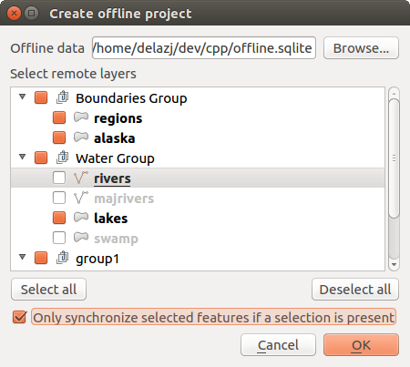

.. only:: html

.. index:: Plugins; Offline editing
.. _`offlinedit`:

Offline Editing Plugin
======================

For data collection, it is a common situation to work with a laptop or a cell
phone offline in the field. Upon returning to the network, the changes need to
be synchronized with the master datasource (e.g., a PostGIS database). If several
persons are working simultaneously on the same datasets, it is difficult to
merge the edits by hand, even if people don’t change the same features.

The |offlineEditingCopy| :sup:`Offline Editing` Plugin automates the
synchronisation by copying the content of a datasource (usually PostGIS or
WFS-T) to a SpatiaLite database and storing the offline edits to dedicated
tables. After being connected to the network again, it is possible to apply the
offline edits to the master dataset.

Using the plugin
----------------

* Open a project with some vector layers (e.g., from a PostGIS or WFS-T datasource).
* Go to :menuselection:`Database --> Offline Editing -->` |offlineEditingCopy|
  :guilabel:`Convert to offline project` and select the layers to save.
  The content of the layers is saved to SpatiaLite tables.
* You can check |checkbox| :guilabel:`Only synchronize selected features if a
  selection is present` allowing the offline editing to only save and work on a
  subset. It can be invaluable in case of large layers.
* Edit the layers offline.
* After being connected again, upload the changes using :menuselection:`Database
  --> Offline Editing -->` |offlineEditingSync| :guilabel:`Synchronize`.

.. _figure_offline_editing:

   Create an offline project from PostGIS or WFS layers

.. Substitutions definitions - AVOID EDITING PAST THIS LINE
   This will be automatically updated by the find_set_subst.py script.
   If you need to create a new substitution manually,
   please add it also to the substitutions.txt file in the
   source folder.

.. |checkbox| image:: /static/common/checkbox.png
   :width: 1.3em
.. |offlineEditingCopy| image:: /static/common/offline_editing_copy.png
   :width: 1.5em
.. |offlineEditingSync| image:: /static/common/offline_editing_sync.png
   :width: 1.5em
