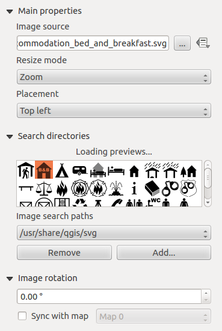

.. index:: Image, Picture, Layout; Image item, Layout; North arrow

The Picture and the North Arrow Items
=====================================
The :guilabel:`Picture` item is a tool that helps decorate your map with
pictures, logos... It can also be used to add north arrows, despite the
dedicated :ref:`North arrow <layout_northarrow_item>` tool.

.. _layout_picture_item:

The Picture Item
----------------

You can add a picture with the |addImage| :sup:`Add Picture` following
:ref:`items creation instructions <create_layout_item>` and manipulate it the
same way as exposed in :ref:`interact_layout_item`.

.. index:: Picture database, Rotated north arrow

By default, the picture item is a blank frame that you can customize using its
:guilabel:`Item Properties` panel. Other than the :ref:`items common properties
<item_common_properties>`, this feature has the following functionalities
(see figure_layout_image_):

.. _figure_layout_image:

   Picture Item Properties panel

You first have to select the image you want to display. There are several ways
to set the :guilabel:`Image source`:

#. In the :guilabel:`Main properties` group, use the :guilabel:`...`
   :sup:`Browse` button of :guilabel:`image source` to
   select a file on your computer. The browser will start in the
   SVG-libraries provided with QGIS. Besides :file:`SVG`, you can also select
   other image formats like :file:`.png` or :file:`.jpg`.
#. You can enter the source directly in the :guilabel:`Image source` text field.
   You can even provide a remote URL-address to a picture.
#. From the :guilabel:`Search directories` area you can also select an image
   from the loaded previews to set the image source. These images are by default
   provided    by folders set in :menuselection:`Settings --> Options --> System
   --> SVG Paths`.
#. Use the |dataDefined| :sup:`data defined override` button to set the image
   source from a feature attribute or using a regular expression.

.. note:: In the :guilabel:`Search directories` group, you can use the :guilabel:`Add`
  and :guilabel:`Remove` buttons in the group to customize the list of folders to fetch
  and preview images from.

With the :guilabel:`Resize mode` option, you can set how the image is displayed
when the frame is resized:

* ``Zoom``: enlarges/reduces the image to the frame while maintaining aspect
  ratio of picture;
* ``Stretch``: stretches image to fit inside the frame, ignores aspect ratio;
* ``Clip``: use this mode for raster images only, it sets the size of the image
  to original image size without scaling and the frame is used to clip the image,
  so only the part of the image inside the frame is visible;
* ``Zoom and resize frame``: enlarges image to fit frame, then resizes frame to
  fit resultant image;
* ``Resize frame to image size``: sets size of frame to match original size of
  image without scaling.

Depending on the selected :guilabel:`Resize mode`, the :guilabel:`Placement` and
:guilabel:`Image rotation` options are disabled or not. With :guilabel:`Placement`
you can select the position of the image inside its frame.

.. _parameterized_svg:

QGIS default provided :file:`.SVG` files are customizable, meaning that you can
easily apply different :guilabel:`Fill color`, :guilabel:`Stroke color`
(including opacity) and :guilabel:`Stroke width` than the original, using their
corresponding feature in the :guilabel:`SVG Parameters` group. These properties
can as well be :ref:`data-defined <data_defined>`.

If you add a :file:`.SVG` file that does not enable these properties, you may
need to add the following tags to the file in order to add support e.g. for
transparency:

* `fill-opacity="param(fill-opacity)"`
* `stroke-opacity="param(outline-opacity)"`

You can read this `blog post
<https://blog.sourcepole.ch/2011/06/30/svg-symbols-in-qgis-with-modifiable-colors/>`_
to see an example.

Images can be rotated with the :guilabel:`Image rotation` field.
Activating the |checkbox| :guilabel:`Sync with map` checkbox synchronizes the
rotation of the image with the rotation applied to a selected map item; this
is a convenient feature for north arrows that you can align with either:

* the **Grid north**: direction of a grid line which is parallel to the
  central meridian on the national/local grid;
* or the **True north**: direction of a meridian of longitude which converges
  on the North Pole.

You can also apply a declination :guilabel:`Offset` to the picture rotation.

.. index:: North arrow
.. _layout_northarrow_item:

The North Arrow Item
--------------------

You can add a north arrow with the |northArrow| :sup:`Add North Arrow` following
:ref:`items creation instructions <create_layout_item>` and manipulate it the
same way as exposed in :ref:`interact_layout_item`.

Since north arrows are images, the :guilabel:`North Arrow` item has the same
properties as the :ref:`picture item <layout_picture_item>`. The main
differences are:

* A default north arrow is used when adding the item instead of a blank frame
* The north arrow item is synced with a map item by default: the :guilabel:`Sync
  with map` property is filled with the map over which the north arrow item is
  drawn. If none, then it falls back to the :ref:`reference map <reference_map>`.
   
.. note::

   Many of the north arrows do not have an 'N' added in the north arrow, this is
   done on purpose for languages that do not use an 'N' for North, so they can
   use another letter.

.. _figure_layout_image_north:

.. figure:: img/north_arrows.png
   :align: center

   North arrows available for selection in provided SVG library

.. Substitutions definitions - AVOID EDITING PAST THIS LINE
   This will be automatically updated by the find_set_subst.py script.
   If you need to create a new substitution manually,
   please add it also to the substitutions.txt file in the
   source folder.

.. |addImage| image:: /static/common/mActionAddImage.png
   :width: 1.5em
.. |checkbox| image:: /static/common/checkbox.png
   :width: 1.3em
.. |dataDefined| image:: /static/common/mIconDataDefine.png
   :width: 1.5em
.. |northArrow| image:: /static/common/north_arrow.png
   :width: 1.5em
