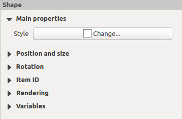
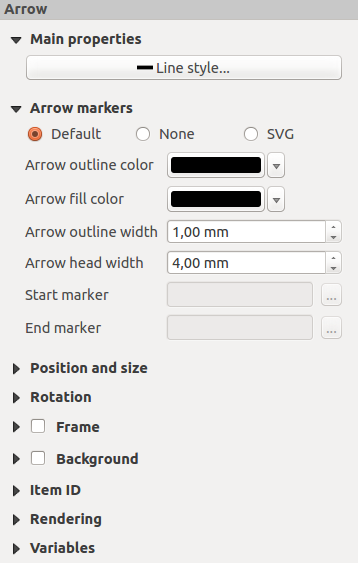

.. only:: html

   |updatedisclaimer|

Shape Items
===========

.. only:: html

   .. contents::
      :local:

.. index:: 
   single: Layout item; Basic shape
.. _layout_basic_shape_item:

The Basic Shape Items
---------------------

To add a basic shape (ellipse, rectangle, triangle), click the |addBasicShape|
:sup:`Add basic shape` icon,  place the element holding down the left mouse.
Customize the appearance in the :guilabel:`Item Properties` panel.

When you also hold down the :kbd:`Shift` key while placing the basic shape
you can create a perfect square, circle or triangle.

.. _figure_layout_basic_shape:

.. figure:: img/shape_properties.png
   :align: center

   Shape Item Properties Panel

The :guilabel:`Shape` item properties panel allows you to select if you want to
draw an ellipse, rectangle or triangle inside the given frame.

You can set the style of the shape using the advanced symbol style dialog with
which you can define its outline and fill color, fill pattern, use markers...

For the rectangle shape, you can set the value of the corner radius to round of
the corners.

.. note::
   Unlike other items, you can not style the frame or the background color of
   the frame.

.. index::
   single: Layout item; Node-based shape
.. _layout_node_based_shape_item:

The Node-Based Shape Items
--------------------------

While the |addBasicShape| :guilabel:`Add Shape` tool provides way to create
simple and predefined geometric item, the |addNodesShape| :guilabel:`Add Node
Item` tool helps you create a custom and more advanced geometric item. For
polylines or polygons, you can draw as many lines or sides as you want and
vertices of the items can be independently and directly manipulated using the
|editNodesShape| :guilabel:`Edit Nodes Item`. The item itself can be manipulated
as exposed in :ref:`interact_layout_item`.

To add a node-based shape, click the |addNodesShape| :sup:`Add Node Item` icon
and select either |addPolygon| :sup:`Add Polygon` or |addPolyline| :sup:`Add
Polyline` tool. Then perform left clicks to add nodes to your current shape.
If you hold down the :kbd:`Shift` key while drawing a segment, it is constrained
to follow an orientation multiple of 45\ |degrees|.

When you're done, a simple right click terminates the shape, allowing you to
customize the appearance in the :guilabel:`Item Properties` panel.

.. _figure_layout_nodes_shape:

   Polygon Node Shape Item Properties Panel

In the :guilabel:`Main properties`, you can set the style of the shape using
the advanced :ref:`symbol <symbol-selector>` and :ref:`color <color-selector>`
selector widget...

For polyline node items, you can also parameterize the :guilabel:`Line markers`
i.e. add:

* start and/or end markers with options:

  * :guilabel:`None`: draws a simple polyline;
  * :guilabel:`Arrow`: adds a regular triangular arrow head that you can
    customize;
  * :guilabel:`SVG` marker: uses an :file:`SVG` file as arrow head of the
    item.
* customize the arrow head:

  * :guilabel:`Arrow stroke color`: set the stroke color of the arrow head;
  * :guilabel:`Arrow fill color`: set the fill color of the arrow head;
  * :guilabel:`Arrow stroke width`: set the stroke width of the arrow head;
  * :guilabel:`Arrow head width`: set the size of the arrow head.

SVG images are automatically rotated with the line. Stroke and fill colors of
QGIS predefined SVG images can be changed using the corresponding options. Custom
SVG may require some tags following this :ref:`instruction <parameterized_svg>`.

.. _figure_layout_arrow:

   Polyline Node Shape Item Properties Panel

.. index:: 
   single: Layout item; Arrow
.. _layout_arrow_item:

The Arrow Item
..............

The |addArrow| :sup:`Add Arrow` tool is a shortcut to create an arrow-enabled
polyline by default and thus has same properties and behavior as a polyline
node item.

Actually, the arrow item can be used to add a simple arrow, for example, to
show the relation between two different print layout items. However, to create
a north arrow, the :ref:`image item <layout_picture_item>` should be considered
first as it gives access to a set of north arrows in :file:`.SVG` format that
you can sync with a map item so that it rotates automatically with it.

Editing a node item geometry
............................

A specific tool is provided to edit node-based shapes through
|editNodesShape| :sup:`Edit Nodes Item`. Within this mode, you can select
a node by clicking on it (a marker is displayed on the selected node). A
selected node can be moved either by dragging it or by using the arrow keys.
Moreover, in this mode, you are able to add nodes to an existing shape:
double-click on a segment and a node is added at the place you click.
Finally, you can remove the currently selected node by
hitting the :kbd:`DEL` key.

.. Substitutions definitions - AVOID EDITING PAST THIS LINE
   This will be automatically updated by the find_set_subst.py script.
   If you need to create a new substitution manually,
   please add it also to the substitutions.txt file in the
   source folder.

.. |addArrow| image:: /static/common/mActionAddArrow.png
   :width: 1.5em
.. |addBasicShape| image:: /static/common/mActionAddBasicShape.png
   :width: 1.5em
.. |addNodesShape| image:: /static/common/mActionAddNodesShape.png
   :width: 1.5em
.. |addPolygon| image:: /static/common/mActionAddPolygon.png
   :width: 1.5em
.. |addPolyline| image:: /static/common/mActionAddPolyline.png
   :width: 1.5em
.. |degrees| unicode:: 0x00B0
   :ltrim:
.. |editNodesShape| image:: /static/common/mActionEditNodesShape.png
   :width: 1.5em
.. |updatedisclaimer| replace:: :disclaimer:`Docs for 'QGIS testing'. Visit http://docs.qgis.org/2.18 for QGIS 2.18 docs and translations.`
