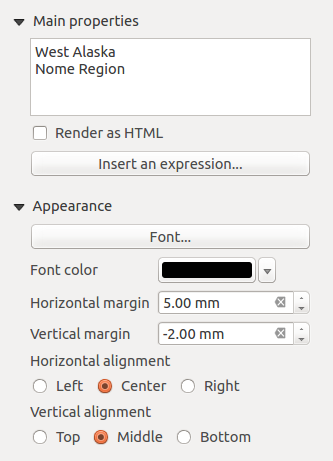

.. only:: html

   |updatedisclaimer|

.. index:: Layout; Label item
.. _layout_label_item:

The Label Item
===============

.. only:: html

   .. contents::
      :local:

The :guilabel:`Label` item is a tool that helps decorate your map with
texts that would help to understand it; it can be the title, author, data
sources or any other information...
You can add a label with the |label| :guilabel:`Add Label` tool following
:ref:`items creation instructions <create_layout_item>` and manipulate it the
same way as exposed in :ref:`interact_layout_item`.
 
By default, the label item provides a default text that you can customize using
its :guilabel:`Item Properties` panel. Other than the :ref:`items common
properties <item_common_properties>`, this feature has the following
functionalities (see figure_layout_label_):

.. _figure_layout_label:

   Label Item Properties Panel

Main properties
----------------

The :guilabel:`Main properties` group is the place to provide the text (it can
be in HTML) or the expression to build the label. Expressions need to be
surrounded by ``[%``and ``%]`` in order to be interpreted as such.

* Labels can be interpreted as HTML code: check |checkbox|
  :guilabel:`Render as HTML`. You can now insert a URL, a clickable image that
  links to a web page or something more complex.
* You can also use :ref:`expressions <expression_builder>`: click on **[Insert
  an expression]** button, write your formula as usual and when the dialog is
  applied, QGIS automatically adds the surrounding characters.
  
.. note:: Clicking the **[Insert an expression]** button when no selection is
  made in the textbox will append the new expression to the existing text.
  If you want to update an existing text, you need to select it the part of
  interest beforehand.

You can combine HTML rendering and expressions, leading to e.g. a text like:

::

 [% '<b>Check out the new logo for ' || '<a href="https://www.qgis.org" title="Nice logo" target="_blank">QGIS ' ||@qgis_short_version || '</a>' || ' : ' %]

which will render:
**Check out the new logo for `QGIS 3.0 <https://www.qgis.org>`_ :** |logo|

.. Todo: it may be nice to provide some screenshot of some funnier/cooler/advanced
 html label in action

Appearance
----------

* Define :guilabel:`Font` by clicking on the **[Font...]** button or a
  :guilabel:`Font color` by pushing the :ref:`color widget <color-selector>`.
* You can specify different horizontal and vertical margins in ``mm``. This is
  the margin from the edge of the layout item. The label can be positioned
  outside the bounds of the label e.g. to align label items with other items.
  In this case you have to use negative values for the margin.
* Using the text alignment is another way to position your label. It can be:

  * :guilabel:`Left`, :guilabel:`Center`, :guilabel:`Right`or
    :guilabel:`Justify` for :guilabel:`Horizontal alignment`
  * and :guilabel:`Top`, :guilabel:`Middle`, :guilabel:`Bottom` for
    :guilabel:`Vertical alignment`.

.. Substitutions definitions - AVOID EDITING PAST THIS LINE
   This will be automatically updated by the find_set_subst.py script.
   If you need to create a new substitution manually,
   please add it also to the substitutions.txt file in the
   source folder.

.. |checkbox| image:: /static/common/checkbox.png
   :width: 1.3em
.. |label| image:: /static/common/mActionLabel.png
   :width: 1.5em
.. |logo| image:: /static/common/logo.png
   :width: 1.5em
.. |radioButtonOn| image:: /static/common/radiobuttonon.png
.. |updatedisclaimer| replace:: :disclaimer:`Docs for 'QGIS testing'. Visit http://docs.qgis.org/2.18 for QGIS 2.18 docs and translations.`
