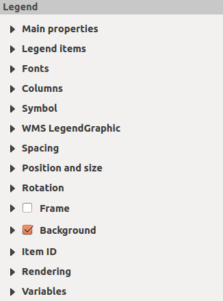
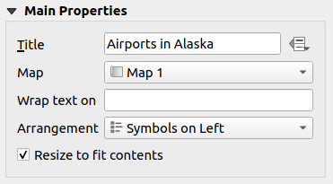
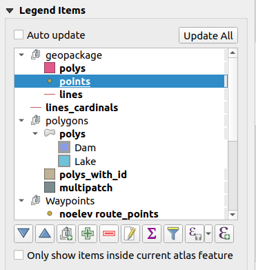
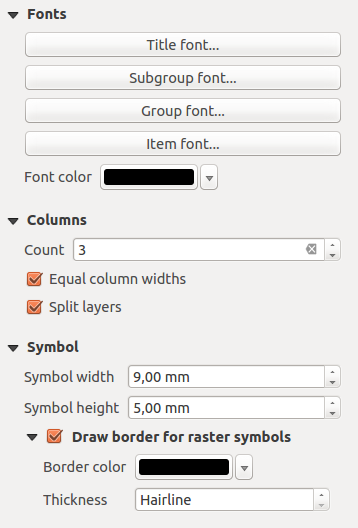
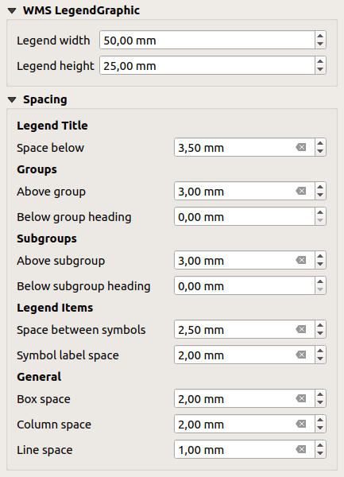

.. only:: html

   |updatedisclaimer|

.. index:: Legend item, Map legend
.. _layout_legend_item:

The Legend Item
================

.. only:: html

   .. contents::
      :local:

To add a map legend, click the |addLegend| :sup:`Add new legend` icon,
place the element with the left mouse button on the print layout canvas and
position and customize the appearance in the legend :guilabel:`Item Properties`
panel.

The :guilabel:`Item properties` panel of a legend item provides the following
functionalities (see figure_layout_legend_):

.. _figure_layout_legend:

   Legend Item Properties Panel

Main properties
---------------

The :guilabel:`Main properties` dialog of the legend :guilabel:`Item Properties`
panel provides the following functionalities (see figure_layout_legend_ppt_):

.. _figure_layout_legend_ppt:

   Legend Main properties Dialog

In Main properties you can:

* change the title of the legend;
* set the title alignment to Left, Center or Right;
* choose which :guilabel:`Map` item the current legend will refer to
  in the select list;
* wrap the text of the legend title on a given character;
* use |checkbox| :guilabel:`Resize to fit contents` to control whether or
  not a legend should be automatically resized to fit its contents. If
  unchecked, then the legend will never resize and instead just stick to
  whatever size the user has set. Any content which doesn't fit the size
  is cropped out.

Legend items
------------

The :guilabel:`Legend items` dialog of the legend :guilabel:`Item Properties`
panel provides the following functionalities (see figure_layout_legend_items_):

.. _figure_layout_legend_items:

   Legend Items Dialog

* The legend will be updated automatically if |checkbox| :guilabel:`Auto-update`
  is checked. When :guilabel:`Auto-update` is unchecked this will give you more
  control over the legend items. The icons below the legend items list will be
  activated.
* The legend items window lists all legend items and allows you to change item
  order, group layers, remove and restore items in the list, edit layer names
  and add a filter.

  * The item order can be changed using the |arrowUp| and |arrowDown| buttons or
    with 'drag-and-drop' functionality. The order can not be changed for WMS
    legend graphics.
  * Use the |addGroup| button to add a legend group.
  * Use the |signPlus| button to add layers and |signMinus| button to remove
    groups, layers or symbol classes.
  * The |projectProperties| button is used to edit the layer, group name or title.
    First you need to select the legend item. Double-clicking the item also
    opens the text box to rename it.
  * The |sum| button adds a feature count for each class of vector layer.
  * With the |filterMap| :sup:`Filter legend by map content` button, only the
    legend items visible in the map will be listed in the legend. This tool
    remains available when |checkbox| :guilabel:`Auto-update` is active.
  * The |expressionFilter| :sup:`Filter legend by expression` helps you filter
    which of the legend items of a layer will be displayed, i.e. using a layer
    that has different legend items (e.g., from a rule-based or categorized
    symbology), you can specify a boolean expression to remove from the legend
    tree, styles that have no feature satisfying a condition. Note that the
    features are nevertheless kept and shown in the layout map item.

  While the default behavior of the legend item is to mimic the
  :guilabel:`Layers panel` tree, displaying the same groups, layers and classes
  of symbology, right-click any item offers you options to hide layer's name or
  raise it as a group or subgroup. In case you have made some changes to a layer,
  you can revert them by choosing :guilabel:`Reset to defaults` from the
  contextual menu.

  After changing the symbology in the QGIS main window, you can click on
  **[Update All]** to adapt the changes in the legend element of the print
  layout.

* While generating an atlas with polygon features, you can filter out legend
  items that lie outside the current atlas feature. To do that, check the
  |checkbox| :guilabel:`Only show items inside current atlas feature` option.

Fonts, Columns, Symbol
----------------------

The :guilabel:`Fonts`, :guilabel:`Columns` and :guilabel:`Symbol` dialogs of the
legend :guilabel:`Item Properties` panel provide the following functionalities
(see figure_layout_legend_fonts_):

.. _figure_layout_legend_fonts:

   Legend Fonts, Columns and Symbol Dialogs

* You can change the font of the legend title, group, subgroup and item (layer)
  in the legend item.
  Click on a category button to open a **Select font** dialog.
* You provide the labels with a **Color** using the advanced color picker,
  however the selected color will be given to all font items in the legend..
* Legend items can be arranged over several columns. Set the number of columns
  in the :guilabel:`Count` |selectNumber| field.

  * |checkbox| :guilabel:`Equal column widths` sets how legend columns should be
    adjusted.
  * The |checkbox| :guilabel:`Split layers` option allows a categorized or a
    graduated layer legend to be divided between columns.

* You can also change the width and height of the legend symbol, set a color and
  a thickness in case of raster layer symbol.

WMS LegendGraphic and Spacing
------------------------------

The :guilabel:`WMS LegendGraphic` and :guilabel:`Spacing` dialogs of the legend
:guilabel:`Item Properties` panel provide the following functionalities (see
figure_layout_legend_wms_):

.. _figure_layout_legend_wms:

   WMS LegendGraphic and Spacing Dialogs

When you have added a WMS layer and you insert a legend item, a request
will be sent to the WMS server to provide a WMS legend. This Legend will only be
shown if the WMS server provides the GetLegendGraphic capability.
The WMS legend content will be provided as a raster image.

:guilabel:`WMS LegendGraphic` is used to be able to adjust the :guilabel:`Legend
width` and the :guilabel:`Legend height` of the WMS legend raster image.

Spacing around title, group, subgroup, symbol, icon label, box space
or column space can be customized through this dialog.

.. Substitutions definitions - AVOID EDITING PAST THIS LINE
   This will be automatically updated by the find_set_subst.py script.
   If you need to create a new substitution manually,
   please add it also to the substitutions.txt file in the
   source folder.

.. |addGroup| image:: /static/common/mActionAddGroup.png
   :width: 1.5em
.. |addLegend| image:: /static/common/mActionAddLegend.png
   :width: 1.5em
.. |arrowDown| image:: /static/common/mActionArrowDown.png
   :width: 1.5em
.. |arrowUp| image:: /static/common/mActionArrowUp.png
   :width: 1.5em
.. |checkbox| image:: /static/common/checkbox.png
   :width: 1.3em
.. |expressionFilter| image:: /static/common/mIconExpressionFilter.png
   :width: 1.5em
.. |filterMap| image:: /static/common/mActionFilterMap.png
   :width: 1.5em
.. |projectProperties| image:: /static/common/mActionProjectProperties.png
   :width: 1.5em
.. |selectNumber| image:: /static/common/selectnumber.png
   :width: 2.8em
.. |signMinus| image:: /static/common/symbologyRemove.png
   :width: 1.5em
.. |signPlus| image:: /static/common/symbologyAdd.png
   :width: 1.5em
.. |sum| image:: /static/common/mActionSum.png
   :width: 1.5em
.. |updatedisclaimer| replace:: :disclaimer:`Docs for 'QGIS testing'. Visit http://docs.qgis.org/2.18 for QGIS 2.18 docs and translations.`