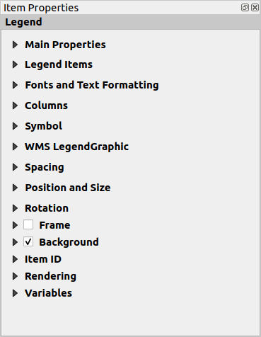
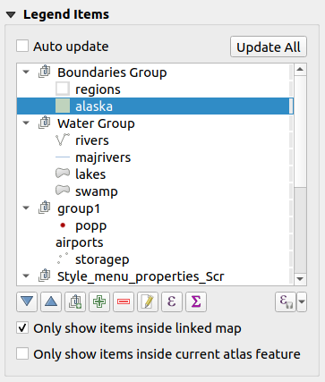

.. only:: html

   |updatedisclaimer|

.. index:: Legend item, Map legend
.. _layout_legend_item:

The Legend Item
================

.. only:: html

   .. contents::
      :local:

The :guilabel:`Legend` item is a box or a table that explains the meanings
of the symbols used on the map. A legend is then bound to a map item. You can
add a legend item with the |addLegend| :guilabel:`Add Legend` tool following
:ref:`items creation instructions <create_layout_item>` and manipulate it the
same way as exposed in :ref:`interact_layout_item`.

By default, the legend item displays all available layers and can be refined
using its :guilabel:`Item Properties` panel. Other than the :ref:`items common
properties <item_common_properties>`, this feature has the following
functionalities (see figure_layout_legend_):

.. showing all layers is a bug (https://issues.qgis.org/issues/13575) but given
   that it's the behavior for a long moment now, let's document it...

.. _figure_layout_legend:

   Legend Item Properties Panel

Main properties
---------------

The :guilabel:`Main properties` group of the legend :guilabel:`Item Properties`
panel provides the following functionalities (see figure_layout_legend_ppt_):

.. _figure_layout_legend_ppt:

   Legend Main properties group

In Main properties you can:

* change the title of the legend. It can be made dynamic using the
  :ref:`data-defined override <data_defined>` setting, useful for example when
  generating atlas;
* set the :guilabel:`Title alignment` to Left, Center or Right;
* choose which :guilabel:`Map` item the current legend will refer to;
* wrap the text of the legend on a given character: each time the character
  appears, it's replaced by a line break;
* use |checkbox| :guilabel:`Resize to fit contents` to control whether or
  not a legend should be automatically resized to fit its contents. If
  unchecked, then the legend will never resize and instead just stick to
  whatever size the user has set. Any content which doesn't fit the size
  is cropped out.

Legend items
------------

The :guilabel:`Legend items` group of the legend :guilabel:`Item Properties`
panel provides the following functionalities (see figure_layout_legend_items_):

.. _figure_layout_legend_items:

   Legend Items group

* The legend will be updated automatically if |checkbox| :guilabel:`Auto-update`
  is checked. When :guilabel:`Auto-update` is unchecked this will give you more
  control over the legend items. The icons below the legend items list will be
  activated.
* The legend items window lists all legend items and allows you to change item
  order, group layers, remove and restore items in the list, edit layer names
  and add a filter.

  * The item order can be changed using the |arrowUp| and |arrowDown| buttons or
    with 'drag-and-drop' functionality. The order can not be changed for WMS
    legend graphics.
  * Use the |addGroup| button to add a legend group.
  * Use the |signPlus| button to add layers and |signMinus| button to remove
    groups, layers or symbol classes.
  * The |projectProperties| button is used to edit the layer, group name or title.
    First you need to select the legend item. Double-clicking the item also
    opens the text box to rename it.
  * The |sum| button adds a feature count for each class of vector layer.
  * With the |filterMap| :sup:`Filter legend by map content` button, only the
    legend items visible in the map will be listed in the legend. This tool
    remains available when |checkbox| :guilabel:`Auto-update` is active.
  * The |expressionFilter| :sup:`Filter legend by expression` helps you filter
    which of the legend items of a layer will be displayed, i.e. using a layer
    that has different legend items (e.g., from a rule-based or categorized
    symbology), you can specify a boolean expression to remove from the legend
    tree, styles that have no feature satisfying a condition. Note that the
    features are nevertheless kept and shown in the layout map item.
  * |addExpression| :sup:`Add symbol expression` allows you to add expressions
    to each symbol label of a given layer. The label is represented by 
    the variable "@symbol_label" in the expression. Currently aggregate functions 
    are supported but will use all the features during evaluation.

  While the default behavior of the legend item is to mimic the
  :guilabel:`Layers panel` tree, displaying the same groups, layers and classes
  of symbology, right-click any item offers you options to hide layer's name or
  raise it as a group or subgroup. In case you have made some changes to a layer,
  you can revert them by choosing :guilabel:`Reset to defaults` from the
  contextual menu.

  After changing the symbology in the QGIS main window, you can click on
  :guilabel:`Update All` to adapt the changes in the legend element of the print
  layout.

* While generating an atlas with polygon features, you can filter out legend
  items that lie outside the current atlas feature. To do that, check the
  |checkbox| :guilabel:`Only show items inside current atlas feature` option.

Fonts, Columns, Symbol
----------------------

The :guilabel:`Fonts`, :guilabel:`Columns` and :guilabel:`Symbol` groups of the
legend :guilabel:`Item Properties` panel provide the following functionalities
(see figure_layout_legend_fonts_):

.. _figure_layout_legend_fonts:

.. figure:: img/legend_fonts.png
   :align: center

   Legend Fonts, Columns and Symbol groups

* You can change the font of the legend title, group, subgroup and item (feature)
  in the legend item using the font selector widget;
* You provide the labels with a **Color** using the :ref:`color selector
  <color-selector>` widget. The selected color will apply to all font items in the
  legend;
* Legend items can be arranged over several columns. Set the number of columns
  in the :guilabel:`Count` |selectNumber| field. This value can be made dynamic
  e.g., following atlas features, legend contents, the frame size...

  * |checkbox| :guilabel:`Equal column widths` sets how legend columns should be
    adjusted.
  * The |checkbox| :guilabel:`Split layers` option allows a categorized or a
    graduated layer legend to be divided between columns.

* You can also change the width and height of the legend symbol, set a color and
  a thickness in case of raster layer symbol.

WMS LegendGraphic and Spacing
------------------------------

The :guilabel:`WMS LegendGraphic` and :guilabel:`Spacing` groups of the legend
:guilabel:`Item Properties` panel provide the following functionalities (see
figure_layout_legend_wms_):

.. _figure_layout_legend_wms:

.. figure:: img/legend_wms.png
   :align: center

   WMS LegendGraphic and Spacing groups

When you have added a WMS layer and you insert a legend item, a request
will be sent to the WMS server to provide a WMS legend. This Legend will only be
shown if the WMS server provides the GetLegendGraphic capability.
The WMS legend content will be provided as a raster image.

:guilabel:`WMS LegendGraphic` is used to be able to adjust the :guilabel:`Legend
width` and the :guilabel:`Legend height` of the WMS legend raster image.

:guilabel:`Spacing` around title, group, subgroup, symbol, icon label, box,
column or line can be customized through this dialog.

.. Substitutions definitions - AVOID EDITING PAST THIS LINE
   This will be automatically updated by the find_set_subst.py script.
   If you need to create a new substitution manually,
   please add it also to the substitutions.txt file in the
   source folder.

.. |addExpression| image:: /static/common/mActionAddExpression.png
   :width: 1.5em
.. |addGroup| image:: /static/common/mActionAddGroup.png
   :width: 1.5em
.. |addLegend| image:: /static/common/mActionAddLegend.png
   :width: 1.5em
.. |arrowDown| image:: /static/common/mActionArrowDown.png
   :width: 1.5em
.. |arrowUp| image:: /static/common/mActionArrowUp.png
   :width: 1.5em
.. |checkbox| image:: /static/common/checkbox.png
   :width: 1.3em
.. |expressionFilter| image:: /static/common/mIconExpressionFilter.png
   :width: 1.5em
.. |filterMap| image:: /static/common/mActionFilterMap.png
   :width: 1.5em
.. |projectProperties| image:: /static/common/mActionProjectProperties.png
   :width: 1.5em
.. |selectNumber| image:: /static/common/selectnumber.png
   :width: 2.8em
.. |signMinus| image:: /static/common/symbologyRemove.png
   :width: 1.5em
.. |signPlus| image:: /static/common/symbologyAdd.png
   :width: 1.5em
.. |sum| image:: /static/common/mActionSum.png
   :width: 1.2em
.. |updatedisclaimer| replace:: :disclaimer:`Docs in progress for 'QGIS testing'. Visit https://docs.qgis.org/3.4 for QGIS 3.4 docs and translations.`
