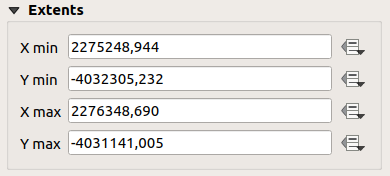
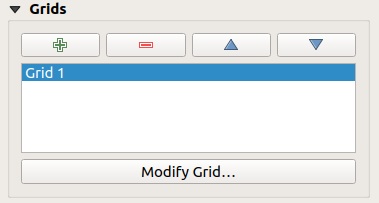
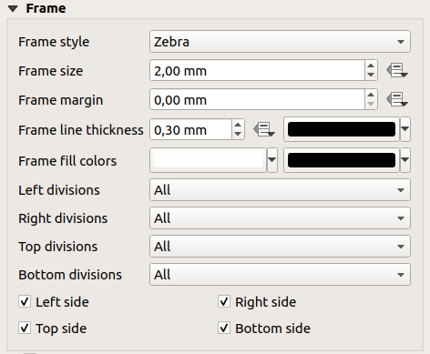
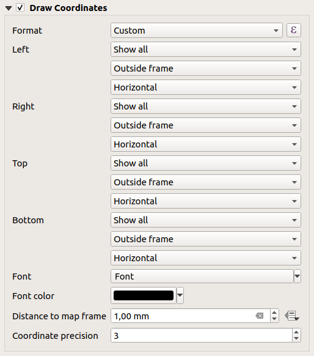

.. only:: html

   |updatedisclaimer|

.. index:: Layout; Map item
.. _layout_map_item:

The Map Item
=============

.. only:: html

   .. contents::
      :local:

Click on the |addMap| :sup:`Add new map` toolbar button in the print layout
toolbar to add the QGIS map canvas. Now, drag a rectangle onto the layout
canvas with the left mouse button to add the map. To display the current map, you
can choose between three different modes in the map :guilabel:`Item Properties`
panel:

* **Rectangle** is the default setting. It only displays an empty box with a
  message 'Map will be printed here'.
* **Cache** renders the map in the current screen resolution. If you zoom the
  layout window in or out, the map is not rendered again but the image will
  be scaled.
* **Render** means that if you zoom the layout window in or out, the map will
  be rendered again, but for space reasons, only up to a maximum resolution.

**Cache** is the default preview mode for newly added print layout maps.

You can resize the map item by clicking on the |select| :sup:`Select/Move item`
button, selecting the element, and dragging one of the blue handles in the
corner of the map.  This button also helps to move the map to another place.
Select the item and while holding the left mouse button, move to the new place
and release the mouse button. After you have found the right place for an item,
you can lock the item position within the print layout canvas. Select the
map item and use the toolbar |locked| :sup:`Lock Selected Items` or the
:menuselection:`Items` panel to Lock the item. A locked item can only be selected
using the :menuselection:`Items` panel. Once selected you can use the
:menuselection:`Items` panel to unlock individual items. The |unlocked|
:sup:`Unlock All Items` icon will unlock all locked layout items. With the
map selected, you can now adapt more properties in the map
:guilabel:`Item Properties` panel.

To move layers within the map element, select the map element, click the
|moveItemContent| :sup:`Move item content` icon and move the layers within
the map item frame with the left mouse button.

.. _`layout_main_properties`:

Main properties
---------------

The :guilabel:`Main properties` dialog of the map :guilabel:`Item Properties`
panel provides the following functionalities (see figure_layout_map_):

.. _figure_layout_map:

   Map Item Properties Panel

* The **Preview** drop-down menu allows you to select one of the preview modes
  'Rectangle', 'Cache' and 'Render', as described above. If you change the
  view on the QGIS map canvas by changing vector or raster properties, you can
  update the print layout view by selecting the map element and clicking
  the **[Update preview]** button.
* The field :guilabel:`Scale` |selectNumber| manually sets the map item scale.
* The field :guilabel:`Map rotation` |selectNumber| allows you to rotate the
  map element content clockwise in degrees. The rotation of the map
  canvas can be imitated here.
* |checkbox| :guilabel:`Draw map canvas items` lets you show annotations that
  may be placed on the map canvas in the main QGIS window.

Layers
------

The :guilabel:`Layers` dialog of the map item panel provides the following
functionality (see figure_layout_map_layers_):

.. _figure_layout_map_layers:

   Map Layers Dialog

If you want to keep the map item consistent with an existing map theme, 
use |selectString| :guilabel:`Follow map theme` and select the desired theme. 
(See :ref:`map_themes` to find out how to configure map themes.)
Any changes applied to the theme in QGIS' main window (using the replace theme
function) will automatically affect the map item. 
If a map theme is selected, the :guilabel:`Lock styles for layers` option will
be disabled because :guilabel:`Follow map theme` also updates the
style (symbology, labels, diagrams) of the layers.

To lock the layers shown in a map item to the current map canvas check
|checkbox| :guilabel:`Lock layers`. After this option is enabled, any
changes on the layers' visibility in QGIS' main window won't affect
the layout's map item. Nevertheless, style and labels of locked
layers are still refreshed according to QGIS' main window.
You can prevent this by using :guilabel:`Lock styles for layers`.

Using the |showMapTheme| button, you can lock the map item's layers to one of
the map themes you have prepared (see :ref:`map_themes`).
Clicking the |showMapTheme| button will show the list of all themes. 
Select the theme you want to display. The map canvas will lock the
theme layers automatically by enabling the |checkbox| :guilabel:`Lock
layers`. You can release the theme by unchecking the |checkbox|
:guilabel:`Lock layers` and press the |draw| button in the
print layout's :guilabel:`Navigation` toolbar.

Note that, unlike the :guilabel:`Follow map theme`, using the
:guilabel:`Lock layers` option enabled and set to a theme, the map item
layers won't be updated if the theme is changed (using the replace theme
function) in QGIS' main window.

Locked layers in the map can also be :ref:`data-defined <data_defined>`, using
the |dataDefined| icon beside the option. When used, this overrides the
selection set in the drop-down list. You need to pass a list of layers
separated by ``|`` character.
The following example locks the map item to use only layers ``layer 1`` and
``layer 2``::

    concat ('layer 1', '|', 'layer 2')

Extents
-------

The :guilabel:`Extents` dialog of the map item panel provides the following
functionalities (see figure_layout_map_extents_):

.. _figure_layout_map_extents:

   Map Extents Dialog

The **Map extents** area allows you to specify the map extent using ``X`` and
``Y`` min/max values and by clicking the **[Set to map canvas extent]** button.
This button sets the map extent of the layout map item to the extent of the
current map view in the main QGIS application.
The button **[View extent in map canvas]** does exactly the opposite; it
updates the extent of the map view in the QGIS application to the extent
of the layout map item.

If you change the view on the QGIS map canvas by changing
vector or raster properties, you can update the print layout view by selecting
the map element in the print layout and clicking the **[Update preview]**
button in the map :guilabel:`Item Properties` panel (see figure_layout_map_).

.. index:: Atlas
.. _controlled_atlas:

Controlled by atlas
-------------------

The |checkbox| :guilabel:`Controlled by atlas` group properties is available
only if an :ref:`atlas <atlas_generation>` is active in the print layout. Check
this option if you want the map item being ruled by the atlas; when iterating
over the coverage layer, the map item extent is panned/zoomed to the atlas
feature following:

* |radioButtonOn| :guilabel:`Margin around features`: zoom to the feature at the
  best scale, keeping around each a margin representing a percentage of the map
  item width or height. The margin can be the same for all features or :ref:`set
  variable <data_defined>`, e.g., depending on map scale;
* |radioButtonOff| :guilabel:`Predefined scale (best fit)`: zoom to the feature
  at the project :ref:`predefined scale <predefinedscales>` where the atlas
  feature best fits;
* |radioButtonOff| :guilabel:`Fixed scale`: atlas features are panned from one
  to another, keeping the same scale of the map item. Ideal when working with
  features of same size (e.g., a grid) or willing to highlight size differences
  among atlas features.

.. index:: Grids, Map grid

Grids
-----

With grids, you can add, over your map, information relative to its extent or
coordinates, either in the map item projection or a different one. The
:guilabel:`Grids` group provides the possibility to add several grids to a
map item.

* With the |signPlus| and |signMinus| buttons you can add or remove a selected
  grid;
* With the |arrowUp| and |arrowDown| buttons you can move up and down a grid in
  the list, hence move it on top or bottom of another one, over the map item.

Double-click the added grid to rename it.

.. _Figure_layout_map_grid:

   Map Grids Dialog

After you add a grid, you can activate the checkbox |checkbox| :guilabel:`Draw
grid` to allow overlaying the grid onto the map item. Press the **[Modify grid...]**
button to access configuration options.

Grid Appearance
...............

As grid type, you can specify to use a:

* *Solid*: shows a line across the grid frame. The :guilabel:`Line style` can
  be customized using :ref:`color <color-selector>` and :ref:`symbol
  <symbol-selector>` selector widget;
* *Cross*: displays segment at the grid lines intersection for which you can
  set the :guilabel:`Line style` and the :guilabel:`Cross width`;
* *Markers*: only displays customizable markers symbol at grid lines
  intersection;
* or *Frame and annotations only*.

Other than the grid type, you can define:

* the :guilabel:`CRS` which could not be the same as the map item's;
* the :guilabel:`Interval` between two consecutive grid references in ``X``
  and ``Y`` directions;
* the :guilabel:`Interval Units` to use for the grid references, in ``Map
  units``, ``Millimeters`` or ``Centimeters``;
* an :guilabel:`Offset` from the map item edges, in ``X`` and ``Y`` directions;
* and the :guilabel:`Blend mode` of the grid (see :ref:`blend-modes`) when
  compatible.

.. _Figure_layout_map_grid_draw:

.. figure:: img/map_draw_grid.png
   :align: center

   Draw Grid Dialog

Grid Frame
..........

There are different options to style the frame that holds the map.
Following options are available: ``No Frame``, ``Zebra``, ``Interior ticks``,
``Exterior ticks``, ``Interior and Exterior ticks`` and ``Line border``.
Also you can choose to set visible or not each side of the grid frame.

When compatible, it's possible to set the :guilabel:`Frame size`,
:guilabel:`Frame line thickness`, :guilabel:`Frame fill colors`.
With ``Latitude/Y only`` and ``Longitude/X only`` settings in the divisions
section you have the possibility to prevent a mix of latitude/y and longitude/x
coordinates showing on a side when working with rotated maps or reprojected
grids.

.. _Figure_layout_map_frame:

   Grid Frame Dialog

Coordinates
...........

The |checkbox| :guilabel:`Draw coordinates` checkbox allows you to add
coordinates to the map frame. You can choose the annotation numeric format,
the options range from decimal to degrees, minute and seconds, with or without
suffix, aligned or not and a custom format using the expression dialog.

You can choose which annotation to show. The options are: show all, latitude
only, longitude only, or disable(none). This is useful when the map is rotated.
The annotation can be drawn inside or outside the map frame. The annotation
direction can be defined as horizontal, vertical ascending or vertical
descending.

Finally, you can define the annotation font, font color, distance from the map
frame and the precision of the drawn coordinates.

.. _figure_layout_map_coord:

   Grid Draw Coordinates dialog

.. index:: Location map, Map overview

Overviews
---------

Sometimes you may have more than one map in the print layout and would like to
locate the study area of one map item on another one. This could be for example
to help map readers identify the area in relation with its larger geographic
context shown in the second map.

The :guilabel:`Overviews` group of the map panel helps you create the link
between two different maps extent and provides the following functionalities:

.. _figure_layout_map_overview:

   Map Overviews Dialog

To create an overview, select the map item on which you want to show the other
map item's extent and expand the :guilabel:`Overviews` option in the
:guilabel:`Item Properties` panel. Then press the |signPlus| button to add
an overview.

Initially this overview is named 'Overview 1' (see Figure_layout_map_overview_).
You can:

* Rename it with a double-click;
* With the |signPlus| and |signMinus| buttons, add or remove overviews;
* With the |arrowUp| and |arrowDown| buttons, move up and down an overview in
  the list, hence move it on top or bottom of another one, over the map item.

Then select the overview item in the list and check the |checkbox|
:guilabel:`Draw "<name_overview>" overview` to enable the overview
drawing over the selected map frame. You can customize it with:

* The :guilabel:`Map frame` combo list can be used to select the map item whose
  extents will be drawn on the present map item.
* The :guilabel:`Frame Style` allows you to change the style of the overview frame.
* The :guilabel:`Blending mode` allows you to set different transparency blend modes.
* The |checkbox| :guilabel:`Invert overview` creates a mask around the extents when
  activated: the referenced map extents are shown clearly, whereas everything else
  is blended with the frame color.
* The |checkbox| :guilabel:`Center on overview` puts the extent of the overview
  frame in the center of the overview map. You can only activate one overview
  item to center, when you have added several overviews.

.. Substitutions definitions - AVOID EDITING PAST THIS LINE
   This will be automatically updated by the find_set_subst.py script.
   If you need to create a new substitution manually,
   please add it also to the substitutions.txt file in the
   source folder.

.. |addMap| image:: /static/common/mActionAddMap.png
   :width: 1.5em
.. |arrowDown| image:: /static/common/mActionArrowDown.png
   :width: 1.5em
.. |arrowUp| image:: /static/common/mActionArrowUp.png
   :width: 1.5em
.. |checkbox| image:: /static/common/checkbox.png
   :width: 1.3em
.. |dataDefined| image:: /static/common/mIconDataDefine.png
   :width: 1.5em
.. |draw| image:: /static/common/mActionDraw.png
   :width: 1.5em
.. |locked| image:: /static/common/locked.png
   :width: 1.5em
.. |moveItemContent| image:: /static/common/mActionMoveItemContent.png
   :width: 1.5em
.. |radioButtonOff| image:: /static/common/radiobuttonoff.png
.. |radioButtonOn| image:: /static/common/radiobuttonon.png
.. |select| image:: /static/common/mActionSelect.png
   :width: 1.5em
.. |selectNumber| image:: /static/common/selectnumber.png
   :width: 2.8em
.. |selectString| image:: /static/common/selectstring.png
   :width: 2.5em
.. |showMapTheme| image:: /static/common/mActionShowPresets.png
   :width: 1.5em
.. |signMinus| image:: /static/common/symbologyRemove.png
   :width: 1.5em
.. |signPlus| image:: /static/common/symbologyAdd.png
   :width: 1.5em
.. |unlocked| image:: /static/common/unlocked.png
   :width: 1.5em
.. |updatedisclaimer| replace:: :disclaimer:`Docs for 'QGIS testing'. Visit http://docs.qgis.org/2.18 for QGIS 2.18 docs and translations.`
