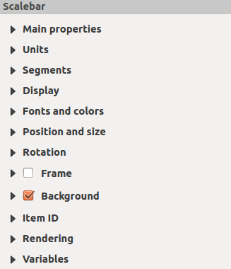
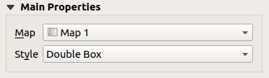
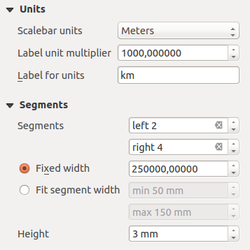
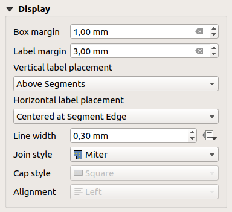
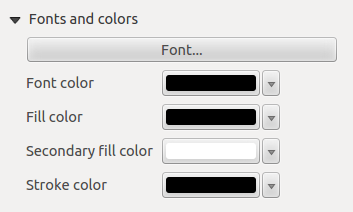

.. only:: html

.. index:: Layout; Scale bar, Map scalebar
.. _layout_scalebar_item:

The Scale Bar Item
==================

.. only:: html

   .. contents::
      :local:

Scale bars provide a visual indication of the size of features, and distance
between features, on the map item. A scale bar item requires a map item.
Use the |scaleBar| :guilabel:`Add Scale Bar` tool following :ref:`items creation
instructions <create_layout_item>` to add a new scale bar item that you can
later manipulate the same way as exposed in :ref:`interact_layout_item`.

By default, a new scale bar item shows the scale of the most recently added map
item. You can customize it thanks to the :guilabel:`Item Properties` panel.
Other than the :ref:`items common properties <item_common_properties>`, this
feature has the following functionalities (see figure_layout_scalebar_):

.. _figure_layout_scalebar:

   Scale Bar Item Properties Panel

Main properties
---------------

The :guilabel:`Main properties` group of the scale bar
:guilabel:`Item Properties` panel provides the following functionalities
(see figure_layout_scalebar_ppt_):

.. _figure_layout_scalebar_ppt:

   Scale Bar Main properties group

* First, choose the map the scale bar will be attached to.
* Then, choose the style of the scale bar. Six styles are available:

  * **Single box** and **Double box** styles, which contain one or two lines of
    boxes alternating colors;
  * **Middle**, **Up** or **Down** line ticks;
  * **Numeric**, where the scale ratio is printed (i.e., 1:50000).

Units and Segments
------------------

The :guilabel:`Units` and :guilabel:`Segments` groups of the scale bar
:guilabel:`Item Properties` panel provide the following functionalities
(see figure_layout_scalebar_units_):

.. _figure_layout_scalebar_units:

   Scale Bar Units and Segments groups

In these two groups, you can set how the scale bar will be represented.

* Select the units you want to use with :guilabel:`Scalebar units`. There are
  many possible choices: **Map Units** (the default one), **Meters**, **Feet**,
  **Miles** or **Nautical Miles**... which may force unit conversions.
* The :guilabel:`Label unit multiplier` specifies how many scale bar units per
  labeled unit. Eg, if your scale bar units are set to "meters", a multiplier of
  1000 will result in the scale bar labels in "kilometers".
* The :guilabel:`Label for units` field defines the text used to describe the
  units of the scale bar, eg ``m`` or ``km``. This should be matched to reflect
  the multiplier above.
* You can define how many :guilabel:`Segments` will be drawn on the left and on
  the right side of the scale bar.
* You can set how long each segment will be (:guilabel:`Fixed width`), or limit
  the scale bar size in ``mm`` with :guilabel:`Fit segment width` option. In the
  latter case, each time the map scale changes, the scale bar is resized (and
  its label updated) to fit the range set.
* :guilabel:`Height` is used to define the height of the bar.

Display
--------

The :guilabel:`Display` group of the scale bar :guilabel:`Item Properties`
panel provides the following functionalities (see
figure_layout_scalebar_display_):

.. _figure_layout_scalebar_display:

   Scale Bar Display group

You can define how the scale bar will be displayed in its frame.

* :guilabel:`Box margin` : space between text and frame borders
* :guilabel:`Labels margin` : space between text and scale bar drawing
* :guilabel:`Line width` : line width of the scale bar drawing
* :guilabel:`Join style` : Corners at the end of scale bar in Bevel, Miter or
  Round style (only available for Scale bar style Single Box & Double Box)
* :guilabel:`Cap style` : End of all lines in style Square, Round or Flat
  (only available for Scale bar style Line Ticks Up, Down and Middle)
* :guilabel:`Alignment` : Puts text on the left, middle or right side of the
  frame (works only for Scale bar style Numeric)

Fonts and colors
-----------------

The :guilabel:`Fonts and colors` group of the scale bar
:guilabel:`Item Properties` panel provides the following functionalities
(see figure_layout_scalebar_fonts_):

.. _figure_layout_scalebar_fonts:

   Scale Bar Fonts and colors groups

You can define the fonts and :ref:`colors <color-selector>` used for the scale
bar.

* Use the :guilabel:`Font` button to set the font of scale bar label
* :guilabel:`Font color`: set the font color
* :guilabel:`Fill color`: set the first fill color
* :guilabel:`Secondary fill color`: set the second fill color
* :guilabel:`Line color`: set the color of the lines of the Scale Bar

Fill colors are only used for *Single Box* and *Double Box* styles.

.. Substitutions definitions - AVOID EDITING PAST THIS LINE
   This will be automatically updated by the find_set_subst.py script.
   If you need to create a new substitution manually,
   please add it also to the substitutions.txt file in the
   source folder.

.. |scaleBar| image:: /static/common/mActionScaleBar.png
   :width: 1.5em
