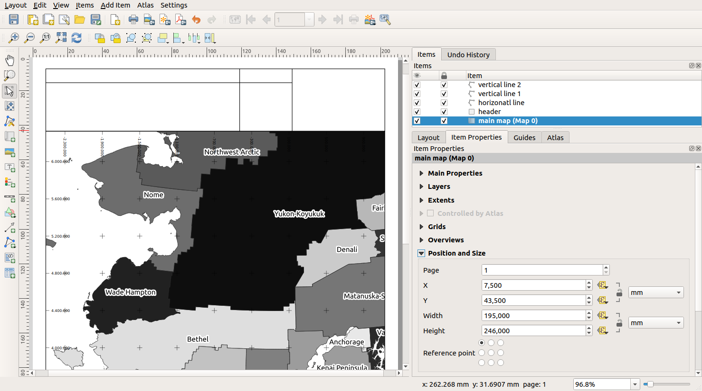

.. only:: html

   |updatedisclaimer|

.. index::
   single: Printing; Reports

.. _create-dynamic-layouts:

*********************************************************
Session for advanced users: Creating a Dynamic Map Layout
*********************************************************

.. only:: html

   .. contents::
      :local:

It is possible to create map layouts that adapt dynamically to the changes of the
page properties and the map extend in the main window. Also, the date of creation
can be insterted dynamically.

We will use variables that QGIS creates automatically and create our own variables
to construct a page layout including a header with a map title, a scale bar, the
actual date, a north arrow and fields for information about your organisation as
well for a logo of your organisation.

To demonstrate how to create a dynamic map layout please follow the next descriptions
and instructions.

#. Load the vector layer regions.shp into the map canvas and adapt its properties
   to suit your own convenience.
#. After everything is rendered and symbolized to your liking,
   click the |newLayout| :sup:`New Print Layout` icon in the toolbar or
   choose :menuselection:`File --> New Print Layout`. You will be prompted to
   choose a title for the new layout.
   
We want to create a map layout consisting of a header and a map about the regions of
Alaska. The layout should have a margin of 7.5 mm and the header should be 36mm high.

How to create the dynamic map canvas

#. Create a map item called ``main map`` onto the canvas and go into the :guilabel:`Layout` panel.
   Choose the :guilabel:`Variables` menu and go to the :guilabel:`Layout` menu. Here we set some variables you
   can use all over the dynamic print layout. The first variable defines the margin.
   Press the |signPlus| button and type in the name ``rg_layout_margin``. Set the value to ``7.5``. Press
   the |signPlus| button again and type in the name ``rg_layout_height_header``. Set the value to ``36``.
#. Now you are ready to create the position and the size of the map canvas automatically
   by means of the variables. Go to the :guilabel:`Item Properties` panel and open the menu :guilabel:`Position and Size`.
   Click the |dataDefineExpressionOn| :sup:`Data defined override` for ``X``. From :guilabel:`Variables`, choose ``@rg_layout_margin``.
   Click the |dataDefineExpressionOn| :sup:`Data defined override` for ``Y``. Choose :guilabel:`Edit...` and type in the formula
   ``to_real(@rg_layout_margin) + to_real(@rg_layout_height_header)``. This means that the
   reference point will have the X-Position of 7.5 mm and the Y-Postion of 43.5 mmm where
   the header ends. Notice that the values for the Y-Position have to be converted from
   string to a real number. Now finally let's define the width and height of the map canvas.
   For ``Width`` use the |dataDefineExpressionOn| :sup:`Data defined override` typing in ``@layout_pagewidth - @zg_layout_rand * 2'``
   under :guilabel:`Edit...` . Here the variable ``layout_pagewidth`` that QGIS creates automatically is used.
   Finally, set the ``Height`` with the expression ``@layout_pageheight -  @rg_layout_header -  @rg_layout_margin * 2``
   with the |dataDefineExpressionOn| :sup:`Data defined override`.
#. We will also create a grid containing the coordinates of the main canvas map extend.
   Go to the :guilabel:`Item Properties` again and choose the menu :guilabel:`Grids`. Insert a grid by clicking the
   |signPlus| button. Go to :guilabel:`Modify grid ...` and apply the Intervals for X, Y and Offset according
   to the map scale you choosed in the QGIS main canvas. The Grid type :guilabel:`Cross` is very well suited
   for our purposes.
   
How to create the dynamic header

#. First step is that you insert a rectangle which will be the header with the |addBasicShape| :sup:`Add Shape` Item. 
   In the :guilabel:`Items` panel enter the name ``header``.
   Again, go to the :guilabel:`Item Properties` and open the menu :guilabel:`Position and Size`. Using the |dataDefineOn| :sup:`Data defined override`
   choose the ``@rg_layout_margin`` variable for ``X`` as well as for ``Y``. The width is defined by the expression
   ``@layout_pagewidth - @zg_layout_rand * 2`` and the height by the expression ``@rg_layout_header``. 
#. We will insert a horizontal line and two vertical lines to divide the header into different sections
   using the |addNodesShape| :sup:`Add Node Item`. Create a horizontal line and two vertical lines. After entering the names
   insert the expression ``@rg_layout_margin`` and ``@rg_layout_margin + 8`` for X and Y and
   ``@layout_pagewidth -  @rg_layout_margin * 2 - 53.5`` for the width of the horizontal line.
   The first vertical line is defined by ``@layout_pagewidth -  @rg_layout_margin * 2 - 53.5`` for ``X``
   and ``@rg_layout_margin`` for ``Y``. It's defined by the height of the header we created, so enter
   the expression ``@rg_layout_height_header`` for ``Height``.
   The second vertical line is placed left to it. Enter the expression ``@layout_pagewidth-@rg_layout_margin*2-83.5``
   for ``X`` and ``@rg_layout_margin`` for ``Y``. It has the same height as the first vertical line: 
   ``@rg_layout_height_header``. The figure below shows the structure of our dynamic layout. We will fill
   the fields we created by the lines with some elements.

How to create the labels of the dynamic header

#. You can enter the project title of your QGIS project automatically. This title has to be set
   in the :guilabel:`Project Properties` first. Insert a label with the |addLabel| :sup:`Adds a new Label to the layout` Item
   and enter the name ``project title (variable)``.
   In the :guilabel:`Main Properties` of the :guilabel:`Items Properties` Panel enter the expression ``[%@project title%]``. Set the
   position of the label with the expression ``@rg_layout_margin +3`` for ``X`` and ``@rg_layout_margin + 0.25`` for ``Y``.
   The label box should have a width of 105 mm. Enter the expression ``@layout_pagewidth - @rg_layout_margin *2 -90``
   for Width and enter ``11,25`` for Height. Under :guilabel:`Appearance` set the Font to 16 pt.
#. The second label will include a description of the map you created. Again, insert a label and name it
   ``map description``. In the Main Properties also enter the text ``map description``. Here also enter
   the date of description by typing in ``printed on: [%format_date(now(),'dd.MM.yyyy')%]``. We are using
   a variable that QGIS creates automatically again. For x insert the expression ``@rg_layout_margin +3`` and
   for y enter the expression ``@rg_layout_margin +11.5``.
#. The third label will include information about your organisation. We will create some variables first
   in the :guilabel:`Variables` menu of the :guilabel:`Item Properties`. Go to the :guilabel:`Layout` menu, click the |signPlus| button each time
   and enter the names ``o_department``, ``o_name`` , ``o_adress`` and ``o_postcode`` as shown in the picture below.
   In the second row enter the detailed information about your organisation. We will use these variables in the :guilabel:`Main Properties`
   menu. The position is defined by ``@layout_pagewidth - @rg_layout_margin - 49.5`` for ``X`` and
   ``@rg_layout_margin + 15.5`` for ``Y``. The ``Width`` is ``49,00`` and the ``Height`` is defined by ``@rg_layout_header - 15.5``.

.. figure:: img/dynamic_layout_organisation.png

How to create the images of the dynamic header

#. Go to the |addNewImage| :sup:`Adds a new Picture to the layout` item and place a picture on top of your
   label ``organisation information``. After entering the name ``organisation logo`` define the position
   for ``X`` with ``@layout_pagewidth - @rg_layout_margin-48.5`` and for ``Y`` with ``@rg_layout_margin+3.5``.
   The size of the logo is defined statically by ``39,292`` for ``Width`` and ``9,583`` for ``Height``.
   To include a logo of your organisation you have to save your logo under your home directory and enter
   the path under :menuselection:`Main Properties --> Image Source`.
#. Our layout still needs a north arrow. This will also be insterted by using |addNewImage| :sup:`Adds a new Picture to the layout`.
   Give the name ``nort arrow`` and go to :menuselection:``Main Properties`` and select the
   :guilabel:`Image source`  ``/usr/local/share/qgis/svg/arrows/Arrow_02.svg``. The position is defined by
   ``@layout_pagewidth - @rg_layout_margin - 68.25`` for x and by ``@rg_layout_margin + 22.5``.
   We use static numbers here to define the ``Width`` and the ``Height``: ``21,027`` and ``21,157``.
   
How to create the scalebar of the dynamic header

#. To insert a scalebar in the header click on |addScalebar| :sup:`Adds a new Scale Bar to the layout` and
   place it in the rectangle on top of the north arrow. From the :guilabel:`Main Properties` refer to your ``main map(Map 0)``
   which we created before. This means that the scale changes automatically according to the extent you choose
   in the QGIS main canvas. Choose the :guilabel:`Style` ``Numeric``. This means that we insert a simple scale without
   a scalebar. The scale still needs a position and size. For x enter ``@layout_pagewidth - @rg_layout_margin - 68.25``,
   for y enter ``@rg_layout_margin + 6.5``, for Width enter ``28,639`` and for Height ``13,100``. The ``Reference point``
   should be placed in the center.
#. Congratulations! You created your first dynamic map layout. Take a look at the layout and check if everything looks the way you want it!

.. figure:: img/dynamic_layout.png

.. note::

  The dynamic map layout reacts automatically when you change the :guilabel:`page properties`.
  For example, if you change the page size from DIN A4 to DIN A3, just click the |draw| :sup:`Refresh view` button and
  the page design is adapted.
    
.. Substitutions definitions - AVOID EDITING PAST THIS LINE
   This will be
   automatically updated by the find_set_subst.py script. If you need to create a
   new substitution manually, please add it also to the substitutions.txt file in
   the source folder.

.. |signPlus| image:: /static/common/symbologyAdd.png
   :width: 1.5em
.. |newLayout| image:: /static/common/mActionNewLayout.png
.. |addBasicShape| image:: /static/common/mActionAddBasicShape.png
.. |dataDefineExpressionOn| image:: /static/common/mIconDataDefineExpressionOn.png
.. |addNodesShape| image:: /static/common/mActionAddNodesShape.png
.. |addLabel| image:: /static/common/mActionLabel.png
.. |addNewImage| image:: /static/common/mActionAddImage.png
.. |addScalebar| image:: /static/common/mActionScaleBar.png
.. |draw| image:: /static/common/mActionDraw.png
.. |updatedisclaimer| replace:: :disclaimer:`Docs in progress for 'QGIS testing'. Visit https://docs.qgis.org/2.18 for QGIS 2.18 docs and translations.`
