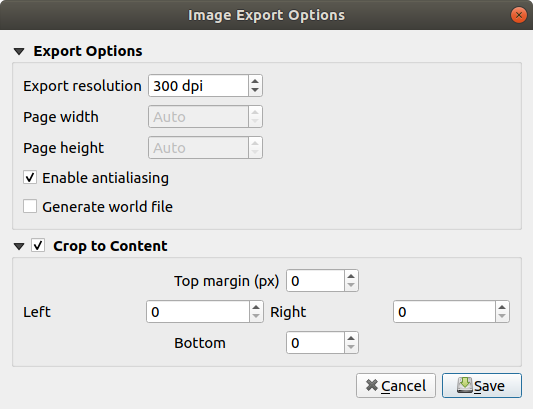
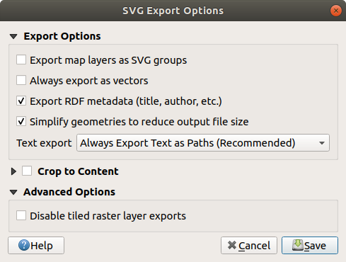
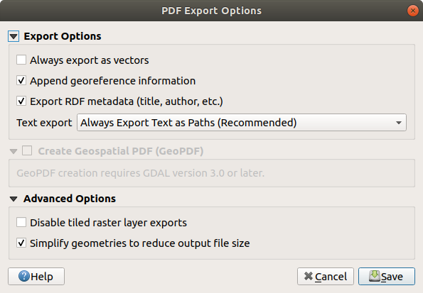
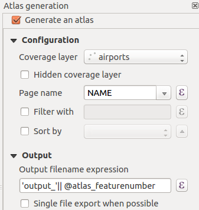

.. only:: html

   |updatedisclaimer|

.. index::
   single: Printing; Export map

.. _create-output:

*******************
 Creating an Output
*******************

.. only:: html

   .. contents::
      :local:

The :ref:`figure below <figure_layout_output>` shows an example of print layout
including each type of layout items described in the previous section.

.. _figure_layout_output:

   Print Layout with map view, legend, image, scale bar, coordinates, text and
   HTML frame added

.. index:: Export as image, Export as PDF, Export as SVG

From the :menuselection:`Layout` menu or toolbar, you can output the print
layout to different file formats, and it is possible to modify the resolution
(print quality) and paper size:

* The |filePrint| :sup:`Print` icon allows you to print the layout to a
  connected printer or a PostScript file, depending on installed printer drivers.
* The |saveMapAsImage| :sup:`Export as image` icon exports the print layout
  in several image formats such as :file:`PNG`, :file:`BMP`, :file:`TIF`,
  :file:`JPG`, and many others...
* The |saveAsSVG| :sup:`Export as SVG` icon saves the print layout
  as an :file:`SVG` (Scalable Vector Graphic).
* The |saveAsPDF| :sup:`Export as PDF` icon saves the defined print layout
  directly as a :file:`PDF`.

Export settings
===============

Whenever you export a print layout, there are a selection of export settings QGIS needs
to check in order to return the most appropriate output. These configurations
are:

* the :ref:`Export settings <layout_export_settings>` of the :guilabel:`Layout`
  panel, such as :guilabel:`Export resolution`, :guilabel:`Print as raster`,
  :guilabel:`Always export as vectors` or :guilabel:`Save world file`;
* the :guilabel:`Exclude page from exports` in the :ref:`page item properties
  <page_properties>` panel;
* the :guilabel:`Exclude item from exports` in the :ref:`item properties
  <layout_Rendering_Mode>` panel.

.. _export_layout_image:

Export as Image
===============

Clicking the |saveMapAsImage| :sup:`Export as image` icon will ask you to
select the image format and enter the filename to use to export the print layout:
in the case of multi-page composition, each page will be exported to a file with
the given name appended with the page number.

In the next :guilabel:`Image Export Options` dialog, you can optionally
override the print layout resolution and the exported page dimensions
(set in :guilabel:`Layout` panel).

.. index:: Crop layout to content
.. _crop_to_content:

By checking |checkbox| :guilabel:`Crop to content` option, the image output
by the layout will include the minimal area enclosing all the items (map,
legend, scale bar, shapes, label, image...) of each page of the composition:

* If the composition includes a single page, then the output is resized to
  include EVERYTHING on the composition. The page can then be reduced or
  extended to all items depending on their position (on, above, below, left or
  right of the page).
* In case of a multi-page layout, each page will be resized to include items in
  its area (left and right sides for all pages, plus top for the first page and
  bottom for the last page). Each resized page is exported to a separate file.

The :guilabel:`Crop to content` dialog also allows to add some margins around
the cropped bounds.

.. _figure_layout_output_image:

   Image Export Options, output is resized to items extent

.. tip:: **Use image formats that support transparency when items extend beyond the paper extent**

 Since layout items may be placed outside the paper extent, using the :guilabel:`Crop
 to content` option while exporting can result in an image that extends beyond the paper extent.
 Since the background outside of the paper extent will be transparent, for image
 formats that do not support transparency (eg, :file:`.BMP`, :file:`.JPG`) it
 will be rendered as full black,
 "corrupting" the image.

 Use transparency-compatible formats like :file:`.TIFF` or :file:`.PNG` in such
 a case.

If you need to export your layout as a **georeferenced image** (e.g., to share
with other projects), check the |unchecked| :guilabel:`Generate world file`
option and a world file named like the page on which the map reference set in
:guilabel:`Layout` panel is placed will be created along the export(s).
This option can also be checked by default in the :ref:`layout panel
<layout_panel>`.

When needed, images rendering can also be improved with the :guilabel:`Enable
antialiasing` option.

.. _export_layout_svg:

Export as SVG
=============

With |saveAsSVG| :sup:`Export as SVG`, you also need to fill the filename (used
as a basename for all files in case of multi-page composition) and then can
apply |checkbox| :guilabel:`Crop to content` :ref:`option <crop_to_content>`.

The SVG export options dialog also allows to override the layout default export
and offers other settings:

* |unchecked|:guilabel:`Export map layers as SVG groups`: may affect label
  placement.
* |checkbox|:guilabel:`Render map labels as outlines`: unchecking this will
  allow you to edit labels as texts in vector illustration software.
* |unchecked|:guilabel:`Always export as vectors`: some rendering options
  require items to be rasterized for a better rendering. Check this option to
  keep the objects as vectors with the risk that the appearance of the output
  file may not match the print layout preview (for more details, see
  :ref:`layout_export_settings`).
* |checkbox|:guilabel:`Export RDF metadata`.

.. _figure_layout_output_svg:

   SVG Export Options

.. note::

   Currently, the SVG output is very basic. This is not a QGIS problem, but a
   problem with the underlying Qt library. This will hopefully be sorted out
   in future versions.

.. _export_layout_pdf:

Export as PDF
=============

The |saveAsPDF| :sup:`Export as PDF` tool exports all the composition pages
into a single PDF file. Like the other formats, exporting to :file:`.PDF`
provides means to override some of the layout :ref:`export settings
<layout_export_settings>`.

.. _figure_layout_output_pdf:

   PDF Export Options

.. note:: Exporting a print layout to formats like :file:`.PDF` or :file:`.TIFF`
  creates by default a georeferenced output (no world file needed).

.. index:: Atlas generation

.. _atlas_generation:

Generate an Atlas
=================

Atlas functions allow you to create map books in an automated way. Atlas uses
the features of a vector or table layer called **coverage layer** and creates
an output for each **atlas feature**. The most common usage is to zoom a map
item to the current atlas feature. Further use cases include:

* a map item showing, for another layer, only features that share the same
  attribute as the atlas feature or are within its geometry;
* a label or html item whose text is replaced as features are iterated over;
* a table item showing attributes of associated :ref:`parent or children
  <vector_relations>` features of the current atlas feature...

For each feature, an output is processed for all pages and items according
to their exports settings.

.. tip:: **Use variables for more flexibility**

  QGIS provides a large panel of functions and :ref:`variables <general_tools_variables>`,
  including atlas related ones, that you can use to manipulate the layout
  items but also the layers symbology according to atlas status.
  Combining these features gives you a lot of flexibility and helps you
  easily produce advanced mappings.

To enable the generation of an atlas and access atlas parameters, refer to
the :guilabel:`Atlas` panel. This panel contains the following functionalities
(see figure_layout_atlas_):

.. _figure_layout_atlas:

   Atlas Panel

* |checkbox| :guilabel:`Generate an atlas`, which enables or disables the atlas
  generation;
* A :guilabel:`Coverage layer` |selectString| combo box that allows you to
  choose the table or vector layer containing the features to iterate over;
* An optional |checkbox| :guilabel:`Hidden coverage layer` that, if checked,
  will hide the coverage layer (but not the other layers) during the generation;
* An optional :guilabel:`Page name` combo box to give a more explicit name to
  each feature page(s) when previewing atlas. You can select a field of
  the coverage layer or set an :ref:`expression <vector_expressions>`. If this
  option is empty, QGIS will use an internal ID, according to the filter and/or
  the sort order applied to the layer;
* An optional :guilabel:`Filter with` text area that allows you to specify an
  expression for filtering features from the coverage layer. If the expression
  is not empty, only features that evaluate to ``True`` will be processed;
* An optional |checkbox| :guilabel:`Sort by` that allows you to
  sort features of the coverage layer, using a field of the coverage layer or
  an expression. The sort order (either ascending or descending) is set by the
  two-state *Sort direction* button that displays an up or a down arrow.

You also have options to set the output of the atlas:

* An :guilabel:`Output filename expression` textbox that is used to generate
  a filename for each geometry if needed. It is based on expressions. This field
  is meaningful only for rendering to multiple files;
* A |checkbox| :guilabel:`Single file export when possible` that allows you to
  force the generation of a single file if this is possible with the chosen output
  format (PDF, for instance). If this field is checked, the value of the
  :guilabel:`Output filename expression` field is meaningless;
* An :guilabel:`Image export format` drop-down list to select the output format
  when using the |saveMapAsImage| :sup:`Export atlas as Images...` button.

Control map by atlas
--------------------

The most common usage of atlas is with the map item, zooming to the current atlas
feature, as iteration goes over the coverage layer. This behavior is set in
the :guilabel:`Controlled by atlas` group properties of the map item. See
:ref:`controlled_atlas` for different settings you can apply on map item.

.. _atlas_labels:

Customize labels with expression
--------------------------------

In order to adapt labels to the feature the atlas iterates over, you can
include expressions. What you should take care of is to place expression part
(including functions, fields or variables) between ``[%`` and ``%]`` (see
:ref:`layout_label_item` for more details).

For example, for a city layer with fields CITY_NAME and ZIPCODE, you could
insert this:

.. code::

   The area of [% concat( upper(CITY_NAME), ',', ZIPCODE, ' is ',
   format_number($area/1000000, 2) ) %] km2

or, another combination:

.. code::

   The area of [% upper(CITY_NAME)%],[%ZIPCODE%] is
   [%format_number($area/1000000,2) %] km2

The information ``[% concat( upper(CITY_NAME), ',', ZIPCODE, ' is ',  format_number($area/1000000, 2) ) %]``
is an expression used inside the label. Both expressions would result in the
generated atlas as::

  The area of PARIS,75001 is 1.94 km2

.. _atlas_data_defined_override:

Explore Data-defined override buttons with atlas
------------------------------------------------

There are several places where you can use a |dataDefined| :sup:`Data defined
override` button to override the selected setting. These options are
particularly useful with atlas generation. See :ref:`data_defined` for more
details on this widget.

For the following examples the :file:`Regions` layer of the QGIS sample
dataset is used and selected as coverage layer for the atlas generation.
We also assume it's a single page layout containing a map and a label items.

When the height (north-south) of the extents of a region is greater
than its width (east-west), you rather want to use *Portrait* instead of
*Landscape* orientation to optimize the use of paper. With a |dataDefined|
:sup:`Data Defined Override` button you can dynamically set the paper
orientation.

Right-click on the page and select :guilabel:`Page Properties` to open the
panel. We want to set the orientation dynamically, using an expression
depending on the region geometry so press the |dataDefined| button of
field :guilabel:`Orientation`, select :guilabel:`Edit...` to open the
:guilabel:`Expression string builder` dialog and enter the following expression:

.. code::

   CASE WHEN bounds_width(@atlas_geometry) > bounds_height(@atlas_geometry)
   THEN 'Landscape' ELSE 'Portrait' END

Now if you :ref:`preview the atlas <atlas_preview>`, the paper orients itself
automatically but items placement may not be ideal. For each Region you need to
reposition the location of the layout items as well. For the map item you can
use the |dataDefined| button of its :guilabel:`Width` property to set it
dynamic using following expression:

.. code::

   @layout_pagewidth - 20

Likewise, use the |dataDefined| button of the :guilabel:`Height` property to
provide following expression and constrain map item size:

.. code::

   @layout_pageheight - 20

To ensure the map item is centered in the page, set its :guilabel:`Reference
point` to the upper left radio button and enter ``10`` for its :guilabel:`X`
and :guilabel:`Y` positions.

Let's add a title above the map in the center of the page. Select the label
item and set the horizontal alignment to |radioButtonOn| :guilabel:`Center`.
Next move the label to the right position, activate from :guilabel:`Reference
point` any of the middle buttons, and provide the following expression for
field :guilabel:`X`:

.. code::

   @layout_pagewidth / 2

For all other layout items you can set the position in a similar way so they
are correctly positioned when the page is automatically rotated in portrait or
landscape. You can also do more tweaks such as customizing the title with
feature attributes (see :ref:`atlas_labels` example), updating images with
atlas feature, resizing the legend columns number according to page orientation...

Information provided is an update of the excellent blog (in English and Portuguese)
on the Data Defined Override options Multiple_format_map_series_using_QGIS_2.6_ .

This is just one example of how you can use some advanced settings with atlas.

.. _atlas_preview:

Preview and generate an atlas
-----------------------------

.. _figure_layout_atlas_preview:

.. figure:: img/atlas_preview.png
   :align: center

   Atlas Preview toolbar

Once the atlas settings have been configured and layout items (map, table,
image...) linked to it, you can create a preview of all the pages by clicking
:menuselection:`Atlas --> Preview Atlas` or |atlas| :sup:`Preview Atlas` icon.
You can then use the arrows in the same toolbar to navigate through all the
features:

* |atlasFirst| :sup:`First feature`
* |atlasPrev| :sup:`Previous feature`
* |atlasNext| :sup:`Next feature`
* |atlasLast| :sup:`Last feature`

You can also use the combo box to directly select and preview a specific feature.
The combo box shows atlas features name according to the expression set in the
atlas :guilabel:`Page name` option.

As for simple compositions, an atlas can be generated in different ways (see
:ref:`create-output` for more information). Instead of :menuselection:`Layout`
menu, rather use tools from :menuselection:`Atlas` menu or toolbar.

This means that you can directly print your compositions with :menuselection:`Atlas --> Print Atlas`.
You can also create a PDF using :menuselection:`Atlas --> Export Atlas as PDF...`:
You will be asked for a directory to save all the generated PDF files,
except if the |checkbox| :guilabel:`Single file export when possible` has been
selected. In that case, you'll be prompted to give a filename.

With :menuselection:`Atlas --> Export Atlas as Images...` or
:menuselection:`Atlas --> Export Atlas as SVG...` tool, you're also prompted to
select a folder. Each page of each atlas feature composition is exported to
the image file format set in :guilabel:`Atlas` panel or to SVG file.

.. tip:: **Print a specific atlas feature**

  If you want to print or export the composition of only one feature of the atlas,
  simply start the preview, select the desired feature in the drop-down list
  and click on :menuselection:`Layout --> Print` (or :menuselection:`Export...`
  to any supported file format).

.. _Multiple_format_map_series_using_QGIS_2.6: https://sigsemgrilhetas.wordpress.com/2014/11/09/series-de-mapas-com-formatos-multiplos-em-qgis-2-6-parte-1-multiple-format-map-series-using-qgis-2-6-part-1

.. _relations_in_atlas:

Use project defined relations for atlas creation
------------------------------------------------

For users with HTML and Javascript knowledge it's possible to operate on
GeoJSON objects and use project defined relations from the QGIS project.
The difference between this approach and using expressions
directly inserted into the HTML is that it gives you a full,
unstructured GeoJSON feature to work with. This means that you can use the
existing Javascript libraries and functions which operate on GeoJSON
feature representations.
The following code includes all related child features from the defined relation.
Using the JavaScript ``setFeature`` function it allows you to make flexible HTML
which represents relations in whatever format you like (lists, tables, etc).
In the code sample, we create a dynamic bullet list of the related child features.

.. code::

   

   

During the atlas creation there will be an iteration over the coverage layer
containing the parent features. On every page, you will see a bullet list of
the related child features.
   

.. Substitutions definitions - AVOID EDITING PAST THIS LINE
   This will be automatically updated by the find_set_subst.py script.
   If you need to create a new substitution manually,
   please add it also to the substitutions.txt file in the
   source folder.

.. |atlas| image:: /static/common/mIconAtlas.png
   :width: 1.5em
.. |atlasFirst| image:: /static/common/mActionAtlasFirst.png
   :width: 1.5em
.. |atlasLast| image:: /static/common/mActionAtlasLast.png
   :width: 1.5em
.. |atlasNext| image:: /static/common/mActionAtlasNext.png
   :width: 1.5em
.. |atlasPrev| image:: /static/common/mActionAtlasPrev.png
   :width: 1.5em
.. |checkbox| image:: /static/common/checkbox.png
   :width: 1.3em
.. |dataDefined| image:: /static/common/mIconDataDefine.png
   :width: 1.5em
.. |filePrint| image:: /static/common/mActionFilePrint.png
   :width: 1.5em
.. |radioButtonOn| image:: /static/common/radiobuttonon.png
   :width: 1.5em
.. |saveAsPDF| image:: /static/common/mActionSaveAsPDF.png
   :width: 1.5em
.. |saveAsSVG| image:: /static/common/mActionSaveAsSVG.png
   :width: 1.5em
.. |saveMapAsImage| image:: /static/common/mActionSaveMapAsImage.png
   :width: 1.5em
.. |selectString| image:: /static/common/selectstring.png
   :width: 2.5em
.. |unchecked| image:: /static/common/checkbox_unchecked.png
   :width: 1.3em
.. |updatedisclaimer| replace:: :disclaimer:`Docs in progress for 'QGIS testing'. Visit https://docs.qgis.org/3.4 for QGIS 3.4 docs and translations.`
