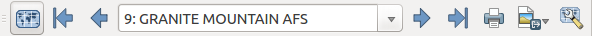

.. only:: html

   |updatedisclaimer|

.. index::
   single: Printing; Export map

.. _create-output:

*******************
 Creating an Output
*******************

.. only:: html

   .. contents::
      :local:

figure_layout_output_ shows the print layout with an example print layout,
including each type of map item described in the previous section.

.. _figure_layout_output:

.. figure:: img/print_composer_complete.png
   :align: center

   Print Layout with map view, legend, image, scale bar, coordinates, text and
   HTML frame added

.. index:: Export as image, Export as PDF, Export as SVG

Before printing a layout you have the possibility to view your composition
without bounding boxes. This can be enabled by deactivating :menuselection:`View -->`
|checkbox| :guilabel:`Show bounding boxes` or pressing the shortcut
:kbd:`Ctrl+Shift+B`.

The print layout allows you to create several output formats, and it is
possible to define the resolution (print quality) and paper size:

* The |filePrint| :sup:`Print` icon allows you to print the layout to a
  connected printer or a PostScript file, depending on installed printer drivers.
* The |saveMapAsImage| :sup:`Export as image` icon exports the layout
  canvas in several image formats, such as PNG, BPM, TIF, JPG,...
* The |saveAsSVG| :sup:`Export as SVG` icon saves the print layout canvas
  as an SVG (Scalable Vector Graphic).
* The |saveAsPDF| :sup:`Export as PDF` icon saves the defined print layout
  canvas directly as a PDF.

.. _export_layout_image:

Export as Image
===============

Clicking the |saveMapAsImage| :sup:`Export as image` icon will ask you to
enter the filename to use to export composition: in the case of multi-page
composition, each page will be exported to a file with the given name
appended with the page number.

You can then override the print resolution and the exported image dimensions
(set in Composition panel).

.. index:: Crop layout to content
.. _crop_to_content:

By checking |checkbox| :guilabel:`Crop to content` option, the image output
by the layout includes the minimal area enclosing all the items (map,
legend, scale bar, shapes, label, image...) of each page of the composition:

* If the composition includes a single page, then the output is resized to
  include EVERYTHING on the composition. The page can then be reduced or
  extended to all items depending on their position (on, above, below, left or
  right of the page).
* In case of a multi-page layout, each page will be resized to include
  items in its area (left and right sides for all pages, plus top for the first page
  and bottom for the last page). Each resized page is exported to a separate file.

The :guilabel:`Crop to content` dialog also allows to add some margins around
the cropped bounds.

.. _figure_layout_output_image:

.. figure:: img/image_export_options.png
   :align: center

   Image Export Options, output is resized to items extent

If you need to export your layout as a **georeferenced image** (e.g., to share
with other projects), you need to enable this feature under the
:ref:`layout_tab`.

If the output format is a TIFF format, all you need to do is making sure to
select the correct map item to use in |selectString| :guilabel:`Reference
map`, and the output will always be a GeoTIFF. For other image formats,
you also need to check the |checkbox| :guilabel:`Save world file` option.
With this option, the 'Export as image' action will create a world file along
with the exported image.

.. note::

   Exporting large rasters can sometimes fail, even if there seems to be
   enough memory. This is a problem with the underlying Qt management of rasters.

.. _export_layout_svg:

Export as SVG
=============

With |saveAsSVG| :sup:`Export as SVG`, you also need to fill the filename
(used as a basename for all files in case of multi-page composition) and then
can apply |checkbox| :guilabel:`Crop to content` :ref:`option <crop_to_content>`.

The SVG export options dialog also allows to:

* :guilabel:`Export map layers as SVG groups`: may affect label placement;
* :guilabel:`Render map labels as outlines`;
* :guilabel:`Always export as vectors`.

.. _figure_layout_output_svg:

.. figure:: img/svg_export_options.png
   :align: center

   SVG Export Options

.. note::

   Currently, the SVG output is very basic. This is not a QGIS problem, but a
   problem with the underlying Qt library. This will hopefully be sorted out
   in future versions.
   
.. _export_layout_pdf:

Export as PDF
=============

The |saveAsPDF| :sup:`Export as PDF` exports all the composition into a
single PDF file.

If you applied to your layout or any shown layer an advanced effect such as
blend modes, transparency or symbol effects, these cannot be printed
as vectors, and the effects may be lost. Checking :guilabel:`Print as
raster` in the :ref:`layout_tab` helps to keep the effects but
rasterize the composition. Note that the :guilabel:`Force layer to render as
raster` in the Rendering tab of Layer Properties dialog is a layer-level
alternative that avoids global composition rasterization.

If you need to export your layout as a **georeferenced PDF**, in the
:ref:`layout_tab`, make sure you select the correct map item to
use in |selectString| :guilabel:`Reference map`.

.. index:: Atlas generation

.. _atlas_generation:

Generate an Atlas
=================

The print layout includes generation functions that allow you to create map
books in an automated way. The concept is to use a coverage layer, which contains
geometries and fields. For each geometry in the coverage layer, a new output will
be generated where the content of some canvas maps will be moved to highlight the
current geometry. Fields associated with this geometry can be used within text
labels.

Every page will be generated with each feature. To enable the generation
of an atlas and access generation parameters, refer to the `Atlas generation`
panel.This panel contains the following widgets (see figure_layout_atlas_):

.. _figure_layout_atlas:

.. figure:: img/atlas_properties.png
   :align: center

   Atlas Generation Panel

* |checkbox| :guilabel:`Generate an atlas`, which enables or disables the atlas
  generation.
* A :guilabel:`Coverage layer` |selectString| combo box that allows you to
  choose the (vector) layer containing the features on which to iterate over.
* An optional |checkbox| :guilabel:`Hidden coverage layer` that, if checked,
  will hide the coverage layer (but not the other ones) during the generation.
* An optional :guilabel:`Page name` combo box to give a more explicit name to
  each feature page(s) when previewing atlas. You can select an attribute of
  the coverage layer or set an expression. If this option is empty, QGIS will
  use an internal ID, according to the filter and/or the sort order applied to
  the layer.
* An optional :guilabel:`Filter with` text area that allows you to specify an
  expression for filtering features from the coverage layer. If the expression
  is not empty, only features that evaluate to ``True`` will be selected.
  The button on the right allows you to display the expression builder.
* An optional |checkbox| :guilabel:`Sort by` that, if checked, allows you to
  sort features of the coverage layer. The associated combo box allows you to
  choose which column will be used as the sorting key. Sort order (either
  ascending or descending) is set by a two-state button that displays an up or
  a down arrow.

You also have options to set the output of the atlas:

* An :guilabel:`Output filename expression` textbox that is used to generate
  a filename for each geometry if needed. It is based on expressions. This field
  is meaningful only for rendering to multiple files.
* A |checkbox| :guilabel:`Single file export when possible` that allows you to
  force the generation of a single file if this is possible with the chosen output
  format (PDF, for instance). If this field is checked, the value of the
  :guilabel:`Output filename expression` field is meaningless.

You can use multiple map items with the atlas generation; each map will be rendered
according to the coverage features. To enable atlas generation for a specific map
item, you need to check |checkbox|:guilabel:`Controlled by Atlas` under the item
properties of the map item.
Once checked, you can set:

* A |radioButtonOn| :guilabel:`Margin around feature` that allows you to select
  the amount of space added around each geometry within the allocated map.
  Its value is meaningful only when using the auto-scaling mode.
* A |radioButtonOff| :guilabel:`Predefined scale` (best fit). It will use the best
  fitting option from the list of predefined scales in your project properties settings
  (see :menuselection:`Project --> Project Properties --> General --> Project Scales`
  to configure these predefined scales).
* A |radioButtonOff| :guilabel:`Fixed scale` that allows you to toggle between
  auto-scale and fixed-scale mode.
  In fixed-scale mode, the map will only be translated for each geometry to be centered.
  In auto-scale mode, the map's extents are computed in such a way that
  each geometry will appear in its entirety.

Labels
------

In order to adapt labels to the feature the atlas plugin iterates over, you can
include expressions. What you should take care of is to place expression part
(including functions, fields or variables) between ``[%`` and ``%]``.
For example, for a city layer with fields CITY_NAME and ZIPCODE, you could
insert this:

.. code::

   The area of [% upper(CITY_NAME) || ',' || ZIPCODE || ' is '
   format_number($area/1000000,2) %] km2

or, another combination:

.. code::

   The area of [% upper(CITY_NAME)%],[%ZIPCODE%] is
   [%format_number($area/1000000,2) %] km2

The information ``[% upper(CITY_NAME) || ',' || ZIPCODE || ' is ' format_number($area/1000000,2) %]``
is an expression used inside the label. Both expressions would result in the
generated atlas as::

  The area of PARIS,75001 is 1.94 km2

.. _atlas_data_defined_override:

Data Defined Override Buttons
-----------------------------

There are several places where you can use a |dataDefined| :sup:`Data Defined
Override` button to override the selected setting. These options are
particularly useful with Atlas Generation.

For the following examples the `Regions` layer of the QGIS sample dataset is
used and selected for Atlas Generation.
We also assume the paper format `A4 (210X297)` is selected in the
:guilabel:`Composition` panel for field :guilabel:`Presets`.

With a `Data Defined Override` button you can dynamically set the paper
orientation. When the height (north-south) of the extents of a region is greater
than its width (east-west), you rather want to use `portrait` instead of
`landscape` orientation to optimize the use of paper.

In the :guilabel:`Composition` you can set the field :guilabel:`Orientation`
and select `Landscape` or `Portrait`. We want to set the orientation dynamically
using an expression depending on the region geometry.
Press the |dataDefined| button of field :guilabel:`Orientation`, select
:menuselection:`Edit...` so the :guilabel:`Expression string builder` dialog
opens. Enter the following expression:

.. code::

   CASE WHEN bounds_width($atlasgeometry) > bounds_height($atlasgeometry)
   THEN 'Landscape' ELSE 'Portrait' END

Now the paper orients itself automatically. For each Region you need to
reposition the location of the layout item as well. For the map item you can
use the |dataDefined| button of field :guilabel:`Width` to set it
dynamically using following expression:

.. code::

   (CASE WHEN bounds_width($atlasgeometry) > bounds_height($atlasgeometry)
   THEN 297 ELSE 210 END) - 20

Use the |dataDefined| button of field :guilabel:`Height` to provide following
expression:

.. code::

   (CASE WHEN bounds_width($atlasgeometry) > bounds_height($atlasgeometry)
   THEN 210 ELSE 297 END) - 20

When you want to give a title above the map in the center of the page,
insert a label item above the map. First use the item properties of the label
item to set the horizontal alignment to |radioButtonOn| :guilabel:`Center`.
Next activate from :guilabel:`Reference point` the upper middle checkbox.
You can provide the following expression for field :guilabel:`X` :

.. code::

   (CASE WHEN bounds_width($atlasgeometry) > bounds_height($atlasgeometry)
   THEN 297 ELSE 210 END) / 2

For all other layout items you can set the position in a similar way so they
are correctly positioned when the page is automatically rotated in portrait or
landscape.

Information provided is derived from the excellent blog (in English and Portuguese)
on the Data Defined Override options Multiple_format_map_series_using_QGIS_2.6_ .

This is just one example of how you can use the Data Defined Override option.

.. _atlas_preview:

Preview and generate an atlas
-----------------------------

.. _figure_layout_atlas_preview:

   Atlas Preview toolbar

Once the atlas settings have been configured and layout items (map, table,
image...) linked to it, you can create a preview of all the pages by clicking
:menuselection:`Atlas --> Preview Atlas` or |atlas| :sup:`Preview Atlas` icon.
You can then use the arrows in the same toolbar to navigate through all the
features:

* |atlasFirst| :sup:`First feature`
* |atlasPrev| :sup:`Previous feature`
* |atlasNext| :sup:`Next feature`
* |atlasLast| :sup:`Last feature`

You can also use the combo box to directly select and preview a specific feature.
The combo box shows atlas features name according to the expression set in the
atlas :guilabel:`Page name` option.

As for simple compositions, an atlas can be generated in different ways (see
:ref:`create-output` for more information). Instead of :menuselection:`Layout`
menu, rather use tools from :menuselection:`Atlas` menu or toolbar.

This means that you can directly print your compositions with :menuselection:`Atlas --> Print Atlas`.
You can also create a PDF using :menuselection:`Atlas --> Export Atlas as PDF...`:
You will be asked for a directory to save all the generated PDF files,
except if the |checkbox| :guilabel:`Single file export when possible` has been
selected. In that case, you'll be prompted to give a filename.

With :menuselection:`Atlas --> Export Atlas as Images...` or
:menuselection:`Atlas --> Export Atlas as SVG...` tool, you're also prompted to
select a folder. Each page of each atlas feature composition is exported to
an image or SVG file.

.. tip:: **Print a specific atlas feature**

  If you want to print or export the composition of only one feature of the atlas,
  simply start the preview, select the desired feature in the drop-down list
  and click on :menuselection:`Layout --> Print` (or :menuselection:`Export...`
  to any supported file format).

.. _Multiple_format_map_series_using_QGIS_2.6: http://sigsemgrilhetas.wordpress.com/2014/11/09/series-de-mapas-com-formatos-multiplos-em-qgis-2-6-parte-1-multiple-format-map-series-using-qgis-2-6-part-1

.. Substitutions definitions - AVOID EDITING PAST THIS LINE
   This will be automatically updated by the find_set_subst.py script.
   If you need to create a new substitution manually,
   please add it also to the substitutions.txt file in the
   source folder.

.. |atlas| image:: /static/common/mIconAtlas.png
   :width: 1.5em
.. |atlasFirst| image:: /static/common/mActionAtlasFirst.png
   :width: 1.5em
.. |atlasLast| image:: /static/common/mActionAtlasLast.png
   :width: 1.5em
.. |atlasNext| image:: /static/common/mActionAtlasNext.png
   :width: 1.5em
.. |atlasPrev| image:: /static/common/mActionAtlasPrev.png
   :width: 1.5em
.. |checkbox| image:: /static/common/checkbox.png
   :width: 1.3em
.. |dataDefined| image:: /static/common/mIconDataDefine.png
   :width: 1.5em
.. |filePrint| image:: /static/common/mActionFilePrint.png
   :width: 1.5em
.. |radioButtonOff| image:: /static/common/radiobuttonoff.png
.. |radioButtonOn| image:: /static/common/radiobuttonon.png
.. |saveAsPDF| image:: /static/common/mActionSaveAsPDF.png
   :width: 1.5em
.. |saveAsSVG| image:: /static/common/mActionSaveAsSVG.png
   :width: 1.5em
.. |saveMapAsImage| image:: /static/common/mActionSaveMapAsImage.png
   :width: 1.5em
.. |selectString| image:: /static/common/selectstring.png
   :width: 2.5em
.. |updatedisclaimer| replace:: :disclaimer:`Docs for 'QGIS testing'. Visit http://docs.qgis.org/2.18 for QGIS 2.18 docs and translations.`
