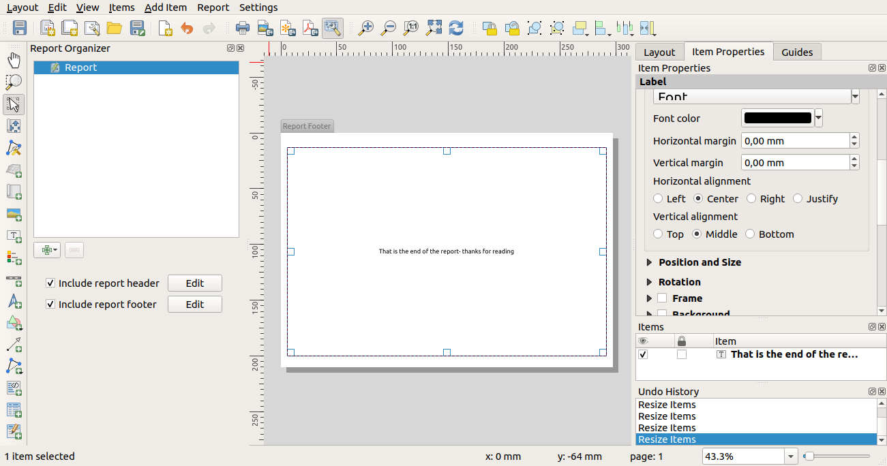
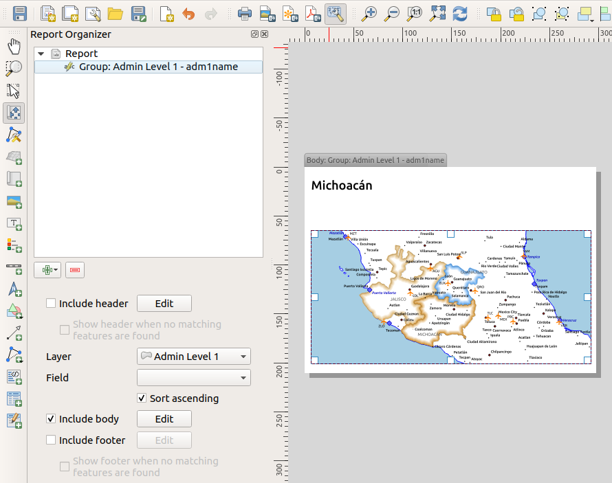
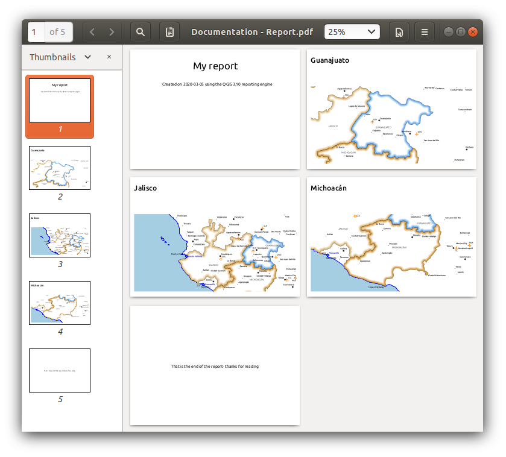
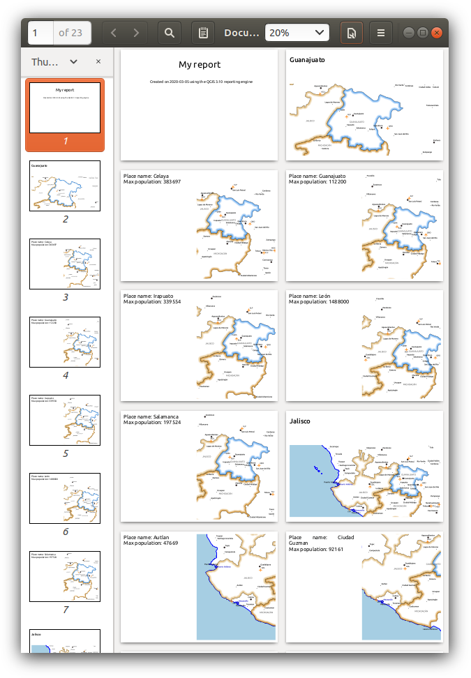
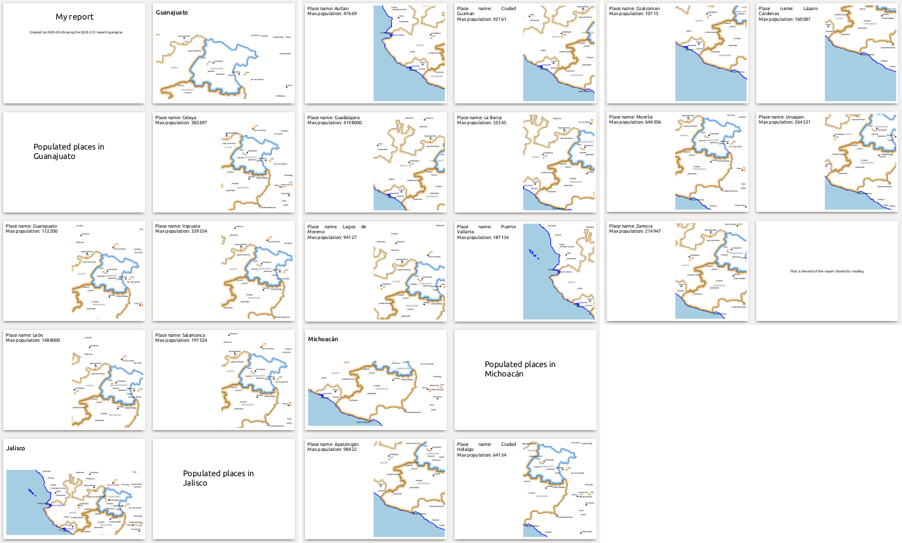
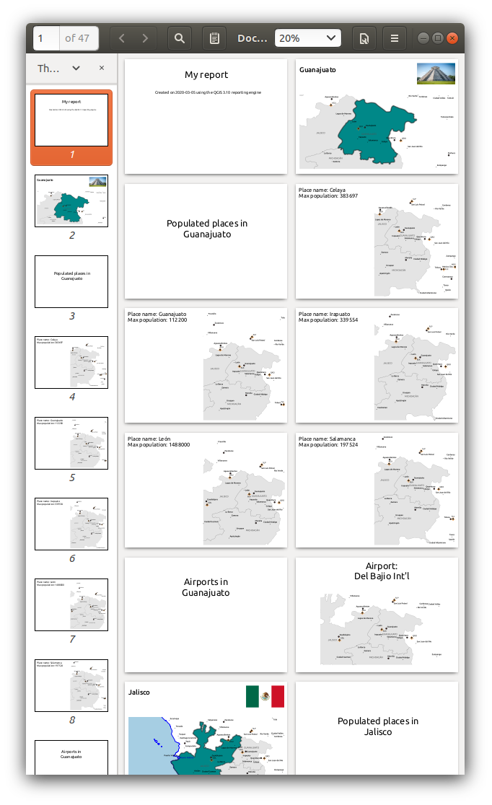

.. only:: html

   |updatedisclaimer|

.. index::
   single: Printing; Reports

.. _create-reports:

*****************
Creating a Report
*****************

.. only:: html

   .. contents::
      :local:

What is?
========

This section will help you set up an automatic report in QGIS. By definition a
GIS report is a document containing information organized in a narrative,
graphic, maps, or tabular form, prepared on ad hoc, periodic, recurring,
regular, or as required basis. Reports may refer to specific periods, events,
occurrences, or subjects, locations, and may be communicated or presented in
oral or written form. The reports in QGIS will allow the users to output their
GIS projects in a simple, quick and structured way.

Get started
===========

:guilabel:`Reports` menu is an extension of Print Layout. This funcionality can
be found in :menuselection:`Project --> New Report` or inside of
:menuselection:`Project --> Layout Manager`.

In the :guilabel:`Layout Manager` dialog the report can be created through
:guilabel:`New from template` and select the dropdown option :guilabel:`Empty
Report` and hitting :guilabel:`Create...` button.

For this example, we use some administrative boundaries, populated places, ports
and airports from dataset of `Natural Earth
<https://www.naturalearthdata.com/downloads/>`_.

|

Using the :menuselection:`Project --> New Report` command, we then create a new
blank report. Initially, there’s not much to look at – the dialog which is
displayed looks much like the print layout designer, except for the new
:guilabel:`Report Organizer` panel shown on the left:

.. figure:: img/report-2.png
   :align: center

Layout Report Workspace
=======================

QGIS reports can consist of multiple, nested sections. In our new blank report
we initially have only the main report section. The only options present for
this report section is :guilabel:`Include report header` or :guilabel:`Include
report footer`. If we enable these options, the header will be included as the
very first page (or pages… --- individual parts of reports can be multi-page if
desired) in the report, and the footer would be the last page. Let’s go ahead
and enable the header, and hit the :guilabel:`Edit` button next to it:

.. figure:: img/report_header.png
  :align: center

|

A few things happen as a result. Firstly, an edit pencil is now shown next to
the :guilabel:`Report` section in the :guilabel:`Report Organizer`, indicating
that the report section is currently being edited in the designer. We also see a
new blank page shown in the designer itself, with the small :guilabel:`Report
Header` title. In QGIS reports, every component of the report is made up of
individual layouts. They can be created and modified using the exact same tools
as are available for standard print layouts – so you can use any desired
combination of labels, pictures, maps, tables, etc. Let’s add some items to our
report header to demonstrate:

.. figure:: img/header.png
   :align: center

|

We’ll also create a simple footer for the report, by checking the
:guilabel:`Include report footer` option and hitting :guilabel:`Edit`.

|

Before proceeding further, let’s export this report and see what we get.
Exporting is done from the Report menu – in this case we select
:guilabel:`Export Report as PDF` to render the whole report to a PDF file.
Here’s the not-very-impressive result – a two page PDF consisting of our header
and footer:

|

Let’s make things more interesting. By hitting the |signPlus| :sup:`Add Static Layout Section`
button in the :guilabel:`Report Organizer`, we’re given a choice of new sections
to add to our report.

.. figure:: img/add_section.png
   :align: center

|

There are two options: :guilabel:`Add Static Layout Section` and a
:guilabel:`Field Group Section`.  The :guilabel:`Add Static Layout Section` is a
single, static body layout. This can be used to embed static layouts mid-way
through a report. Alternatively, a :guilabel:`Field Group Section` repeats its
body layout for every feature in a layer. The features are sorted by the
selected grouping feature (with an option for ascending/descending sort). If a
field group section has child sections (e.g. another field group section with a
different field, then only features with unique values for the group feature are
iterated over. This allows nested reports with different information.

For now we’ll add a Field Group to our report. At its
most basic level, you can think of a :guilabel:`Field Group Section` as the equivalent
of a :ref:`print atlas <atlas_generation>`. You select a layer to iterate over,
and the report will insert a section for each feature found. Selecting the new
::guilabel:`Field Group Section` section reveals a number of new related settings:

.. figure:: img/field_group.png
   :align: center

|

In this case we’ve setup our Field Group so that we iterate over all the states
from the :guilabel:`Admin Level 1` layer, using the values from the
:guilabel:`adm1name` field. The same options for header and footer are present,
together with a new option to include a :guilabel:`body` for this section. We’ll
do that, and edit the body:

|

We’ve setup this body with a map (set to follow the current report feature –
just like how a map item in an atlas can follow the current atlas feature), and
a label showing the state’s name. If we went ahead and exported our report now,
we’d get something like this:

|

First, the report header, then a page for each state, and finally the report
footer. So more or less an atlas, but with a header and footer page. Let’s make
things more interesting by adding a subsection to our state group. We do this by
first selecting the state field group in the organizer, then hitting the
|signPlus| :sup:`Field Group Section` button and adding a new :guilabel:`Field Group Section`:

.. figure:: img/subsection.png
   :align: center

|

When a :guilabel:`Field Group Section` is iterating over its features, it will
automatically filter these features to match the feature attributes from its
parent groups. In this case, the subsection we added will iterate over a
:guilabel:`Populated Places` layer, including a body section for each place
encountered. The magic here is that the :guilabel:`Populated Places` layer has
an attribute named :guilabel:`adm1name`, tagging each place with the state it’s
contained within (if you’re lucky your data will already be structured like this
– if not, run the Processing :ref:`Join Attributes by Location
<qgisjoinattributesbylocation>` algorithm and create your own field). When we
export this report, QGIS will grab the first state from the :guilabel:`Admin
Level 1` layer, and then iterate over all the :guilabel:`Populated Places` with
a matching :guilabel:`adm1name` value. Here’s what we get:

|

Here we created a basic body for the Populated Places group, including a map of
the place and a table of some place attributes. So our report is now a report
header, a page for each state followed by a page for every populated place
within that state, and finally the report footer. If we were to add a header for
the Populated Places group, it would be included just before listing the
populated places for each state:

|

Similarly, a footer for the Populated Places group would be inserted after the
final place for each state is included.

In addition to nested subsections, subsections in a report can also be included
consecutively. If we add a second subsection to the `Admin Level 1 group` for
:guilabel:`Airports`, then our report will first list ALL the populated places
for each state, followed by all the airports within that state, before
proceeding to the next state. In this case our report would be structured like
this:

Report Output
=============

The key point here is that our :guilabel:`Airports group` is a subsection of the
:guilabel:`Admin Level 1 group` – not the :guilabel:`Populated Places group`.
Here’s what our report could look like now:

|

Combining nested and consecutive sections, together with section headers and
footers allows for tons of flexibility. For instance, in the below report we add
another field group as a child of the main report for the :guilabel`Ports`
layer. Now, after listing the states together with their populated places and
airports, we’ll get a summary list of all the ports in the region:

|

This results in the last part of our report exporting as:

.. figure:: img/ports.png
   :align: center

Export settings
===============

Whenever you export a report, there is a selection of export settings QGIS needs
to check in order to return the most appropriate output. As you can start to
imagine, reports in QGIS are extremely powerful and flexible!

.. note:: When you are exporting a report to the available formats please choose the options (Print, SVG, Image, PDF) that have the labels saying :guilabel:`Export Report as...` otherwise you will print the current active map.

    .. figure:: img/export_options_reports.png
       :align: center

|

The current information was adapted from the blog of North Road, `Exploring
Reports in QGIS 3.0 - the Ultimate Guide!
<https://north-road.com/2018/01/23/exploring-reports-in-qgis-3-0-the-ultimate-guide>`_

.. Substitutions definitions - AVOID EDITING PAST THIS LINE
   This will be
   automatically updated by the find_set_subst.py script. If you need to create a
   new substitution manually, please add it also to the substitutions.txt file in
   the source folder.

.. |signPlus| image:: /static/common/symbologyAdd.png
   :width: 1.5em
.. |updatedisclaimer| replace:: :disclaimer:`Docs in progress for 'QGIS testing'. Visit https://docs.qgis.org/2.18 for QGIS 2.18 docs and translations.`
