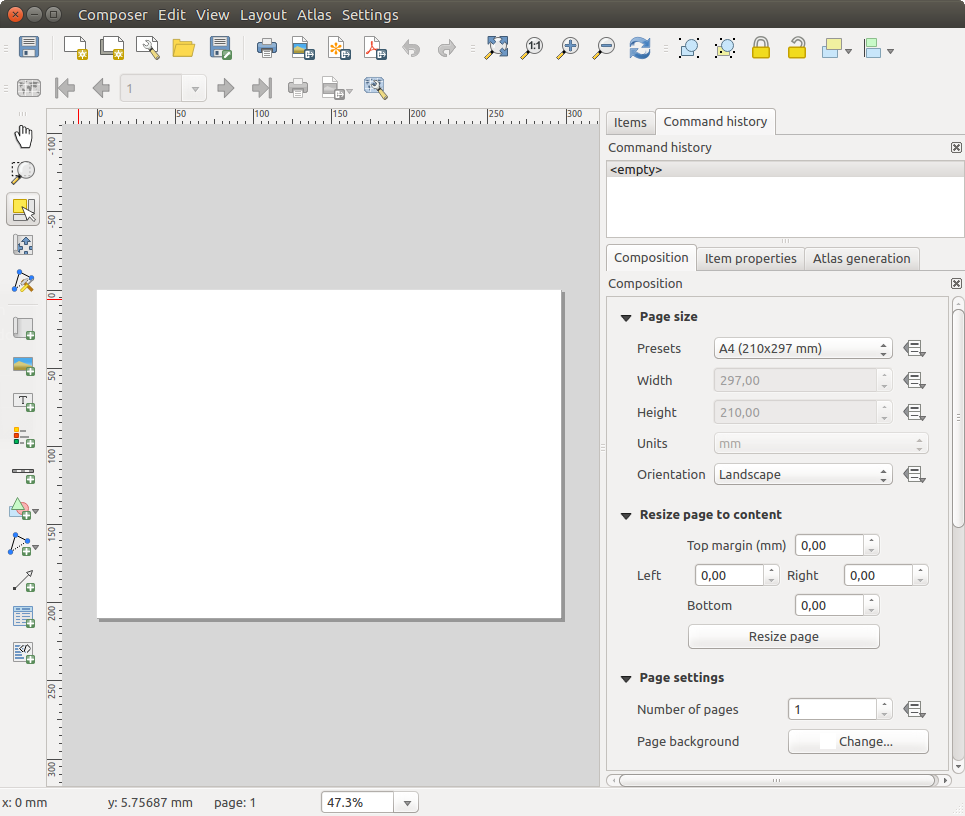
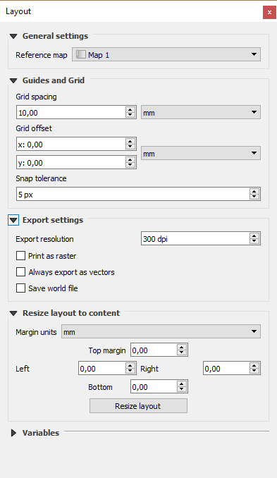

.. only:: html

   |updatedisclaimer|

.. _overview_layout:

******************************
 Overview of the Print Layout
******************************

.. only:: html

   .. contents::
      :local:

The print layout provides growing layout and printing capabilities. It allows
you to add elements such as the QGIS map canvas, text labels, images, legends,
scale bars, basic shapes, arrows, attribute tables and HTML frames. You can size,
group, align, position and rotate each element and adjust their properties to
create your layout. The layout can be printed or exported to image formats,
PostScript, PDF or to SVG (export to SVG is not working properly with some
recent Qt4 versions; you should try and check individually on your system).
You can save the layout as a template and load it again in another session.
Finally, generating several maps based on a template can be done through the
atlas generator.

.. index:: Layout template, Map template

Sample Session
==============

Before you start to work with the print layout, you need to load some raster
or vector layers in the QGIS map canvas and adapt their properties to suit your
own convenience. After everything is rendered and symbolized to your liking,
click the |newLayout| :sup:`New Print Layout` icon in the toolbar or
choose :menuselection:`File --> New Print Layout`. You will be prompted to
choose a title for the new layout.

To demonstrate how to create a map please follow the next instructions.

#. On the left side, select the |addMap| :sup:`Add new map` toolbar button
   and draw a rectangle on the canvas holding down the left mouse button.
   Inside the drawn rectangle the QGIS map view to the canvas.
#. Select the |scaleBar| :sup:`Add new scalebar` toolbar button and click
   with the left mouse button on the print layout canvas. A scalebar will be
   added to the canvas.
#. Select the |addLegend| :sup:`Add new legend` toolbar button and draw a
   rectangle on the canvas holding down the left mouse button.
   Inside the drawn rectangle the legend will be drawn.
#. Select the |select| :sup:`Select/Move item` icon to select the map on
   the canvas and move it a bit.
#. While the map item is still selected you can also change the size of the map
   item. Click while holding down the left mouse button, in a white little
   rectangle in one of the corners of the map item and drag it to a new location
   to change its size.
#. Click the :guilabel:`Item Properties` panel on the left down side and find
   the setting for the orientation. Change the value of the setting
   :guilabel:`Map orientation` to '15.00\ |degrees| '. You should see the
   orientation of the map item change.
#. Now, you can print or export your print layout to image formats, PDF or
   to SVG with the export tools in :menuselection:`Layout` menu.
#. Finally, you can save your print layout within the project file with the
   |fileSave| :sup:`Save Project` button.

You can add multiple elements to the print layout. It is also possible to have more
than one map view or legend or scale bar in the print layout canvas, on one or
several pages. Each element has its own properties and, in the case of the map,
its own extent. If you want to remove any elements from the layout canvas you
can do that with the :kbd:`Delete` or the :kbd:`Backspace` key.

.. index:: Layout manager
.. _layout_manager:

The Layout Manager
====================

The :guilabel:`Layout Manager` is the main window to manage print layouts in the project.
It helps you add new print layout, duplicate an existing one, rename or delete
it. To open the layout manager dialog, click on the |layoutManager|
:sup:`Layout Manager` button in the toolbar or choose :menuselection:`Layout
--> Layout Manager`. It can also be reached from the main window of QGIS with
:menuselection:`Project --> Layout Manager...`.

.. _figure_layout_manager:

   The Print Layout Manager

The layout manager lists in its upper part all the available print layouts
in the project. The bottom part shows tools that help to:

* show the selected print layout(s): you can open multiple print layouts in
  one-click
* duplicate the selected print layout (available only if one print layout is
  selected): it creates a new layout using the selected one as template.
  You'll be prompted to choose a new title for the new layout
* rename the layout (available only if one print layout is selected):
  You'll be prompted to choose a new title for the layout. Note that you can
  also rename the print layout by double-clicking on its title in the upper part
* remove the layout: the selected print layout(s) will be deleted from the
  project.

With the layout manager, it's also possible to create new print layouts as
an empty layout or from a saved template. By default, QGIS will look for
templates in user profile folder (:file:`~/.qgis2/composer_templates`) or
application's one (:file:`ApplicationFolder/composer_templates`).
QGIS will retrieve all the available templates and propose them in the combobox.
The selected template will be used to create a new print layout when clicking
:guilabel:`Add` button.
You can also save layout templates in another folder.
Choosing *specific* in the template list offers the ability to select such
template and use it to create a new print layout.

.. _print_composer_menus:

Menus, tools and panels of the print layout
=============================================

Opening the print layout provides you with a blank canvas that represents the
paper surface when using the print option. Initially you find buttons on the
left beside the canvas to add print layout items: the current QGIS map canvas,
text labels, images, legends, scale bars, basic shapes, arrows, attribute tables
and HTML frames. In this toolbar you also find buttons to navigate,
zoom in on an area and pan the view on the layout a well as buttons to
select any layout item and to move the contents of the map item.

figure_layout_overview_ shows the initial view of the print layout before
any elements are added.

.. _figure_layout_overview:

   Print Layout

On the right beside the canvas you find two set of panels. The upper one holds
the panels :guilabel:`Items` and :guilabel:`Undo History` and the lower holds
the panels :guilabel:`Layout`, :guilabel:`Item properties`
and :guilabel:`Atlas generation`.

* The :guilabel:`Items` panel provides a list of all the print layout items added to
  the canvas.
* The :guilabel:`Undo history` panel displays a history of all changes applied
  to the layout. With a mouse click, it is possible to undo and
  redo layout steps back and forth to a certain status.
* The :guilabel:`Layout` panel allows you to set paper size, orientation, the
  page background, number of pages and print quality for the output file in dpi.
  Furthermore, you can also activate the |checkbox| :guilabel:`Print as raster`
  checkbox. This means all items will be converted to raster before printing or
  saving as PostScript or PDF.
  In this panel, you can also customize settings for grid and smart guides.
* The :guilabel:`Item Properties` panel displays the properties for the selected
  item. Click the |select| :sup:`Select/Move item` icon to select
  an item (e.g., legend, scale bar or label) on the canvas. Then click the
  :guilabel:`Item Properties` panel and customize the settings for the selected
  item (see :ref:`layout_items` for detailed information on each item
  settings).
* The :guilabel:`Atlas generation` panel allows you to enable the generation of an
  atlas for the current layout and gives access to its parameters
  (see :ref:`atlas_generation` for detailed information on atlas
  generation usage).

In the bottom part of the print layout window, you can find a status bar with
mouse position, current page number, a combo box to set the zoom level,
the number of selected items if applicable and, in the case of atlas generation,
the number of features.

In the upper part of the print layout window, you can find menus and other
toolbars. All print layout tools are available in menus and as icons in a
toolbar. See a list of tools in table_layout_tools_.

The toolbars and the panels can be switched off and on using the right mouse
button over any toolbar or through :menuselection:`View --> Toolbars` or
:menuselection:`View --> Panels`.

.. index::
   single: Print layout; Tools

.. _layout_tools:

Tools
-----

.. _table_layout_tools:

+-----------------------+---------------------------------------+---------------------+------------------------------------------+
| Icon                  | Purpose                               | Icon                | Purpose                                  |
+=======================+=======================================+=====================+==========================================+
| |fileSave|            | Save Project                          | |newLayout|         | New Layout                               |
+-----------------------+---------------------------------------+---------------------+------------------------------------------+
| |duplicateLayout|     | Duplicate Layout                      | |layoutManager|     | Layout Manager                           |
+-----------------------+---------------------------------------+---------------------+------------------------------------------+
| |fileOpen|            | Load from template                    | |fileSaveAs|        | Save as template                         |
+-----------------------+---------------------------------------+---------------------+------------------------------------------+
| |filePrint|           | Print or export as PostScript         | |saveMapAsImage|    | Export to an image format                |
+-----------------------+---------------------------------------+---------------------+------------------------------------------+
| |saveAsSVG|           | Export print composition to SVG       | |saveAsPDF|         | Export as PDF                            |
+-----------------------+---------------------------------------+---------------------+------------------------------------------+
| |undo|                | Revert last change                    | |redo|              | Restore last change                      |
+-----------------------+---------------------------------------+---------------------+------------------------------------------+
| |zoomFullExtent|      | Zoom to full extent                   | |zoomActual|        | Zoom to 100%                             |
+-----------------------+---------------------------------------+---------------------+------------------------------------------+
| |zoomIn|              | Zoom in                               | |zoomIn|            | Zoom out                                 |
+-----------------------+---------------------------------------+---------------------+------------------------------------------+
| |draw|                | Refresh View                          |                     |                                          |
+-----------------------+---------------------------------------+---------------------+------------------------------------------+
| |pan|                 | Pan                                   | |zoomToArea|        | Zoom to specific region                  |
+-----------------------+---------------------------------------+---------------------+------------------------------------------+
| |select|              | Select/Move item in print composition | |moveItemContent|   | Move content within an item              |
+-----------------------+---------------------------------------+---------------------+------------------------------------------+
| |addMap|              | Add new map from QGIS map canvas      | |addImage|          | Add image to print composition           |
+-----------------------+---------------------------------------+---------------------+------------------------------------------+
| |label|               | Add label to print composition        | |addLegend|         | Add new legend to print composition      |
+-----------------------+---------------------------------------+---------------------+------------------------------------------+
| |scaleBar|            | Add scale bar to print composition    | |addBasicShape|     | Add basic shape to print composition     |
+-----------------------+---------------------------------------+---------------------+------------------------------------------+
| |addArrow|            | Add arrow to print composition        | |openTable|         | Add attribute table to print composition |
+-----------------------+---------------------------------------+---------------------+------------------------------------------+
| |addHtml|             | Add an HTML frame                     | |addNodesShape|     | Add nodes shape to print composition     |
+-----------------------+---------------------------------------+---------------------+------------------------------------------+
| |editNodesShape|      | Edit a nodes shape                    |                     |                                          |
+-----------------------+---------------------------------------+---------------------+------------------------------------------+
| |groupItems|          | Group items of print composition      | |ungroupItems|      | Ungroup items of print composition       |
+-----------------------+---------------------------------------+---------------------+------------------------------------------+
| |locked|              | Lock Selected Items                   | |unlocked|          | Unlock All items                         |
+-----------------------+---------------------------------------+---------------------+------------------------------------------+
| |raiseItems|          | Raise selected items                  | |lowerItems|        | Lower selected items                     |
+-----------------------+---------------------------------------+---------------------+------------------------------------------+
| |moveItemsToTop|      | Move selected items to top            | |moveItemsToBottom| | Move selected items to bottom            |
+-----------------------+---------------------------------------+---------------------+------------------------------------------+
| |alignLeft|           | Align selected items left             | |alignRight|        | Align selected items right               |
+-----------------------+---------------------------------------+---------------------+------------------------------------------+
| |alignHCenter|        | Align selected items center           | |alignVCenter|      | Align selected items center vertical     |
+-----------------------+---------------------------------------+---------------------+------------------------------------------+
| |alignTop|            | Align selected items top              | |alignBottom|       | Align selected items bottom              |
+-----------------------+---------------------------------------+---------------------+------------------------------------------+
| |atlas|               | Preview Atlas                         | |atlasFirst|        | First Feature                            |
+-----------------------+---------------------------------------+---------------------+------------------------------------------+
| |atlasPrev|           | Previous Feature                      |  |atlasNext|        | Next Feature                             |
+-----------------------+---------------------------------------+---------------------+------------------------------------------+
| |atlasLast|           | Last feature                          |  |filePrint|        | Print Atlas                              |
+-----------------------+---------------------------------------+---------------------+------------------------------------------+
| |saveMapAsImage|      | Export Atlas as Image                 |  |atlasSettings|    | Atlas Settings                           |
+-----------------------+---------------------------------------+---------------------+------------------------------------------+

Table Layout 1: Print Layout Tools

Layout Menu
-----------

With the :menuselection:`Layout --> Save Project` action, you can save
the project file directly from the print layout window.
The :menuselection:`Layout` menu also provides actions to:

* Create a new and blank print layout with |newLayout| :guilabel:`New Layout...`
* |duplicateLayout| :guilabel:`Duplicate Layout...` : Create a new print layout
  by duplicating the current one
* Open the |layoutManager| :guilabel:`Layout Manager...`
* :menuselection:`Layouts -->` : Open an existing print layout

Once the layout is designed, with |fileSaveAs| :guilabel:`Save as Template`
and |fileOpen| :guilabel:`Add Items from Template` icons, you can save
the current state of a print layout session as a :file:`.qpt` template
and load its item again in another session.

In the :menuselection:`Layout` menu, there are also powerful ways to share
geographical information produced with QGIS that can be included in reports or
published. These tools are |saveMapAsImage| :guilabel:`Export as Image...`,
|saveAsPDF| :guilabel:`Export as PDF...`, |saveAsSVG| :guilabel:`Export as
SVG...` and |filePrint| :guilabel:`Print...`.

Settings Menu
-------------

From :menuselection:`Settings --> Layout Options...` you can set some options
that will be used as default on any layout during your work.

* :guilabel:`Layout defaults` let you specify the default font to use.
* With :guilabel:`Grid appearance`, you can set the grid style and its color.
  There are three types of grid: **Dots**, **Solid** lines and **Crosses**.
* :guilabel:`Grid and guide defaults` defines spacing, offset and tolerance of
  the grid.

Edit Menu
---------

Copy/Cut and Paste Items
........................

The print layout includes actions to use the common Copy/Cut/Paste functionality
for the items in the layout. As usual first you need to select the items using
one of the options seen above; at this point the actions can be found in the
:menuselection:`Edit` menu.
When using the Paste action, the elements will be pasted according to the current
mouse position. Using the :menuselection:`Edit --> Paste in Place` action or
pressing :kbd:`Ctrl+Shift+V` will paste the items into the current page, at the
same position they were in their initial page. It ensures to copy/paste items at
the same place, from page to page.

.. note::
   HTML items can not be copied in this way. As a workaround, use the
   **[Add Frame]** button in the :menuselection:`Item Properties` panel.

View Menu
---------

Navigation Tools
................

To navigate in the canvas layout, the print layout provides some general tools:

* |zoomIn| :sup:`Zoom In`
* |zoomOut| :sup:`Zoom Out`
* |zoomFullExtent| :sup:`Zoom Full`
* |zoomActual| :sup:`Zoom to 100%`
* |draw| :sup:`Refresh view` (if you find the view in an inconsistent state)
* `Show Grid` behind items.
* `Snap Grid` to snap items on the grid.
* `Show Guides` to help user to align items. These are red line that you can
  click in the rule (above or at the left side of the layout) and drag and drop
  to the desired location.
* `Snap Guides`: allows user to snap items to the guides,
* `Smart Guides`: uses other layout items as guides to dynamically snap to as
  user moves or reshapes an item.
* `Clear Guides` to remove all current guides.
* `Show Bounding box` around the items.
* `Show Rules` around the layout.
* `Show Pages` or set up pages to transparent. Often layout is used
  to create non-print layouts, e.g. for inclusion in presentations or other
  documents, and it's desirable to export the composition using a totally
  transparent background. It's sometimes referred to as "infinite canvas" in
  other editing packages.
* `Toggle Full Screen` makes the layout window to full screen.
* `Hide Panels` hides/shows the right panel
* `Panels` lists all panels available to hide/show them.
* `Toolbars` same as above for toolbars.

You can change the zoom level also using the mouse wheel or the combo box in
the status bar. If you need to switch to pan mode while working in the layout
area, you can hold the :kbd:`Spacebar` or the mouse wheel.
With :kbd:`Ctrl+Spacebar`, you can temporarily switch to Zoom In mode,
and with :kbd:`Ctrl+Shift+Spacebar`, to Zoom Out mode.

Hide and Show Panels
.....................

To maximise the space available to interact with a composition you can use
:menuselection:`View -->` |checkbox| :guilabel:`Hide panels` or press :kbd:`F10`.

.. note::

   It's also possible to switch to a full screen mode to have more space to
   interact by pressing :kbd:`F11` or using :menuselection:`View -->` |checkbox|
   :guilabel:`Toggle full screen`.

.. _layout_tab:

Layout Panel
-----------------

In the :guilabel:`Layout` panel, you can define the global settings of the
current composition.

.. _figure_composition:

   Layout Settings in the Print Layout

General settings
................

A layout can be divided into several pages. For instance, a first page can show
a map canvas, and a second page can show the attribute table associated with a
layer, while a third one shows an HTML frame linking to your organization website.
Set the :guilabel:`Number of pages` to the desired value. You can also
custom the :guilabel:`Page Background` with the color or the symbol you want.

The :guilabel:`Reference map` selects the map item to be used as the
composition's master map. The layout will use this map in any
properties and variable calculating units or scale. This includes exporting
the composition to georeferenced formats.

Page size and resize
....................

In the :guilabel:`Page size` group, you can choose one of the
:guilabel:`Presets` formats for your paper sheet, or enter your custom
:guilabel:`width`, :guilabel:`height` and :guilabel:`units`.
You can also choose the page :guilabel:`Orientation` to use.

The Page size options apply to all the pages in the composition. However,
you can modify the values using the data defined override options (see
:ref:`atlas_data_defined_override`).

A custom page size can also be set, using the :guilabel:`Resize page` tool.
This creates an unique page composition, resizes the page to fit the current
contents of the composition (with optional margins).

Export settings
...............

You can define a resolution to use for all exported maps in :guilabel:`Export
resolution`. This setting can, however, be overridden each time you are
exporting a map.

When checked, |checkbox| :guilabel:`print as raster` means all elements will be
rasterized before printing or saving as PostScript or PDF.

While exporting to an image file format, you can choose to generate a world file
by checking |checkbox| :guilabel:`Save world file` using the map selected in
|selectString| :guilabel:`Reference map` in the :guilabel:`general settings`
group. The world file is created beside the exported map, has the same name
and contains information to georeference it easily.

.. _figure_composition_export:

.. figure:: img/composition_export.png
   :align: center

   Export Settings in the Print Layout

Grid and guides
...............

You can put some reference marks on your composition paper sheet to help you
place some items. These marks can be:

* simple lines (called **Guides**) put at the position you want. To do that,
  ensure that :guilabel:`Show Rulers` and :guilabel:`Show Guides` in :menuselection:`View`
  menu are checked. Then, click and drag from within the ruler to the paper sheet.
  A vertical or horizontal line is added to the paper and you can set its position
  following the coordinates displayed at the left bottom of the print layout dialog.
* or regular **Grid**.

Whether grids or guides should be shown is set in :menuselection:`View` menu.
There, you can also decide if they might be used to snap layout items. The
:guilabel:`Grid and guides` section lets you customize grid settings like
:guilabel:`Grid spacing`, :guilabel:`Grid offset` and :guilabel:`Snap tolerance`
to your need. The tolerance is the maximum distance below which an item is snapped
to a grid or a guide.

.. _figure_composition_grid:

.. figure:: img/composition_guides.png
   :align: center

   Snapping to Grids in the Print Layout

In the :menuselection:`Options --> Layout` menu in QGIS main canvas, you can
also set the spacing, offset and snap tolerance of the grid as much as its style
and color. These options are applied by default to any new print layout.

Variables
.........

The :guilabel:`Variables` lists all the variables available at
the layout's level (which includes all global and project's variables).

It also allows the user to manage layout-level variables. Click the
|signPlus| button to add a new custom composition-level variable. Likewise,
select a custom layout-level variable from the list and click the
|signMinus| button to remove it.

More information on variables usage in the 
:ref:`General Tools <general_tools_variables>` section.

.. _figure_composition_variables:

   Variables Editor in the Print Layout

.. index:: Revert layout actions
.. _layout_undo_panel:

Undo History Panel: Revert and Restore actions
-------------------------------------------------

During the layout process, it is possible to revert and restore changes.
This can be done with the revert and restore tools:

* |undo| :sup:`Revert last change`
* |redo| :sup:`Restore last change`

This can also be done by mouse click within the :guilabel:`Undo history`
panel (see figure_layout_). The History panel lists the last actions done
within the print layout.
Just select the point you want to revert to and once you do new action all
the actions done after the selected one will be removed.

.. _figure_layout:

.. figure:: img/command_hist.png
   :align: center

   Undo History in the Print Layout

.. _layout_items_tab:

Items Panel
-----------

The :guilabel:`Items` panel offers some options to manage selection and
visibility of items.
All the items added to the print layout canvas are shown in a list and
selecting an item makes the corresponding row selected in the list as well as
selecting a row does select the corresponding item in the print layout canvas.
This is thus a handy way to select an item placed behind another one.
Note that a selected row is shown as bold.

For any selected item, you can :

* |showAllLayers| set it visible or not,
* |locked| lock or unlock its position,
* order its Z position. You can move up and down each item in the list with a
  click and drag. The upper item in the list will be brought to the foreground
  in the print layout canvas.
  By default, a newly created item is placed in the foreground.
* change the name by double-clicking the text.

Once you have found the correct position for an item, you can lock it by ticking
the box in |locked| column. Locked items are **not** selectable on the canvas.
Locked items can be unlocked by selecting the item in the :menuselection:`Items`
panel and unchecking the tickbox or you can use the icons on the toolbar.

.. Substitutions definitions - AVOID EDITING PAST THIS LINE
   This will be automatically updated by the find_set_subst.py script.
   If you need to create a new substitution manually,
   please add it also to the substitutions.txt file in the
   source folder.

.. |addArrow| image:: /static/common/mActionAddArrow.png
   :width: 1.5em
.. |addBasicShape| image:: /static/common/mActionAddBasicShape.png
   :width: 1.5em
.. |addHtml| image:: /static/common/mActionAddHtml.png
   :width: 1.5em
.. |addImage| image:: /static/common/mActionAddImage.png
   :width: 1.5em
.. |addLegend| image:: /static/common/mActionAddLegend.png
   :width: 1.5em
.. |addMap| image:: /static/common/mActionAddMap.png
   :width: 1.5em
.. |addNodesShape| image:: /static/common/mActionAddNodesShape.png
   :width: 1.5em
.. |alignBottom| image:: /static/common/mActionAlignBottom.png
   :width: 1.5em
.. |alignHCenter| image:: /static/common/mActionAlignHCenter.png
   :width: 1.5em
.. |alignLeft| image:: /static/common/mActionAlignLeft.png
   :width: 1.5em
.. |alignRight| image:: /static/common/mActionAlignRight.png
   :width: 1.5em
.. |alignTop| image:: /static/common/mActionAlignTop.png
   :width: 1.5em
.. |alignVCenter| image:: /static/common/mActionAlignVCenter.png
   :width: 1.5em
.. |atlas| image:: /static/common/mIconAtlas.png
   :width: 1.5em
.. |atlasFirst| image:: /static/common/mActionAtlasFirst.png
   :width: 1.5em
.. |atlasLast| image:: /static/common/mActionAtlasLast.png
   :width: 1.5em
.. |atlasNext| image:: /static/common/mActionAtlasNext.png
   :width: 1.5em
.. |atlasPrev| image:: /static/common/mActionAtlasPrev.png
   :width: 1.5em
.. |atlasSettings| image:: /static/common/mActionAtlasSettings.png
   :width: 1.5em
.. |checkbox| image:: /static/common/checkbox.png
   :width: 1.3em
.. |degrees| unicode:: 0x00B0
   :ltrim:
.. |draw| image:: /static/common/mActionDraw.png
   :width: 1.5em
.. |duplicateLayout| image:: /static/common/mActionDuplicateLayout.png
   :width: 1.5em
.. |editNodesShape| image:: /static/common/mActionEditNodesShape.png
   :width: 1.5em
.. |fileOpen| image:: /static/common/mActionFileOpen.png
   :width: 1.5em
.. |filePrint| image:: /static/common/mActionFilePrint.png
   :width: 1.5em
.. |fileSave| image:: /static/common/mActionFileSave.png
   :width: 1.5em
.. |fileSaveAs| image:: /static/common/mActionFileSaveAs.png
   :width: 1.5em
.. |groupItems| image:: /static/common/mActionGroupItems.png
   :width: 1.5em
.. |label| image:: /static/common/mActionLabel.png
   :width: 1.5em
.. |layoutManager| image:: /static/common/mActionLayoutManager.png
   :width: 1.5em
.. |locked| image:: /static/common/locked.png
   :width: 1.5em
.. |lowerItems| image:: /static/common/mActionLowerItems.png
   :width: 1.5em
.. |moveItemContent| image:: /static/common/mActionMoveItemContent.png
   :width: 1.5em
.. |moveItemsToBottom| image:: /static/common/mActionMoveItemsToBottom.png
   :width: 1.5em
.. |moveItemsToTop| image:: /static/common/mActionMoveItemsToTop.png
   :width: 1.5em
.. |newLayout| image:: /static/common/mActionNewLayout.png
   :width: 1.5em
.. |openTable| image:: /static/common/mActionOpenTable.png
   :width: 1.5em
.. |pan| image:: /static/common/mActionPan.png
   :width: 1.5em
.. |raiseItems| image:: /static/common/mActionRaiseItems.png
   :width: 1.5em
.. |redo| image:: /static/common/mActionRedo.png
   :width: 1.5em
.. |saveAsPDF| image:: /static/common/mActionSaveAsPDF.png
   :width: 1.5em
.. |saveAsSVG| image:: /static/common/mActionSaveAsSVG.png
   :width: 1.5em
.. |saveMapAsImage| image:: /static/common/mActionSaveMapAsImage.png
   :width: 1.5em
.. |scaleBar| image:: /static/common/mActionScaleBar.png
   :width: 1.5em
.. |select| image:: /static/common/mActionSelect.png
   :width: 1.5em
.. |selectString| image:: /static/common/selectstring.png
   :width: 2.5em
.. |showAllLayers| image:: /static/common/mActionShowAllLayers.png
   :width: 1.5em
.. |signMinus| image:: /static/common/symbologyRemove.png
   :width: 1.5em
.. |signPlus| image:: /static/common/symbologyAdd.png
   :width: 1.5em
.. |undo| image:: /static/common/mActionUndo.png
   :width: 1.5em
.. |ungroupItems| image:: /static/common/mActionUngroupItems.png
   :width: 1.5em
.. |unlocked| image:: /static/common/unlocked.png
   :width: 1.5em
.. |updatedisclaimer| replace:: :disclaimer:`Docs for 'QGIS testing'. Visit http://docs.qgis.org/2.18 for QGIS 2.18 docs and translations.`
.. |zoomActual| image:: /static/common/mActionZoomActual.png
   :width: 1.5em
.. |zoomFullExtent| image:: /static/common/mActionZoomFullExtent.png
   :width: 1.5em
.. |zoomIn| image:: /static/common/mActionZoomIn.png
   :width: 1.5em
.. |zoomOut| image:: /static/common/mActionZoomOut.png
   :width: 1.5em
.. |zoomToArea| image:: /static/common/mActionZoomToArea.png
   :width: 1.5em
