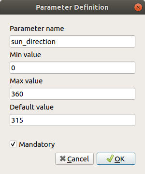
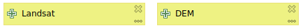
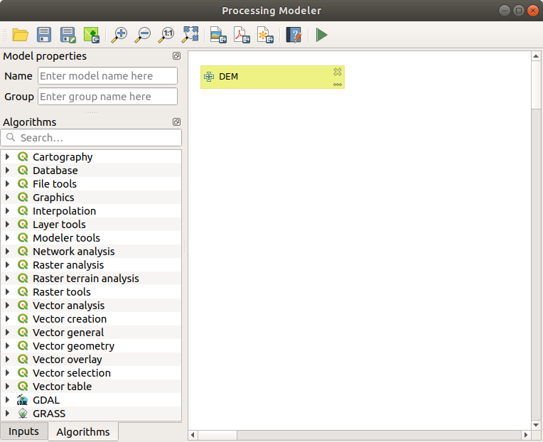
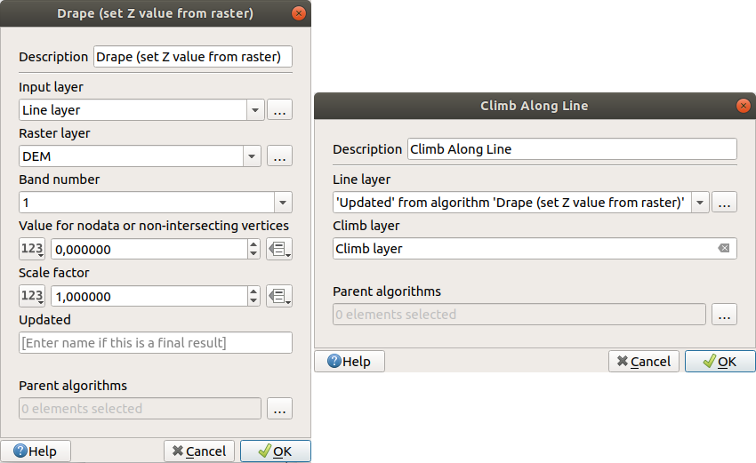

.. only:: html

.. _`processing.modeler`:

The graphical modeler
=====================

.. only:: html

   .. contents::
      :local:

The *graphical modeler* allows you to create complex models using a simple and
easy-to-use interface. When working with a GIS, most analysis operations are not
isolated, but rather part of a chain of operations instead. Using the graphical modeler,
that chain of processes can be wrapped into a single process, so it is as more
convenient to execute as a single process later on a different set of
inputs. No matter how many steps and different algorithms it involves, a model
is executed as a single algorithm, thus saving time and effort, especially for
larger models.

The modeler can be opened from the processing menu.

The modeler has a working canvas where the structure of the model and the workflow
it represents are shown. On the left part of the window, a panel with two tabs can
be used to add new elements to the model.

.. _figure_modeler:

   Modeler

Creating a model involves two steps:

#. *Definition of necessary inputs*. These inputs will be added to the parameters
   window, so the user can set their values when executing the model. The model
   itself is an algorithm, so the parameters window is generated
   automatically as it happens with all the algorithms available in the processing framework.
#. *Definition of the workflow*. Using the input data of the model, the workflow
   is defined by adding algorithms and selecting how they use those inputs or the
   outputs generated by other algorithms already in the model.

Definition of inputs
--------------------

The first step to create a model is to define the inputs it needs. The following
elements are found in the :guilabel:`Inputs` tab on the left side of the modeler
window:

* Raster layer
* Vector layer
* String
* Table field
* Table
* Extent
* Number
* Boolean
* File

Double-clicking on any of these elements, a dialog is shown to define its characteristics.
Depending on the parameter itself, the dialog may contain just one basic element
(the description, which is what the user will see when executing the model) or
more of them. For instance, when adding a numerical value, as can be seen in
the next figure, apart from the description of the parameter, you have to set a
default value and a range of valid values.

.. _figure_model_parameter:

   Model Parameters Definition

For each added input, a new element is added to the modeler canvas.

.. _figure_model_parameter_canvas:

   Model Parameters in canvas

You can also add inputs by dragging the input type from the list and dropping
it in the modeler canvas, in the position where you want to place it.

Definition of the workflow
--------------------------

Once the inputs have been defined, it is time to define the algorithms to apply
on them. Algorithms can be found in the :guilabel:`Algorithms` tab, grouped much
in the same way as they are in the toolbox.

.. _figure_model_parameter_inputs:

   Model Inputs

To add an algorithm to a model, double-click on its name or drag and drop it,
just like it was done when adding inputs. An execution dialog
will appear, with a content similar to the one found in the execution panel that
is shown when executing the algorithm from the toolbox. The one shown next
corresponds to the SAGA 'Convergence index' algorithm.

.. _figure_model_parameter_alg:

   Model Algorithm parameters

As you can see, some differences exist. Instead of the file output box that was
used to set the file path for output layers and tables, a simple text box is used here. If
the layer generated by the algorithm is just a temporary result that will be used
as the input of another algorithm and should not be kept as a final result, just
do not edit that text box. Typing anything in it means that the result is final
and the text that you supply will be the description for the output, which
will be the output the user will see when executing the model.

Selecting the value of each parameter is also a bit different, since there are
important differences between the context of the modeler and that of the toolbox.
Let's see how to introduce the values for each type of parameter.

* Layers (raster and vector) and tables. These are selected from a list, but in
  this case, the possible values are not the layers or tables currently loaded in
  QGIS, but the list of model inputs of the corresponding type, or other layers
  or tables generated by algorithms already added to the model.
* Numerical values. Literal values can be introduced directly in the text box.
  Clicking on the button beside the text box, expressions can be entered. Available variables for expressions include numerical inputs of the model, and also statistical values from available raster layers within the model.
* String. Literal strings can be typed in the corresponding text box. Clicking on the button beside the text box, expressions can be entered, as in the case of numerical values.
* Table field. The fields of the parent table or layer cannot be known at
  design time, since they depend on the selection of the user each time the model
  is executed. To set the value for this parameter, type the name of a field
  directly in the text box, or use the list to select a table field input already
  added to the model. The validity of the selected field will be checked at run time.

In all cases, you will find an additional parameter named *Parent algorithms*
that is not available when calling the algorithm from the toolbox. This parameter
allows you to define the order in which algorithms are executed by explicitly
defining one algorithm as a parent of the current one, which will force the parent
algorithm to be executed before the current one.

When you use the output of a previous algorithm as the input of your algorithm,
that implicitly sets the previous algorithm as parent of the current one (and places the
corresponding arrow in the modeler canvas). However, in some cases an algorithm
might depend on another one even if it does not use any output object from it
(for instance, an algorithm that executes a SQL sentence on a PostGIS database
and another one that imports a layer into that same database). In that case, just
select the previous algorithm in the *Parent algorithms* parameter and the two
steps will be executed in the correct order.

Once all the parameters have been assigned valid values, click on :guilabel:`OK` and the
algorithm will be added to the canvas. It will be linked to all the other elements
in the canvas, whether algorithms or inputs, that provide objects that are used
as inputs for that algorithm.

Elements can be dragged to a different position within the canvas, to change the
way the module structure is displayed and make it more clear and intuitive. Links
between elements are updated automatically. You can zoom in and out by using the mouse wheel.

You can run your algorithm any time by clicking on the :guilabel:`Run` button. However, in
order to use the algorithm from the toolbox, it has to be saved and the modeler dialog
closed, to allow the toolbox to refresh its contents.

Saving and loading models
-------------------------

Use the :guilabel:`Save` button to save the current model and the :guilabel:`Open` button to
open any model previously saved. Models are saved with the :file:`.model`
extension. If the model has been previously saved from the modeler window, you
will not be prompted for a filename. Since there is already a file associated
with that model, the same file will be used for any subsequent saves.

Before saving a model, you have to enter a name and a group for it, using the
text boxes in the upper part of the window.

Models saved on the :file:`models` folder (the default folder when you are
prompted for a filename to save the model) will appear in the toolbox in the
corresponding branch. When the toolbox is invoked, it searches the
:file:`models` folder for files with the :file:`.model` extension and loads the models
they contain. Since a model is itself an algorithm, it can be added to
the toolbox just like any other algorithm.

Models can also be saved within the project file using the
|addToProject|:sup:`Save model in project` button. Models saved with this
method won't be written as :file:`.model` files on the disk but will be embedded
in the :file:`.qgz` project file.

Project models are available in the |qgsProjectFile|:guilabel:`Project models` menu
of the toolbox.

The models folder can be set from the Processing configuration dialog, under the
:guilabel:`Modeler` group.

Models loaded from the :file:`models` folder appear not only in the toolbox, but
also in the algorithms tree in the :guilabel:`Algorithms` tab of the modeler
window. That means that you can incorporate a model as a part of a bigger model,
just as you add any other algorithm.

Models will show up in the Browser Panel, and can be run from there.

Exporting a model as an image, PDF or SVG
.........................................

A model can also be exported as an image, SVG or PDF (for illustration purposes).

Editing a model
---------------

You can edit the model you are currently creating, redefining the workflow and
the relationships between the algorithms and inputs that define the model itself.

If you right-click on an algorithm in the canvas representing the model, you will
see a context menu like the one shown next:

.. _figure_model_right_click:

   Modeler Right Click

Selecting the :guilabel:`Remove` option will cause the selected algorithm to be
removed. An algorithm can be removed only if there are no other algorithms
depending on it. That is, if no output from the algorithm is used in a different
one as input. If you try to remove an algorithm that has others depending on it,
a warning message like the one you can see below will be shown:

.. _figure_cannot_delete_alg:

   Cannot Delete Algorithm

Selecting the :guilabel:`Edit` option will show the parameters dialog of the
algorithm, so you can change the
inputs and parameter values. Not all input elements available in the model will
appear in this case as available inputs. Layers or values generated at a more
advanced step in the workflow defined by the model will not be available if they
cause circular dependencies.

Select the new values and then click on the :guilabel:`OK` button as usual. The
connections between the model elements will change accordingly in the modeler
canvas.

A model can be run partially, by deactivating some of its algorithms. To do it,
select the :guilabel:`Deactivate` option in the context menu that appears when
right-clicking on an algorithm element. The selected algorithm, and all the ones
in the model that depend on it will be displayed in grey and will not be executed
as part of the model.

.. _figure_cannot_model_deactivate:

   Model With Deactivated Algorithms

When right-clicking on an algorithm that is not active, you will instead see a
:guilabel:`Activate` menu option that you can use to activate it back.

Editing model help files and meta-information
---------------------------------------------

You can document your models from the modeler itself. Just click on the
:guilabel:`Edit Model Help` button and a dialog like the one shown next will
appear.

.. _figure_help_edition:

   Help Edition

On the right-hand side, you will see a simple HTML page, created using the
description of the input parameters and outputs of the algorithm, along with some
additional items like a general description of the model or its author. The first
time you open the help editor, all these descriptions are empty, but you can edit
them using the elements on the left-hand side of the dialog. Select an element
on the upper part and then write its description in the text box below.

Model help is saved as part of the model itself.

About available algorithms
--------------------------

You might notice that some algorithms that can be be executed from the toolbox
do not appear in the list of available algorithms when you are designing a model. To be
included in a model, an algorithm must have a correct semantic, so as to be
properly linked to others in the workflow. If an algorithm does not have such a
well-defined semantic (for instance, if the number of output layers cannot be
known in advance), then it is not possible to use it within a model, and thus, it does
not appear in the list of algorithms that you can find in the modeler dialog.

.. Substitutions definitions - AVOID EDITING PAST THIS LINE
   This will be automatically updated by the find_set_subst.py script.
   If you need to create a new substitution manually,
   please add it also to the substitutions.txt file in the
   source folder.

.. |addToProject| image:: /static/common/mAddToProject.png
   :width: 1.5em
.. |qgsProjectFile| image:: /static/common/mIconQgsProjectFile.png
   :width: 1.5em
