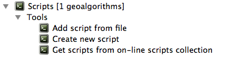

.. only:: html

   |updatedisclaimer|

Writing new Processing algorithms as Python scripts
===================================================

.. only:: html

   .. contents::
      :local:

There are currently two options for writing Processing algorithms using Python.

* Extending :class:`QgsProcessingAlgorithm <qgis.core.QgsProcessingAlgorithm>`
* Using the @alg decorator

Extending QgsProcessingAlgorithm
--------------------------------

.. code-block:: python

    from PyQt5.QtCore import QCoreApplication
    from qgis.core import (QgsProcessing,
                           QgsProcessingAlgorithm,
                           QgsProcessingException,
                           QgsProcessingParameterNumber,
                           QgsProcessingParameterDistance,
                           QgsProcessingParameterVectorLayer,
                           QgsProcessingParameterVectorDestination,
                           QgsProcessingParameterRasterDestination)
    import processing
    
    class ExampleProcessingAlgorithm(QgsProcessingAlgorithm):
        """
        This is an example algorithm that takes a vector layer,
        creates some new layers and returns some results.
        """
    
        def tr(self, string):
            """
            Returns a translatable string with the self.tr() function.
            """
            return QCoreApplication.translate('Processing', string)
    
        def createInstance(self):
            return ExampleProcessingAlgorithm()
    
        def name(self):
            """
            Returns the algorithm name, used for identifying the algorithm.
            """
            return 'bufferraster'
    
        def displayName(self):
            """
            Returns the translated algorithm name.
            """
            return self.tr('Buffer and export to raster')
    
        def group(self):
            """
            Returns the name of the group this algorithm belongs to.
            """
            return self.tr('Example scripts')
    
        def groupId(self):
            """
            Returns the unique ID of the group this algorithm belongs to.
            """
            return 'examplescripts'
    
        def shortHelpString(self):
            """
            Returns a localised short helper string for the algorithm.
            """
            return self.tr("Example algorithm short description")
    
        def initAlgorithm(self, config=None):
            """
            Here we define the inputs and output of the algorithm.
            """
            self.addParameter(
                QgsProcessingParameterVectorLayer(
                    'INPUTVECTOR',
                    self.tr('Input vector layer'),
                    types=[QgsProcessing.TypeVectorAnyGeometry]
                )
            )
            self.addParameter(
                QgsProcessingParameterVectorDestination(
                    'BUFFER',
                    self.tr('BUFFER'),
                )
            )
            self.addParameter(
                QgsProcessingParameterRasterDestination(
                    "OUTPUTRASTER",
                    self.tr('OUTPUTRASTER')
                )
            )
            self.addParameter(
                QgsProcessingParameterDistance(
                    'BUFFERDIST',
                    self.tr('BUFFERDIST'),
                    defaultValue = 100
                )
            )
            self.addParameter(
                QgsProcessingParameterDistance(
                    'CELLSIZE',
                    self.tr('CELLSIZE'),
                    defaultValue = 10
                )
            )
    
        def processAlgorithm(self, parameters, context, feedback):
            """
            Here is where the processing itself takes place.
            """
            inputlayer = self.parameterAsVectorLayer(parameters, "INPUTVECTOR",
                                                     context)
            numfeatures = inputlayer.featureCount()
            bufferlayer = self.parameterAsOutputLayer(parameters, "BUFFER",
                                                      context)
            outputraster = self.parameterAsOutputLayer(parameters, "OUTPUTRASTER",
                                                       context)
            bufferdist = self.parameterAsDouble(parameters, "BUFFERDIST", context)
            rastercellsize = self.parameterAsDouble(parameters, "CELLSIZE",
                                                    context)
            if feedback.isCanceled():
                return {'OUTPUTRASTER': None, 'BUFFER': None,
                        'NUMBEROFFEATURES': numfeatures}
            inpbuffer = processing.run("native:buffer",
                                   {"INPUT": inputlayer, "OUTPUT": bufferlayer,
                                    'DISTANCE': bufferdist, 'SEGMENTS': 10, 
                                    'DISSOLVE': True, 'END_CAP_STYLE': 0,
                                    'JOIN_STYLE': 0, 'MITER_LIMIT': 10
                                    },
                                   is_child_algorithm=True, context=context,
                                   feedback=feedback)
            if feedback.isCanceled():
                return {'OUTPUTRASTER': None, 'BUFFER': bufferlayer,
                        'NUMBEROFFEATURES': numfeatures}
            rasterized = processing.run("qgis:rasterize",
                                   {"LAYER": bufferlayer, "EXTENT": bufferlayer,
                                    "MAP_UNITS_PER_PIXEL": rastercellsize,
                                    "OUTPUT": outputraster
                                   },
                                   is_child_algorithm=True, context=context,
                                   feedback=feedback)
            return {'OUTPUTRASTER': outputraster, 'BUFFER': bufferlayer,
                    'NUMBEROFFEATURES': numfeatures}
 
The @alg decorator
------------------

By using the @alg decorator, you can create your own algorithms by writing the
corresponding Python code and adding a few extra lines to supply additional
information needed to define the semantics of the algorithm.

Within QGIS, you can use :guilabel:`Create new script` in the
:guilabel:`Scrips` menu at the top of the :guilabel:`Processing Toolbox` to
open the :guilabel:`Processing Script Editor` where you can write your code.
To simplify the task, you can start with a script template by using
:guilabel:`Create new script from template` from the same menu.
This opens a template that extends
:class:`QgsProcessingAlgorithm <qgis.core.QgsProcessingAlgorithm>`.

When saving the script to the :file:`scripts` folder (the default location)
with a :file:`.py` extension, the algorithm will be made available in the
:guilabel:`Processing Toolbox`.

The name of the algorithm (the one you will see in the toolbox) is created from
the filename by removing the :file:`.py` extension and replacing underscores
with spaces.

The following code calculates the Topographic Wetness Index (TWI) directly from
a DEM using the @alg decorator.

.. code-block:: python

    import processing
    from qgis.processing import alg
    from qgis.core import QgsProject
    
    @alg(name="bufferraster", label="Buffer and export to raster", group="examplescripts",
         group_label="Example scripts")
    @alg.input(type=alg.VECTOR_LAYER, name="INPUTVECTOR", label="Input vector layer")
    @alg.input(type=alg.RASTER_LAYER_DEST, name="OUTPUTRASTER", label="OUTPUTRASTER")
    @alg.input(type=alg.VECTOR_LAYER_DEST, name="BUFFER", label="BUFFER")
    @alg.input(type=alg.DISTANCE, name="BUFFERDIST", label="BUFFER DISTANCE", default=1.0)
    @alg.input(type=alg.DISTANCE, name="CELLSIZE", label="RASTER CELL SIZE", default=10.0)
    @alg.output(type=alg.NUMBER, name="NUMBEROFFEATURES", label="NUMBEROFFEATURES")
    
    def bufferrasteralg(instance, parameters, context, feedback, inputs):
        """
        Description of the algorithm.
        (If there is no comment here, you will get an error)
        """
        numfeatures = 0
        inputlayer = instance.parameterAsVectorLayer(parameters, "INPUTVECTOR", context)
        numfeatures = inputlayer.featureCount()
        bufferlayer = instance.parameterAsOutputLayer(parameters, "BUFFER", context)
        outputraster = instance.parameterAsOutputLayer(parameters, "OUTPUTRASTER", context)
        bufferdist = instance.parameterAsDouble(parameters, "BUFFERDIST", context)
        rastercellsize = instance.parameterAsDouble(parameters, "CELLSIZE", context)
        inpbuffer = processing.run("native:buffer",
                                   {"INPUT": inputlayer, "OUTPUT": bufferlayer,
                                    'DISTANCE': bufferdist, 'SEGMENTS': 10, 
                                    'DISSOLVE': True, 'END_CAP_STYLE': 0,
                                    'JOIN_STYLE': 0, 'MITER_LIMIT': 10
                                    },
                                   is_child_algorithm=True, context=context,
                                   feedback=feedback)
        rasterized = processing.run("qgis:rasterize",
                                   {"LAYER": bufferlayer, "EXTENT": bufferlayer,
                                    "MAP_UNITS_PER_PIXEL": rastercellsize,
                                    "OUTPUT": outputraster
                                   },
                                   is_child_algorithm=True, context=context,
                                   feedback=feedback)
        return {'OUTPUTRASTER': outputraster, 'NUMBEROFFEATURES': numfeatures}

As you can see, it involves 3 algorithms, all of them coming from SAGA. The last
one of them calculates the TWI, but it needs a slope layer and a flow accumulation
layer. We do not have these, but since we have the DEM, we can calculate them by
calling the corresponding SAGA algorithms.

The part of the code where this processing takes place is not difficult to
understand if you have read the previous chapter. The first
lines, however, need some additional explanation. They provide the
information that is needed to turn your code into an algorithm that can be run from any
of the GUI components, like the toolbox or the graphical modeler.

These lines are all calls to the ``@alg`` functions that help simplify the coding of
the algorithm.

The @alg function is used to define the name and location of the algorithm in the Toolbox.
The @alg.input function is used to define the inputs of the algorithm.
The @alg.output function is used to define the outputs of the algorithm.

Here is the list of input and output types types that are supported in
processing and their corresponding alg decorator constants
(:file:`algfactory.py` contains the complete list of alg constants).

.. list-table:: Input and output types
   :widths: 50 20 30
   :header-rows: 1

   * - Class
     - alg
     - Description
   * - :class:`QgsProcessingParameterAuthConfig <qgis.core.QgsProcessingParameterAuthConfig>`
     - ``alg.AUTH_CFG``
     - Allows users to select from available authentication configurations or create new authentication configurations.
   * - :class:`QgsProcessingParameterBand <qgis.core.QgsProcessingParameterBand>`
     - ``alg.BAND``
     - A band of a raster layer.
   * - :class:`QgsProcessingParameterBoolean <qgis.core.QgsProcessingParameterBoolean>`
     - ``alg.BOOL``
     - A boolean value.
   * - :class:`QgsProcessingParameterCrs <qgis.core.QgsProcessingParameterCrs>`
     - ``alg.CRS``
     - A Coordinate Reference System
   * - :class:`QgsProcessingParameterDistance <qgis.core.QgsProcessingParameterDistance>`
     - ``alg.DISTANCE``
     - A double numeric parameter for distance values.
   * - :class:`QgsProcessingParameterEnum <qgis.core.QgsProcessingParameterEnum>`
     - ``alg.ENUM``
     - An enumeration, allowing for selection from a set of predefined values.
   * - :class:`QgsProcessingParameterExpression <qgis.core.QgsProcessingParameterExpression>`
     - ``alg.EXPRESSION``
     - An expression.
   * - :class:`QgsProcessingParameterExtent <qgis.core.QgsProcessingParameterExtent>`
     - ``alg.EXTENT``
     - A spatial extent defined by xmin, xmax, ymin, ymax.
   * - :class:`QgsProcessingParameterFeatureSink <qgis.core.QgsProcessingParameterFeatureSink>`
     - ``alg.SINK``
     - A feature sink.
   * - :class:`QgsProcessingParameterFeatureSource <qgis.core.QgsProcessingParameterFeatureSource>`
     - ``alg.SOURCE``
     - A feature source.
   * - :class:`QgsProcessingParameterField <qgis.core.QgsProcessingParameterField>`
     - ``alg.FIELD``
     - A field in the attribute table of a vector layer.
   * - :class:`QgsProcessingParameterFile <qgis.core.QgsProcessingParameterFile>`
     - ``alg.FILE``
     - A filename.
   * - :class:`QgsProcessingParameterFileDestination <qgis.core.QgsProcessingParameterFileDestination>`
     - ``alg.FILE_DEST``
     - A filename.
   * - :class:`QgsProcessingParameterFolderDestination <qgis.core.QgsProcessingParameterFolderDestination>`
     - ``alg.FOLDER_DEST``
     - A folder.
   * - :class:`QgsProcessingParameterMapLayer <qgis.core.QgsProcessingParameterMapLayer>`
     - ``alg.MAPLAYER``
     - A map layer.
   * - :class:`QgsProcessingParameterMatrix <qgis.core.QgsProcessingParameterMatrix>`
     - ``alg.MATRIX``
     - A matrix.
   * - :class:`QgsProcessingParameterMeshLayer <qgis.core.QgsProcessingParameterMeshLayer>`
     - ``alg.MESH_LAYER``
     - A mesh layer.
   * - :class:`QgsProcessingParameterMultipleLayers <qgis.core.QgsProcessingParameterMultipleLayers>`
     - ``alg.MULTILAYER``
     - A set of layers.
   * - :class:`QgsProcessingParameterNumber <qgis.core.QgsProcessingParameterNumber>`
     - ``alg.NUMBER``
     - A numerical value.
   * - :class:`QgsProcessingParameterPoint <qgis.core.QgsProcessingParameterPoint>`
     - ``alg.POINT``
     - A point.
   * - :class:`QgsProcessingParameterRange <qgis.core.QgsProcessingParameterRange>`
     - ``alg.RANGE``
     - A number range.
   * - :class:`QgsProcessingParameterRasterDestination <qgis.core.QgsProcessingParameterRasterDestination>`
     - ``alg.RASTER_LAYER_DEST``
     - A raster layer.
   * - :class:`QgsProcessingParameterRasterLayer <qgis.core.QgsProcessingParameterRasterLayer>`
     - ``alg.RASTER_LAYER``
     - A raster layer.
   * - :class:`QgsProcessingParameterString <qgis.core.QgsProcessingParameterString>`
     - ``alg.STRING``
     - A text string.
   * - :class:`QgsProcessingParameterVectorDestination <qgis.core.QgsProcessingParameterVectorDestination>`
     - ``alg.VECTOR_LAYER_DEST``
     - A vector layer.
   * - :class:`QgsProcessingParameterVectorLayer <qgis.core.QgsProcessingParameterVectorLayer>`
     - ``alg.VECTOR_LAYER``
     - A vector layer.

* ``table``. A table
* ``number``. A numerical value. A default value must be provided. For instance,
  ``depth=number 2.4``
* ``string``. A text string. As in the case of numerical values, a default value
  must be added. For instance, ``name=string Victor``
* ``longstring``. Same as string, but a larger text box will be shown, so it is 
  better suited for long strings, such as for a script expecting a small code snippet.
* ``boolean``. A boolean value. Add ``True`` or ``False`` after it to set the
  default value. For example, ``verbose=boolean True``.
* ``multiple raster``. A set of input raster layers.
* ``multiple vector``. A set of input vector layers.
* ``field``. A field in the attributes table of a vector layer. The name of the
  layer has to be added after the ``field`` tag. For instance, if you have
  declared a vector input with ``mylayer=vector``, you could use ``myfield=field
  mylayer`` to add a field from that layer as parameter.
* ``extent``. A spatial extent defined by xmin, xmax, ymin, ymax
* ``folder``. A folder
* ``file``. A filename
* ``crs``. A Coordinate Reference System
* ``selection``. A dropdown menu that allows the user to select from
  a pre-populated list. For example ``units=selection sq_km;sq_miles;sq_degrees``
* ``name``. Name of the script. This will be displayed as the algorithm name in the
  processing toolbox. For example ``My Algorithm Name=name``
* ``group``. Folder name where the script will appear in the Processing Toolbox. 
  For Example, adding ``Utils=groups`` will put the script within a ``Utils`` folder
  within Scripts.

The parameter name is the name that will be shown to the user when executing the
algorithm, and also the variable name to use in the script code. The value entered
by the user for that parameter will be assigned to a variable with that name.

When showing the name of the parameter to the user, the name will be edited to
improve its appearance, replacing underscores with spaces. So, for instance,
if you want the user to see a parameter named ``A numerical value``, you can use
the variable name ``A_numerical_value``.

Layers and tables values are strings containing the filepath of the corresponding
object. To turn them into a QGIS object, you can use the ``processing.getObjectFromUri()``
function. Multiple inputs also have a string value, which contains the filepaths
to all selected objects, separated by semicolons (``;``).

Outputs are defined in a similar manner, using the following tags:

* ``output raster``
* ``output vector``
* ``output table``
* ``output html``
* ``output file``
* ``output number``
* ``output string``
* ``output extent``

The value assigned to the output variables is always a string with a filepath.
It will correspond to a temporary filepath in case the user has not entered any
output filename.

In addition to the tags for parameters and outputs, you can also define the group
under which the algorithm will be shown, using the ``group`` tag.

The last tag that you can use in your script header is ``##nomodeler``.
Use that when you do not want your algorithm to be shown in the modeler window.
This should be used for algorithms that do not have a clear syntax (for instance,
if the number of layers to be created is not known in advance, at design time),
which make them unsuitable for the graphical modeler

Handing data produced by the algorithm
--------------------------------------

When you declare an output representing a layer (raster, vector or table),
the algorithm will try to add it to QGIS once it
is finished. That is the reason why, although the ``run()`` method does not
load the layers it produces, the final *TWI* layer will be loaded, since it is saved
to the file entered by the user, which is the value of the corresponding output.

Do not use the ``load()`` method in your script algorithms, but just when working
with the console line. If a layer is created as output of an algorithm, it should
be declared as such. Otherwise, you will not be able to properly use the algorithm
in the modeler, since its syntax (as defined by the tags explained above) will
not match what the algorithm really creates.

Hidden outputs (numbers and strings) do not have a value. Instead, it is you who
has to assign a value to them. To do so, just set the value of a variable with
the name you used to declare that output. For instance, if you have used this
declaration,

::

    ##average=output number

the following line will set the value of the output to 5:

::

    average = 5

Communicating with the user
---------------------------

If your algorithm takes a long time to process, it is a good idea to inform the
user. You have a global named ``progress`` available, with two available methods:
``setText(text)`` and ``setPercentage(percent)`` to modify the progress text and
the progress bar.

If you have to provide some information to the user, not related to the progress of
the algorithm, you can use the
``setInfo(text)`` method, also from the ``progress`` object.

If your script has some problem, the correct way of propagating it is to raise
an exception of type ``GeoAlgorithmExecutionException()``. You can pass a message
as argument to the constructor of the exception. Processing will take care of
handling it and communicating with the user, depending on where the algorithm
is being executed from (toolbox, modeler, Python console...)

Documenting your scripts
------------------------

As in the case of models, you can create additional documentation for your script,
to explain what they do and how to use them. In the script editing dialog you will
find a :guilabel:`Edit Script Help` button. Click on it and it will take you to the help
editing dialog. Check the chapter about the graphical modeler to find out more about
this dialog and how to use it.

Help files are saved in the same folder as the script itself, adding the
:file:`.help` extension to the filename. Note that you can edit your script's
help before saving it for the first time. If you later close the script editing
dialog without saving the script (i.e. you discard it), the help content you
wrote will be lost. If your script was already saved and is associated with a
filename, saving is done automatically.

Example scripts
----------------

Several examples are available in the on-line collection of scripts, which you
can access by selecting the *Get script from on-line script collection* tool
under the *Scripts/tools* entry in the toolbox.

.. _figure_script_online:

   Processing Get Script

Please, check them to see real examples of how to create algorithms using the
processing framework classes. You can right-click on any script algorithm and
select :guilabel:`Edit script` to edit its code or just to see it.

Best practices for writing script algorithms
--------------------------------------------

Here's a quick summary of ideas to consider when creating your script algorithms
and, especially, if you want to share with other QGIS users. Following these
simple rules will ensure consistency across the different Processing elements
such as the toolbox, the modeler or the batch processing interface.

* Do not load resulting layers. Let Processing handle your results and load
  your layers if needed.
* Always declare the outputs your algorithm creates. Avoid things such as
  declaring one output and then using the destination filename set for that
  output to create a collection of them. That will break the correct semantics
  of the algorithm and make it impossible to use it safely in the modeler. If 
  you have to write an algorithm like that, make sure you add the ``##nomodeler`` tag.
* Do not show message boxes or use any GUI element from the script. If you want
  to communicate with the user, use the ``setInfo()`` method or throw an
  ``GeoAlgorithmExecutionException``
* As a rule of thumb, do not forget that your algorithm might be executed in a
  context other than the Processing toolbox.

Pre- and post-execution script hooks
------------------------------------

Scripts can also be used to set pre- and post-execution hooks that are run before
and after an algorithm is run. This can be used to automate tasks that should be
performed whenever an algorithm is executed.

The syntax is identical to the syntax explained above, but an additional global
variable named ``alg`` is available, representing the algorithm that has just
been (or is about to be) executed.

In the :guilabel:`General` group of the processing config dialog you will find two
entries named :guilabel:`Pre-execution script file` and :guilabel:`Post-execution
script file` where the filename of the scripts to be run in each case can be
entered.

.. Substitutions definitions - AVOID EDITING PAST THIS LINE
   This will be automatically updated by the find_set_subst.py script.
   If you need to create a new substitution manually,
   please add it also to the substitutions.txt file in the
   source folder.

.. |updatedisclaimer| replace:: :disclaimer:`Docs in progress for 'QGIS testing'. Visit https://docs.qgis.org/3.4 for QGIS 3.4 docs and translations.`
