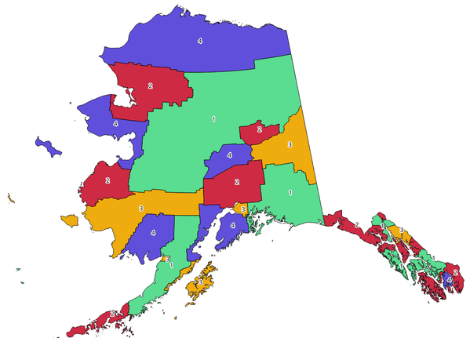

.. only:: html

   |updatedisclaimer|

Cartography
============

.. only:: html

   .. contents::
      :local:
      :depth: 1

.. _qgiscategorizeusingstyle:

Create categorized renderer from styles
---------------------------------------
Sets a vector layer's renderer to a categorized renderer using matching symbols
from a style database. If no style file is specified, symbols from the user's
current :ref:`symbol library <vector_symbol_library>` are used instead.

A specified expression or field is used to create categories for the renderer.
Each category is individually matched to the symbols which exist within
the specified QGIS XML style database. Whenever a matching symbol name is found,
the category's symbol will be set to this matched symbol.

If desired, outputs can also be tables containing lists of the categories which
could not be matched to symbols, and symbols which were not matched to categories.

Parameters
..........

``Input layer`` [vector: any]
  Vector layer to apply a categorized style to.

``Categorize using expression`` [expression]
  Field or expression to categorize the features.

``Style database (leave blank to use saved symbols)`` [file]
  File (:file:`.XML`) containing the symbols to apply to the input layer categories.
  The file can be obtained from the Style Manager
  :ref:`Share symbols <share_symbols>` tool.
  If no file is specified, QGIS local symbols library is used.

``Use case-sensitive match to symbol names`` [boolean]
  If checked, applies a case sensitive comparison between the categories and symbols names.

  Default: *False*

``Ignore non-alphanumeric characters while matching`` [boolean]
  If checked, non-alphanumeric characters in the categories and symbols names will be
  ignored, allowing greater tolerance during the match.

  Default: *False*

Outputs
.......

``Categorized layer`` [vector: any]
  Input vector layer with the categorized style applied. No new layer is output.

``Non-matching categories`` [table]
  Optional

  Lists categories which could not be matched to any symbol in the provided style database.

``Non-matching symbol names`` [table]
  Optional

  Lists symbols from the provided style database which could not match any category.

.. _qgiscombinestyles:

Combine style databases |310|
---------------------------------------
Combines multiple QGIS style databases into a single style database.
If items of the same type with the same name exist in different source
databases these will be renamed to have unique names in the output combined database.

Parameters
..........

``Input databases`` [file] [list]
  Files containing QGIS style items.

``Objects to combine`` [list]
  Types of style items in the input databases you would like to put in the new
  database. These can be:
  
  * :ref:`Symbols <edit_symbol>`
  * :ref:`Color ramps <color-ramp>`
  * :ref:`Text formats <text_format>`
  * :ref:`Label settings <showlabels>`

Outputs
.......

``Output style database`` [file]
  Output :file:`.XML` file combining the selected style items.

See also
........
:ref:`qgisstylefromproject`

.. _qgisstylefromproject:

Create style database from project |310|
----------------------------------------
Extracts all style objects (symbols, color ramps, text formats and
label settings) from a QGIS project.

The extracted symbols are saved to a QGIS style database (:file:`XML` format),
which can be managed and imported via the :ref:`Style Manager <vector_style_manager>`
dialog.

Parameters
..........

``Input project`` [file]
  A QGIS project file to extract the style items from.

``Objects to extract`` [list]
  Types of style items in the input project you would like to put in the new
  database. These can be:
  
  * :ref:`Symbols <edit_symbol>`
  * :ref:`Color ramps <color-ramp>`
  * :ref:`Text formats <text_format>`
  * :ref:`Label settings <showlabels>`

Outputs
.......

``Output style database`` [file]
  Output :file:`.XML` file storing the selected style items.

See also
........
:ref:`qgiscombinestyles`

.. _qgisprintlayoutmapextenttolayer:

Print layout map extent to layer |38|
-------------------------------------

Creates a polygon layer containing the extent of a print layout map item
(or items), with attributes specifying the map size (in layout units,
i.e. the :ref:`reference map <reference_map>` units), scale and rotation.

If the map item parameter is specified, then only the matching map extent will
be exported. If it is not specified, all map extents from the layout will be exported.

Optionally, a specific output CRS can be specified. If it is not specified,
the original map item CRS will be used.

Parameters
..........

``Print layout`` [enumeration]
  A print layout in the current project.

``Map item`` [enumeration]
  Optional

  The map item(s) whose information you want to extract.
  If none is provided then all the map items are processed.

  Default: *All the map items*

``Override CRS`` [crs]
  Optional

  Select the CRS of the layer in which the information will be reported.

  Default: *The layout CRS*

Outputs
.......

``Extent`` [vector: polygon]
  A vector layer storing the selected map item(s) information.

.. _qgistopologicalcoloring:

Topological coloring
--------------------
Assigns a color index to polygon features in such a way that no adjacent polygons
share the same color index, whilst minimizing the number of colors required.

The algorithm allows choice of method to use when assigning colors.

A minimum number of colors can be specified if desired. The color index is saved
to a new attribute named **color_id**.

The following example shows the algorithm with four different colors chosen; as you
can see each color class has the same amount of features.

  Topological colors example

Parameters
..........

``Input layer`` [vector: polygon]
  Polygon vector layer.

``Minimum number of colors`` [number]
  Minimum colors number to assign.

  Default: *4*

``Minimum distance between features`` [number]
  Prevent nearby (but non-touching) features from being assigned equal colors.

  Default: *0.0*

``Balance color assignment`` [enumeration]
  Options are:

  * 0 --- By feature count

    Attempts to assign colors so that the count of features assigned to each
    individual color index is balanced.

  * 1 --- By assigned area

    Assigns colors so that the total area of features assigned to each color is
    balanced. This mode can be useful to help avoid large features resulting in
    one of the colors appearing more dominant on a colored map.

  * 2 --- By distance between colors

    Assigns colors in order to maximize the distance between features of the same
    color. This mode helps to create a more uniform distribution of colors across
    a map.

  Default: *0*

Outputs
.......

``Colored`` [vector: polygon]
  Polygon vector layer with the addition of the ``color_id`` column.

.. Substitutions definitions - AVOID EDITING PAST THIS LINE
   This will be automatically updated by the find_set_subst.py script.
   If you need to create a new substitution manually,
   please add it also to the substitutions.txt file in the
   source folder.

.. |310| replace:: ``NEW in 3.10``
.. |38| replace:: ``NEW in 3.8``
.. |updatedisclaimer| replace:: :disclaimer:`Docs in progress for 'QGIS testing'. Visit https://docs.qgis.org/3.4 for QGIS 3.4 docs and translations.`
