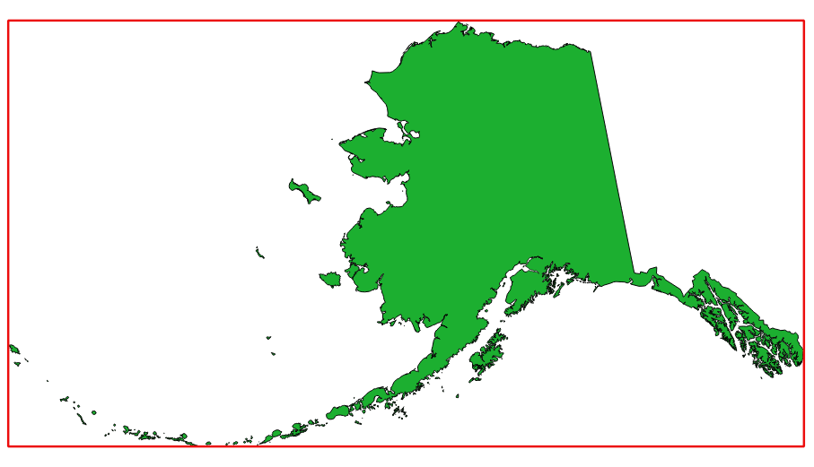

Layer tools
===========

.. only:: html

   .. contents::
      :local:
      :depth: 1

.. _qgispolygonfromlayerextent:

Extract layer extent
--------------------

Generates a vector layer with the minimum bounding box (rectangle with N-S orientation)
that covers all the input features.

The output layer contains a single bounding box for the whole input layer.

   In red the bounding box of the source layer

``Default menu``: :menuselection:`Vector --> Research Tools`

Parameters
..........

.. list-table::
   :header-rows: 1
   :widths: 20 20 20 40
   :stub-columns: 0

   *  - Label
      - Name
      - Type
      - Description
   *  - **Layer**
      - ``INPUT``
      - [layer:any]
      - Input vector layer
      

Outputs
.......
.. list-table::
   :header-rows: 1
   :widths: 20 20 20 40
   :stub-columns: 0

   *  - Label
      - Name
      - Type
      - Description
   *  - **Extent**
      - ``OUTPUT``
      - [vector: polygon]
      - Output extent (minimum bounding box)
