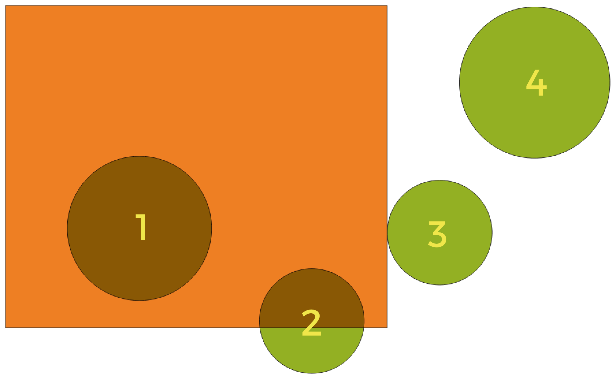

:orphan:

.. The following section is included in network analysis algorithms, ie
 qgisserviceareafrompoint, qgisserviceareafromlayer, qgisshortestpathlayertopoint,
 qgisshortestpathpointtolayer and qgisshortestpathpointtopoint

**network_advanced_parameters**

``Direction field`` [tablefield: string]
  Optional

  The field used to specify directions for the network edges.

  The values used in this field are specified with the three parameters ``Value for
  forward direction``, ``Value for backward direction`` and ``Value for both directions``.
  Forward and reverse directions correspond to a one-way edge, "both directions"
  indicates a two-way edge.

  If a feature does not have a value in this field, or no field is set then the
  default direction setting (provided with the ``Default direction`` parameter)
  is used.

``Value for forward direction`` [string]
  Optional

  Value set in the direction field to identify edges with a forward direction.

``Value for backward direction`` [string]
  Optional

  Value set in the direction field to identify edges with a backward direction.

``Value for both directions`` [string]
  Optional

  Value set in the direction field to identify bidirectional edges.

``Default direction`` [enumeration]
  If a feature has no value set in the direction field or if no direction field is set,
  then this direction value is used.

  Available options are:

  * 0 --- Forward direction
  * 1 --- Backward direction
  * 2 --- Both directions

  Default: *2*

``Speed field`` [tablefield: string]
  Optional

  Field providing the speed value (in ``km/h``) for the edges of the network when
  looking for the fastest path.

  If a feature does not have a value in this field, or no field is set then the
  default speed value (provided with the ``Default speed`` parameter) is used.

  ``Default speed (km/h)`` [number]
    Value to use to calculate the travel time if no speed field is provided for an edge.

    Default: *50.0*

  ``Topology tolerance`` [number]
    Two lines with nodes closer than the specified tolerance are considered connected.

    Default: *0.0*

**end_network_advanced_parameters**

.. The following section is included in vector selection algorithms such as
 qgisselectbylocation, qgisextractbylocation
 
**geometric_predicates**

       
   In this example, the dataset from which we want to select (the *source
   vector layer*) consists of the green circles, the orange rectangle is the
   dataset that it is being compared to (the *intersection vector layer*).

``Where the features (geometric predicate)`` [enumeration] [list]
  The spatial condition for the selection is defined by choosing one or more
  geometric predicates.

  *Intersect*
    Tests whether a geometry intersects another. Returns 1 (true) if the
    geometries spatially intersect (share any portion of space - overlap or touch) and 0 if they
    don’t. In the picture above, this will select circles 1, 2 and 3.

  *Contain*
    Returns 1 (true) if and only if no points of b lie in the exterior of a,
    and at least one point of the interior of b lies in the interior of a.
    In the picture, no circle is selected, but the rectangle would be if you
    would select it the other way around, as it contains a circle completely.
    This is the opposite of *are within*.
    
  *Disjoint*
    Returns 1 (true) if the geometries do not share any portion of space (no overlap, not touching).
    Only circle 4 is selected.
    
  *Equal*
    Returns 1 (true) if and only if geometries are exactly the same.
    No circles will be selected.
    
  *Touch*
    Tests whether a geometry touches another. Returns 1 (true) if the geometries
    have at least one point in common, but their interiors do not intersect.
    Only circle 3 is selected.
      
  *Overlap*
    Tests whether a geometry overlaps another. Returns 1 (true) if the geometries
    share space, are of the same dimension, but are not completely contained by
    each other. Only circle 2 is selected.
    
  *Are within*
    Tests whether a geometry is within another. Returns 1 (true) if geometry a
    is completely inside geometry b. Only circle 1 is selected.
    
  *Cross*
    Returns 1 (true) if the supplied geometries have some, but not all, interior
    points in common and the actual crossing is of a lower dimension than the
    highest supplied geometry. For example, a line crossing a polygon will cross
    as a line (selected). Two lines crossing will cross as a point (selected).
    Two polygons cross as a polygon (not selected).

  Default: *Intersect*

**end_geometric_predicates**

.. The following section is included in database algorithms such as
 qgispostgisexecutesql, qgispostgisexecuteandloadsql
 
**postgisexecutesqlexample**

**Example**

#. For all features / rows in a PostGIS / PostgreSQL table
   ("your_table"), set the value of an existing field ("field_to_update")
   to a given value (``20``).
   The SQL query string:

   .. code-block:: sql

    UPDATE your_table SET field_to_update=20;

#. Create a new ``area`` column and calculate the area of each feature
    with the ``ST_AREA`` PostGIS function.

   .. code-block:: sql

    -- Create the new column "area" in a table named "your_table"
    ALTER TABLE your_table ADD COLUMN area double precision;
    -- Update the "area" column of each feature with the its area:
    UPDATE your_table SET area=ST_AREA(geom);

**end_postgisexecutesqlexample**
