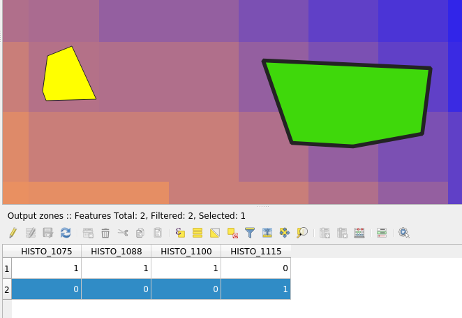

.. only:: html

Raster analysis
===============

.. only:: html

   .. contents::
      :local:
      :depth: 1

.. _qgisrastercalculator:

Raster calculator
-----------------
Performs algebraic operations using raster layers.

The resulting layer will have its values computed according to an expression.
The expression can contain numerical values, operators and references to any of
the layers in the current project.

.. note:: When using the calculator in :ref:`processing_batch` or from the
  :ref:`console` the files to use have to be specified. The corresponding layers
  are referred using the base name of the file (without the full path). For instance,
  if using a layer at ``path/to/my/rasterfile.tif``, the first band of that layer
  will be referred as ``rasterfile.tif@1``.

Parameters
..........

.. list-table::
   :header-rows: 1
   :widths: 20 20 20 40
   :stub-columns: 0

   * - Label
     - Name
     - Type
     - Description
   * - **Operators**
     -  GUI only
     - 
     - Contains some calculator like buttons that can be used to fill
       the expression box.
   * - **Expression**
     -  ``EXPRESSION``
     - [string]
     - Expression that will be used to calculate the output raster layer.
       You can use the operator buttons provided to type directly the
       expression in this box.
   * - **Predefined expressions**
     - GUI only
     - 
     - You can use the predefined ``NDVI`` expression or you can define
       new expressions for calculations.
       The :kbd:`Add...` button loads a defined expression (and lets
       you set the parameters).
       The :kbd:`Save...` button lets you define a new expression.
   * - **Reference layer(s) (used for automated extent, cellsize, and CRS)**
       
       Optional
     - ``LAYERS``
     - [raster] [list]
     - Layer(s) that will be used to fetch extent, cell size and CRS.
       By choosing the layer in this box you avoid filling in all the
       other parameters by hand.
       Raster layers are referred by their name and the number of
       the band: ``layer_name@band_number``.
       For instance, the first band from a layer named ``DEM`` will be
       referred as ``DEM@1``.
   * - **Cell size (use 0 or empty to set it automatically)**
       
       Optional
     - ``CELLSIZE``
     - [number]
     - Cell size of the output raster layer.
       If the cell size is not specified, the minimum cell size of
       selected reference layer(s) will be used.
       The cell size will be the same for the X and Y axes.
   * - **Output extent**
     - ``EXTENT``
     - [extent]
     - Extent of the output raster layer.
       If the extent is not specified, the minimum extent that covers
       all the selected reference layers will be used.
   * - **Output CRS**
       
       Optional
     - ``CRS``
     - [crs]
     - CRS of the output raster layer.
       If the output CRS is not specified, the CRS of the first
       reference layer will be used.
   * - **Output**
     - ``OUTPUT``
     - [raster]
       
       Default: ``[Save to temporary file]``
     - Specification of the output raster. One of:
       
       * Save to a Temporary File
       * Save to File...
       
       The file encoding can also be changed here.

Outputs
.......

.. list-table::
   :header-rows: 1
   :widths: 20 20 20 40
   :stub-columns: 0

   * - Label
     - Name
     - Type
     - Description
   * - **Output**
     - ``OUTPUT``
     - [raster]
     - Output raster file with the calculated values.

.. _qgisrasterlayerstatistics:

Raster layer statistics
-----------------------
Calculates basic statistics from the values in a given band of the raster layer.
The output is loaded in the :menuselection:`Processing --> Results viewer` menu.

Parameters
..........

.. list-table::
   :header-rows: 1
   :widths: 20 20 20 40
   :stub-columns: 0

   * - Label
     - Name
     - Type
     - Description
   * - **Input layer**
     - ``INPUT``
     - [raster]
     - Input raster layer
   * - **Band number**
     - ``BAND``
     - [raster band]
       
       Default: The first band
     - If the raster is multiband, choose the band you want to get
       statistics for.
   * - **Output**
     - ``OUTPUT_HTML_FILE``
     - [file]
       
       Default: ``[Save to temporary file]``
     - Specification of the output file:
       
       * Skip Output
       * Save to a Temporary File
       * Save to File...
       
       The file encoding can also be changed here.

Outputs
.......

.. list-table::
   :header-rows: 1
   :widths: 20 20 20 40
   :stub-columns: 0

   * - Label
     - Name
     - Type
     - Description
   * - **Maximum value**
     - ``MAX``
     - [number]
     - 
   * - **Mean value**
     - ``MEAN``
     - [number]
     - 
   * - **Minimum value**
     - ``MIN``
     - [number]
     - 
   * - **Output**
     - ``OUTPUT_HTML_FILE``
     - [html]
     - The output file contains the following information:
       
       * Analyzed file: path of the raster layer
       * Minimum value: minimum value of the raster
       * Maximum value: maximum value of the raster
       * Range: difference between the maximum and minimum values
       * Sum: total sum of the values
       * Mean value: mean of the values
       * Standard deviation: standard deviation of the values
       * Sum of the squares: sum of the squared differences of
         each observation from the overall mean
       
   * - **Range**
     - ``RANGE``
     - [number]
     - 
   * - **Standard deviation**
     - ``STD_DEV``
     - [number]
     - 
   * - **Sum**
     - ``SUM``
     - [number]
     - 
   * - **Sum of the squares**
     - ``SUM_OF_SQUARES``
     - [number]
     - 

.. _qgisrasterlayeruniquevaluesreport:

Raster layer unique values report
---------------------------------
Returns the count and area of each unique value in a given raster layer.

Parameters
..........

.. list-table::
   :header-rows: 1
   :widths: 20 20 20 40
   :stub-columns: 0

   * - Label
     - Name
     - Type
     - Description
   * - **Input layer**
     - ``INPUT``
     - [raster]
     - Input raster layer
   * - **Band number**
     - ``BAND``
     - [raster band]
       
       Default: The first band
     - If the raster is multiband, choose the band you want to get
       statistics for.
   * - **Unique values report**
     - ``OUTPUT_HTML_FILE``
     - [file]
       
       Default: ``[Save to temporary file]``
     - Specification of the output file:
       
       * Skip Output
       * Save to a Temporary File
       * Save to File...
       
       The file encoding can also be changed here.
   * - **Unique values table**
     - ``OUTPUT_TABLE``
     - [table]
       
       Default: ``[Skip output]``
     - Specification of the table for unique values:
       
       * Skip Output
       * Create Temporary Layer
       * Save to File...
       * Save to GeoPackage...
       * Save to PostGIS Table...
       
       The file encoding can also be changed here.

Outputs
.......

.. list-table::
   :header-rows: 1
   :widths: 20 20 20 40
   :stub-columns: 0

   * - Label
     - Name
     - Type
     - Description
   * - **CRS authority identifier**
     - ``CRS_AUTHID``
     - [crs]
     - 
   * - **Extent**
     - ``EXTENT``
     - [extent]
     - 
   * - **Height in pixels**
     - ``HEIGHT_IN_PIXELS``
     - [number]
     - 
   * - **NODATA pixel count**
     - ``NODATA_PIXEL_COUNT``
     - [number]
     - 
   * - **Total pixel count**
     - ``TOTAL_PIXEL_COUNT``
     - [number]
     - 
   * - **Unique values report**
     - ``OUTPUT_HTML_FILE``
     - [html]
     - The output HTML file contains the following information:
       
       * Analyzed file: the path of the raster layer
       * Extent: xmin, ymin, xmax, ymax coordinates of the extent
       * Projection: projection of the layer
       * Width in pixels: number of columns and pixel width size
       * Height in pixels: number of rows and pixel width size
       * Total pixel count: count of all the pixels
       * NODATA pixel count: count of pixels with NODATA value
   * - **Unique values table**
     - ``OUTPUT_TABLE``
     - [table]
     - A table with three columns:
         
       * *value*: pixel value
       * *count*: count of pixels with this value
       * *m*\ :sup:`2`: total area in square meters of pixels with
         this value.
       
   * - **Width in pixels**
     - ``WIDTH_IN_PIXELS``
     - [number]
     - 

.. _qgisreclassifybylayer:

Reclassify by layer
-------------------
Reclassifies a raster band by assigning new class values based on the ranges
specified in a vector table.

Parameters
..........

``Raster Layer`` [raster]
  Raster layer to reclassify.

``Band number`` [raster band]
  Band of the raster you want to recalculate values.

  Default: *1*

``Layer containing class breaks`` [vector: any]
  Vector layer containing the values to use for classification.

``Minimum class value field`` [tablefield: numeric]
  Field to extract the minimum value of the range of each class.

``Maximum class value field`` [tablefield: numeric]
  Field to extract the maximum value of the range of each class.

``Output value field`` [tablefield: numeric]
  Field to extract the new value to assign to the pixels that fall in the class,
  i.e. between the corresponding min and max values.

``Output no data value`` [number]
  Value to apply to no data values.

  Default: *-9999.0*

``Range boundaries`` [enumeration]
  Defines comparison rules to apply to values classification.

  Options:

  * 0 --- min < value <= max
  * 1 --- min <= value < max
  * 2 --- min <= value <= max
  * 3 --- min < value < max

  Default: *0*

``Use no data when no range matches`` [boolean]
  Applies the no data value to band values that do not fall in any class.
  If False, the original value is kept.

  Default: *False*

``Output data type`` [enumeration]
  Defines the format of the output raster file.

  Options:

  * 0 --- Byte
  * 1 --- Int16
  * 2 --- UInt16
  * 3 --- UInt32
  * 4 --- Int32
  * 5 --- Float32
  * 6 --- Float64
  * 7 --- CInt16
  * 8 --- CInt32
  * 9 --- CFloat32
  * 10 --- CFloat64

  Default: *5*

Outputs
.......

``Reclassified raster`` [raster]
  Raster layer in output with reclassified band values.

.. _qgisreclassifybytable:

Reclassify by table
-------------------
Reclassifies a raster band by assigning new class values based on the ranges
specified in a fixed table.

Parameters
..........

``Raster Layer`` [raster]
  Raster layer to reclassify.

``Band number`` [raster band]
  Band of the raster you want to recalculate values.

  Default: *1*

``Reclassification table`` [table]
  A 3-columns table to fill with the values to set the boundaries of each class
  (``Minimum`` and ``Maximum``) and the new ``Value`` to assign to the band
  values that fall in the class.

``Output no data value`` [number]
  Value to apply to no data values.

  Default: *-9999.0*

``Range boundaries`` [enumeration]
  Defines comparison rules to apply to values classification.

  Options:

  * 0 --- min < value <= max
  * 1 --- min <= value < max
  * 2 --- min <= value <= max
  * 3 --- min < value < max

  Default: *0*

``Use no data when no range matches`` [boolean]
  Applies the no data value to band values that do not fall in any class.
  If False, the original value is kept.

  Default: *False*

``Output data type`` [enumeration]
  Defines the format of the output raster file.

  Options:

  * 0 --- Byte
  * 1 --- Int16
  * 2 --- UInt16
  * 3 --- UInt32
  * 4 --- Int32
  * 5 --- Float32
  * 6 --- Float64
  * 7 --- CInt16
  * 8 --- CInt32
  * 9 --- CFloat32
  * 10 --- CFloat64

  Default: *5*

Outputs
.......

``Reclassified raster`` [raster]
  Raster layer in output with reclassified band values.

.. _qgisrastersampling:

Sample raster values
--------------------
Extracts raster values at the point locations. If the raster layer is multiband,
each band is sampled.

The attribute table of the resulting layer will have as many new columns as the
raster layer band count.

Parameters
..........

``Input Point Layer`` [vector: point]
  Point vector layer in input to use for the sampling.

``Raster Layer to sample`` [raster]
  Raster layer with corresponding band(s) to sample at given point locations.

``Output column prefix`` [string]
  Prefix for the column(s) name.

  Default: ``rvalue``

Outputs
.......

``Sampled Points`` [vector: point]
  Layer in output with additional column(s) of sampled raster values.

.. _qgiszonalhistogram:

Zonal histogram
---------------
Appends fields representing counts of each unique value from a raster layer contained
within polygon features.

The output layer attribute table will have as many fields as the unique values
of the raster layer that intersects the polygon(s).

  Raster layer histogram example

Parameters
..........

``Raster layer`` [raster]
  Raster layer in input.

``Band number`` [raster band]
  If the raster is multiband, choose the band you want to calculate the statistics.

``Vector layer containing the zones`` [vector: polygon]
  Overlaying vector layer where unique raster values will be appended.

``Output column prefix`` [string]
  Optional

  Prefix string for output columns.

Outputs
.......

``Output zones`` [vector: polygon]
  Output polygon vector layer with unique count of raster values.

.. _qgiszonalstatistics:

Zonal statistics
----------------
Calculates statistics of a raster layer for each feature of an overlapping polygon
vector layer.

.. warning:: No new output file will be created. The algorithm adds new columns
  to the source vector layer.

Parameters
..........

``Raster layer`` [raster]
  Raster layer in input.

``Band number`` [raster band]
  If the raster is multiband choose the band you want to calculate the statistics.

  Default: *1*

``Vector layer containing zones`` [vector: polygon]
  Polygon vector layer.

``Output column prefix`` [string]
  Prefix string for output columns.

  Default: ``_``

``Statistics to calculate`` [enumeration] [list]
  List of statistical operator for the output. The available operators are:

  * Count
  * Sum
  * Mean
  * Median
  * St. dev.
  * Min
  * Max
  * Range
  * Minority
  * Majority (mode)
  * Variety
  * Variance
  * All
