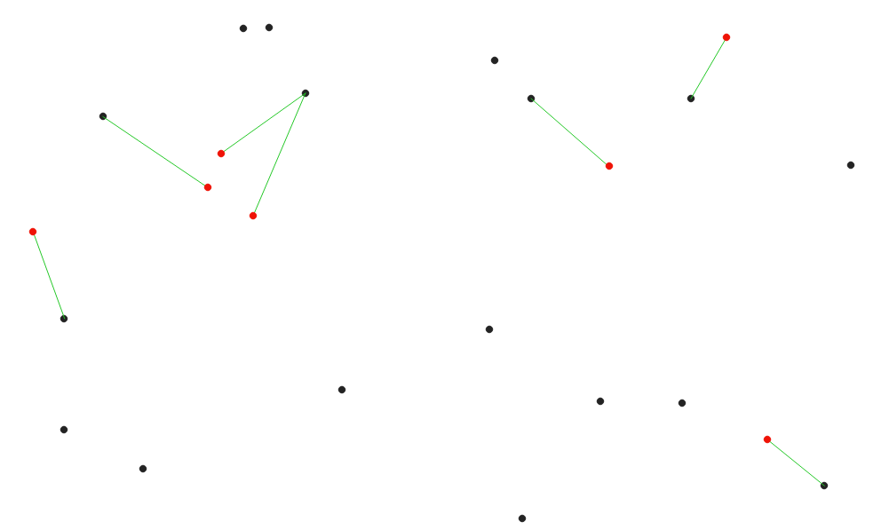

.. only:: html

   |updatedisclaimer|

Vector analysis
===============

.. only:: html

   .. contents::
      :local:
      :depth: 1

.. _qgisbasicstatisticsforfields:

Basic statistics for fields
---------------------------
Generates basic statistics for a field of the attribute table of a vector layer.

Numeric, date, time and string fields are supported.

The statistics returned will depend on the field type.

Statistics are generated as an HTML file and are available in the
:menuselection:`Processing --> Results viewer`.

``Default menu``: :menuselection:`Vector --> Analysis Tools`

Parameters
..........

``Input vector`` [vector: any]
  Vector layer to calculate the statistic on.

``Field to calculate statistics on`` [tablefield: any]
  Any supported table field to calculate the statistics.

Outputs
.......
``Statistics`` [html]
  HTML file with calculated statistics.

.. _qgiscountpointsinpolygon:

Count points in polygon
-----------------------
Takes a point and a polygon layer and counts the number of points from the
first one in each polygon of the second one.

A new polygons layer is generated, with the exact same content as the input polygons
layer, but containing an additional field with the points count corresponding to
each polygon.

  The labels identify the point count

An optional weight field can be used to assign weights to each point. Alternatively,
a unique class field can be specified. If both options are used, the weight field
will take precedence and the unique class field will be ignored.

``Default menu``: :menuselection:`Vector --> Analysis Tools`

Parameters
..........
``Polygons`` [vector: polygon]
  Polygons layer.

``Points`` [vector: point]
  Points layer.

``Weight field`` [tablefield: any]
  Optional

  The count generated will be the sum of the weight field for each point contained
  by the polygon.

``Class field`` [tablefield: any]
  Optional

  Points are classified based on the selected attribute and if several points with
  the same attribute value are within the polygon, only one of them is counted.
  The final count of the point in a polygon is, therefore, the count of different
  classes that are found in it.

``Count field name`` [string]
  The name of the field to store the count of points.

  Default: *NUMPOINTS*

Outputs
.......

``Count`` [vector: polygon]
  Resulting layer with the attribute table containing the new column of the
  points count.

.. _qgisdbscanclustering:

DBSCAN clustering
-----------------
Clusters point features based on a 2D implementation of Density-based spatial
clustering of applications with noise (DBSCAN) algorithm.

The algorithm requires two parameters, a minimum cluster size,
and the maximum distance allowed between clustered points.

Parameters
..........

``Input layer`` [vector: point]
  Layer to analyze.

``Minimum cluster size`` [number]
  Minimum number of features to generate a cluster.

  Default: *5*

``Maximum distance between clustered points`` [number]
  Distance beyond which two features can not belong to
  the same cluster.

  Default: *1.0*

``Treat border points as noise (DBSCAN*)`` [boolean]
  Optional

  If checked, points on the border of a cluster are themselves treated as
  unclustered points, and only points on the interior of a cluster are tagged
  as clustered.

  Default: *FALSE*

``Cluster field name`` [string]
  Name of the field where to store the associated cluster number.

  Default: *CLUSTER_ID*

Outputs
.......

``Clusters`` [vector: point]
  Vector layer containing the original features with a field
  setting the cluster they belong to.

See also
........
:ref:`qgiskmeansclustering`

.. _qgisdistancematrix:

Distance matrix
---------------
Creates a table containing a distance matrix, with distances between all the points
in a points layer.

``Default menu``: :menuselection:`Vector --> Analysis Tools`

Parameters
..........

``Input point layer`` [vector: point]
  Input point vector layer.

``Input unique ID field`` [tablefield: any]
  Define the field of the input layer with unique ID that will be copied in the
  output attribute table.

``Target point layer`` [vector: point]
  Destination point vector layer.

``Target unique ID field`` [tablefield: any]
  Define the field of the target layer with unique ID that will be copied in the
  output attribute table.

``Output matrix type`` [enumeration]
  Different types of calculation are available:

  * 0 --- Linear (N*k x 3) distance matrix
  * 1 --- Standard (N x T) distance matrix
  * 2 --- Summary distance matrix (mean, std. dev., min, max)

  Default: *0*

``Use only the nearest (k) target points`` [number]
  You can choose to calculate the distance between all points or to stop the
  calculation at a chosen point number.

  Default: *0* all points are used

Outputs
.......

``Distance matrix`` [vector: point]
  Point vector layer with attribute table composed by:

  * *InputID*: the unique ID of the input layer
  * *TargetID*: the unique ID of the target layer
  * *Distance*: the distance between the points

.. _qgisdistancetonearesthublinetohub:

Distance to nearest hub (line to hub)
-------------------------------------
Links each feature of the input vector with the nearest feature of the destination
layer. The output is a line vector layer with all the attributes of the input layer,
one attribute of the destination layer and the distance.

  Distance to nearest hub example

Parameters
..........

``Source points layer`` [vector: any]
  Input vector layer.

``Destination hubs layer`` [vector: any]
  Destination layer to calculate the nearest point.

``Hub layer name attribute`` [tablefield: any]
  Attribute of the destination layer that will be copied into the
  output.

``Measurement unit`` [enumeration]
  The distance field in the output attribute table will be calculated according
  to this choice:

  * 0 --- Meters
  * 1 --- Feet
  * 2 --- Miles
  * 3 --- Kilometers
  * 4 --- Layer units

  Default: *0*

Outputs
.......
``Hub distance`` [vector: line]
  Line vector layer with distance values.

.. _qgisdistancetonearesthubpoints:

Distance to nearest hub (points)
--------------------------------
Creates a copy of the input layer with the addition of two fields containing the
attribute of the destination layer and the distance between points.

Parameters
..........

``Source points layer`` [vector: any]
  Input vector layer.

``Destination hubs layer`` [vector: any]
  Destination layer to calculate the nearest point.

``Hub layer name attribute`` [tablefield: any]
  Attribute of the destination layer that will be copied into the
  output.

``Measurement unit`` [enumeration]
  The distance field in the output attribute table will be calculated according
  to this choice:

  * 0 --- Meters
  * 1 --- Feet
  * 2 --- Miles
  * 3 --- Kilometers
  * 4 --- Layer units

  Default: *0*

Outputs
.......
``Hub distance`` [vector: point]
  Point vector layer with distance values.

.. _qgishublines:

Join by lines (hub lines)
-------------------------
Creates hub and spoke diagrams by connecting lines from points on the spoke layer
to matching points in the hub layer.

Determination of which hub goes with each point is based on a match between the
Hub ID field on the hub points and the Spoke ID field on the spoke points.

If input layers are not point layers, a point on the surface of the geometries
will be taken as the connecting location.

  Join points on common field

Parameters
..........

``Hub point layer`` [vector: any]
  Input layer.

``Hub ID field`` [tablefield: any]
  Field of the hub layer with ID to join.

``Hub layer fields to copy``
  Optional

  Choose here the field(s) of the hub layer to copy. If no field(s) are chosen
  all fields are taken.

``Spoke point layer`` [vector: any]
  Additional spoke point layer.

``Spoke ID field`` [tablefield: any]
  Field of the spoke layer with ID to join.

``Spoke layer fields to copy``
  Optional

  Field(s) of the spoke layer to be copied. If no fields are chosen all fields
  are taken.

Outputs
.......
``Hub lines`` [vector: lines]
  The resulting line layer.

.. _qgiskmeansclustering:

K-means clustering
------------------
Calculates the 2D distance based k-means cluster number for each input feature.

K-means clustering aims to partition the features into k clusters in which
each feature belongs to the cluster with the nearest mean.
The mean point is represented by the barycenter of the clustered features.

If input geometries are lines or polygons, the clustering
is based on the centroid of the feature.

  A five class point clusters

Parameters
..........

``Input layer`` [vector: any]
  Layer to analyze.

``Number of clusters`` [number]
  Number of clusters to create with the features.

  Default: *5*

``Cluster field name`` [tablefield: any]
  Name of the field where to store the associated cluster number.

  Default: *CLUSTER_ID*

Outputs
.......

``Clusters`` [vector: any]
  Vector layer containing the original features with a field
  setting the cluster they belong to.

See also
........
:ref:`qgisdbscanclustering`

.. _qgislistuniquevalues:

List unique values
------------------
Lists unique values of an attribute table field and counts their number.

``Default menu``: :menuselection:`Vector --> Analysis Tools`

Parameters
..........

``Input layer`` [vector: any]
  Layer to analyze.

``Target field`` [tablefield: any]
  Field to analyze.

Outputs
.......

``Unique values`` [table]
  Summary table layer with unique values.

``HTML report`` [html]
  HTML report of unique values in the :menuselection:`Processing --> Results viewer`.

.. _qgismeancoordinates:

Mean coordinate(s)
------------------
Computes a point layer with the center of mass of geometries in an input layer.

An attribute can be specified as containing weights to be applied to each feature
when computing the center of mass.

If an attribute is selected in the parameter, features will be grouped according
to values in this field. Instead of a single point with the center of mass of the
whole layer, the output layer will contain a center of mass for the features in
each category.

``Default menu``: :menuselection:`Vector --> Analysis Tools`

Parameters
..........

``Input layer`` [vector: any]
  Input vector layer.

``Weight field`` [tablefield: numeric]
  Optional

  Field to use if you want to perform a weighted mean.

``Unique ID field`` [tablefield: numeric]
  Optional

  Unique field on which the calculation of the mean will be made.

Outputs
.......
``Mean coordinates`` [vector: point]
  Resulting point(s) layer.

.. _qgisnearestneighbouranalysis:

Nearest neighbour analysis
--------------------------
Performs nearest neighbor analysis for a point layer.

Output is generated as an HTML file with the computed statistical values:

* Observed mean distance
* Expected mean distance
* Nearest neighbour index
* Number of points
* Z-Score

``Default menu``: :menuselection:`Vector --> Analysis Tools`

Parameters
..........

``Points`` [vector: point]
  Point vector layer to calculate the statistics on.

Outputs
.......
``Nearest neighbour`` [html]
  HTML file in output with the computed statistics.

.. _qgisstatisticsbycategories:

Statistics by categories
------------------------
Calculates statistics of fields depending on a parent class.

The output is a table layer with the following statistics calculated:

* count
* unique
* min
* max
* range
* sum
* mean
* median
* stdev
* minority
* majority
* q1
* q3
* iqr

Parameters
..........

``Input vector layer`` [vector: any]
  Input vector layer with unique classes and values.

``Field to calculate the statistics on`` [tablefield: any]
  Optional

  If empty only the count will be calculated.

``Field(s) with categories`` [tablefield: any] [list]
  Field(s) of the categories.

Outputs
.......
``N unique values`` [table]
  Table with statistics field.

.. _qgissumlinelengths:

Sum line lengths
----------------
Takes a polygon layer and a line layer and measures the total length of lines and
the total number of them that cross each polygon.

The resulting layer has the same features as the input polygon layer, but with two
additional attributes containing the length and count of the lines across each
polygon.

The names of these two fields can be configured in the algorithm parameters.

``Default menu``: :menuselection:`Vector --> Analysis Tools`

Parameters
..........

``Lines`` [vector: line]
  Input vector line layer.

``Polygons`` [vector: polygon]
  Polygon vector layer.

``Lines length field name`` [string]
  Name of the field of the lines length.

  Default: *LENGTH*

``Lines count field name`` [string]
  Name of the field of the lines count.

  Default: *COUNT*

Outputs
.......
``Line length`` [vector: polygon]
  Polygon output layer with fields of lines length and line count.

.. Substitutions definitions - AVOID EDITING PAST THIS LINE
   This will be automatically updated by the find_set_subst.py script.
   If you need to create a new substitution manually,
   please add it also to the substitutions.txt file in the
   source folder.

.. |updatedisclaimer| replace:: :disclaimer:`Docs in progress for 'QGIS testing'. Visit https://docs.qgis.org/3.4 for QGIS 3.4 docs and translations.`
