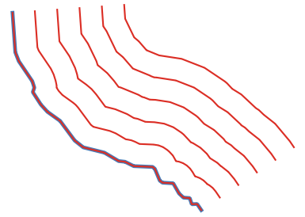
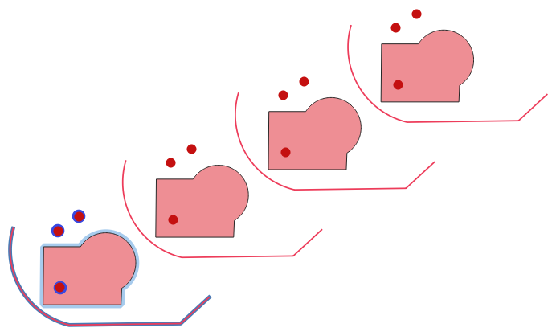
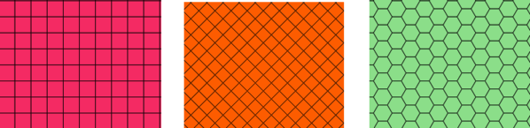
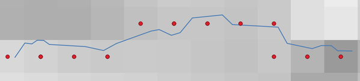
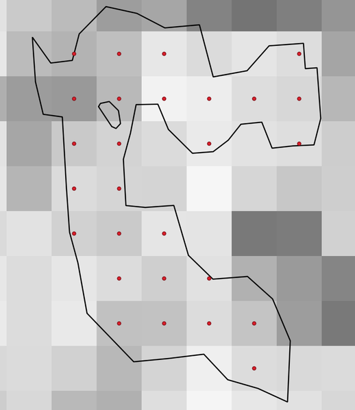

Vector creation
===============

.. only:: html

   .. contents::
      :local:
      :depth: 1


.. _qgisarrayoffsetlines:

Array of offset (parallel) lines
--------------------------------
Creates copies of line features in a layer, by creating multiple offset versions
of each feature. Each new version is incrementally offset by a specified distance.

Positive distance will offset lines to the left, and negative distances will offset
them to the right.



   In blue the source layer, in red the offset one

|checkbox| Allows :ref:`features in-place modification <processing_inplace_edit>`

.. seealso:: :ref:`qgisoffsetline`, :ref:`qgisarraytranslatedfeatures`

Parameters
..........

.. list-table::
   :header-rows: 1
   :widths: 20 20 20 40
   :stub-columns: 0

   * - Label
     - Name
     - Type
     - Description
   * - **Input layer**
     - ``INPUT``
     - [vector: line]
     - Input line vector layer to use for the offsets.
   * - **Number of features to create**
     - ``COUNT``
     - [number |dataDefined|]

       Default: 10
     - Number of offset copies to generate for each feature
   * - **Offset step distance**
     - ``OFFSET``
     - [number |dataDefined|]

       Default: 1.0
     - Distance between two consecutive offset copies
   * - **Segments**
     - ``SEGMENTS``
     - [number]

       Default: 8
     - Number of line segments to use to approximate a quarter
       circle when creating rounded offsets
   * - **Join style**
     - ``JOIN_STYLE``
     - [enumeration]

       Default: 0
     - Specify whether round, miter or beveled joins should be
       used when offsetting corners in a line. One of:

       * 0 --- Round
       * 1 --- Miter
       * 2 --- Bevel

   * - **Miter limit**
     - ``MITER_LIMIT``
     - [number]

       Default: 2.0
     - Only applicable for mitered join styles, and controls
       the maximum distance from the offset curve to use when
       creating a mitered join.
   * - **Offset lines**
     - ``OUTPUT``
     - [vector: line]

       Default: ``[Create temporary layer]``
     - Specify the output line layer with offset features. One of:

       * Create Temporary Layer (``TEMPORARY_OUTPUT``)
       * Save to File...
       * Save to Geopackage...
       * Save to PostGIS Table

       The file encoding can also be changed here.
       
Outputs
.......

.. list-table::
   :header-rows: 1
   :widths: 20 20 20 40
   :stub-columns: 0

   * - Label
     - Name
     - Type
     - Description
   * - **Offset lines**
     - ``OUTPUT``
     - [vector: line]
     - Output line layer with offset features.
       The original features are also copied.


.. _qgisarraytranslatedfeatures:

Array of translated features
----------------------------
Creates copies of features in a layer by creating multiple translated
versions of each.
Each copy is incrementally displaced by a preset amount in the X, Y and/or
Z axis.

M values present in the geometry can also be translated.



   Input layers in blue tones, output layers with translated features in
   red tones

|checkbox| Allows
:ref:`features in-place modification <processing_inplace_edit>`

.. seealso:: :ref:`qgistranslategeometry`, :ref:`qgisarrayoffsetlines`

Parameters
..........

.. list-table::
   :header-rows: 1
   :widths: 20 20 20 40
   :stub-columns: 0

   * - Label
     - Name
     - Type
     - Description
   * - **Input layer**
     - ``INPUT``
     - [vector: line]
     - Input vector layer to translate
   * - **Number of features to create**
     - ````
     - [number |dataDefined|]

       Default: 10
     - Number of copies to generate for each feature
   * - **Step distance (x-axis)**
     - ````
     - [number |dataDefined|]

       Default: 0.0
     - Displacement to apply on the X axis
   * - **Step distance (y-axis)**
     - ````
     - [number |dataDefined|]

       Default: 0.0
     - Displacement to apply on the Y axis
   * - **Step distance (z-axis)**
     - ````
     - [number |dataDefined|]

       Default: 0.0
     - Displacement to apply on the Z axis
   * - **Step distance (m values)**
     - ````
     - [number |dataDefined|]

       Default: 0.0
     - Displacement to apply on M
   * - **Translated**
     - ``OUTPUT``
     - [same as input]

       Default: ``[Create temporary layer]``
     - Output vector layer with translated (moved) copies
       of the features.
       The original features are also copied. One of:

       * Create Temporary Layer (``TEMPORARY_OUTPUT``)
       * Save to File...
       * Save to Geopackage...
       * Save to PostGIS Table

       The file encoding can also be changed here.
       
Outputs
.......

.. list-table::
   :header-rows: 1
   :widths: 20 20 20 40
   :stub-columns: 0

   * - Label
     - Name
     - Type
     - Description
   * - **Translated**
     - ``OUTPUT``
     - [same as input]
     - Output vector layer with translated (moved)
       copies of the features.
       The original features are also copied.


.. _qgiscreategrid:

Create grid
-----------
Creates a vector layer with a grid covering a given extent. Grid cells can have
different shapes:



  Different grid cell shapes

The size of each element in the grid is defined using a horizontal and vertical
spacing.

The CRS of the output layer must be defined.

The grid extent and the spacing values must be expressed in the coordinates and
units of this CRS.

``Default menu``: :menuselection:`Vector --> Research Tools`

Parameters
..........

.. list-table::
   :header-rows: 1
   :widths: 20 20 20 40
   :stub-columns: 0

   * - Label
     - Name
     - Type
     - Description
   * - **Grid type**
     - ``TYPE``
     - [enumeration]

       Default: 0
     - Shape of the grid. One of:

       * 0 --- Point
       * 1 --- Line
       * 2 --- Rectangle (polygon)
       * 3 --- Diamond (polygon)
       * 4 --- Hexagon (polygon)

   * - **Grid extent**
     - ``EXTENT``
     - [extent]
     - Extent of the grid
   * - **Horizontal spacing**
     - ``HSPACING``
     - [number]

       Default: 1.0
     - Size of a grid cell on the X-axis
   * - **Vertical spacing**
     - ``VSPACING``
     - [number]

       Default: 1.0
     - Size of a grid cell on the Y-axis
   * - **Horizontal overlay**
     - ``HOVERLAY``
     - [number]

       Default: 0.0
     - Overlay distance between two consecutive grid cells on the X-axis
   * - **Vertical overlay**
     - ``VOVERLAY``
     - [number]

       Default: 0.0
     - Overlay distance between two consecutive grid cells on the Y-axis
   * - **Grid CRS**
     - ``CRS``
     - [crs]

       Default: *Project CRS*
     - Coordinate reference system to apply to the grid
   * - **Grid**
     - ``OUTPUT``
     - [vector: point, vector: line or vector: polygon]
       
       Default: ``[Create temporary layer]``
     - Resulting vector grid layer. One of:

       * Create Temporary Layer (``TEMPORARY_OUTPUT``)
       * Save to File...
       * Save to Geopackage...
       * Save to PostGIS Table

       The file encoding can also be changed here.

Outputs
.......

.. list-table::
   :header-rows: 1
   :widths: 20 20 20 40
   :stub-columns: 0

   * - Label
     - Name
     - Type
     - Description
   * - **Grid**
     - ``OUTPUT``
     - [vector: point, vector: line or vector: polygon]
     - Resulting vector grid layer


.. _qgiscreatepointslayerfromtable:

Create points layer from table
------------------------------
Creates points layer from a table with columns that contain coordinates
fields.

Besides X and Y coordinates you can also specify Z and M fields.

Parameters
..........

``Input layer`` [vector: any]
  Input vector layer or geometryless table.

``X field`` [tablefield: any]
  Field containing the X coordinate.

``Y field`` [tablefield: any]
  Field containing the Y coordinate.

``Z field`` [tablefield: any]
  Optional

  Field containing the Z coordinate.

``M field`` [tablefield: any]
  Optional

  Field containing the M coordinate.

``Target CRS`` [crs]
  Coordinate reference system to use for layer.
  Provided coordinates are assumed to be compliant.

  Default: *EPSG:4326*

Outputs
.......

``Points from table`` [vector: point]
  The resulting point layer.


.. _qgisgeneratepointspixelcentroidsalongline:

Generate points (pixel centroids) along line
--------------------------------------------
Generates a point vector layer from an input raster and line layer.

The points correspond to the pixel centroids that intersect the line layer.




  Points of the pixel centroids

Parameters
..........

``Raster layer`` [raster]
  Raster layer in input.

``Vector layer`` [vector: line]
  Line vector layer to follow.

Outputs
.......

``Points from polygons`` [vector: point]
  Resulting point layer of pixel centroid.


.. _qgisgeneratepointspixelcentroidsinsidepolygons:

Generate points (pixel centroids) inside polygon
------------------------------------------------
Generates a point vector layer from an input raster and polygon layer.

The points correspond to the pixel centroids that intersect the polygon layer.




  Points of the pixel centroids

Parameters
..........

``Raster layer`` [raster]
  Raster layer in input.

``Vector layer`` [vector: polygon]
  Polygon vector layer.

Outputs
.......

``Points from polygons`` [vector: point]
  Resulting point layer of pixel centroid.


.. _qgisimportphotos:

Import geotagged photos
-----------------------
Creates a point layer corresponding to the geotagged locations from JPEG images
from a source folder.

The point layer will contain a single PointZ feature per input file from which
the geotags could be read. Any altitude information from the geotags will be used
to set the point's Z value.

Besides longitude and latitude also altitude, direction and timestamp information,
if present in the photo, will be added to the point as attributes.

Parameters
..........

``Input folder`` [folder]
  Path to the source folder containing the geotagged photos.

``Scan recursively`` [boolean]
  If checked, the folder and its subfolders will be scanned.

Outputs
.......

``Photos`` [vector: point]
  Point vector layer with geotagged photos. The form of the layer is automatically
  filled with paths and photo previews settings.

``Invalid photos table`` [table]
  Optional

  Table of unreadable or non-geotagged photos can also be created.


.. _qgispointstopath:

Points to path
--------------
Converts a point layer to a line layer, by joining points in a defined order.

Points can be grouped by a field to output individual line features per group.

Parameters
..........

``Input point layer`` [vector: point]
  point vector layer to be converted.

``Order field`` [tablefield: any]
  Field containing the order to connect the points in the path.

``Group field`` [tablefield: any]
  Optional

  Point features of the same value in the field will be grouped in the same line.
  If not set, a single path is drawn with all the input points.

``Date format (if order field is DateTime)`` [string]
  Optional

  Indicates the format to use for the ``order field`` parameter.
  Fill this option only if the ``order field`` is of a Date/Time format.

  Default: *(not set)*

Outputs
.......

``Paths`` [vector: line]
  Line vector layer of the path.

``Directory for text output`` [folder]
  Directory containing description files of points and paths.


.. _qgisrandompointsalongline:

Random points along line
------------------------
Creates a new point layer, with points placed in the lines of another layer.

For each line in the input layer, a given number of points is added to the resulting
layer.

A minimum distance can be specified, to avoid points being too close to each other.

Parameters
..........

``Input layer`` [vector: line]
  Line vector layer in input.

``Number of points`` [number]
  Number of point to create.

  Default: *1*

``Minimum distance`` [number]
  A minimum distance that points must respect.

  Default: *0.0*

Outputs
.......

``Random points`` [vector: point]
  Final random point layer along line.


.. _qgisrandompointsinextent:

Random points in extent
-----------------------
Creates a new point layer with a given number of random points, all of them within
a given extent.

A minimum distance can be specified, to avoid points being too close to each other.

``Default menu``: :menuselection:`Vector --> Research Tools`

Parameters
..........

``Input extent`` [extent]
  Map extent for the random points.

``Points number`` [number]
  Number of point to create.

  Default: *1*

``Minimum distance`` [number]
  A minimum distance that points must respect.

  Default: *0.0*

``Target CRS`` [crs]
  CRS of the random points layer.

Outputs
.......

``Random points`` [vector: point]
  Final random point layer in extent.


.. _qgisrandompointsinlayerbounds:

Random points in layer bounds
-----------------------------
Creates a new point layer with a given number of random points, all of them within
the extent of a given layer.

A minimum distance can be specified, to avoid points being too close to each other.

``Default menu``: :menuselection:`Vector --> Research Tools`

Parameters
..........

``Input layer`` [vector: polygon]
  Input polygon layer for the extent.

``Points number`` [number]
  Number of point to create.

  Default: *1*

``Minimum distance`` [number]
  A minimum distance that points must respect.

  default: *0.0*


Outputs
.......

``Random points`` [vector: point]
  Final random point layer in layer bounds.


.. _qgisrandompointsinsidepolygons:

Random points inside polygons
-----------------------------
Creates a new point layer with a given number of random points, all of them within
a given layer.

Together with the point number. two different sampling strategies can be chosen.

A minimum distance can be specified, to avoid points being too close to each other.

``Default menu``: :menuselection:`Vector --> Research Tools`

Parameters
..........

``Input layer`` [vector: polygon]
  Polygon vector layer in input. All the points will be created withing each
  feature of this layer.

``Sampling strategy`` [enumeration]
  Choose between:

  * 0 --- Points count: number of points for each feature
  * 1 --- points density: density of points for each feature

  Default: *0*

``Number or density of points`` [expression]
  You can choose the points number also with an expression.

  Default: *1.0*

``Minimum distance`` [number]
  A minimum distance that points must respect.

  default: *0.0*

Outputs
.......

``Random points`` [vector: point]
  Final random point layer inside polygon.


.. _qgispixelstopoints:

Raster pixels to points
-----------------------
Creates a vector layer of points corresponding to each pixel in a raster layer.

Converts a raster layer to a vector layer, by creating point features
for each individual pixel's center in the raster layer.
Any nodata pixels are skipped in the output.

Parameters
..........

``Raster layer`` [raster]
  Raster layer in input.

``Band number`` [raster band]
  Raster band to extract data from.

``Field name`` [string]
  Name of the field to store the raster band value.

  Default: *VALUE*

Outputs
.......

``Vector points`` [vector: point]
  Resulting point layer of pixels centroid.


.. _qgispixelstopolygons:

Raster pixels to polygons
-------------------------
Creates a vector layer of polygons corresponding to each pixel in a raster layer.

Converts a raster layer to a vector layer, by creating polygon features
for each individual pixel's extent in the raster layer.
Any nodata pixels are skipped in the output.

Parameters
..........

``Raster layer`` [raster]
  Raster layer in input.

``Band number`` [raster band]
  Raster band to extract data from.

``Field name`` [string]
  Name of the field to store the raster band value.

  Default: *VALUE*

Outputs
.......

``Vector polygons`` [vector: polygon]
  Resulting polygon layer of pixels extent.


.. _qgisregularpoints:

Regular points
--------------
Creates a new point layer with a given number of regular points, all of them within
a given extent.

Together with the point number. two different sampling strategies can be chosen.

A distance factor can be specified, to avoid points being too close to each other.

``Default menu``: :menuselection:`Vector --> Research Tools`

Parameters
..........

``Input extent`` [extent]
  Map extent for the random points.

``Point spacing/count`` [number]
  Spacing between the points.

  Default: *100*

``Initial inset from corner (LH side)`` [number]
  Choose to move the initial points coordinate from the left upper corner.

  Default: *0.0*

``Apply random offset to point spacing`` [boolean]
  If checked the points will have a random spacing.

  Default: *False*

``Use point spacing`` [boolean]
  If unchecked the point spacing is not taken into account.

  Default: *True*

Outputs
.......

``Regular points`` [vector: point]
  Regular point layer in output.


.. Substitutions definitions - AVOID EDITING PAST THIS LINE
   This will be automatically updated by the find_set_subst.py script.
   If you need to create a new substitution manually,
   please add it also to the substitutions.txt file in the
   source folder.

.. |checkbox| image:: /static/common/checkbox.png
   :width: 1.3em
.. |dataDefined| image:: /static/common/mIconDataDefine.png
   :width: 1.5em
