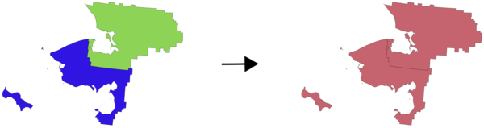

.. only:: html

   |updatedisclaimer|

Vector general
==============

.. only:: html

   .. contents::
      :local:
      :depth: 1

.. _qgisassignprojection:

Assign projection
-----------------
Assigns a new projection to a vector layer.

It creates a new layer with the exact same features and geometries as the input
one, but assigned to a new CRS. The geometries are **not** reprojected, they
are just assigned to a different CRS.

This algorithm can be used to repair layers which have been assigned an incorrect
projection.

Attributes are not modified by this algorithm.

Parameters
..........
``Input layer`` [vector: any]
  Vector layer with wrong or missing CRS.

``Assigned CRS`` [crs]
  Select the new CRS to assign to the vector layer.

  Default: *EPSG:4326 - WGS84*

Outputs
.......
``Assigned CRS`` [vector: any]
  Vector layer with assigned projection.

See also
........
:ref:`qgisdefinecurrentprojection`, :ref:`qgisfindprojection`, :ref:`qgisreprojectlayer`

.. _qgisbuildvirtualvector:

Build virtual vector
--------------------
Creates a virtual vector layer that contains a set of vector layer.
The output virtual vector layer will not be open in the current project.

This algorithm is especially useful in case another algorithm needs multiple
layers but accept only one ``vrt`` in which the layers are specified.

Parameters
..........
``Input datasources`` [vector: any] [list]
  Select the vector layers you want to use to build the virtual vector.

``Create "unioned" VRT`` [boolean]
  Check if you want to unite all the vectors in a single ``vrt`` file.

  Default: *False*

Outputs
.......
``Virtual vector`` [vector: any]
  The final virtual vector made by all the source vector chosen.

.. _qgiscreateattributeindex:

Create attribute index
----------------------
Creates an index against a field of the attribute table to speed up queries.
The support for index creation depends on both the layer's data provider and the
field type.

No outputs are created: the index is stored on the layer itself.

Parameters
..........

``Input layer`` [vector: any]
  Vector layer.

``Attribute to index`` [tablefield: any]
  Field of the vector layer.

.. _qgiscreatespatialindex:

Create spatial index
--------------------
Creates an index to speed up access to the features in a layer based on their
spatial location. Support for spatial index creation is dependent on the layer's
data provider.

No new output layers are created.

``Default menu``: :menuselection:`Vector --> Data Management Tools`

Parameters
..........
``Input layer`` [vector: any]
  Vector layer in input.

.. _qgisdefinecurrentprojection:

Define layer projection
-----------------------
Sets an existing layer's projection to the provided CRS. It is very useful when
a layer is missing the ``proj`` file and you know the correct projection.

Contrary to the :ref:`qgisassignprojection` algorithm, it modifies the current
layer and will not output a new layer.

.. note:: For Shapefile datasets, the ``.prj`` and ``.qpj`` files will
   be overwritten - or created if missing - to match the provided CRS.

``Default menu``: :menuselection:`Vector --> Data Management Tools`

Parameters
..........
``Input layer`` [vector: any]
  Vector layer with missing projection information.

``CRS`` [crs]
  CRS to associate to the input vector layer.

See also
........
:ref:`qgisassignprojection`, :ref:`qgisfindprojection`, :ref:`qgisreprojectlayer`

.. _qgisdeleteduplicategeometries:

Delete duplicate geometries
---------------------------
Finds and removes duplicated geometries.

Attributes are not checked, so in case two features have identical geometries
but different attributes, only one of them will be added to the result layer.

Parameters
..........
``Input layer`` [vector: any]
  The layer with duplicate geometries you want to clean.

Outputs
.......
``Cleaned`` [vector: any]
  The final layer without any duplicated geometries.

.. _qgisdropgeometries:

Drop geometries
---------------
Creates a simple *geometryless* copy of the input layer attribute table. It keeps
the attribute table of the source layer.

If the file is saved in a local folder, you can choose between many file formats.

|checkbox| Allows :ref:`features in-place modification <processing_inplace_edit>`

Parameters
..........
``Input layer`` [vector: any]
  Vector layer.

Outputs
.......

``Dropped geometry`` [table]
  Geometryless table as a copy of the original attribute table.

.. _qgisexecutesql:

Execute SQL
-----------
Runs a simple or complex query with ``SQL`` syntax on the source layer.

The result of the query will be added as new layer.

Parameters
..........
``Additional input datasources`` [vector: any] [list]
  List of layers to query. In the SQL editor you can refer these layers with
  their **real** name or also with **input1**, **input2**, **inputN** depending
  on how many layers have been chosen.

``SQL query`` [string]
  Type here the string of your SQL query, e.g. ``SELECT * FROM input1``.

``Unique identifier field`` [string]
  Optional

  Specify the column with unique ID.

``Geometry field`` [string]
  Optional

  Specify the geometry field.

``Geometry type`` [enumeration]
  Optional

  Choose the final geometry of the result. By default the algorithm will autodetect
  it. Available options are:

  * 0 --- Autodetect
  * 1 --- No geometry
  * 2 --- Point
  * 3 --- LineString
  * 4 --- Polygon
  * 5 --- MultiPoint
  * 6 --- MultiLineString
  * 7 --- MultiPolygon

  Default: *0*

``CRS`` [crs]
  Optional

  The CRS to assign to the output layer.

Outputs
.......
``SQL Output`` [vector: any]
  Vector layer created by the query.

.. _qgissaveselectedfeatures:

Extract selected features
-------------------------
Saves the selected features as a new layer.

.. note:: If the selected layer has no selected features, the newly created
   layer will be empty.

Parameters
..........

``Input layer`` [vector: any]
  Layer to save the selection from.

Outputs
.......

``Selection`` [vector: any]
  Vector layer with only the selected features, or no feature if none was selected.

.. _qgisfindprojection:

Find projection
---------------
Allows creation of a shortlist of possible candidate coordinate reference systems
for a layer with an unknown projection.

The expected area which the layer should reside in must be specified via the
target area parameter. Additionally, the coordinate reference system for this
target area must also be set.

The algorithm operates by testing the layer's extent in every known reference
system and listing any in which the bounds would fall near the target area if the
layer was in this projection.

Parameters
..........
``Input layer`` [vector: any]
  Layer with unknown projection.

``Target area for layer`` [extent]
  This is the area in which the layer is expected to be.

``Target area CRS`` [crs]
  Choose the target CRS of the target area selected.

Outputs
.......
``CRS candidates`` [table]
  The algorithm writes a table with all the CRS (EPSG codes) of the matching
  criteria.

See also
........
:ref:`qgisassignprojection`, :ref:`qgisdefinecurrentprojection`, :ref:`qgisreprojectlayer`

.. _qgisjoinattributestable:

Join attributes by field value
------------------------------
Takes an input vector layer and creates a new vector layer that is an extended
version of the input one, with additional attributes in its attribute table.

The additional attributes and their values are taken from a second vector layer.
An attribute is selected in each of them to define the join criteria.

Parameters
..........
``Input layer`` [vector: any]
  Source input vector layer. The final attribute table will be added to **this**
  vector layer.

``Table field`` [tablefield: any]
  Field of the source layer with the unique identifier.

``Input layer 2`` [vector: any]
  Layer with the attribute table to join.

``Table field 2`` [tablefield: any]
  Table of the joining layer with the common unique field identifier.

``Layer 2 fields to copy`` [tablefield: any]
  Optional

  Select the specific fields you want to add. By default all the fields are added.

``Join type`` [enumeration]
  Choose the type of the final joined layer between:

  * 0 --- Create separate feature for each matching feature (one-to-many)
  * 1 --- Take attributes of the first matching feature only (one-to-one)

  Default: *1*

``Discard records which could not be joined`` [boolean]
  Check if you don't want to add the features that cannot be joined.

``Joined field prefix`` [string]
  Optional

  Add a prefix to joined fields in order to easily identify them and avoid field
  name collision.

Outputs
.......
``Joined layer`` [vector: any]
  Final vector layer with the attribute table as result of the join.

``Unjoinable features from first layer`` [vector: any]
  Optional

  Vector layer of the non matching features resulting from the join.

.. _qgisjoinattributesbylocation:

Join attributes by location
---------------------------
Takes an input vector layer and creates a new vector layer that is an extended
version of the input one, with additional attributes in its attribute table.

The additional attributes and their values are taken from a second vector layer.
A spatial criteria is applied to select the values from the second layer that are
added to each feature from the first layer.

``Default menu``: :menuselection:`Vector --> Data Management Tools`

Parameters
..........
``Input layer`` [vector: any]
  Source vector layer.

``Join layer`` [vector: any]
  The attributes of this vector layer will be **added** to the source layer
  attribute table.

``Geometric predicate`` [enumeration] [list]
  Check the geometric criteria.

  Options:

  * 0 --- intersects
  * 1 --- contains
  * 2 --- equals
  * 3 --- touches
  * 4 --- overlaps
  * 5 --- within
  * 6 --- crosses

  Default: *0*

``Fields to add`` [tablefield: any]
  Optional

  Select the specific fields you want to add. By default all the fields are added.

``Join type`` [enumeration]
  Choose the type of the final joined layer between:

  * 0 --- Create separate feature for each located feature (one-to-many)
  * 1 --- Take attributes of the first located feature only (one-to-one)

  Default: *0*

``Discard records which could not be joined`` [boolean]
  Check if you don't want to add the features that cannot be joined.

``Joined field prefix`` [string]
  Optional

  Add a prefix to joined fields in order to easily identify them and avoid field
  name collision.

Outputs
.......
``Joined layer`` [vector: any]
  The final vector with all the joined features.

``Unjoinable features from first layer`` [vector: any]
  Optional

  Vector layer of only the input features that do not spatially match any join feature.

.. _qgisjoinbylocationsummary:

Join attributes by location (summary)
-------------------------------------
Takes an input vector layer and creates a new vector layer that is an extended
version of the input one, with additional attributes in its attribute table.

The additional attributes and their values are taken from a second vector layer.
A spatial criteria is applied to select the values from the second layer that are
added to each feature from the first layer.

The algorithm calculates a statistical summary for the values from matching
features in the second layer (e.g. maximum value, mean value, etc).

Parameters
..........
``Input layer`` [vector: any]
  Source vector layer.

``Join layer`` [vector: any]
  The attributes of this vector layer will be **added** to the source layer
  attribute table.

``Geometric predicate`` [enumeration] [list]
  Check the geometric criteria.

  Options:

  * 0 --- intersects
  * 1 --- contains
  * 2 --- equals
  * 3 --- touches
  * 4 --- overlaps
  * 5 --- within
  * 6 --- crosses

  Default: *0*

``Fields to summarize`` [tablefield: any] [list]
  Optional

  Select the specific fields you want to add. By default all the fields are added.

``Summaries to calculate`` [enumeration] [list]
  Optional

  Choose which type of summary you want to add to each field and for each feature.

  * 0 --- count
  * 1 --- unique
  * 2 --- min
  * 3 --- max
  * 4 --- range
  * 5 --- sum
  * 6 --- mean
  * 7 --- median
  * 8 --- stddev
  * 9 --- minority
  * 10 --- majority
  * 11 --- q1
  * 12 --- q3
  * 13 --- iqr
  * 14 --- empty
  * 15 --- filled
  * 16 --- min_length
  * 17 --- max_length
  * 18 --- mean_length

``Discard records which could not be joined`` [boolean]
  Check if you don't want to add the features that cannot be joined.

Outputs
.......
``Joined layer`` [vector: any]
  The final vector with all the joined features.

.. _qgismergevectorlayers:

Merge vector layers
-------------------
Combines multiple vector layers of the **same geometry** type into a single one.

If attributes tables are different, the attribute table of the resulting layer
will contain the attributes from all input layers. Non-matching fields will be
appended at the end of the attribute table.

If any input layers contain Z or M values, then the output layer will also contain
these values. Similarly, if any of the input layers are multi-part, the output layer
will also be a multi-part layer.

Optionally, the destination coordinate reference system (CRS) for the merged layer
can be set. If it is not set, the CRS will be taken from the first input layer.
All layers will be reprojected to match this CRS.

``Default menu``: :menuselection:`Vector --> Data Management Tools`

Parameters
..........

``Layers to merge`` [vector: any] [list]
  All the layers that have to be merged into a single layer.
  Layers should be of the same geometry type.

``Destination CRS`` [crs]
  Optional

  Choose the CRS of the output layer. If not specified the
  CRS of the first input layer is taken.

Outputs
.......

``Merged`` [vector: any]
  Merged vector layer containing all the features and attributes from input layers.

See also
........
:ref:`qgissplitvectorlayer`

.. _qgisorderbyexpression:

Order by expression
-------------------
Sorts a vector layer according to an expression: changes the feature index
according to an expression.

Be careful, it might not work as expected with some providers, the order might
not be kept every time.

Parameters
..........

``Input layer`` [vector: any]
  Vector layer to sort.

``Expression`` [expression]
  Expression to use for the vector sorting.

``Sort ascending`` [boolean]
  If checked the vector layer will be sorted from the smallest to the
  biggest values found.

  Default: *True*

``Sort nulls first`` [boolean]
  If checked Null values are placed at the beginning of the sorted layer.

  Default: *False*

Outputs
.......

``Output layer`` [vector: any]
  Sorted vector layer.

.. _qgisreprojectlayer:

Reproject layer
---------------
Reprojects a vector layer in a different CRS. The reprojected layer will have
the same features and attributes of the input layer.

|checkbox| Allows :ref:`features in-place modification <processing_inplace_edit>`

Parameters
..........

``Input layer`` [vector: any]
  Layer to reproject.

``Target CRS`` [crs]
  Destination coordinate reference system.

  Default: *EPSG:4326*

Outputs
.......

``Reprojected layer`` [vector: any]
  The resulting reprojected layer.

See also
........
:ref:`qgisassignprojection`, :ref:`qgisdefinecurrentprojection`, :ref:`qgisfindprojection`

.. _qgissetstyleforvectorlayer:

Set style for vector layer
--------------------------
Sets the style of a vector layer. The style must be defined in a
QML file.

No new output are created: the style is immediately assigned to the vector layer.

Parameters
..........
``Vector layer`` [vector: any]
  The layer you want to change the style.

``Style file`` [file]
  ``qml`` file of the style.

.. _qgissplitvectorlayer:

Split vector layer
------------------
Creates a set of vectors in an output folder based on an input layer and an attribute.
The output folder will contain as many layers as the unique values found in the
desired field.

The number of geopackage files generated is equal to the number of different values found
for the specified attribute.

It is the opposite operation of *merging*.

``Default menu``: :menuselection:`Vector --> Data Management Tools`

Parameters
..........

``Input layer`` [vector: any]
  Vector layer.

``Unique ID field`` [tablefield: any]
  Field of the attribute table on which the layer will be split.

Outputs
.......

``Output directory`` [folder]
  Directory where all the split layer will be saved.

See also
........
:ref:`qgismergevectorlayers`

.. _qgistruncatetable:

Truncate table
--------------
Truncates a layer, by deleting all features from within the layer.

.. warning:: This algorithm modifies the layer in place, and deleted features cannot
  be restored!

Parameters
..........
``Input layer`` [vector: any]
  Vector layer in input.

.. Substitutions definitions - AVOID EDITING PAST THIS LINE
   This will be automatically updated by the find_set_subst.py script.
   If you need to create a new substitution manually,
   please add it also to the substitutions.txt file in the
   source folder.

.. |checkbox| image:: /static/common/checkbox.png
   :width: 1.3em
.. |updatedisclaimer| replace:: :disclaimer:`Docs in progress for 'QGIS testing'. Visit https://docs.qgis.org/3.4 for QGIS 3.4 docs and translations.`
