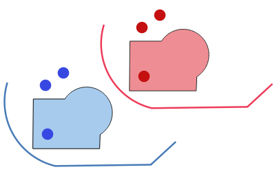

.. only:: html

   |updatedisclaimer|

Vector geometry
===============

.. only:: html

   .. contents::
      :local:
      :depth: 1

.. _qgisaggregate:

Aggregate
---------
Takes a vector or table layer and creates a new layer by aggregating features based
on a ``group by`` expression.

Features for which ``group by`` expression returns the same value are grouped together.

It is possible to group all source features together using constant value in ``group
by`` parameter, example: NULL.

It is also possible to group features using multiple fields using Array function,
example: Array("Field1", "Field2").

Geometries (if present) are combined into one multipart geometry for each group.
Output attributes are computed depending on each given aggregate definition.

This algorithm allows to use the default aggregation functions of the QGIS Expression
engine.

Parameters
..........

``Input layer`` [vector: any]
  Vector layer in input to aggregate the features from

``Group by expression`` [tablefield: any]
  Choose the grouping field. If *NULL* all features will be grouped

  Default: *NULL*

``Aggregates`` [fieldsmapping]
  Summary of all fields of the source layer, aggregation function available,
  delimiter and output field name

``Load fields from layer`` [vector: any]
  You can also load the fields from another layer and use these fields for the
  aggregation.

Output
......

``Aggregated`` [vector]
  Multigeometry vector layer with the aggregated values

See also
........
For a  complete description of the aggregates function, refer to the dedicated
:ref:`aggregates_function` chapter.

.. _qgisboundary:

Boundary
---------
Returns the closure of the combinatorial boundary of the input geometries (i.e.
the topological boundary of the geometry).

Only valid for polygon or line layers.

For **polygon geometries** , the boundary consists of all the line strings for
each ring of the polygon.

.. figure:: img/boundary_polygon.png
   :align: center

   Black dash boundary lines of the source polygon layer

For **lines geometries**, the boundaries are the vertices between each features.

   Boundary layer for lines. In yellow a selected features

Parameters
..........

``Input layer`` [vector: line, polygon]
  Input vector layer

Output
......

``Boundary`` [vector: point, line]
  Boundary from the input layer (point for line, and line for polygon).

.. _qgisboundingboxes:

Bounding boxes
---------------
Calculates the bounding box (envelope) of each feature in an input layer.
Polygon and line geometries are supported.

   Black lines represent the bounding boxes of each polygon feature

Parameters
..........

``Input layer`` [vector: polygon, line]
  Input vector layer

Outputs
.......

``Bounds`` [vector: polygon]
  Bounding boxes of input layer.

See also
........
:ref:`qgisminimumboundinggeometry`

.. _qgisbuffer:

Buffer
------
Computes a buffer area for all the features in an input layer, using a fixed distance.

It is possible to define also a negative distance for polygon input layers: in this
case the buffer will result in a smaller polygon.

Buffer always results in a polygon layer: in the following picture the buffer
for points, lines and polygons:

.. figure:: img/buffer.png
   :align: center

   In yellow the buffer of point, line and polygon layer

Parameters
..........

``Input layer`` [vector: any]
  Input vector layer

``Distance`` [number]
  Distance radius of the buffer calculated from the boundary of each feature.
  Moreover you can use the Data Defined button on the right to choose a field of
  from which the radius will be calculated: this way you can have different radius
  for each feature (see :ref:`qgisvariabledistancebuffer`).

  Default: *10.0*

``Segments`` [number]
  Controls the number of line segments to use to approximate a quarter circle when
  creating rounded offsets.

  Default: *5*

``End cap style`` [selection]
  Controls how line endings are handled in the buffer.

  .. figure:: img/buffer_cap_style.png
     :align: center

     Round, flat and square cap styles

``Join style`` [selection]
  Specifies whether round, miter or beveled joins should be used when offsetting
  corners in a line.

``Miter limit`` [number]
  Only applicable for miter join styles

  Default: *2.0*

``Dissolve result`` [boolean]
  Choose to dissolve the final buffer. If chosen each buffer that overlaps with
  another one will be dissolved and an unique feature will be created.

  Default: *False*

  .. figure:: img/buffer_dissolve.png
     :align: center

     Standard and dissolved buffer

Outputs
.......

``Buffer`` [vector: polygon]
  Buffer polygon vector layer

See also
........
:ref:`qgisvariabledistancebuffer`

.. _qgiscentroids:

Centroids
---------
Creates a new point layer, with points representing the centroid of the geometries
of the input layer.

The attributes associated to each point in the output layer are the same ones
associated to the original features.

   The red stars represent the centroids of each feature of the input layer.

In case of a multigeometry layer a single centroid will be calculated for each
feature. The resulting centroid represents the barycenter of all parts, so the
centroid can be outside the feature borders.

Parameters
..........

``Input layer`` [vector: any]
  Vector layer in input.

Outputs
.......

``Centroids`` [vector: point]
  Points vector layer in output.

.. _qgischeckvalidity:

Check validity
--------------
Performs a validity check on the geometries of a vector layer.

The geometries are classified in three groups (valid, invalid and error) and a
vector layer is generated with the features in each of these categories:

* the **valid** layer contains only the valid features (without topological errors)
* the **invalid** layer contains all the invalid features found by the algorithm
* the **error** layer is the point layer where the invalid features have been found

The attribute table of each generated vector layer will contain some additional
information (numbers of error found and type of error):

   Left the input layer. Right: in green the valid layer, in orange the invalid layer

Parameters
..........

``Input layer`` [vector: any]
  Source layer to check.

``Method`` [selection]
  Check validity method.

  Options:

  * The one selected in digitizing settings
  * QGIS
  * GEOS

  Default: *The one selected in digitizing settings*

Outputs
.......

``Valid output`` [vector: any]
  Vector layer containing copy of the valid features of the source layer.

``Invalid output`` [vector: any]
  Vector layer containing copy of the invalid features of the source layer with
  the field  ``_errors`` listing the summary of the error found.

``Error output`` [vector: point]
  Point layer of the exact position of the validity problems detected with the
  ``message`` field describing the error(s) found.

.. _qgiscollect:

Collect geometries
------------------
Takes a vector layer and collects its geometries into new multipart geometries.

One or more attributes can be specified to collect only geometries belonging to
the same class (having the same value for the specified attributes), alternatively
all geometries can be collected.

All output geometries will be converted to multi geometries, even those with just
a single part. This algorithm does not dissolve overlapping geometries - they will
be collected together without modifying the shape of each geometry part.

See the 'Promote to multipart' or 'Aggregate' algorithms for alternative options.

Parameters
..........

``Input layer`` [vector: any]
  Vector layer to be transformed

``Unique ID fields`` [multipleinput]
  Optional

  Choose one or more attributes to collect the geometries

Output
......

``Collected`` [vector]

See also
........
:ref:`qgisaggregate` and :ref:`qgispromotetomulti`

.. _qgisconcavehull:

Concave hull
------------
Computes the concave hull of the features in an input point layer.

Parameters
..........
``Input point layer`` [vector: point]
  Point vector layer to calculate the concave hull

``Threshold`` [number]
  Number from 0 (maximum concave hull) to 1 (convex hull)

  Default: *0.3*

  .. figure:: img/concave_hull_threshold.png
     :align: center

     Different thresholds used (0.3, 0.6, 0.9)

``Allow holes`` [boolean]
  Choose whether to allow holes in the final concave hull

  Default: *True*

``Split multipart geometry into singlepart geometries`` [boolean]
  Check if you want to have singlepart geometries instead of multipart ones

  Default: *False*

Output
......
``Concave hull`` [vector: polygon]
  Output concave hull

See also
........
:ref:`qgisconvexhull`

.. _qgisconvertgeometrytype:

Convert geometry type
---------------------
Generates a new layer based on an existing one, with a different type of geometry.

Not all conversions are possible. For instance, a line layer can be converted to
a point layer, but a point layer cannot be converted to a line layer.

Parameters
..........
``Input layer`` [vector: any]
  Input vector layer to transform

``New geometry type`` [selection]
  List of all the conversions supported:

  * Centroids
  * Vertices
  * Linestrings
  * Multilinestrings
  * Polygons

  .. note:: Conversion types availability depends on the input layer and the conversion
    chosen: e.g. it is not possible to convert a point to a line

Output
......

``Converted`` [vector]
  Converted vector layer depending on the parameters chosen

See also
........
:ref:`qgispolygonize`, :ref:`qgislinestopolygons`

.. _qgisconvexhull:

Convex hull
-----------
Calculates the convex hull for each feature in an input layer.

See the 'Minimum bounding geometry' algorithm for a convex hull calculation which
covers the whole layer or grouped subsets of features.

.. figure:: img/convex_hull.png
   :align: center

   Black lines identify the convex hull for each layer feature

Parameters
..........
``Input point layer`` [vector: any]
  Point vector layer to calculate the convex hull

Output
......
``Convex hull`` [vector: polygon]
  Output convex hull

See also
........
:ref:`qgisminimumboundinggeometry`, :ref:`qgisconcavehull`

.. _qgisextenttolayer:

Create layer from extent
------------------------
Creates a new vector layer that contains a single feature with geometry matching
the extent of the input layer.

It can be used in models to convert an literal extent (``xmin``, ``xmax``, ``ymin``,
``ymax`` format) into a layer which can be used for other algorithms which require
a layer based input.

Parameters
..........

``Extent (xmin, xmax, ymin, ymax)`` [extent]
  Output layer as result of the chosen extent

Output
......

``Extent``
  Final extent of the layer

.. _qgisdelaunaytriangulation:

Delaunay triangulation
----------------------
Creates a polygon layer with the delaunay triangulation corresponding to a points
layer.

.. figure:: img/delaunay.png
   :align: center

   Delaunay triangulation on points

Parameters
..........

``Input layer`` [vector: point]
  Point vector layer to compute the triangulation on

Output
......
``Delaunay triangulation`` [vector: polygon]
  Resulting polygon layer of delaunay triangulation

.. _qgisdeleteholes:

Delete holes
------------
Takes a polygon layer and removes holes in polygons. It creates a new vector layer
in which polygons with holes have been replaced by polygons with only their external
ring. Attributes are not modified.

An optional minimum area parameter allows removing only holes which are smaller
than a specified area threshold. Leaving this parameter at ``0.0`` results in all
holes being removed.

   Before and after the cleaning

Parameters
..........
``Input layer`` [vector: polygon]
  Polygon layer with holes.

``Remove holes with area less than`` [number]
  Optional.

  Only holes with an area less than this threshold will be deleted. If ``0.0`` is
  added, **all** the holes will be deleted.

  Default: *0.0*

Outputs
.......

``Cleaned`` [vector: polygon]
  Vector layer without holes or holes larger than specified area

.. _qgisdensifygeometries:

Densify geometries
------------------
Takes a polygon or line layer and generates a new one in which the geometries have
a larger number of vertices than the original one.

If the geometries have z or m values present then these will be linearly interpolated
at the added vertices.

The number of new vertices to add to each feature geometry is specified as an
input parameter.

Vertices will be added to each segment of the layer.

.. figure:: img/densify_geometry.png
   :align: center

   Red points show the vertices before and after the densify

Parameters
..........

``Input layer`` [vector: polygon, line]
  Polygon or line vector layer.

``Vertices to add`` [number]
  Number of vertices to add.

  Default: *1*

Outputs
.......

``Densified`` [vector: polygon, line]
  Densified layer with vertices added.

See also
........
To add vertices at specific intervals look at :ref:`qgisdensifygeometriesgivenaninterval`.

.. _qgisdensifygeometriesgivenaninterval:

Densify geometries given an interval
------------------------------------
Takes a polygon or line layer and generates a new one in which the geometries have
a larger number of vertices than the original one.

The geometries are densified by adding regularly placed extra vertices inside each
segment so that the maximum distance between any two vertices does not exceed the
specified distance.

The distance is expressed in the same units used by the layer CRS.

If the geometries have z or m values present then these will be linearly interpolated
at the added vertices.

Example
.......
Specifying a distance 3 would cause the segment ``[0 0] -> [10 0]`` to be converted
to ``[0 0] -> [2.5 0] -> [5 0] -> [7.5 0] -> [10 0]``, since 3 extra vertices are required
on the segment and spacing these at 2.5 increments allows them to be evenly spaced
over the segment.

   Densify geometry at a given interval

Parameters
..........

``Input layer`` [vector: polygon, line]
  Polygon or line vector layer.

``Interval between vertices to add`` [number]
  Distance between the vertices. Units are taken from the layer CRS.

  Default: *1.0*

Outputs
.......

``Densified`` [vector: plygon, line]
  Densified layer with vertices added at specified intervals

See also
........
To add a specific number of vertices, look at :ref:`qgisdensifygeometries`.

.. _qgisdissolve:

Dissolve
--------
Takes a polygon or line vector layer and combines their geometries into new
geometries creating a new layer.

One or more attributes can be specified to dissolve only geometries belonging to
the same class (having the same value for the specified attributes), alternatively
all geometries can be dissolved.

All output geometries will be converted to multi geometries. In case the input is
a polygon layer, common boundaries of adjacent polygons being dissolved will get
erased.

The resulting attribute table will have the same fields of the input layer while
the features are *aggregated*.

   Dissolve the polygon layer on a common attribute

Parameters
..........

``Input layer`` [vector: polygon, line]
  Line or polygon layer to be dissolved.

``Unique ID fields`` [tablefield: any]
  Optional.

  If features share a common value in all selected field(s) their geometries will
  be combined.

  Values in the output layer's fields are the ones of the first input feature
  that happens to be processed.
  Returns one feature for each unique value in the field. The feature's
  geometry represents all input geometries with this value.

Outputs
.......

``Dissolved`` [vector: polygon, line]
  Output layer, either (multi) line or (multi) polygon

.. _qgisdropmzvalues:

Drop m/z values
---------------
Removes any M (measure) or Z (altitude) values from input geometries.

Parameters
..........
``Input layer`` [vector: any]
  Input vector layer to clean

``Drop M Values`` [boolean]
  Check to remove the M values

  Default: *False*

``Drop Z Values`` [boolean]
  Check to remove the Z values

  Default: *False*

Output
......
``Z/M Dropped`` [vector]
  Cleaned vector layer without M and/or Z values

.. _qgiseliminateselectedpolygons:

Eliminate selected polygons
---------------------------
Combines selected polygons of the input layer with certain adjacent polygons by
erasing their common boundary. The adjacent polygon can be either the one with
the largest or smallest area or the one sharing the largest common boundary with
the polygon to be eliminated.

Eliminate is normally used to get rid of sliver polygons, i.e. tiny polygons that
are a result of polygon intersection processes where boundaries of the inputs are
similar but not identical.

Parameters
..........
``Input layer`` [vector: polygon]
  Input polygon vector layer to clean

``Merge selection with the neighboring polygon with the`` [selection]
  Choose the parameter to use in order to get rid of the selected polygons:

  * Largest Area
  * Smallest Area
  * Largest Common Boundary

Output
......
``Eliminated`` [vector: polygon]
  Cleaned vector layer as result of the parameters chosen

.. _qgisexplodelines:

Explode lines
-------------
Takes a lines layer and creates a new one in which each line layer is replaced by
a set of lines representing the segments in the original line.

Each line in the resulting layer contains only a start and an end point, with no
intermediate vertices between them.

.. figure:: img/explode_lines.png
   :align: center

   The original line layer and the exploded one

Parameters
..........
``Input layer`` [vector: line]
  Line vector layer in input to explode

Output
......

``Exploded`` [vector: line]

.. _qgisexportaddgeometrycolumns:

Export geometry columns
-----------------------
Computes geometric properties of the features in a vector layer.

It generates a new vector layer with the same content as the input one, but with
additional attributes, containing geometric measurements.

Depending on the geometry type of the vector layer, the attributes added to the
table will be different:

* for point layers: x and y coordinates
* for line layers: length
* for polygon layers: perimeter and area

Parameters
..........
``Input layer`` [vector: any]
  Vector layer in input

``Calculate using`` [selection]
  Choose different calculation type for the coordinates:

  * Layer CRS
  * Project CRS
  * Ellipsoidal

Output
......

``Added gom info`` [vector]
  Copy of the input vector layer with the addition of the coordinates fields

.. _qgisextendlines:

Extend lines
------------
Extends line geometry by a specified amount at the start and end of the line.

Lines are extended using the bearing of the first and last segment in the line.

.. figure:: img/extend_lines.png
   :align: center

   The red dashes represent the initial and final extension of the original layer

Parameters
..........

``Input layer`` [vector: line]
  Line vector layer to extend

``Start distance`` [number]
  Starting distance to extend the line by (starting point)

``End distance`` [number]
  Ending distance of the extension

Output
......

``Extended`` [vector: line]
  Extended vector line layer

.. _qgisextractspecificvertices:

Extract specific vertices
-------------------------
Takes a line or polygon layer and generates a point layer with points representing
specific vertices in the input lines or polygons.

For instance, this algorithm can be used to extract the first or last vertices in
the geometry. The attributes associated to each point are the same ones associated
to the line or polygon that the point belongs to.

The vertex indices parameter accepts a comma separated string specifying the indices
of the vertices to extract. The first vertex corresponds to an index of 0, the second
vertex has an index of 1, etc. Negative indices can be used to find vertices at the
end of the geometry, e.g., an index of -1 corresponds to the last vertex, -2
corresponds to the second last vertex, etc.

Additional fields are added to the vertices indicating the specific vertex position
(e.g., 0, -1, etc), the original vertex index, the vertex’s part and its index within
the part (as well as its ring for polygons), distance along the original geometry
and bisector angle of vertex for the original geometry.

Parameters
..........
``Input layer`` [vector]
  Vector layer in input to extract the vertices from

``Vertex indices`` [number]
  Type the indices of the vertices to extract. The algorithm accepts comma separated
  values for many vertices to extract (e.g. ``-2, 3, 5, 7``)

  Default: *0*

Output
......

``Vertices`` [vector: point]
  Extracted vertices of input layer

.. _qgisextractvertices:

Extract vertices
----------------
Takes a line or polygon layer and generates a point layer with points representing
the vertices in the input lines or polygons.

The attributes associated to each point are the same ones associated to the line
or polygon that the point belongs to.

Additional fields are added to the vertices indicating the vertex index (beginning at 0),
the feature’s part and its index within the part (as well as its ring for polygons),
distance along original geometry and bisector angle of vertex for original geometry.

   Vertices extracted for line and polygon layer

Parameters
..........

``Input layer`` [vector: any]
  Vector layer in input to extract the vertices from

Output
......

``Vertices`` [vector: point]
  Vector layer of extracted vertices

.. _qgisfixgeometries:

Fix geometry
------------
This algorithm attempts to create a valid representation of a given invalid geometry
without losing any of the input vertices. Already-valid geometries are returned
without further intervention. Always outputs multi-geometry layer.

.. note:: M values will be dropped from the output.

Parameters
..........

``Input layer`` [vector: polygon, line]
  Polygon or vector layer in input.

Outputs
.......

``Fixed geometries`` [vector: polygon, line]
  Layer with fixed geometries.

.. _qgisgeometrybyexpression:

Geometry by expression
----------------------
Updates existing geometries (or creates new geometries) for input features by use
of a QGIS expression.

This allows complex geometry modifications which can utilize all the flexibility
of the QGIS expression engine to manipulate and create geometries for output features.

For help with QGIS expression functions, see the inbuilt help for specific functions
which is available in the expression builder.

Parameters
..........
``Input layer`` [vector: any]
  Vector input layer

``Output geometry type`` [selection]
  The output geometry strongly depends on the expression you will choose: for
  instance, if you want to create a buffer than the geometry type has to be
  a polygon

  * Polygon
  * Line
  * Point

``Output geometry has z dimension`` [boolean]
  Choose if the output geometry should have the z dimension

  Default: *False*

``Output geometry has m dimension`` [boolean]
  Choose if the output geometry should have the z dimension

  Default: *False*

``Geometry expression`` [expression]
  Add the geometry expression you want to use. You can use the button to open
  the Expression Dialog: the dialog has a lists of all the usable expression
  together with their help and guide

  Default: *$geometry*

``Modified geometry`` [vector]
  Vector layer resulting from the expression added

.. _qgiskeepnbiggestparts:

Keep n biggest parts
--------------------
Cuts the n biggest parts of the input layer.

This algorithm is particularly useful if a single layer is very complicated and
made of many different parts.

   Clockwise from left-up: source layer, one, tow and three biggest parts to keep

Parameters
..........

``Polygons`` [vector: polygon]
  Input polygon layer.

``To keep`` [number]
  Choose how many biggest parts have to be kept. If 1 is selected, only the
  biggest part of the whole layer will be saved.

  Default: *1*

Outputs
.......

``Biggest parts`` [vector: polygon]
  Resulting polygon layer with the biggest parts chosen.

.. _qgislinestopolygons:

Lines to polygon
----------------
Generates a polygon layer using as polygon rings the lines from an input line layer.

The attribute table of the output layer is the same as the one from of the input
line layer.

Parameters
..........

``Input layer`` [vector: line]
  Line vector layer to convert

Output
......

``Polygons`` [vector: polygon]
  Polygon vector layer from the line input vector layer

.. _qgismergelines:

Merge lines
-----------
Joins all connected parts of MultiLineString geometries into single LineString
geometries.

If any parts of the input MultiLineString geometries are not connected, the
resultant geometry will be a MultiLineString containing any lines which could be
merged and any non-connected line parts.

Parameters
..........

``Input layer`` [vector: line]
  MultiLineString vector layer

Output
......

``Merged`` [vector: lines]
  Single Linestring vector layer

.. _qgisminimumboundinggeometry:

Minimum bounding geometry
-------------------------
Creates geometries which enclose the features from an input layer.

Parameters
..........

``Input layer`` [vector: any]
  Input vector layer

``Field`` [tablefield: any]
  Optional

  Features can be grouped by a field. If set, this causes the output
  layer to contain one feature per grouped value with a minimal geometry covering
  just the features with matching values

``Geometry type`` [selection]
  Numerous enclosing geometry types are supported:

  * Envelopes (bounding boxes)
  * Minimum oriented rectangle
  * Minimum enclosing circles
  * Convex hulls

  .. figure:: img/minimum_bounding.png
     :align: center

     Clockwise from left-up: envelopes, oriented rectangle, circle, convex hull

Output
......

``Bounding geometry`` [vector: polygon]
  Bounding polygon layer

.. _qgisminimumenclosingcircle:

Minimum enclosing circles
-------------------------
Calculates the minimum enclosing circle which covers each feature in an input layer.

.. figure:: img/minimum_enclosing_circles.png
   :align: center

   Enclosing circles for each feature

Parameters
..........

``Input layer`` [vector: any]
  Input vector layer

``Number of segment in circles`` [number]
  Choose the number of segment for each circle

  Default: *72*

Output
......

``Minimum enclosing circles`` [vector: polygon]
  Enclosing circles for each polygon feature

See also
........
:ref:`qgisminimumboundinggeometry`

.. _qgismultiparttosingleparts:

Multipart to singleparts
------------------------
Splits the multipart input layers into single features.

The attributes of the output layers are the same of the original ones but divided
into single features.

.. figure:: img/multipart.png
   :align: center

   Left the multipart source layer and right the single part output result

Parameters
..........

``Input layer`` [vector: any]
  Multipart input layer.

Outputs
.......

``Single parts`` [vector: any]
  Singlepart layer in output with updated attribute table.

See also
........
:ref:`qgiscollect` and :ref:`qgispromotetomulti`

.. _qgisoffsetline:

Offset line
-----------
Offsets lines by a specified distance. Positive distances will offset lines to
the left, and negative distances will offset to the right of lines.

   In blue the source layer, in red the offset one

Parameters
..........

``Input layer`` [vector: line]
  Line vector layer in input to elaborate the offset on

``Distance`` [number]
  Distance of the offset. Negative distances are also supported: for instance a
  negative distance will create the offset to the other part of the layer

  Default: *10.0*

``Segment`` [number]
  Number of line segments to use to approximate a quarter circle when creating
  rounded offsets

  Default: *8*

``Join style`` [selection]
  Specify whether round, miter or beveled joins should be used when offsetting
  corners in a line

  Default: *Round*

``Miter limit`` [number]
  Only applicable for mitered join styles, and controls the maximum distance from
  the offset curve to use when creating a mitered join

  Default: *2.0*

Output
......

``Offset`` [vector: line]
  Offset line layer

.. _qgisorientedminimumboundingbox:

Oriented minimum bounding box
-----------------------------
Calculates the minimum area rotated rectangle which covers each feature in an input layer.

   Oriented minimum bounding box

Parameters
..........

``Input layer`` [vector: any]
  Input vector layer

Output
......

``Bounding boxes`` [vector: polygon]
  Oriented minimum bounding boxes for each polygon feature

See also
........
:ref:`qgisminimumboundinggeometry`

.. _qgisorthogonalize:

Orthogonalize
-------------
Takes a line or polygon layer and attempts to orthogonalize all the geometries
in the layer. This process shifts the vertices in the geometries to try to make every
angle in the geometry either a right angle or a straight line.

.. figure:: img/orthogonize.png
   :align: center

   In blue the source layer while the red line is the orthogonalized result

Parameters
..........

``Input layer`` [vector: polygon, line]
  Input vector layer

``Maximum angle tolerance (degrees)`` [number]
  Specify the maximum deviation from a right angle or straight line a vertex can
  have for it to be adjusted. Smaller tolerances mean that only vertices which are
  already closer to right angles will be adjusted, and larger tolerances mean
  that vertices which deviate further from right angles will also be adjusted.

``Maximum algorithm iterations`` [number]
  Setting a larger number for the maximum iterations will result in a more
  orthogonal geometry at the cost of extra processing time

Output
......

``Orthogonalized`` [vector]
  Final layer with angles adjusted depending on the parameters chosen

.. _qgispointonsurface:

Point on surface
----------------
Returns a point guaranteed to lie on the surface of a geometry.

Parameters
..........

``Input layer`` [vector: any]
  Input vector layer

``Create point on surface for each part`` [boolean]
  If checked a point for each different part of the geometry will be created.

  Default: *False*

Output
......

``Point`` [vector: point]
  Point vector layer

.. _qgispointsalonglines:

Points along lines
------------------
Creates points at regular intervals along line or polygon geometries. Created
points will have new attributes added for the distance along the geometry and the
angle of the line at the point.

An optional start and end offset can be specified, which controls how far from
the start and end of the geometry the points should be created.

.. figure:: img/points_along_line.png
   :align: center

   Points created along the source line layer

Parameters
..........

``Input layer`` [vector: line, polygon]
  Input vector layer

``Distance`` [number]
  Set the distance between each point

  Default: *100*

``Start offset`` [number]
  Specify an eventual offset where the first point should start

  Default: *0*

``End offset`` [number]
  Specify an eventual offset where the last point should end

  Default: *0*

Output
......

``Points`` [vector: point]
  Point vector layer

.. _qgispointsdisplacement:

Points displacement
-------------------
Offsets nearby point features by moving nearby points by a preset amount to minimize
overlapping features.

Parameters
..........

``Input layer`` [vector: point]
  Input point vector layer

``Minimum distance to other points`` [number]
  Set the distance between each point

  Default: *0,000150*

``Displacement distance`` [number]
  Specify an eventual offset where the first point should start

  Default: *0,000150*

``Horizontal distribution for two point case`` [boolean]
  Specify an eventual offset where the last point should end

  Default: *False*

Output
......

``Displaced`` [vector: point]
  Point vector layer

.. _qgispoleofinaccessibility:

Pole of inaccessibility
-----------------------
Calculates the pole of inaccessibility for a polygon layer, which is the most
distant internal point from the boundary of the surface.

This algorithm uses the 'polylabel' algorithm (Vladimir Agafonkin, 2016), which
is an iterative approach guaranteed to find the true pole of inaccessibility within
a specified tolerance (in layer units). More precise tolerances require more iterations
and will take longer to calculate.

The distance from the calculated pole to the polygon boundary will be stored as
a new attribute in the output layer.

   Pole of inaccessibility

Parameters
..........

``Input layer`` [vector: polygon]
  Input polygon vector layer

``Tolerance (layer units)`` [number]
  Set the tolerance for the calculation

  Default: *1.0*

Output
......

``Point`` [vector: point]
  Point as pole of inaccessibility for the source polygon vector layer

.. _qgispolygonize:

Polygonize
----------
Creates a polygon layer whose features boundaries are generated from a **closed**
line layer features.

.. note:: the line layer must have closed shapes in order to be transformed into
  a polygon

.. figure:: img/polygonize.png
   :align: center

   The yellow polygons generated from the closed lines

Parameters
..........

``Input layer`` [vector: line]
  Input line vector layer

``Keep table structure of line layer`` [boolean]
  Optional

  Check to copy the original attribute of the line layer

  Default: *False*

Output
......

``Polygons from lines`` [vector: polygon]
  Vector layer with polygonized features

.. _qgispolygonstolines:

Polygons to lines
-----------------
Takes a polygon layer and creates a line layer, with lines representing the boundaries
of the polygons in the input layer.

   Black lines as the result of the algorithm

Parameters
..........

``Input layer`` [vector: polygon]
  Input polygon vector layer

Output
......

``Lines`` [vector: line]
  Lines from the polygon layer

.. _qgisprojectpointcartesian:

Project points (Cartesian)
--------------------------
Projects point geometries by a specified distance and bearing (azimuth), creating
a new point layer with the projected points.

Parameters
..........

``Input layer`` [vector: point]
  Point vector layer to project

``Bearing (degrees from North)`` [number]
  Clockwise degrees starting from North

``Distance`` [number]
  Distance in layer units

Output
......

``Projected`` [vector: point]
  Projected layer at given degrees and distance

The distance is specified in layer units, and the bearing in degrees clockwise from North.

.. _qgispromotetomulti:

Promote to multipart
--------------------
Takes a vector layer with singlepart geometries and generates a new one in which
all geometries are multipart.

Input features which are already multipart features will remain unchanged.

This algorithm can be used to force geometries to multipart types in order to be
compatible with data providers that require multipart features.

Parameters
..........

``Input layer`` [vector]
  Input vector layer

Output
......

``Multiparts`` [vector]
  Multiparts vector layer

See also
........
:ref:`qgisaggregate` and :ref:`qgiscollect`

.. _qgisrectanglesovalsdiamondsfixed:

Rectangles, ovals, diamonds (fixed)
-----------------------------------
Creates a buffer area for all the features in an input layer with different shape
choice.

Parameters can vary depending on the shape chosen.

.. figure:: img/rectangles_ovals_diamond.png
   :align: center

   Different buffer shapes

Parameters
..........

``Input layer`` [vector: point]
  Input point vector layer

``Buffer shape`` [selection]
  Different shape available:

  * Rectangles
  * Ovals
  * Diamonds

  Default: *Rectangles*

``Width`` [number]
  Width of the buffer shape

  Default: *1.0*

``Height`` [number]
  Height of the buffer shape

  Default: *1.0*

``Rotation`` [number]
  Optional

  Rotation of the buffer shape

  Default: *0.0*

``Number of segment`` [number]
  How many segment should have the buffer shape

  Default: *36*

Outputs
.......

``Output`` [vector: polygon]
  Buffer shape in output

See also
........
:ref:`qgisrectanglesovalsdiamondsvariable`

.. _qgisrectanglesovalsdiamondsvariable:

Rectangles, ovals, diamonds (variable)
--------------------------------------
Creates a buffer area for all the features in an input layer with different shape
choice.

Buffer shape parameters are specified through attribute of the input layer.

   Different buffer shapes with different parameters

Parameters
..........

``Input layer`` [vector: point]
  Input point vector layer

``Buffer shape`` [selection]
  Different shape available:

  * Rectangles
  * Ovals
  * Diamonds

  Default: *Rectangles*

``Width`` [tablefield: numeric]
  Width of the buffer shape

  Default: *1.0*

``Height`` [tablefield: numeric]
  Height of the buffer shape

  Default: *1.0*

``Rotation`` [tablefield: numeric]
  Optional

  Rotation of the buffer shape

  Default: *0.0*

``Number of segment`` [number]
  How many segment should have the buffer shape

  Default: *36*

Outputs
.......

``Output`` [vector: polygon]
  Buffer shape in output

See also
........
:ref:`qgisrectanglesovalsdiamondsfixed`

.. _qgisremovenullgeometries:

Remove null geometries
----------------------
Removes any features which do not have a geometry from a vector layer.

All other features will be copied unchanged.

The features with null geometries can be saved to a separate layer.

Parameters
..........
``Input layer`` [vector: any]
  Input vector layer with NULL geometries

Outputs
.......

``Non null geometries`` [vector]
  Vector layer without NULL geometries

``Null geometries`` [vector]
  Vector layer with only NULL geometries

.. _qgisreverselinedirection:

Reverse line
------------
Inverts the direction of a line layer.

   Before and after the direction inversion

Parameters
..........

``Input layer`` [vector: line]
  Input line vector layer to invert the direction

Output
......

``Reversed`` [vector: line]
  Inverted line vector layer

.. _qgissetmvalue:

Set M value
-----------
Sets the M value for geometries in a layer.

If M values already exist in the layer, they will be overwritten with the new value.
If no M values exist, the geometry will be upgraded to include M values and the
specified value used as the initial M value for all geometries.

Use the |identify|:sup:`Identify Features` button to check the added M value: the
results are available in the :guilabel:`Identify Results` dialog.

Parameters
..........

``Input layer`` [vector: any]
  Input vector layer

Output
......

``M Added`` [vector]
  Vector layer in output with M value

.. _qgissetzvalue:

Set Z value
-----------
Sets the Z value for geometries in a layer.

If Z values already exist in the layer, they will be overwritten with the new value.
If no Z values exist, the geometry will be upgraded to include Z values and the
specified value used as the initial Z value for all geometries.

Use the |identify|:sup:`Identify Features` button to check the added Z value: the
results are available in the :guilabel:`Identify Results` dialog.

Parameters
..........

``Input layer`` [vector: any]
  Input vector layer

Output
......

``Z Added`` [vector]
  Vector layer in output with Z value

.. _qgissimplifygeometries:

Simplify geometries
-------------------
Simplifies the geometries in a line or polygon layer. It creates a new layer with
the same features as the ones in the input layer, but with geometries containing
a lower number of vertices.

The algorithm gives a choice of simplification methods, including distance based
(the "Douglas-Peucker" algorithm), area based ("Visvalingam" algorithm) and
snapping geometries to grid.

   Clockwise from left-up: source layer and different simplification tolerances

Parameters
..........

``Input layer`` [vector: polygon, line]
  Polygon or line vector to simplify.

``Simplification method`` [selection]
  Method of the simplification.

  Options:

  * Distance (Douglas-Peucker)
  * Snap to grid
  * Area (Visvalingam)

  Default: *Distance (Douglas-Peucker)*

``Tolerance`` [number]
  Threshold tolerance: if the distance between two nodes is smaller than the
  tolerance value, the segment will be simplified and vetices will be removed.

  **Value in map unit of the layer**

  Default: *1.0*

Outputs
.......

``Simplified`` [vector: polygon, line]
  Simplified vector layers in output.

.. _qgissinglesidedbuffer:

Single side buffer
------------------
Computes a buffer on lines by a specified distance on one side of the line only.

Buffer always results in a polygon layer.

.. figure:: img/single_side_buffer.png
   :align: center

   Left versus right side buffer on the same vector line layer

Parameters
..........

``Input layer`` [vector: line]
  Input line vector layer

``Distance`` [number]
  Distance radius of the buffer

  Default: *10.0*

``Side`` [selection]
  Choose which side the buffer should be created

  * Left
  * Right

  Default: *Left*

``Segments`` [number]
  Controls the number of line segments to use to approximate a quarter circle when
  creating rounded offsets

  Default: *5*

``Join style`` [selection]
  Specifies whether round, miter or beveled joins should be used when offsetting
  corners in a line.

  * Round
  * Miter
  * Bevel

  Default: *Round*

``Miter limit`` [number]
  Only applicable for mitered join styles, and controls the maximum distance from
  the offset curve to use when creating a mitered join

  Default: *2.0*

Outputs
.......

``Buffer`` [vector: polygon]
  One side buffer polygon vector layer

.. _qgissmoothgeometry:

Smooth geometry
---------------
Smooths the geometries in a line or polygon layer. It creates a new layer with
the same features as the ones in the input layer, but with geometries containing
a **higher number of vertices and corners** in the geometries smoothed out.

The iterations parameter dictates how many smoothing iterations will be applied
to each geometry. A higher number of iterations results in smoother geometries
with the cost of greater number of nodes in the geometries.

The offset parameter controls how "tightly" the smoothed geometries follow the
original geometries. Smaller values results in a tighter fit, and larger values
will create a looser fit.

The maximum angle parameter can be used to prevent smoothing of nodes with large
angles. Any node where the angle of the segments to either side is larger than
this will not be smoothed. For example, setting the maximum angle to 90 degrees
or lower would preserve right angles in the geometry.

Parameters
..........

``Input layer`` [vector: polygon, line]
  Polygon or line vector to smooth.

``Iterations`` [number]
  With many iterations the resulting layer will have many nodes.

  Default: *1*

  .. figure:: img/smooth_geometry_1.png
     :align: center

     Different number of iterations cause smoother geometries

``Offset`` [number]
  Larger values will *move* the resulting layer borders from the input layer ones.

  Default: *0.25*

  .. figure:: img/smooth_geometry_2.png
     :align: center

     In blue the input layer. Offset value of 0.25 results in the red line while
     offset value of 0.50 results in the green line

``Maximum angle to smooth`` [number]
  Every node below this value will be smoothed.

  Default: *180*

Outputs
.......

``Smoothed`` [vector]
  The smoothed vector layer.

.. _qgissnapgeometries:

Snap geometry
-------------
Snaps the geometries in a layer.

Snapping can be done either to the geometries from another layer, or to geometries
within the same layer.

Vertices will be inserted or removed as required to make the geometries match the
reference geometries.

Parameters
..........

``Input layer`` [vector: any]
  Input vector layer to snap

``Reference layer`` [vector: any]
  Input vector layer to snap

``Tolerance`` [number]
  Control how close vertices need to be to the reference layer geometries before
  they are snapped

  Default: *10.0*

``Behavior`` [selection]
  Choose between different snapping options:

  * Prefer aligning nodes
  * Prefer closest point
  * Move end points only, prefer aligning nodes
  * Move end points only, prefer closest point
  * Snap end points to end points only

  Default: *Prefer aligning nodes*

Outputs
.......

``Snapped geometry`` [vector]
  Snapped geometry in output

.. _qgissnappointstogrid:

Snap points to grid
-------------------
Modifies the coordinates of geometries in a vector layer, so that all points or
vertices are snapped to the closest point of the grid.

If the snapped geometry cannot be calculated (or is totally collapsed) the feature's
geometry will be cleared.

Note that snapping to grid may generate an invalid geometry in some corner cases.

Snapping can be performed on the X, Y, Z or M axis. A grid spacing of 0 for any
axis will disable snapping for that axis.

Parameters
..........

``Input layer`` [vector: any]
  Input vector layer to snap

``X Grid Spacing`` [number]
  X snapping parameter

  Default: *1.0*

``Y Grid Spacing`` [number]
  Y snapping parameter

  Default: *1.0*

``Z Grid Spacing`` [number]
  Z snapping parameter

  Default: *0.0*

``M Grid Spacing`` [number]
  M snapping parameter

  Default: *0.0*

Outputs
.......

``Snapped`` [vector]
  Snapped geometry in output

.. _qgissubdivide:

Subdivide
---------
Subdivides the geometry. The returned geometry will be a collection containing
subdivided parts from the original geometry, where no part has more then the
specified maximum number of nodes.

This is useful for dividing a complex geometry into less complex parts, easier to
spatially index and faster to perform spatial operations. The returned geometry
parts may not be valid and may contain self-intersections.

Curved geometries will be segmentized before subdivision.

.. figure:: img/subdivide.png
   :align: center

   Left the input layer, middle maximum nodes value is 100 and right maximum value
   is 200

Parameters
..........

``Input layer`` [vector: any]

``Maximum nodes in parts`` [number]
  Less *sub-parts* for higher values

  Default: *256*

Outputs
.......

``Subdivided`` [vector: any]
  Output vector with *sub-parts*.

.. _qgistransect:

Transect
--------
Creates transects on vertices for (multi)linestring.

A transect is a line oriented from an angle (by default perpendicular) to the
input polylines (at vertices).

Field(s) from feature(s) are returned in the transect with these new fields:

* TR_FID: ID of the original feature
* TR_ID: ID of the transect. Each transect have an unique ID
* TR_SEGMENT: ID of the segment of the linestring
* TR_ANGLE: Angle in degrees from the original line at the vertex
* TR_LENGTH: Total length of the transect returned
* TR_ORIENT: Side of the transect (only on the left or right of the line, or both side)

.. figure:: img/transect.png
   :align: center

   Dashed red lines represent the transect of the input line layer

Parameters
..........

``Input layer`` [vector: line]
  Input line vector layer

``Length of the transect`` [number]
  Length in map unit of the transect

  Default: *5.0*

``Angle in degrees from the original line at the vertices`` [number]
  Change the angle of the transect

  Default: *90.0*

``Side to create the transect`` [selection]
  Choose the side of the transect. Three different options available:

  * Left
  * Right
  * Both

  Default: *Left*

Outputs
.......

``Transect`` [vector: line]
  Transect of the source line vector layer

.. _qgistranslategeometry:

Translate geometry
------------------
Creates an offset of the source layer depending on the parameters chosen.

   Dashed lines represent the translated geometry of the input layer

Parameters
..........

``Input layer`` [vector: any]
  Vector layer in input

``Offset distance (x-axis)`` [number]
  X axis offset distance

  Default: *0.0*

``Offset distance (y-axis)`` [number]
  Y axis offset distance

  Default: *0.0*

Outputs
.......

``Translated`` [vector]
  Translated (offset) vector layer

.. _qgisvoronoipolygons:

Voronoi polygons
----------------
Takes a points layer and generates a polygon layer containing the Voronoi polygons
(known also as Thiessen polygons) corresponding to those input points.

Any location within a Voronoi polygon is closer to the associated point than to
any other point.

   Voronoi polygons

Parameters
..........

``Input layer`` [vector: point]
  Input point vector layer

``Buffer region`` [number]
  Area of the Voronoi polygons or of the input layer

  Default: *0.0*

Outputs
.......

``Voronoi polygons`` [vector: polygon]
  Voronoi polygons of the input point vector layer

.. Substitutions definitions - AVOID EDITING PAST THIS LINE
   This will be automatically updated by the find_set_subst.py script.
   If you need to create a new substitution manually,
   please add it also to the substitutions.txt file in the
   source folder.

.. |identify| image:: /static/common/mActionIdentify.png
   :width: 1.5em
.. |updatedisclaimer| replace:: :disclaimer:`Docs for 'QGIS testing'. Visit http://docs.qgis.org/2.18 for QGIS 2.18 docs and translations.`
