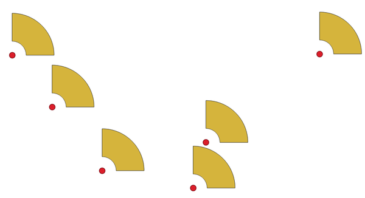
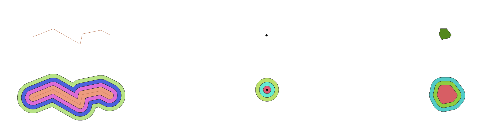
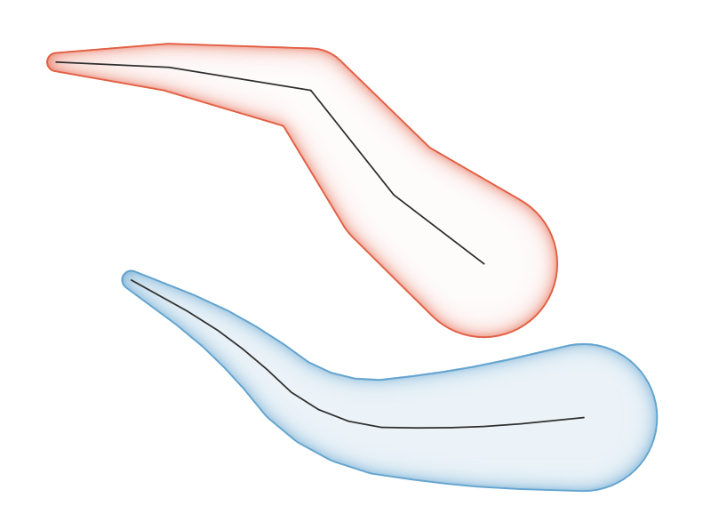

.. only:: html

   |updatedisclaimer|

Vector geometry
===============

.. only:: html

   .. contents::
      :local:
      :depth: 1

.. _qgisexportaddgeometrycolumns:

Add geometry attributes
-----------------------
Computes geometric properties of the features in a vector layer.

It generates a new vector layer with the same content as the input one, but with
additional attributes, containing geometric measurements based on a selected CRS.

The attributes added to the table depend on the geometry type and dimension of
the input layer:

* for **point** layers: X (``xcoord``), Y (``ycoord``), Z (``zcoord``) coordinates
  and/or M value (``mvalue``);
* for **line** layers: ``length`` and, particularly for LineString and CompoundCurve
  geometry type also adds feature's ``sinuosity`` and straight distance (``straightdis``);
* for **polygon** layers: ``perimeter`` and ``area``.

``Default menu``: :menuselection:`Vector --> Geometry Tools`

Parameters
..........
``Input layer`` [vector: any]
  Vector layer in input.

``Calculate using`` [enumeration]
  Calculation parameters to use for the geometric properties.
  Options are:

  * 0 --- Layer CRS
  * 1 --- Project CRS
  * 2 --- Ellipsoidal

  Default: *0*

Outputs
.......

``Added geom info`` [vector: any]
  Copy of the input vector layer with the addition of the geometry fields.

.. _qgisaggregate:

Aggregate
---------
Takes a vector or table layer and creates a new layer by aggregating features based
on a ``group by`` expression.

Features for which ``group by`` expression returns the same value are grouped together.

It is possible to group all source features together using constant value in ``group
by`` parameter, example: NULL.

It is also possible to group features by multiple fields using Array function,
example: Array("Field1", "Field2").

Geometries (if present) are combined into one multipart geometry for each group.
Output attributes are computed depending on each given aggregate definition.

This algorithm allows to use the default aggregation functions of the QGIS Expression
engine.

Parameters
..........

``Input layer`` [vector: any]
  Vector layer in input to aggregate the features from.

``Group by expression`` [tablefield: any]
  Choose the grouping field. If *NULL* all features will be grouped.

  Default: *NULL*

``Aggregates`` [list]
  List of the fields in the output layer with their definitions.

  By default, the embedded table lists all the fields of the source
  layer and allows you to edit them:

  * Click the |newAttribute| button to create a new field.
  * Click |deleteAttribute| to remove a field.
  * Use |arrowUp| and |arrowDown| to change the selected field order.
  * Click |clearText| to reset to the default view.

  For each of the fields you'd like to retrieve information from, you need to
  fill the following options:

  ``Input expression`` [expression]
    Field or expression from the input layer.

  ``Aggregate function`` [enumeration]
    :ref:`Function <aggregates_function>` to use on the input expression
    to return the aggregated value.

    Default: *concatenate* (for string data type), *sum* (for numeric data type)

  ``Delimiter`` [string]
    Text string to separate aggregated values, for example in case of concatenation.

    Default: *,*

  ``Output field name`` [string]
    Name of the aggregated field in the output layer.
    By default input field name is kept.

  ``Type`` [enumeration]
    Data type of the output field.

  ``Length`` [number]
    Length of the output field.

  ``Precision`` [number]
    Precision of the output field.

``Load fields from layer`` [vector: any]
  You can also load the fields from another layer and use these fields for the
  aggregation.

Outputs
.......

``Aggregated`` [vector: any]
  Multigeometry vector layer with the aggregated values.

See also
........
For a  complete description of the aggregates function, refer to the dedicated
:ref:`aggregates_function` chapter.

.. _qgisboundary:

Boundary
---------
Returns the closure of the combinatorial boundary of the input geometries (i.e.
the topological boundary of the geometry).

Only valid for polygon or line layers.

For **polygon geometries** , the boundary consists of all the line strings for
each ring of the polygon.

   Black dash boundary lines of the source polygon layer

For **lines geometries**, the boundaries are the vertices between each features.

.. figure:: img/boundary_lines.png
   :align: center

   Boundary layer for lines. In yellow a selected feature.

Parameters
..........

``Input layer`` [vector: line, polygon]
  Input vector layer.

Outputs
.......

``Boundary`` [vector: point, line]
  Boundary from the input layer (point for line, and line for polygon).

.. _qgisboundingboxes:

Bounding boxes
---------------
Calculates the bounding box (envelope) of each feature in an input layer.
Polygon and line geometries are supported.

.. figure:: img/bounding_box.png
   :align: center

   Black lines represent the bounding boxes of each polygon feature

|checkbox| Allows :ref:`features in-place modification <processing_inplace_edit>`

Parameters
..........

``Input layer`` [vector: line, polygon]
  Input vector layer.

Outputs
.......

``Bounds`` [vector: polygon]
  Bounding boxes of input layer.

See also
........
:ref:`qgisminimumboundinggeometry`

.. _qgisbuffer:

Buffer
------
Computes a buffer area for all the features in an input layer, using a fixed distance.

It is possible to define also a negative distance for polygon input layers: in this
case the buffer will result in a smaller polygon.

   In yellow the buffer of point, line and polygon layer

|checkbox| Allows :ref:`features in-place modification <processing_inplace_edit>`

``Default menu``: :menuselection:`Vector --> Geoprocessing Tools`

Parameters
..........

``Input layer`` [vector: any]
  Input vector layer.

``Distance`` [number |dataDefined|]
  Distance radius of the buffer calculated from the boundary of each feature.
  Moreover you can use the Data Defined button on the right to choose a field
  from which the radius will be calculated: this way you can have different radius
  for each feature (see :ref:`qgisvariabledistancebuffer`).

  Default: *10.0*

``Segments`` [number]
  Controls the number of line segments to use to approximate a quarter circle when
  creating rounded offsets.

  Default: *5*

``End cap style`` [enumeration]
  Controls how line endings are handled in the buffer.
  Options are:

  * 0 --- Round
  * 1 --- Flat
  * 2 --- Square

  Default: *0*

  .. figure:: img/buffer_cap_style.png
     :align: center

     Round, flat and square cap styles

``Join style`` [enumeration]
  Specifies whether round, miter or beveled joins should be used when offsetting
  corners in a line.
  Options are:

  * 0 --- Round
  * 1 --- Miter
  * 2 --- Bevel

  Default: *0*

``Miter limit`` [number]
  Only applicable for miter join styles.

  Default: *2.0*

``Dissolve result`` [boolean]
  Choose to dissolve the final buffer. If chosen each buffer that overlaps with
  another one will be dissolved and an unique feature will be created.

  Default: *False*

  .. figure:: img/buffer_dissolve.png
     :align: center

     Standard and dissolved buffer

Outputs
.......

``Buffer`` [vector: polygon]
  Buffer polygon vector layer.

See also
........
:ref:`qgisvariabledistancebuffer`, :ref:`qgismultiringconstantbuffer`,
:ref:`qgisbufferbym`

.. _qgiscentroids:

Centroids
---------
Creates a new point layer, with points representing the centroid of the geometries
of the input layer.

The centroid can be a single point representing the barycenter (of all parts) of the feature,
so it can be outside the feature borders. It can also be a point on each part of the feature.

The attributes associated to each point in the output layer are the same ones
associated to the original features.

.. figure:: img/centroids.png
   :align: center

   The red stars represent the centroids of each feature of the input layer.

|checkbox| Allows :ref:`features in-place modification <processing_inplace_edit>`

``Default menu``: :menuselection:`Vector --> Geometry Tools`

Parameters
..........

``Input layer`` [vector: any]
  Vector layer in input.

``Create point on surface for each part`` [boolean |dataDefined|]
  If checked a point for each different part of the geometry will be created.

  Default: *False*

Outputs
.......

``Centroids`` [vector: point]
  Points vector layer in output.

See also
........
:ref:`qgispointonsurface`

.. _qgischeckvalidity:

Check validity
--------------
Performs a validity check on the geometries of a vector layer.

The geometries are classified in three groups (valid, invalid and error) and a
vector layer is generated with the features in each of these categories:

* The **valid** layer contains only the valid features (without topological errors).
* The **invalid** layer contains all the invalid features found by the algorithm.
* The **error** layer is the point layer where the invalid features have been found.

The attribute table of each generated vector layer will contain some additional
information (numbers of error found and type of error):

.. figure:: img/check_validity.png
   :align: center

   Left the input layer. Right: in green the valid layer, in orange the invalid layer

``Default menu``: :menuselection:`Vector --> Geometry Tools`

Parameters
..........

``Input layer`` [vector: any]
  Source layer to check.

``Method`` [enumeration]
  Check validity method.

  Options:

  * 0 --- The one selected in digitizing settings
  * 1 --- QGIS
  * 2 --- GEOS

  Default: *2*

Outputs
.......

``Valid output`` [vector: any]
  Vector layer containing copy of the valid features of the source layer.

``Invalid output`` [vector: any]
  Vector layer containing copy of the invalid features of the source layer with
  the field  ``_errors`` listing the summary of the error found.

``Error output`` [vector: point]
  Point layer of the exact position of the validity problems detected with the
  ``message`` field describing the error(s) found.

.. _qgiscollect:

Collect geometries
------------------
Takes a vector layer and collects its geometries into new multipart geometries.

One or more attributes can be specified to collect only geometries belonging to
the same class (having the same value for the specified attributes), alternatively
all geometries can be collected.

All output geometries will be converted to multi geometries, even those with just
a single part. This algorithm does not dissolve overlapping geometries - they will
be collected together without modifying the shape of each geometry part.

See the 'Promote to multipart' or 'Aggregate' algorithms for alternative options.

``Default menu``: :menuselection:`Vector --> Geometry Tools`

Parameters
..........

``Input layer`` [vector: any]
  Vector layer to be transformed.

``Unique ID fields`` [tablefield: any] [list]
  Optional

  Choose one or more attributes to collect the geometries.

Outputs
.......

``Collected`` [vector: any]
  Vector layer with collected geometries.

See also
........
:ref:`qgisaggregate`, :ref:`qgispromotetomulti`

.. _qgisconcavehull:

Concave hull (alpha shapes)
---------------------------
Computes the concave hull of the features in an input point layer.

Parameters
..........
``Input point layer`` [vector: point]
  Point vector layer to calculate the concave hull.

``Threshold`` [number]
  Number from 0 (maximum concave hull) to 1 (convex hull).

  Default: *0.3*

  .. figure:: img/concave_hull_threshold.png
     :align: center

     Different thresholds used (0.3, 0.6, 0.9)

``Allow holes`` [boolean]
  Choose whether to allow holes in the final concave hull.

  Default: *True*

``Split multipart geometry into singlepart geometries`` [boolean]
  Check if you want to have singlepart geometries instead of multipart ones.

  Default: *False*

Outputs
.......
``Concave hull`` [vector: polygon]
  Output concave hull.

See also
........
:ref:`qgisconvexhull`, :ref:`qgisknearestconcavehull`

.. _qgisknearestconcavehull:

Concave hull (k-nearest neighbor)
---------------------------------
This algorithm generates a concave hull polygon from a set of points.
If the input layer is a line or polygon layer, it will use the
vertices.

The number of neighbors to consider determines the concaveness of the
output polygon.
A lower number will result in a concave hull that follows the points very
closely, while a higher number will have a smoother shape.
The minimum number of neighbor points to consider is 3.
A value equal to or greater than the number of points will result in a
convex hull.

If a field is selected, the algorithm will group the features in the
input layer using unique values in that field and generate individual
polygons in the output layer for each group.

Parameters
..........
``Input layer`` [vector: any]
  Vector layer to calculate the concave hull.

``Number of neighboring points to consider`` [number]
  Determines the concaveness of the output polygon.
  A small number will result in a concave hull that follows
  the points very closely, while a high number will make
  the polygon look more like the convex hull (if the number
  is equal to or larger than the number of features, the
  result will be the convex hull).

  Default (and minimum): *3*

``Field`` [tablefield: any]
  Optional

  If specified, one concave hull polygon is generated for each unique
  value of the field (by selecting features using this value).

  Default: *None*

Outputs
.......
``Concave hull`` [vector: polygon]
  Output concave hull.

See also
........
:ref:`qgisconcavehull`

.. _qgisconvertgeometrytype:

Convert geometry type
---------------------
Generates a new layer based on an existing one, with a different type of geometry.

Not all conversions are possible. For instance, a line layer can be converted to
a point layer, but a point layer cannot be converted to a line layer.

Parameters
..........
``Input layer`` [vector: any]
  Input vector layer to transform.

``New geometry type`` [enumeration]
  Geometry type to apply to the output features.
  Options are:

  * 0 --- Centroids
  * 1 --- Nodes
  * 2 --- Linestrings
  * 3 --- Multilinestrings
  * 4 --- Polygons

  .. note:: Conversion types availability depends on the input layer and the
    conversion chosen: e.g. it is not possible to convert a point to a line.

Outputs
.......

``Converted`` [vector: any]
  Converted vector layer depending on the parameters chosen.

See also
........
:ref:`qgispolygonize`, :ref:`qgislinestopolygons`

.. _qgisconvexhull:

Convex hull
-----------
Calculates the convex hull for each feature in an input layer.

See the 'Minimum bounding geometry' algorithm for a convex hull calculation which
covers the whole layer or grouped subsets of features.

   Black lines identify the convex hull for each layer feature

|checkbox| Allows :ref:`features in-place modification <processing_inplace_edit>`

``Default menu``: :menuselection:`Vector --> Geoprocessing Tools`

Parameters
..........
``Input point layer`` [vector: any]
  Point vector layer to calculate the convex hull.

Outputs
.......
``Convex hull`` [vector: polygon]
  Output convex hull.

See also
........
:ref:`qgisminimumboundinggeometry`, :ref:`qgisconcavehull`

.. _qgisextenttolayer:

Create layer from extent
------------------------
Creates a new vector layer that contains a single feature with geometry matching
the extent of the input layer.

It can be used in models to convert a literal extent (``xmin``, ``xmax``, ``ymin``,
``ymax`` format) into a layer which can be used for other algorithms which require
a layer based input.

Parameters
..........

``Extent (xmin, xmax, ymin, ymax)`` [extent]
  Extent to represent.

Outputs
.......

``Extent``
  Layer with a polygon feature representing the input extent.

.. _qgiswedgebuffers:

Create wedge buffers
--------------------
Creates wedge shaped buffers from input points.

   Wedge buffers

The native output from this algorithm are CurvePolygon geometries, but these may
be automatically segmentized to Polygons depending on the output format.

Parameters
..........

``Input layer`` [vector: point]
  Input point vector layer.

``Azimuth (degrees from North)`` [number |dataDefined|]
  Angle (in degrees) as the middle value of the wedge.

``Wedge width (in degrees)`` [number |dataDefined|]
  Width (in degrees) of the buffer. The wedge will extend to half of the angular
  width either side of the azimuth direction.

  .. figure:: img/wedge_buffers_azimuth_width.png
    :align: center

    Azimuth and width values of the wedge buffer

``Outer radius`` [number |dataDefined|]
  The outer *size* (length) of the wedge: the size is meant from the source point
  to the edge of the wedge shape.

``Inner radius`` [number |dataDefined|]
  Optional

  Inner radius value. If 0 the wedge will begin from the source point.

  Default: *0.0*

Outputs
.......

``Buffers`` [vector: polygon]
  Wedge buffer polygon vector layer.

See also
........
:ref:`qgisbuffer`, :ref:`qgisbufferbym`, :ref:`qgistaperedbuffer`

.. _qgisdelaunaytriangulation:

Delaunay triangulation
----------------------
Creates a polygon layer with the delaunay triangulation corresponding to a point
layer.

   Delaunay triangulation on points

``Default menu``: :menuselection:`Vector --> Geometry Tools`

Parameters
..........

``Input layer`` [vector: point]
  Point vector layer to compute the triangulation on.

Outputs
.......
``Delaunay triangulation`` [vector: polygon]
  Resulting polygon layer of delaunay triangulation.

.. _qgisdeleteholes:

Delete holes
------------
Takes a polygon layer and removes holes in polygons. It creates a new vector layer
in which polygons with holes have been replaced by polygons with only their external
ring. Attributes are not modified.

An optional minimum area parameter allows removing only holes which are smaller
than a specified area threshold. Leaving this parameter at ``0.0`` results in all
holes being removed.

.. figure:: img/delete_holes.png
   :align: center

   Before and after the cleaning

|checkbox| Allows :ref:`features in-place modification <processing_inplace_edit>`

Parameters
..........

``Input layer`` [vector: polygon]
  Polygon layer with holes.

``Remove holes with area less than`` [number |dataDefined|]
  Optional

  Only holes with an area less than this threshold will be deleted. If ``0.0`` is
  added, **all** the holes will be deleted.

  Default: *0.0*

Outputs
.......

``Cleaned`` [vector: polygon]
  Vector layer without holes or holes larger than specified area.

.. _qgisdensifygeometries:

Densify by count
----------------
Takes a polygon or line layer and generates a new one in which the geometries have
a larger number of vertices than the original one.

If the geometries have Z or M values present then these will be linearly interpolated
at the added vertices.

The number of new vertices to add to each segment is specified as an input parameter.

   Red points show the vertices before and after the densify

|checkbox| Allows :ref:`features in-place modification <processing_inplace_edit>`

``Default menu``: :menuselection:`Vector --> Geometry Tools`

Parameters
..........

``Input layer`` [vector: line, polygon]
  Polygon or line vector layer to densify.

``Vertices to add`` [number]
  Number of vertices to add to each segment.

  Default: *1*

Outputs
.......

``Densified`` [vector: line, polygon]
  Densified layer with vertices added.

See also
........
:ref:`qgisdensifygeometriesgivenaninterval`

.. _qgisdensifygeometriesgivenaninterval:

Densify by interval
-------------------
Takes a polygon or line layer and generates a new one in which the geometries have
a larger number of vertices than the original one.

The geometries are densified by adding regularly placed extra vertices inside each
segment so that the maximum distance between any two vertices does not exceed the
specified distance.

If the geometries have Z or M values present then these will be linearly interpolated
at the added vertices.

**Example**

Specifying a distance 3 would cause the segment ``[0 0] -> [10 0]`` to be converted
to ``[0 0] -> [2.5 0] -> [5 0] -> [7.5 0] -> [10 0]``, since 3 extra vertices are required
on the segment and spacing these at 2.5 increments allows them to be evenly spaced
over the segment.

.. figure:: img/densify_geometry_interval.png
   :align: center

   Densify geometry at a given interval

|checkbox| Allows :ref:`features in-place modification <processing_inplace_edit>`

Parameters
..........

``Input layer`` [vector: line, polygon]
  Polygon or line vector layer to densify.

``Interval between vertices to add`` [number]
  Maximum distance between two consecutive vertices.

  Default: *1.0*

Outputs
.......

``Densified`` [vector: line, polygon]
  Densified layer with vertices added using the specified interval.

See also
........
:ref:`qgisdensifygeometries`

.. _qgisdissolve:

Dissolve
--------
Takes a vector layer and combines its features into new features.
One or more attributes can be specified to dissolve features belonging to the
same class (having the same value for the specified attributes), alternatively
all features can be dissolved into a single one.

All output geometries will be converted to multi geometries. In case the input is
a polygon layer, common boundaries of adjacent polygons being dissolved will get
erased.

The resulting attribute table will have the same fields as the input layer.
The values in the output layer's fields are the ones of the first input feature
that happens to be processed.

.. figure:: img/dissolve.png
   :align: center

   Dissolve the polygon layer on a common attribute

``Default menu``: :menuselection:`Vector --> Geoprocessing Tools`

Parameters
..........

``Input layer`` [vector: any]
  Vector layer to dissolve.

``Dissolve field(s)`` [tablefield: any] [list]
  Optional

  Features having the same value for the selected field(s) will be replaced
  with a single one and their geometries are merged.

  If no field is provided then all the features are dissolved in a single feature.

Outputs
.......

``Dissolved`` [vector: any]
  Multi geometry type layer with merged geometries but non aggregated values in fields.

.. _qgissetzfromraster:

Drape (set Z value from raster)
-------------------------------
Uses values sampled from a band within a raster layer to set the Z value for every
overlapping vertex in the feature geometry. The raster values can optionally be
scaled by a preset amount.

If Z values already exist in the layer, they will be overwritten with the new value.
If no Z values exist, the geometry will be upgraded to include the Z dimension.

Parameters
..........
``Input layer`` [vector: any]
  Input vector layer to set the Z values to.

``Raster layer`` [raster]
  Raster layer to take the Z values from.

``Band number`` [raster band]
  The raster band to take the Z values from if the raster is multiband.

``Value for nodata or non-intersecting vertices`` [number |dataDefined|]
  Value to use in case the vertex does not intersect (a valid pixel of) the raster.

  Default: *0*

``Scale`` [number |dataDefined|]
  Scaling value: the band values are multiplied by this value.

  Default: *1.0*

Outputs
.......

``Updated`` [vector: any]
  A vector layer with geometries that have Z values extracted from the provided raster layer.

See also
........
:ref:`qgissetmfromraster`, :ref:`qgissetzvalue`

.. _qgisdropmzvalues:

Drop m/z values
---------------
Removes any M (measure) or Z (altitude) values from input geometries.

Parameters
..........
``Input layer`` [vector: any]
  Input vector layer from which M and/or Z values will be dropped.

``Drop M Values`` [boolean]
  Removes the M values from the geometries.

  Default: *False*

``Drop Z Values`` [boolean]
  Removes the Z values from the geometries.

  Default: *False*

Outputs
.......
``Z/M Dropped`` [vector: any]
  A vector layer that is identical to the input layer, except that M and/or Z values have been removed from its geometries.

See also
........
:ref:`qgissetmvalue`, :ref:`qgissetzvalue`

.. _qgiseliminateselectedpolygons:

Eliminate selected polygons
---------------------------
Combines selected polygons of the input layer with certain adjacent polygons by
erasing their common boundary. The adjacent polygon can be either the one with
the largest or smallest area or the one sharing the largest common boundary with
the polygon to be eliminated.

Eliminate is normally used to get rid of sliver polygons, i.e. tiny polygons that
are a result of polygon intersection processes where boundaries of the inputs are
similar but not identical.

``Default menu``: :menuselection:`Vector --> Geoprocessing Tools`

Parameters
..........
``Input layer`` [vector: polygon]
  Input polygon vector layer to clean.

``Merge selection with the neighboring polygon with the`` [enumeration]
  Choose the parameter to use in order to get rid of the selected polygons:

  * Largest Area
  * Smallest Area
  * Largest Common Boundary

Outputs
.......
``Eliminated`` [vector: polygon]
  Cleaned vector layer as result of the parameters chosen.

.. _qgisexplodelines:

Explode lines
-------------
Takes a lines layer and creates a new one in which each line layer is replaced by
a set of lines representing the segments in the original line.

Each line in the resulting layer contains only a start and an end point, with no
intermediate vertices between them.

   The original line layer and the exploded one

|checkbox| Allows :ref:`features in-place modification <processing_inplace_edit>`

Parameters
..........
``Input layer`` [vector: line]
  Line vector layer in input to explode.

Outputs
.......

``Exploded`` [vector: line]
  Output vector line with features representing each segment of the input layer.

.. _qgisextendlines:

Extend lines
------------
Extends line geometry by a specified amount at the start and end of the line.

Lines are extended using the bearing of the first and last segment in the line.

   The red dashes represent the initial and final extension of the original layer

|checkbox| Allows :ref:`features in-place modification <processing_inplace_edit>`

Parameters
..........

``Input layer`` [vector: line]
  Line vector layer to extend.

``Start distance`` [number |dataDefined|]
  Distance by which to extend the first segment of the line (starting point).

``End distance`` [number |dataDefined|]
  Distance by which to extend the last segment of the line (ending point).

Outputs
.......

``Extended`` [vector: line]
  Extended vector line layer.

See also
........
:ref:`qgislinesubstring`

.. _qgisextractspecificvertices:

Extract specific vertices
-------------------------
Takes a line or polygon layer and generates a point layer with points representing
specific vertices in the input lines or polygons.

For instance, this algorithm can be used to extract the first or last vertices in
the geometry. The attributes associated to each point are the same ones associated
to the line or polygon that the point belongs to.

The vertex indices parameter accepts a comma separated string specifying the indices
of the vertices to extract. The first vertex corresponds to an index of 0, the second
vertex has an index of 1, etc. Negative indices can be used to find vertices at the
end of the geometry, e.g., an index of -1 corresponds to the last vertex, -2
corresponds to the second last vertex, etc.

Additional fields are added to the vertices indicating the specific vertex position
(e.g., 0, -1, etc), the original vertex index, the vertex’s part and its index within
the part (as well as its ring for polygons), distance along the original geometry
and bisector angle of vertex for the original geometry.

Parameters
..........
``Input layer`` [vector: line, polygon]
  Vector layer in input to extract the vertices from.

``Vertex indices`` [number]
  Type the indices of the vertices to extract. The algorithm accepts comma separated
  values for many vertices to extract (e.g. ``-2, 3, 5, 7``).

  Default: *0*

Outputs
.......

``Vertices`` [vector: point]
  Point layer with features representing the specific vertices in the input layer.

.. _qgisextractvertices:

Extract vertices
----------------
Takes a line or polygon layer and generates a point layer with points representing
the vertices in the input lines or polygons.

The attributes associated to each point are the same ones associated to the line
or polygon that the point belongs to.

Additional fields are added to the vertices indicating the vertex index (beginning at 0),
the feature’s part and its index within the part (as well as its ring for polygons),
distance along original geometry and bisector angle of vertex for original geometry.

.. figure:: img/extract_nodes.png
   :align: center

   Vertices extracted for line and polygon layer

``Default menu``: :menuselection:`Vector --> Geometry Tools`

Parameters
..........

``Input layer`` [vector: any]
  Vector layer in input to extract the vertices from.

Outputs
.......

``Vertices`` [vector: point]
  Point layer with features representing all the vertices in the input layer.

.. _qgisfilterverticesbym:

Filter vertices by M value
--------------------------
Filters away vertices based on their M value, returning geometries with only vertex
points that have a M value greater than or equal to the specified minimum value and/or
less than or equal to the maximum value.

If the minimum value is not specified then only the maximum value is tested, and
similarly if the maximum value is not specified then only the minimum value is tested.

.. figure:: img/filter_zm.png
   :align: center

   The red line represents the black line with only vertices whose M value is <=10.

.. note:: Depending on the input geometry attributes and the filters used,
  the resultant geometries created by this algorithm may no longer be valid.

Parameters
..........

``Input layer`` [vector: line, polygon]
  Vector layer to remove vertices from.

``Minimum`` [number |dataDefined|]
  Optional

  Minimum M value allowed to keep a vertex.

  Default: *Not set*

``Maximum`` [number |dataDefined|]
  Optional

  Maximum M value allowed to keep a vertex.

  Default: *Not set*

Outputs
.......

``Filtered`` [vector: line, polygon]
  Vector layer of the features with only the filtered vertices.

See also
........
:ref:`qgisfilterverticesbyz`, :ref:`qgisextractvertices`

.. _qgisfilterverticesbyz:

Filter vertices by Z value
--------------------------
Filters away vertices based on their Z value, returning geometries with only vertex
points that have a Z value greater than or equal to the specified minimum value and/or
less than or equal to the maximum value.

If the minimum value is not specified then only the maximum value is tested, and
similarly if the maximum value is not specified then only the minimum value is tested.

.. figure:: img/filter_zm.png
   :align: center

   The red line represents the black line with only vertices whose Z value is <=10.

.. note:: Depending on the input geometry attributes and the filters used,
  the resultant geometries created by this algorithm may no longer be valid.
  You may need to run the :ref:`qgisfixgeometries` algorithm to ensure their validity.

Parameters
..........

``Input layer`` [vector: line, polygon]
  Vector layer to remove vertices from.

``Minimum`` [number |dataDefined|]
  Optional

  Minimum Z value allowed to keep a vertex.

  Default: *Not set*

``Maximum`` [number |dataDefined|]
  Optional

  Maximum Z value allowed to keep a vertex.

  Default: *Not set*

Outputs
.......

``Filtered`` [vector: line, polygon]
  Vector layer of the features with only the filtered vertices.

See also
........
:ref:`qgisfilterverticesbym`, :ref:`qgisextractvertices`

.. _qgisfixgeometries:

Fix geometries
--------------
Attempts to create a valid representation of a given invalid geometry
without losing any of the input vertices. Already valid geometries are returned
without further intervention. Always outputs multi-geometry layer.

.. note:: M values will be dropped from the output.

|checkbox| Allows :ref:`features in-place modification <processing_inplace_edit>`

Parameters
..........

``Input layer`` [vector: line, polygon]
  Polygon or vector layer in input.

Outputs
.......

``Fixed geometries`` [vector: line, polygon]
  Layer with fixed geometries.

.. _qgisantimeridiansplit:

Geodesic line split at antimeridian |36|
----------------------------------------

This algorithm splits a line into multiple geodesic segments, whenever the line
crosses the antimeridian (±180 degrees longitude).

Splitting at the antimeridian helps the visual display of the lines in some
projections. The returned geometry will always be a multi-part geometry.

Whenever line segments in the input geometry cross the antimeridian, they will
be split into two segments, with the latitude of the breakpoint being determined
using a geodesic line connecting the points either side of this segment. The
current project ellipsoid setting will be used when calculating this breakpoint.

If the input geometry contains M or Z values, these will be linearly interpolated
for the new vertices created at the antimeridian.

Parameters
..........
``Input layer`` [vector: line]
  Vector input line layer

Outputs
.......

``Split`` [vector: line]
  Vector line layer resulting from geodesic split.

.. _qgisgeometrybyexpression:

Geometry by expression
----------------------
Updates existing geometries (or creates new geometries) for input features by use
of a QGIS expression.

This allows complex geometry modifications which can utilize all the flexibility
of the QGIS expression engine to manipulate and create geometries for output features.

For help with QGIS expression functions, see the inbuilt help for specific functions
which is available in the :ref:`expression builder <vector_expressions>`.

Parameters
..........
``Input layer`` [vector: any]
  Vector input layer.

``Output geometry type`` [enumeration]
  The output geometry strongly depends on the expression you will choose: for
  instance, if you want to create a buffer then the geometry type has to be
  a polygon.

  Available options are:

  * 0 --- Polygon
  * 1 --- Line
  * 2 --- Point

  Default: *0*

``Output geometry has z dimension`` [boolean]
  Choose if the output geometry should have the Z dimension.

  Default: *False*

``Output geometry has m values`` [boolean]
  Choose if the output geometry should have the M dimension.

  Default: *False*

``Geometry expression`` [expression]
  Add the geometry expression you want to use. You can use the button to open
  the Expression Dialog: the dialog has a list of all the usable expression
  together with their help and guide.

  Default: *$geometry*

Outputs
.......

``Modified geometry`` [vector: any]
  Vector layer resulting from the expression added.

.. _qgisinterpolatepoint:

Interpolate point on line
-------------------------
Creates a point geometry interpolated at a set distance along line or curve
geometries.

Z and M values are linearly interpolated from existing values.

If a multipart geometry is encountered, only the first part is considered when
calculating the substring.

If the specified distance is greater than the input feature's length,
the resultant feature will have a null geometry.

   Interpolated point at 500m of the beginning of the line

Parameters
..........

``Input layer`` [vector: line, polygon]
  Line or polygon vector layer  from which to interpolate point placement.

``Distance`` [number |dataDefined|]
  Distance from the beginning of the line.

Outputs
.......

``Interpolated points`` [vector: point]
  Point vector layer with features at a set distance along the line or polygon boundary.

See also
........
:ref:`qgispointsalonglines`

.. _qgiskeepnbiggestparts:

Keep n biggest parts
--------------------
Takes a layer with polygons or multipolygons and returns a new layer in which
only the *n* largest polygons of each multipolygon feature are kept.
If a feature has *n* or fewer parts, the feature will just be copied.

.. figure:: img/n_biggest.png
   :align: center

   Clockwise from left-up: original multipart feature, one, two and three biggest parts kept

Parameters
..........

``Polygons`` [vector: polygon]
  Input polygon layer.

``To keep`` [number]
  Choose how many parts to keep. If 1 is selected, only the
  biggest part of the feature will be kept.

  Default: *1*

Outputs
.......

``Biggest parts`` [vector: polygon]
  Resulting polygon layer with the n biggest parts of each feature.

.. _qgislinesubstring:

Line substring
--------------
Returns the portion of a line (or curve) which falls between the specified start
and end distances (measured from the beginning of the line).

Z and M values are linearly interpolated from existing values.

If a multipart geometry is encountered, only the first part is considered when
calculating the substring.

   Substring line with starting distance set at 0 meters and the ending distance at 250 meters.

|checkbox| Allows :ref:`features in-place modification <processing_inplace_edit>`

Parameters
..........

``Input layer`` [vector: line]
  Line vector layer to extract the substring from.

``Start distance`` [number |dataDefined|]
  Distance along the input line, representing the start point of the output feature.

``End distance`` [number |dataDefined|]
  Distance along the input line, representing the end point of the output feature.

Outputs
.......

``Substring`` [vector: line]
  Vector line layer of the substring

See also
........
:ref:`qgisextendlines`

.. _qgislinestopolygons:

Lines to polygon
----------------
Generates a polygon layer using as polygon rings the lines from an input line layer.

The attribute table of the output layer is the same as the one from of the input
line layer.

``Default menu``: :menuselection:`Vector --> Geometry Tools`

Parameters
..........

``Input layer`` [vector: line]
  Line vector layer to convert.

Outputs
.......

``Polygons`` [vector: polygon]
  Polygon vector layer from the line input vector layer.

.. _qgismergelines:

Merge lines
-----------
Joins all connected parts of MultiLineString geometries into single LineString
geometries.

If any parts of the input MultiLineString geometries are not connected, the
resultant geometry will be a MultiLineString containing any lines which could be
merged and any non-connected line parts.

|checkbox| Allows :ref:`features in-place modification <processing_inplace_edit>`

Parameters
..........

``Input layer`` [vector: line]
  MultiLineString vector layer.

Outputs
.......

``Merged`` [vector: lines]
  Single LineString vector layer.

.. _qgisminimumboundinggeometry:

Minimum bounding geometry
-------------------------
Creates geometries which enclose the features from an input layer.

Parameters
..........

``Input layer`` [vector: any]
  Input vector layer.

``Field`` [tablefield: any]
  Optional

  Features can be grouped by a field. If set, this causes the output
  layer to contain one feature per grouped value with a minimal geometry covering
  only the features with matching values.

``Geometry type`` [enumeration]
  Numerous enclosing geometry types are supported:

  * 0 --- Envelope (Bounding Box)
  * 1 --- Minimum Oriented Rectangle
  * 2 --- Minimum Enclosing Circle
  * 3 --- Convex Hull

  Default: *0*

  .. figure:: img/minimum_bounding.png
     :align: center

     Clockwise from left-up: envelopes, oriented rectangle, circle, convex hull

Outputs
.......

``Bounding geometry`` [vector: polygon]
  Bounding polygon layer.

.. _qgisminimumenclosingcircle:

Minimum enclosing circles
-------------------------
Calculates the minimum enclosing circle which covers each feature in an input layer.

   Enclosing circles for each feature

|checkbox| Allows :ref:`features in-place modification <processing_inplace_edit>`

Parameters
..........

``Input layer`` [vector: any]
  Input vector layer.

``Number of segment in circles`` [number]
  Choose the number of segment for each circle.

  Default: *72*

Outputs
.......

``Minimum enclosing circles`` [vector: polygon]
  Enclosing circles for each polygon feature.

See also
........
:ref:`qgisminimumboundinggeometry`

.. _qgismultiringconstantbuffer:

Multi-ring buffer (constant distance)
-------------------------------------
Computes multi-ring (*donuts*) buffer for all the features in an input layer,
using a fixed or dynamic distance and ring numbers.

   Multi-ring buffer for line, point and polygon layer

|checkbox| Allows :ref:`features in-place modification <processing_inplace_edit>`

Parameters
..........

``Input layer`` [vector: any]
  Input vector layer.

``Number of rings`` [number |dataDefined|]
  Total number of rings that the buffer must have. It can be a unique value (same
  ring number for all the features) or it can be taken from features data (different
  ring number depending on the feature values).

``Distance between rings`` [number |dataDefined|]
  Distance between the single rings. It can be a unique value (same distance for
  all the features) or it can be taken from features data (different distance
  depending on the feature values).

Outputs
.......

``Multi-ring buffer (constant distance)``
  Multi ring buffer polygon vector layer.

See also
........
:ref:`qgisbuffer`, :ref:`qgisvariabledistancebuffer`, :ref:`qgisrectanglesovalsdiamondsfixed`,
:ref:`qgisrectanglesovalsdiamondsvariable`, :ref:`qgissinglesidedbuffer`

.. _qgismultiparttosingleparts:

Multipart to singleparts
------------------------
Splits the multipart input layers into single features.

The attributes of the output layers are the same of the original ones but divided
into single features.

   Left the multipart source layer and right the single part output result

|checkbox| Allows :ref:`features in-place modification <processing_inplace_edit>`

``Default menu``: :menuselection:`Vector --> Geometry Tools`

Parameters
..........

``Input layer`` [vector: any]
  Multipart input layer.

Outputs
.......

``Single parts`` [vector: any]
  Singlepart layer in output with updated attribute table.

See also
........
:ref:`qgiscollect`, :ref:`qgispromotetomulti`

.. _qgisoffsetline:

Offset lines
------------
Offsets lines by a specified distance. Positive distances will offset lines to
the left, and negative distances will offset them to the right.

.. figure:: img/offset_lines.png
   :align: center

   In blue the source layer, in red the offset one

|checkbox| Allows :ref:`features in-place modification <processing_inplace_edit>`

Parameters
..........

``Input layer`` [vector: line]
  Line vector layer in input to elaborate the offset on.

``Distance`` [number |dataDefined|]
  Distance of the offset.

  Default: *10.0*

``Segment`` [number]
  Number of line segments to use to approximate a quarter circle when creating
  rounded offsets.

  Default: *8*

``Join style`` [enumeration]
  Specify whether round, miter or beveled joins should be used when offsetting
  corners in a line.
  Options are:

  * 0 --- Round
  * 1 --- Miter
  * 2 --- Bevel

  Default: *0*

``Miter limit`` [number]
  Only applicable for mitered join styles, and controls the maximum distance from
  the offset curve to use when creating a mitered join.

  Default: *2.0*

Outputs
.......

``Offset`` [vector: line]
  Offset line layer.

See also
........
:ref:`qgisarrayoffsetlines`, :ref:`qgistranslategeometry`

.. _qgisorientedminimumboundingbox:

Oriented minimum bounding box
-----------------------------
Calculates the minimum area rotated rectangle which covers each feature in an input layer.

.. figure:: img/oriented_minimum_bounding_box.png
   :align: center

   Oriented minimum bounding box

|checkbox| Allows :ref:`features in-place modification <processing_inplace_edit>`

Parameters
..........

``Input layer`` [vector: any]
  Input vector layer.

Outputs
.......

``Bounding boxes`` [vector: polygon]
  Oriented minimum bounding boxes for each polygon feature.

See also
........
:ref:`qgisminimumboundinggeometry`

.. _qgisorthogonalize:

Orthogonalize
-------------
Takes a line or polygon layer and attempts to orthogonalize all the geometries
in the layer. This process shifts the vertices in the geometries to try to make every
angle in the geometry either a right angle or a straight line.

   In blue the source layer while the red line is the orthogonalized result

|checkbox| Allows :ref:`features in-place modification <processing_inplace_edit>`

Parameters
..........

``Input layer`` [vector: line, polygon]
  Input vector layer.

``Maximum angle tolerance (degrees)`` [number]
  Specify the maximum deviation from a right angle or straight line a vertex can
  have for it to be adjusted. Smaller tolerances mean that only vertices which are
  already closer to right angles will be adjusted, and larger tolerances mean
  that vertices which deviate further from right angles will also be adjusted.

``Maximum algorithm iterations`` [number]
  Setting a larger number for the maximum iterations will result in a more
  orthogonal geometry at the cost of extra processing time.

Outputs
.......

``Orthogonalized`` [vector: line, polygon]
  Final layer with angles adjusted depending on the parameters chosen.

.. _qgispointonsurface:

Point on surface
----------------
Returns a point guaranteed to lie on the surface of a geometry.

|checkbox| Allows :ref:`features in-place modification <processing_inplace_edit>`

Parameters
..........

``Input layer`` [vector: any]
  Input vector layer.

``Create point on surface for each part`` [boolean |dataDefined|]
  If checked a point for each different part of the geometry will be created.

  Default: *False*

Outputs
.......

``Point`` [vector: point]
  Point vector layer.

See also
........
:ref:`qgiscentroids`

.. _qgispointsalonglines:

Points along geometry
---------------------
Creates points at regular intervals along line or polygon geometries. Created
points will have new attributes added for the distance along the geometry and the
angle of the line at the point.

An optional start and end offset can be specified, which controls how far from
the start and end of the geometry the points should be created.

   Points created along the source line layer

Parameters
..........

``Input layer`` [vector: line, polygon]
  Input vector layer.

``Distance`` [number]
  Distance between two consecutive points along a geometry.

  Default: *100*

``Start offset`` [number]
  Distance from the beginning of the input line, representing the position of
  the first point.

  Default: *0*

``End offset`` [number]
  Distance from the end of the input line, representing the position beyond which
  no point feature shoud be created.

  Default: *0*

Outputs
.......

``Points`` [vector: point]
  Point vector layer with features placed along the line or polygon boundary.

See also
........
:ref:`qgisinterpolatepoint`

.. _qgispointsdisplacement:

Points displacement
-------------------
Given a distance of proximity, identifies nearby point features and radially
distributes them over a circle whose center represents their barycenter.
A convenient tool to scatter overlaid features.

Parameters
..........

``Input layer`` [vector: point]
  Input point vector layer.

``Minimum distance to other points`` [number]
  Distance below which point features are considered close.
  Close features are distributed altogether.

  Default: *1.0*

``Displacement distance`` [number]
  Radius of the circle on which close features are placed.

  Default: *1.0*

``Horizontal distribution for two point case`` [boolean]
  When only two points are identified as close, aligns them horizontally
  on the circle instead of vertically.

  Default: *False*

Outputs
.......

``Displaced`` [vector: point]
  Point vector layer with displaced features.

.. _qgispointtolayer:

Point to layer
--------------

This algorithm creates a new vector layer that contains a single feature with
geometry matching a point parameter.
It can be used in models to convert a point into a layer which can be used
for other algorithms which require a layer based input.

Parameters
..........

``Point`` [coordinates]
  Input point (example: `397254,6214446 [EPSG:32632]`).

Outputs
.......

``Point`` [vector: point]
  Point vector layer containing the input point.

.. _qgispoleofinaccessibility:

Pole of inaccessibility
-----------------------
Calculates the pole of inaccessibility for a polygon layer, which is the most
distant internal point from the boundary of the surface.

This algorithm uses the 'polylabel' algorithm (Vladimir Agafonkin, 2016), which
is an iterative approach guaranteed to find the true pole of inaccessibility within
a specified tolerance. A more precise tolerance (lower value) requires more iterations
and will take longer to calculate.

The distance from the calculated pole to the polygon boundary will be stored as
a new attribute in the output layer.

.. figure:: img/pole_inaccessibility.png
   :align: center

   Pole of inaccessibility

Parameters
..........

``Input layer`` [vector: polygon]
  Input polygon vector layer.

``Tolerance`` [number]
  Set the tolerance for the calculation.

  Default: *1.0*

Outputs
.......

``Point`` [vector: point]
  Point as pole of inaccessibility for the source polygon vector layer.

.. _qgispolygonize:

Polygonize
----------
Creates a polygon layer whose features boundaries are generated from a **closed**
line layer features.

   The yellow polygons generated from the closed lines

.. note:: The line layer must have closed shapes in order to be transformed into
  a polygon.

Parameters
..........

``Input layer`` [vector: line]
  Input line vector layer.

``Keep table structure of line layer`` [boolean]
  Optional

  Check to copy the original attribute of the line layer.

  Default: *False*

Outputs
.......

``Polygons from lines`` [vector: polygon]
  Vector layer with polygonized features.

.. _qgispolygonstolines:

Polygons to lines
-----------------
Takes a polygon layer and creates a line layer, with lines representing the boundaries
of the polygons in the input layer.

.. figure:: img/polygon_to_lines.png
   :align: center

   Black lines as the result of the algorithm

``Default menu``: :menuselection:`Vector --> Geometry Tools`

Parameters
..........

``Input layer`` [vector: polygon]
  Input polygon vector layer.

Outputs
.......

``Lines`` [vector: line]
  Lines from the polygon layer.

.. _qgisprojectpointcartesian:

Project points (Cartesian)
--------------------------
Projects point geometries by a specified distance and bearing (azimuth), creating
a new point layer with the projected points.

|checkbox| Allows :ref:`features in-place modification <processing_inplace_edit>`

Parameters
..........

``Input layer`` [vector: point]
  Point vector layer to project.

``Bearing (degrees from North)`` [number |dataDefined|]
  Clockwise angle starting from North, in degree (°) unit.

  Default: *0.0*

``Distance`` [number |dataDefined|]
  Distance to offset geometries, in layer units.

  Default: *1.0*

Outputs
.......

``Projected`` [vector: point]
  Projected layer at given degrees and distance.

.. _qgispromotetomulti:

Promote to multipart
--------------------
Takes a vector layer with singlepart geometries and generates a new one in which
all geometries are multipart.

Input features which are already multipart features will remain unchanged.

This algorithm can be used to force geometries to multipart types in order to be
compatible with data providers that require multipart features.

|checkbox| Allows :ref:`features in-place modification <processing_inplace_edit>`

Parameters
..........

``Input layer`` [vector: any]
  Input vector layer.

Outputs
.......

``Multiparts`` [vector: any]
  Multiparts vector layer.

See also
........
:ref:`qgisaggregate`, :ref:`qgiscollect`

.. _qgisrectanglesovalsdiamondsfixed:

Rectangles, ovals, diamonds (fixed)
-----------------------------------
Creates a buffer area for all the features in an input layer with different shape
choice.

Parameters can vary depending on the shape chosen.

.. figure:: img/rectangles_ovals_diamond.png
   :align: center

   Different buffer shapes

Parameters
..........

``Input layer`` [vector: point]
  Input point vector layer.

``Buffer shape`` [enumeration]
  Different shapes available:

  * 0 --- Rectangles
  * 1 --- Ovals
  * 2 --- Diamonds

  Default: *0*

``Width`` [number]
  Width of the buffer shape.

  Default: *1.0*

``Height`` [number]
  Height of the buffer shape.

  Default: *1.0*

``Rotation`` [number]
  Optional

  Rotation of the buffer shape.

  Default: *0.0*

``Number of segment`` [number]
  How many segment should have the buffer shape.

  Default: *36*

Outputs
.......

``Output`` [vector: polygon]
  Buffer shape in output.

See also
........
:ref:`qgisrectanglesovalsdiamondsvariable`

.. _qgisrectanglesovalsdiamondsvariable:

Rectangles, ovals, diamonds (variable)
--------------------------------------
Creates a buffer area for all the features in an input layer with different shape
choice.

Buffer shape parameters are specified through attribute of the input layer.

.. figure:: img/rectangles_ovals_diamond_variable.png
   :align: center

   Different buffer shapes with different parameters

Parameters
..........

``Input layer`` [vector: point]
  Input point vector layer.

``Buffer shape`` [enumeration]
  Different shape available:

  * 0 --- Rectangles
  * 1 --- Ovals
  * 2 --- Diamonds

  Default: *0*

``Width`` [tablefield: numeric]
  Width of the buffer shape.

  Default: *1.0*

``Height`` [tablefield: numeric]
  Height of the buffer shape.

  Default: *1.0*

``Rotation`` [tablefield: numeric]
  Optional

  Rotation of the buffer shape.

  Default: *0.0*

``Number of segment`` [number]
  How many segment should have the buffer shape.

  Default: *36*

Outputs
.......

``Output`` [vector: polygon]
  Buffer shape in output.

See also
........
:ref:`qgisrectanglesovalsdiamondsfixed`

.. _qgisremoveduplicatevertices:

Remove duplicate vertices
-------------------------
Removes duplicate vertices from features, wherever removing the vertices does not
result in a degenerate geometry.

The tolerance parameter specifies the tolerance for coordinates when determining
whether vertices are identical.

By default, Z values are not considered when detecting duplicate vertices.
E.g. two vertices with the same X and Y coordinate but different Z values will still
be considered duplicate and one will be removed. If the Use Z Value parameter is true,
then the Z values are also tested and vertices with the same X and Y but different Z
will be maintained.

.. note:: Duplicate vertices are not tested between different parts of a multipart
  geometry, e.g. a multipoint geometry with overlapping points will not be changed by
  this method.

|checkbox| Allows :ref:`features in-place modification <processing_inplace_edit>`

Parameters
..........

``Input layer`` [vector: any]
  Input vector layer with duplicate vertices.

``Tolerance`` [number |dataDefined|]
  Vertices closer than the specified distance are considered duplicates.

  Default:*0.000001*

``Use Z value`` [boolean |dataDefined|]
  Allows to consider the Z coordinate when detecting duplicate vertices ie two points
  at the same X,Y coordinate but with different Z value are not set as duplicates.

  Default: *False*

Outputs
.......

``Cleaned`` [vector: any]
  Vector layer without duplicate vertices.

.. _qgisremovenullgeometries:

Remove null geometries
----------------------
Removes any features which do not have a geometry from a vector layer.

All other features will be copied unchanged.

The features with null geometries can be saved to a separate layer.

Parameters
..........
``Input layer`` [vector: any]
  Input vector layer with NULL geometries.

Outputs
.......

``Non null geometries`` [vector: any]
  Vector layer without NULL geometries.

``Null geometries`` [vector: any]
  Vector layer with only NULL geometries.

.. _qgisreverselinedirection:

Reverse line direction
----------------------
Inverts the direction of a line layer.

.. figure:: img/reverse_line.png
   :align: center

   Before and after the direction inversion

|checkbox| Allows :ref:`features in-place modification <processing_inplace_edit>`

Parameters
..........

``Input layer`` [vector: line]
  Input line vector layer to invert the direction.

Outputs
.......

``Reversed`` [vector: line]
  Inverted line vector layer.

.. _qgisrotatefeatures:

Rotate
------
Rotates feature geometries by the specified angle clockwise.
The rotation occurs around each feature's centroid, or optionally
around a unique preset point.

|checkbox| Allows :ref:`features in-place modification <processing_inplace_edit>`

Parameters
..........

``Input layer`` [vector: any]
  Vector layer in input.

``Rotation (degrees clockwise)`` [number |dataDefined|]
  Angle of the rotation in degrees.

  Default: *0.0*

``Rotation anchor point (x, y)`` [point]
  Optional

  X,Y coordinates of the point to rotate the features around.
  If not set the rotation occurs around each feature's centroid.

Outputs
.......

``Rotated`` [vector: any]
  Vector layer with rotated geometries.

.. _qgissegmentizebymaxangle:

Segmentize by maximum angle
---------------------------
Segmentizes a geometry by converting curved sections to linear sections.

The segmentization is performed by specifying the maximum allowed radius angle
between vertices on the straightened geometry (e.g the angle of the arc created
from the original arc center to consecutive output vertices on the linearized
geometry).
Non-curved geometries will be retained without change.

Parameters
..........

``Input layer`` [vector: line, polygon]
  Vector layer in input.

``Maximum angle between vertices (degrees)`` [number |dataDefined|]
  Maximum allowed radius angle between vertices on the straightened geometry.

  Default: *5.0*

Outputs
.......

``Segmentized`` [vector: line, polygon]
  Vector layer with segmentized geometries.

See also
........
:ref:`qgissegmentizebymaxdistance`, :ref:`qgissimplifygeometries`, :ref:`qgissmoothgeometry`

.. _qgissegmentizebymaxdistance:

Segmentize by maximum distance
------------------------------
Segmentizes a geometry by converting curved sections to linear sections.

The segmentization is performed by specifying the maximum allowed offset
distance between the original curve and the segmentized representation.
Non-curved geometries will be retained without change.

Parameters
..........

``Input layer`` [vector: line, polygon]
  Vector layer in input.

``Maximum offset distance`` [number |dataDefined|]
  Maximum allowed offset distance between the original curve and the segmentized
  representation, in the layer units.

  Default: *1.0*

Outputs
.......

``Segmentized`` [vector: line, polygon]
  Vector layer with segmentized geometries.

See also
........
:ref:`qgissegmentizebymaxangle`, :ref:`qgissimplifygeometries`, :ref:`qgissmoothgeometry`

.. _qgissetmvalue:

Set M value
-----------
Sets the M value for geometries in a layer.

If M values already exist in the layer, they will be overwritten with the new value.
If no M values exist, the geometry will be upgraded to include M values and the
specified value used as the initial M value for all geometries.

.. tip:: Use the |identify|:sup:`Identify Features` button to check the added M value:
 the results are available in the :guilabel:`Identify Results` dialog.

Parameters
..........

``Input layer`` [vector: any]
  Input vector layer.

``M Value`` [number |dataDefined|]
  New M value to assign to the features.

  Default: *0.0*

Outputs
.......

``M Added`` [vector: any]
  Vector layer in output with M value.

See also
........
:ref:`qgissetmfromraster`, :ref:`qgissetzvalue`, :ref:`qgisdropmzvalues`

.. _qgissetmfromraster:

Set M value from raster
-----------------------

Uses values sampled from a band within a raster layer to set the M value for every
overlapping vertex in the feature geometry. The raster values can optionally be
scaled by a preset amount.

If M values already exist in the layer, they will be overwritten with the new value.
If no M values exist, the geometry will be upgraded to include M values.

Parameters
..........
``Input layer`` [vector: any]
  Input vector layer to set the M values to.

``Raster layer`` [raster]
  Raster layer to take the M values from.

``Band number`` [raster band]
  The raster band to take the M values from if the raster is multiband.

``Value for nodata or non-intersecting vertices`` [number |dataDefined|]
  Value to use in case the vertex does not intersect (a valid pixel of) the raster.

  Default: *0.0*

``Scale factor`` [number |dataDefined|]
  Scaling value: the band values are multiplied by this value.

  Default: *1.0*

Outputs
.......

``Updated`` [vector: any]
  A vector layer with M values extracted from the provided raster layer.

See also
........
:ref:`qgissetzfromraster`, :ref:`qgissetmvalue`

.. _qgissetzvalue:

Set Z value
-----------
Sets the Z value for geometries in a layer.

If Z values already exist in the layer, they will be overwritten with the new value.
If no Z values exist, the geometry will be upgraded to include Z values and the
specified value used as the initial Z value for all geometries.

.. tip:: Use the |identify|:sup:`Identify Features` button to check the added Z value:
 the results are available in the :guilabel:`Identify Results` dialog.

Parameters
..........

``Input layer`` [vector: any]
  Input vector layer.

``Z Value`` [number |dataDefined|]
  New Z value to assign to the features.

  Default: *0.0*

Outputs
.......

``Z Added`` [vector: any]
  Vector layer in output with Z value.

See also
........
:ref:`qgissetzfromraster`, :ref:`qgissetmvalue`, :ref:`qgisdropmzvalues` 

.. _qgissimplifygeometries:

Simplify
--------
Simplifies the geometries in a line or polygon layer. It creates a new layer with
the same features as the ones in the input layer, but with geometries containing
a lower number of vertices.

The algorithm gives a choice of simplification methods, including distance based
(the "Douglas-Peucker" algorithm), area based ("Visvalingam" algorithm) and
snapping geometries to grid.

.. figure:: img/simplify_geometries.png
   :align: center

   Clockwise from top left: source layer and increasing simplification tolerances

|checkbox| Allows :ref:`features in-place modification <processing_inplace_edit>`

``Default menu``: :menuselection:`Vector --> Geometry Tools`

Parameters
..........

``Input layer`` [vector: line, polygon]
  Polygon or line vector to simplify.

``Simplification method`` [enumeration]
  Method of the simplification.

  Options:

  * 0 --- Distance (Douglas-Peucker)
  * 1 --- Snap to grid
  * 2 --- Area (Visvalingam)

  Default: *0*

``Tolerance`` [number |dataDefined|]
  Threshold tolerance (in units of the layer): if the distance between two nodes is smaller than the
  tolerance value, the segment will be simplified and vertices will be removed.

  Default: *1.0*

Outputs
.......

``Simplified`` [vector: line, polygon]
  Simplified vector layers in output.

.. _qgissinglesidedbuffer:

Single sided buffer
-------------------
Computes a buffer on lines by a specified distance on one side of the line only.

Buffer always results in a polygon layer.

   Left versus right side buffer on the same vector line layer

Parameters
..........

``Input layer`` [vector: line]
  Input line vector layer.

``Distance`` [number]
  Distance radius of the buffer.

  Default: *10.0*

``Side`` [enumeration]
  Choose which side the buffer should be created:

  * 0 -- Left
  * 1 -- Right

  Default: *0*

``Segments`` [number]
  Controls the number of line segments to use to approximate a quarter circle when
  creating rounded offsets.

  Default: *8*

``Join style`` [enumeration]
  Specifies whether round, miter or beveled joins should be used when offsetting
  corners in a line.
  Options are:

  * 0 --- Round
  * 1 --- Miter
  * 2 --- Bevel

  Default: *0*

``Miter limit`` [number]
  Only applicable for mitered join styles, and controls the maximum distance from
  the offset curve to use when creating a mitered join.

  Default: *2.0*

Outputs
.......

``Buffer`` [vector: polygon]
  One side buffer polygon vector layer.

.. _qgissmoothgeometry:

Smooth
------
Smooths the geometries in a line or polygon layer. It creates a new layer with
the same features as the ones in the input layer, but with geometries containing
a **higher number of vertices and corners** in the geometries smoothed out.

The iterations parameter dictates how many smoothing iterations will be applied
to each geometry. A higher number of iterations results in smoother geometries
with the cost of greater number of nodes in the geometries.

The offset parameter controls how "tightly" the smoothed geometries follow the
original geometries. Smaller values results in a tighter fit, and larger values
will create a looser fit.

The maximum angle parameter can be used to prevent smoothing of nodes with large
angles. Any node where the angle of the segments to either side is larger than
this will not be smoothed. For example, setting the maximum angle to 90 degrees
or lower would preserve right angles in the geometry.

|checkbox| Allows :ref:`features in-place modification <processing_inplace_edit>`

Parameters
..........

``Input layer`` [vector: line, polygon]
  Polygon or line vector to smooth.

``Iterations`` [number |dataDefined|]
  With many iterations the resulting layer will have many nodes.

  Default: *1*

  .. figure:: img/smooth_geometry_1.png
     :align: center

     Different number of iterations cause smoother geometries

``Offset`` [number |dataDefined|]
  Larger values will *move* the resulting layer borders from the input layer ones.

  Default: *0.25*

  .. figure:: img/smooth_geometry_2.png
     :align: center

     In blue the input layer. Offset value of 0.25 results in the red line while
     offset value of 0.50 results in the green line

``Maximum node angle to smooth`` [number |dataDefined|]
  Every node below this value will be smoothed.

  Default: *180.0*

Outputs
.......

``Smoothed`` [vector: line, polygon]
  The smoothed vector layer.

.. _qgissnapgeometries:

Snap geometries to layer
------------------------
Snaps the geometries in a layer either to the geometries from
another layer, or to geometries within the same layer.

Matching is done based on a tolerance distance, and vertices will be inserted or
removed as required to make the geometries match the reference geometries.

Parameters
..........

``Input layer`` [vector: any]
  Vector layer to align.

``Reference layer`` [vector: any]
  Vector layer to snap to.

``Tolerance`` [number]
  Control how close input vertices need to be to the reference layer geometries
  before they are snapped. This distance is specified in layer units.

  Default: *10.0*

``Behavior`` [enumeration]
  Snapping can be done on an existing node or a segment (its closest point
  to the vertex to move).
  Choose between different snapping options:

  * 0 --- Prefer aligning nodes, insert extra vertices where required
  * 1 --- Prefer closest point, insert extra vertices where required
  * 2 --- Prefer aligning nodes, don't insert new vertices
  * 3 --- Prefer closest point, don't insert new vertices
  * 4 --- Move end points only, prefer aligning nodes
  * 5 --- Move end points only, prefer closest point
  * 6 --- Snap end points to end points only
  * 7 --- Snap to anchor nodes (single layer only)

  Default: *Prefer aligning nodes, insert extra vertices where required*

Outputs
.......

``Snapped geometry`` [vector: any]
  Vector layer with snapped geometries.

.. _qgissnappointstogrid:

Snap points to grid
-------------------
Modifies the coordinates of geometries in a vector layer, so that all points or
vertices are snapped to the closest point of a grid.

If the snapped geometry cannot be calculated (or is totally collapsed) the feature's
geometry will be cleared.

Snapping can be performed on the X, Y, Z or M axis. A grid spacing of 0 for any
axis will disable snapping for that axis.

.. note:: Snapping to grid may generate an invalid geometry in some corner cases.

|checkbox| Allows :ref:`features in-place modification <processing_inplace_edit>`

Parameters
..........

``Input layer`` [vector: any]
  Input vector layer to snap.

``X Grid Spacing`` [number |dataDefined|]
  Spacing of the grid on the X axis.

  Default: *1.0*

``Y Grid Spacing`` [number |dataDefined|]
  Spacing of the grid on the Y axis.

  Default: *1.0*

``Z Grid Spacing`` [number |dataDefined|]
  Spacing of the grid on the Z axis.

  Default: *0.0*

``M Grid Spacing`` [number |dataDefined|]
  Spacing of the grid on the M axis.

  Default: *0.0*

Outputs
.......

``Snapped`` [vector: any]
  Vector layer with snapped geometries.

.. _qgissubdivide:

Subdivide
---------
Subdivides the geometry. The returned geometry will be a collection containing
subdivided parts from the original geometry, where no part has more than the
specified maximum number of nodes.

This is useful for dividing a complex geometry into less complex parts, easier to
spatially index and faster to perform spatial operations.
Curved geometries will be segmentized before subdivision.

   Left the input layer, middle maximum nodes value is 100 and right maximum value
   is 200

.. note:: Subdividing a geometry can generate geometry parts that may not be valid
  and may contain self-intersections.

|checkbox| Allows :ref:`features in-place modification <processing_inplace_edit>`

Parameters
..........

``Input layer`` [vector: any]
  Vector layer that will have its feature geometries subdivided.

``Maximum nodes in parts`` [number |dataDefined|]
  Maximum number of vertices each new geometry part is allowed to have.
  Fewer *sub-parts* for higher values.

  Default: *256*

Outputs
.......

``Subdivided`` [vector: any]
  Output vector layer with subdivided geometries.

.. _qgisswapxy:

Swap X and Y coordinates
------------------------
Switches the X and Y coordinate values in input geometries.

It can be used to repair geometries which have accidentally had their latitude
and longitude values reversed.

|checkbox| Allows :ref:`features in-place modification <processing_inplace_edit>`

Parameters
..........

``Input layer`` [vector: any]
  Input vector layer to swap.

Outputs
.......

``Swapped`` [vector: any]
  Output swapped vector layer.

.. _qgistaperedbuffer:

Tapered buffers
---------------
Creates tapered buffer along line geometries, using a specified start and end
buffer diameter.

   Tapered buffer example

Parameters
..........

``Input layer`` [vector: line]
  Input line vector layer.

``Start width`` [number |dataDefined|]
  Represents the radius of the buffer applied at the start point of the line feature.

  Default: *0.0*

``End width`` [number |dataDefined|]
  Represents the radius of the buffer applied at the end point of the line feature.

  Default: *1.0*

``Segments`` [number |dataDefined|]
  Number of the buffer segments.

  Default: *16*

Outputs
.......

``Buffered`` [vector: polygon]
  Variable buffer polygon layer.

See also
........
:ref:`qgisbufferbym`, :ref:`qgisbuffer`, :ref:`qgiswedgebuffers`

.. _qgistessellate:

Tessellate
----------
Tessellates a polygon geometry layer, dividing the geometries into triangular
components.

The output layer consists of multipolygon geometries for each input feature,
with each multipolygon consisting of multiple triangle component polygons.

.. figure:: img/tessellated.png
   :align: center

   Tessellated polygon (right)

|checkbox| Allows :ref:`features in-place modification <processing_inplace_edit>`

Parameters
..........

``Input layer`` [vector: polygon]
  Polygon vector layer in input.

Outputs
.......

``Tesselated`` [vector: polygon]
  Output a multipolygonZ layer with tessellated features.

.. _qgistransect:

Transect
--------
Creates transects on vertices for (multi)linestring.

A transect is a line oriented from an angle (by default perpendicular) to the
input polylines (at vertices).

Field(s) from feature(s) are returned in the transect with these new fields:

* TR_FID: ID of the original feature
* TR_ID: ID of the transect. Each transect have an unique ID
* TR_SEGMENT: ID of the segment of the linestring
* TR_ANGLE: Angle in degrees from the original line at the vertex
* TR_LENGTH: Total length of the transect returned
* TR_ORIENT: Side of the transect (only on the left or right of the line, or both side)

   Dashed red lines represent the transect of the input line layer

Parameters
..........

``Input layer`` [vector: line]
  Input line vector layer.

``Length of the transect`` [number |dataDefined|]
  Length in map unit of the transect.

  Default: *5.0*

``Angle in degrees from the original line at the vertices`` [number |dataDefined|]
  Change the angle of the transect.

  Default: *90.0*

``Side to create the transect`` [enumeration]
  Choose the side of the transect. Available options are:

  * 0 --- Left
  * 1 --- Right
  * 2 --- Both

  Default: *0*

Outputs
.......

``Transect`` [vector: line]
  Transect of the source line vector layer.

.. _qgistranslategeometry:

Translate
---------
Moves the geometries within a layer, by offsetting with a predefined
X and Y displacement.

Z and M values present in the geometry can also be translated.

.. figure:: img/translate_geometry.png
   :align: center

   Dashed lines represent the translated geometry of the input layer

|checkbox| Allows :ref:`features in-place modification <processing_inplace_edit>`

Parameters
..........

``Input layer`` [vector: any]
  Vector layer in input.

``Offset distance (x-axis)`` [number |dataDefined|]
  Displacement to apply on the X axis.

  Default: *0.0*

``Offset distance (y-axis)`` [number |dataDefined|]
  Displacement to apply on the Y axis.

  Default: *0.0*

``Offset distance (z-axis)`` [number |dataDefined|]
  Displacement to apply on the Z axis.

  Default: *0.0*

``Offset distance (m values)`` [number |dataDefined|]
  Offset value to apply on M.

  Default: *0.0*

Outputs
.......

``Translated`` [vector: any]
  Translated (moved) vector layer.

See also
........
:ref:`qgisarraytranslatedfeatures`, :ref:`qgisoffsetline`

.. _qgisbufferbym:

Variable width buffer (by M value)
----------------------------------
Creates variable width buffers along lines, using the M value of the line geometries
as the diameter of the buffer at each vertex.

   Variable buffer example

Parameters
..........

``Input layer`` [vector: line]
  Line vector layer in input.

``Segments`` [number |dataDefined|]
  Number of the buffer segments. It can be a unique value (same value for all the
  features) or it can be taken from features data (different value depending
  on the feature attribute).

  Default: *16*

Outputs
.......

``Buffered`` [vector: polygon]
  Variable buffer polygon layer.

See also
........
:ref:`qgistaperedbuffer`, :ref:`qgisbuffer`, :ref:`qgissetmvalue`

.. _qgisvoronoipolygons:

Voronoi polygons
----------------
Takes a points layer and generates a polygon layer containing the Voronoi polygons
(known also as Thiessen polygons) corresponding to those input points.

Any location within a Voronoi polygon is closer to the associated point than to
any other point.

.. figure:: img/voronoi.png
   :align: center

   Voronoi polygons

``Default menu``: :menuselection:`Vector --> Geometry Tools`

Parameters
..........

``Input layer`` [vector: point]
  Input point vector layer.

``Buffer region`` [number]
  Area of the Voronoi polygons or of the input layer.

  Default: *0.0*

Outputs
.......

``Voronoi polygons`` [vector: polygon]
  Voronoi polygons of the input point vector layer.

.. Substitutions definitions - AVOID EDITING PAST THIS LINE
   This will be automatically updated by the find_set_subst.py script.
   If you need to create a new substitution manually,
   please add it also to the substitutions.txt file in the
   source folder.

.. |36| replace:: ``NEW in 3.6``
.. |arrowDown| image:: /static/common/mActionArrowDown.png
   :width: 1.5em
.. |arrowUp| image:: /static/common/mActionArrowUp.png
   :width: 1.5em
.. |checkbox| image:: /static/common/checkbox.png
   :width: 1.3em
.. |clearText| image:: /static/common/mIconClearText.png
   :width: 1.5em
.. |dataDefined| image:: /static/common/mIconDataDefine.png
   :width: 1.5em
.. |deleteAttribute| image:: /static/common/mActionDeleteAttribute.png
   :width: 1.5em
.. |identify| image:: /static/common/mActionIdentify.png
   :width: 1.5em
.. |newAttribute| image:: /static/common/mActionNewAttribute.png
   :width: 1.5em
.. |updatedisclaimer| replace:: :disclaimer:`Docs in progress for 'QGIS testing'. Visit https://docs.qgis.org/3.4 for QGIS 3.4 docs and translations.`
