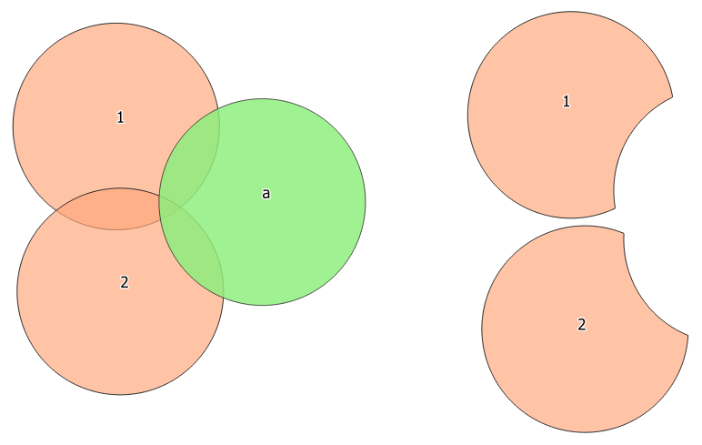
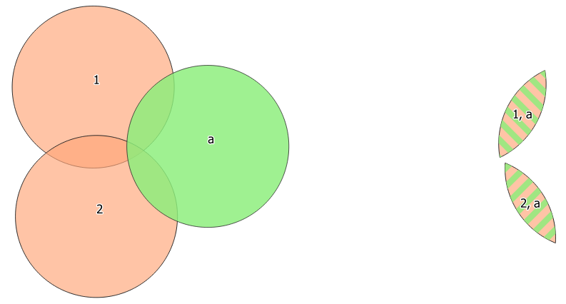
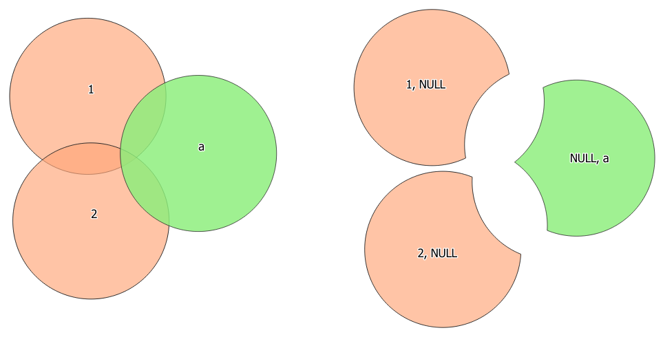
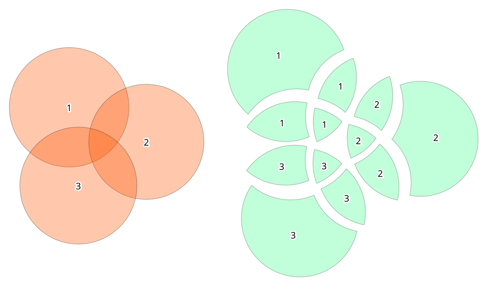

Vector overlay
==============

.. only:: html

   .. contents::
      :local:
      :depth: 1

.. _qgisclip:

Clip
----
Clips a vector layer using the features of an additional polygon layer.

Only the parts of the features in the input layer that fall within the polygons
of the overlay layer will be added to the resulting layer.

.. _warning_difference:

.. warning:: **Feature modification**

  The attributes of the features are **not modified**, although properties
  such as area or length of the features will be modified by the clipping operation.
  If such properties are stored as attributes, those attributes will have to be
  manually updated.

This algorithm uses spatial indexes on the providers, prepared geometries and
apply a clipping operation if the geometry isn't wholly contained by the
mask geometry.

  Clipping operation between a two-features input layer and a single feature
  overlay layer (left) - resulting features are moved for clarity (right)

|checkbox| Allows :ref:`features in-place modification <processing_inplace_edit>`

``Default menu``: :menuselection:`Vector --> Geoprocessing Tools`

Parameters
..........
``Input layer`` [vector: any]
  Layer containing the features to be clipped.

``Overlay layer`` [vector: polygon]
  Layer containing the clipping features.

Outputs
.......

``Clipped`` [vector: any]
  Layer containing features from the input layer split by the overlay layer.

See also
........
:ref:`qgisintersection`

.. _qgisdifference:

Difference
----------
Extracts features from the input layer that don't fall within the boundaries of
the overlay layer.

Input layer features that partially overlap the overlay layer feature(s) are
split along the boundary of those feature(s) and only the portions
outside the overlay layer features are retained.

Attributes are not modified (see :ref:`warning <warning_difference>`).

  Difference operation between a two-features input layer and a single feature
  overlay layer (left) - resulting features are moved for clarity (right)

|checkbox| Allows :ref:`features in-place modification <processing_inplace_edit>`

``Default menu``: :menuselection:`Vector --> Geoprocessing Tools`

Parameters
..........

``Input layer`` [vector: any]
  Layer to extract (parts of) features from.

``Overlay layer`` [vector: any]
  Layer containing the overlapping features to compare to,
  acting as a subtracting layer.

Outputs
.......

``Difference`` [vector: any]
  Layer containing (parts of) features from the input layer not overlapping the overlay layer.

See also
........
:ref:`qgissymmetricaldifference`

.. _qgisextractbyextent:

Extract/clip by extent
----------------------
Creates a new vector layer that only contains features which fall within a specified
extent.

Any features which intersect the extent will be included.

Parameters
..........

``Input layer`` [vector: any]
  Layer to extract (parts of) features from.

``Extent (xmin, xmax, ymin, ymax)`` [extent]
  Extent of the clipping.

``Clip features to the extent`` [boolean]
  If checked, output geometries will be automatically converted to multi geometries
  to ensure uniform output types. Moreover the geometries will be clipped to the
  extent chosen instead of taking the whole geometry as output.

Outputs
.......

``Extracted`` [vector: any]
  Layer containing the clipped features.

.. _qgisintersection:

Intersection
------------
Extracts the portions of features from the input layer that overlap features in
the overlay layer.

Features in the intersection layer are assigned the attributes of the overlapping
features from both the input and overlay layers.

Attributes are not modified (see :ref:`warning <warning_difference>`).

  Intersection operation between a two-features input layer and a single feature
  overlay layer (left) - resulting features are moved for clarity (right)

``Default menu``: :menuselection:`Vector --> Geoprocessing Tools`

Parameters
..........

``Input layer`` [vector: any]
  Layer to extract (parts of) features from.

``Overlay layer`` [vector: any]
  Layer containing the overlapping features to compare to.

``Input fields to keep`` [tablefield: any] [list]
  Optional

  Field(s) of the input layer to keep in the output. If no fields are
  chosen all fields are taken.

``Overlay fields to keep`` [tablefield: any] [list]
  Optional

  Field(s) of the overlay layer to keep in the output. If no fields are
  chosen all fields are taken.
  
``Overlay fields prefix`` [string] |3.8|

  Prefix to add to the field names of the overlay layer's fields to avoid
  name collisions with fields in the input layer.

Outputs
.......

``Intersection`` [vector: any]
  Layer containing (parts of) features from the input layer overlapping the overlay layer.

See also
........
:ref:`qgisclip`

.. _qgislineintersections:

Line intersections
------------------
Creates point features where the lines from both layers intersect.

  Points of intersection

``Default menu``: :menuselection:`Vector --> Analysis Tools`

Parameters
..........

``Input layer`` [vector: line]
  Input layer.

``Intersect layer`` [vector: line]
  Layer to use in the intersection operation.

``Input fields to keep`` [tablefield: any] [list]
  Optional

  Field(s) of the input layer to keep in the output. If no fields are
  chosen all fields are taken.

``Intersect fields to keep`` [tablefield: any] [list]
  Optional

  Field(s) of the intersect layer to keep in the output. If no fields are
  chosen all fields are taken.

``Intersect fields prefix`` [string] |3.8|

  Prefix to add to the field names of the intersect layer's fields to
  avoid name collisions with fields in the input layer.

Outputs
.......

``Intersections`` [vector: point]
  Point vector layer of the intersection.

.. _qgissplitwithlines:

Split with lines
----------------
Splits the lines or polygons in one layer using the lines in another layer to
define the breaking points. Intersection between geometries in both layers are
considered as split points.

Output will contain multi geometries for split features.

  Split lines

|checkbox| Allows :ref:`features in-place modification <processing_inplace_edit>`

Parameters
..........

``Input layer`` [vector: line, polygon]
  Layer containing the lines or polygons to split.

``Split layer`` [vector: line]
  Line layer whose lines are used to define the breaking points.

Outputs
.......

``Split`` [vector: line, polygon]
  Output layer with split lines or polygons from input layer.

.. _qgissymmetricaldifference:

Symmetrical difference
-----------------------
Creates a layer containing features from both the input and overlay layers but
with the overlapping areas between the two layers removed.

The attribute table of the symmetrical difference layer contains attributes and fields
from both the input and overlay layers.

Attributes are not modified (see :ref:`warning <warning_difference>`).

  Symmetrical difference operation between a two-features input layer and a single
  feature overlay layer (left) - resulting features are moved for clarity (right)

``Default menu``: :menuselection:`Vector --> Geoprocessing Tools`

Parameters
..........

``Input layer`` [vector: any]
  First layer to extract (parts of) features from.

``Overlay layer`` [vector: any]
  Second layer to extract (parts of) features from.

``Overlay fields prefix`` [string] |3.8|

  Prefix to add to the field names of the overlay layer's fields to
  avoid name collisions with fields in the input layer.

Outputs
.......

``Symmetrical difference`` [vector: any]
  Layer containing (parts of) features from each layer not overlapping the other layer.

See also
........
:ref:`qgisdifference`

.. _qgisunion:

Union
-----
Checks overlaps between features within the input layer and creates separate
features for overlapping and non-overlapping parts. The area of overlap will
create as many identical overlapping features as there are features that
participate in that overlap.

  Union operation with a single input layer of three overlapping features (left)
  - resulting features are moved for clarity (right)

An overlay layer can also be used, in which case features from each layer
are split at their overlap with features from the other one, creating a
layer containing all the portions from both input and overlay layers.
The attribute table of the union layer is filled with attribute values from the
respective original layer for non-overlapping features, and attribute values
from both layers for overlapping features.

  Union operation between a two-features input layer and a single feature
  overlay layer (left) - resulting features are moved for clarity (right)

.. note::

 For ``union(A,B)`` algorithm, if there are overlaps among geometries of layer A
 or among geometries of layer B, these are not resolved: you need to do
 ``union(union(A,B))`` to resolve all overlaps, i.e. run single layer ``union(X)``
 on the produced result ``X=union(A,B)``.

``Default menu``: :menuselection:`Vector --> Geoprocessing Tools`

Parameters
..........

``Input layer`` [vector: any]
  Input vector layer to split at any intersections.

``Overlay layer`` [vector: any]
  Optional

  Layer that will be combined to the first one.

``Overlay fields prefix`` [string] |3.8|

  Prefix to add to the field names of the overlay layer's fields to
  avoid name collisions with fields in the input layer.

Outputs
.......

``Union`` [vector: any]
  Layer containing all the overlapping and non-overlapping parts from the processed layer(s).

.. Substitutions definitions - AVOID EDITING PAST THIS LINE
   This will be automatically updated by the find_set_subst.py script.
   If you need to create a new substitution manually,
   please add it also to the substitutions.txt file in the
   source folder.

.. |38| replace:: ``NEW in 3.8``
.. |checkbox| image:: /static/common/checkbox.png
   :width: 1.3em
