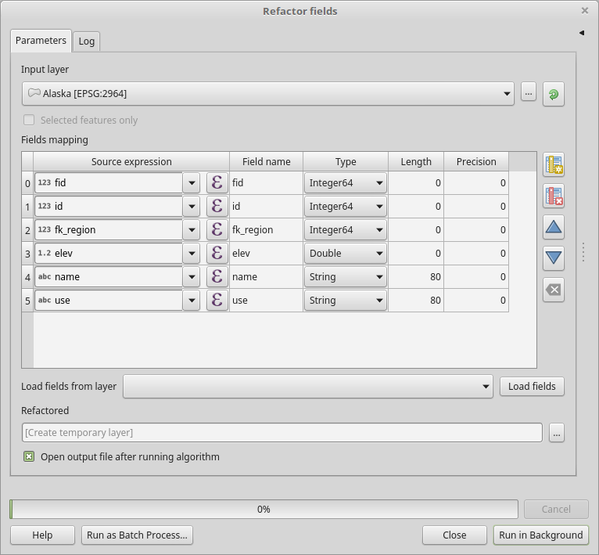

Vector table
============

.. only:: html

   .. contents::
      :local:
      :depth: 1

.. _qgisaddautoincrementalfield:

Add autoincremental field
-------------------------
Adds a new integer field to a vector layer, with a sequential value for each feature.

This field can be used as a unique ID for features in the layer. The new attribute
is not added to the input layer but a new layer is generated instead.

The initial starting value for the incremental series can be specified.
Optionally, the incremental series can be based on grouping fields and a sort order
for features can also be specified.

Parameters
..........

``Input layer`` [vector: any]
  Input vector layer.

``Field name`` [string]
  Name of the field with autoincremental values.

  Default: *AUTO*

``Start values at`` [number]
  Optional

  Choose the initial number of the incremental count.

  Default: *0*

``Group values by`` [tablefield: any] [list]
  Optional

  Select grouping field(s): instead of a single count run for the whole layer,
  a separate count is processed for each value returned by the combination of
  these fields.

``Sort expression`` [expression]
  Optional

  Use an expression to sort the features in the layer either globally
  or if set, based on group fields.

``Sort ascending`` [boolean]
  When a ``sort expression`` is set, use this option to control the order in
  which features are assigned values.

  Default: *True*

``Sort nulls first`` [boolean]
  When a ``sort expression`` is set, use this option to set whether
  *Null* values are counted first or last.

  Default: *False*

Outputs
.......

``Incremented`` [vector: any]
  Vector layer with auto incremental field.

.. _qgisaddfieldtoattributestable:

Add field to attributes table
-----------------------------
Adds a new field to a vector layer.

The name and characteristics of the attribute are defined as parameters.

The new attribute is not added to the input layer but a new layer is generated
instead.

Parameters
..........

``Input layer`` [vector: any]
  Input vector layer.

``Field name`` [string]
  Name of the new field.

``Field type`` [enumeration]
  Type of the new field. You can choose between:

  * 0 --- Integer
  * 1 --- Float
  * 2 --- String

  Default: *0*

``Field length`` [number]
  Length of the field.

  Default: *10*

``Field precision`` [number]
  Precision of the field. Useful with Float field type.

  Default: *0*

Outputs
.......

``Added`` [vector: any]
  Vector layer with new field added.

.. _qgisadduniquevalueindexfield:

Add unique value index field
----------------------------
Takes a vector layer and an attribute and adds a new numeric field.

Values in this field correspond to values in the specified attribute, so features
with the same value for the attribute will have the same value in the new numeric
field.

This creates a numeric equivalent of the specified attribute, which defines the
same classes.

The new attribute is not added to the input layer but a new layer is generated
instead.

Parameters
..........

``Input layer`` [vector: any]
  Input vector layer.

``Class field`` [tablefield: any]
  Features of the same value are given the same index.

``Output field name`` [tablefield: any]
  Name of the new field containing the indexes.

  Default: *NUM_FIELD*

Outputs
.......

``Layer with index field`` [vector: any]
  Vector layer with the numeric field containing indexes.

``Class summary`` [table]
  Table with summary of the class field mapped to the corresponding unique value.

  Default: *Skip Output*

.. _qgisaddxyfieldstolayer:

Add X/Y fields to layer
-----------------------
Adds X and Y (or latitude/longitude) fields to a point layer.
The X/Y fields can be calculated in a different CRS to the layer
(e.g. creating latitude/longitude fields for a layer in a project CRS).

Parameters
..........

.. list-table::
   :header-rows: 1
   :widths: 20 20 20 40
   :stub-columns: 0

   *  - Name
      - Identifier
      - Type
      - Description
   *  - **Input layer**
      - INPUT
      - [vector:any]
      - The input layer.
   *  - **Coordinate system**
      - CRS
      - [string]
        
        Default: "EPSG:4326"
      - Join layer fields to copy (if empty, all fields will be
        copied).
   *  - **Field prefix**
        
        Optional
      - PREFIX
      - [vector:any]
      - The join layer.
   *  - **Added fields**
      - OUTPUT
      - [vector:point]
      - Choice between ``Create Temporary Layer``, ``Save to File``,
        ``Save to Geopackage`` and ``Save to PostGIS Table``

Outputs
.......

.. list-table::
   :header-rows: 1
   :widths: 20 20 20 40
   :stub-columns: 0

   *  - Name
      - Identifier
      - Type
      - Description
   *  - **Added fields**
      - OUTPUT
      - [vector:point]
      - The output layer - identical to the input layer but with two
        new double fields, ``y`` and ``y``.

.. _qgisadvancedpythonfieldcalculator:

Advanced Python field calculator
--------------------------------
Adds a new attribute to a vector layer, with values resulting from applying an
expression to each feature.

The expression is defined as a Python function.

Parameters
..........

``Input layer`` [vector: any]
  Input vector layer.

``Result field name`` [string]
  Name of the new field.

  Default: *NewField*

``Field type`` [enumeration]
  Type of the new field. You can choose between:

  * 0 --- Integer
  * 1 --- Float
  * 2 --- String

  Default: *0*

``Field length`` [number]
  Length of the field.

  Default: *10*

``Field precision`` [number]
  Precision of the field. Useful with Float field type.

  Default: *3*

``Global expression`` [string]
  Optional

  The code in the global expression section will be executed only once before the
  calculator starts iterating through all the features of the input layer.
  Therefore, this is the correct place to import necessary modules or to calculate
  variables that will be used in subsequent calculations.

``Formula`` [string]
  Add here the Python formula to evaluate. For example to calculate the area of
  an input polygon layer you can add::

    value = $geom.area()

Outputs
.......

``Calculated`` [vector: any]
  Vector layer with the new calculated field.

.. _qgisdeletecolumn:

Drop field(s)
-------------
Takes a vector layer and generates a new one that has the same features but
without the selected columns.

Parameters
..........

``Input layer`` [vector: any]
  Input vector layer to drop field(s) from.

``Fields to drop`` [tablefield: any] [list]
  Select the field(s) to drop.

Outputs
.......

``Fields dropped`` [vector: any]
  Vector layer without the field(s) chosen.

.. _qgisextractbinary:

Extract binary field
--------------------
Extracts contents from a binary field, saving them to individual files.
Filenames can be generated using values taken from an attribute in the
source table or based on a more complex expression.

Parameters
..........

``Input layer`` [vector: any]
  Input vector layer containing the binary data.

``Binary field`` [tablefield: any]
  Field containing the binary data.

``File name`` [expression]
  Field or expression-based text to name each output file.

``Destination folder`` [folder]
  Folder in which to store the output files.

.. _qgisfieldcalculator:

Field calculator
----------------
Opens the field calculator (see :ref:`vector_expressions`). You can use all the
supported expressions and functions.

A new layer is created with the result of the expression.

The field calculator is very useful when used in :ref:`processing.modeler`.

.. _qgisrefactorfields:

Refactor fields
---------------
Allows editing the structure of the attribute table of a vector layer.

Fields can be modified in their type and name, using a fields mapping.

The original layer is not modified. A new layer is generated, which contains a
modified attribute table, according to the provided fields mapping.

Refactor layer fields allows to:

* Change field names and types
* Add and remove fields
* Reorder fields
* Calculate new fields based on expressions
* Load field list from another layer

  Refactor fields dialog

Parameters
..........

``Input layer`` [vector: any]
  Layer to edit the attribute table structure.

``Fields mapping`` [list]
  List of output fields with their definitions.

  The embedded table lists all the fields of the source
  layer and allows you to edit them:

  * Click the |newAttribute| button to create a new field.
  * Click |deleteAttribute| to remove a field.
  * Use |arrowUp| and |arrowDown| to change the selected field order.
  * Click |clearText| to reset to the default view.

  For each of the fields you'd like to reuse, you need to
  fill the following options:

  ``Source expression`` [expression]
    Field or expression from the input layer.

  ``Field name`` [string]
    Name of the field in the output layer.
    By default input field name is kept.

  ``Type`` [enumeration]
    Data type of the output field.

  ``Length`` [number]
    Length of the output field.

  ``Precision`` [number]
    Precision of the output field.

``Load fields from layer`` [vector: any]
  Load fields from another vector layer to update the field list.

Outputs
.......

``Refactored`` [vector: any]
  Output layer with refactored fields.

.. _qgistexttofloat:

Text to float
-------------
Modifies the type of a given attribute in a vector layer, converting a text attribute
containing numeric strings into a numeric attribute (e.g. '1' to ``1.0``).

The algorithm creates a new vector layer so the source one is not modified.

If the conversion is not possible the selected column will have ``NULL`` values.

Parameters
..........

``Input Layer`` [vector: any]
  Input vector layer.

``Text attribute to convert to float`` [tablefield: string]
  String field to convert in a floating field type.

Outputs
.......

``Float from text`` [vector: any]
  Output vector layer with string field converted into float.

.. Substitutions definitions - AVOID EDITING PAST THIS LINE
   This will be automatically updated by the find_set_subst.py script.
   If you need to create a new substitution manually,
   please add it also to the substitutions.txt file in the
   source folder.

.. |arrowDown| image:: /static/common/mActionArrowDown.png
   :width: 1.5em
.. |arrowUp| image:: /static/common/mActionArrowUp.png
   :width: 1.5em
.. |clearText| image:: /static/common/mIconClearText.png
   :width: 1.5em
.. |deleteAttribute| image:: /static/common/mActionDeleteAttribute.png
   :width: 1.5em
.. |newAttribute| image:: /static/common/mActionNewAttribute.png
   :width: 1.5em
