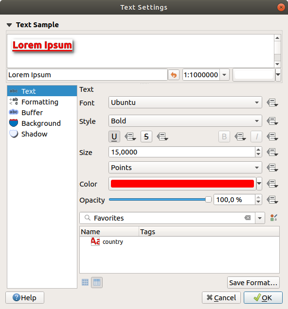

.. only:: html

   |updatedisclaimer|

.. _showlabels:

*****************
 Setting a label
*****************

.. only:: html

   .. contents::
      :local:

Labels are textual information you can display on vector features. They add
details you could not necessarily represent using symbols.

The :guilabel:`Style Manager` dialog allows you to create a set of labels or
text formats (ie the appearance of the text, including font, size, colors,
shadow, background...). Each of these items could later be applied to layers in
the |labeling| :guilabel:`Labels` tab of the vector :guilabel:`Layer Properties`
dialog or :guilabel:`Layer Styling` panel or using the |labeling| :sup:`Layer
Labeling Options` button of the **Labels toolbar**. You can also directly
configure them in the abovementioned dialogs.

.. It could be nice to briefly expose the "label settings" tab of the style
 manager, with some sample of label settings in it.

The :guilabel:`Label Settings` dialog allows you to configure smart labeling
for vector layers. Setting
a label includes configuring the :ref:`text format <text_format>`, and how
the label relates with the features or other labels (through :ref:`placement
<labels_placement>`, :ref:`rendering <labels_rendering>` and callout).

.. _text_format:

Formatting the label text
=========================

To create text formats, you can:

#. Open the |styleManager| :guilabel:`Style Manager` dialog
#. Activate the :guilabel:`Text format` tab

   .. _figure_textformats:

   .. figure:: img/stylemanager_textformat.png
      :align: center

      Text formats in Style Manager dialog

#. Press the |signPlus| :sup:`Add item` button. The :guilabel:`Text Settings`
   dialog opens with the following properties.

.. _labels_text:

Text tab
--------

.. _figure_textsettings_text:

   Text settings - Text tab

In the |text| :guilabel:`Text` tab, you can set:

* the :guilabel:`Font`, from the ones available on your machine
* the :guilabel:`Style`: along with the common styles of the font, you can set
  whether the text should be underlined or striked through
* the :guilabel:`Size` that can be in :guilabel:`Points`, :guilabel:`Pixels`,
  :guilabel:`Millimeters`, :guilabel:`Map units`, :guilabel:`Meters at scale`,
  or :guilabel:`Inches`
* the :guilabel:`Color`
* and the :guilabel:`Opacity`.

At the bottom, a text formats list widget shows a filterable list of text
formats stored within your :ref:`style manager database <vector_style_manager>`.
This allows you to easily set text formats to match styles saved in the local
style database, and also to add a new text format to the style database based on
the current settings. Press the :guilabel:`Save format...` button to store the
current text format in the :guilabel:`Style Manager`, providing a name and tag(s).

Likewise, a label settings list widget is shown when configuring labels, allowing
you to pick from the |styleManager| :sup:`Style Manager` widget or to add new
styles to it.

.. _labels_formatting:

Formatting tab
--------------

.. _figure_textsettings_formatting:

   Text settings - Formatting tab

In the |labelformatting| :guilabel:`Formatting` tab, you can:

* Use the :guilabel:`Type case` option to change the capitalization style of
  the text. You have the possibility to render the text as :guilabel:`All
  uppercase`, :guilabel:`All lowercase` or :guilabel:`Capitalize first letter`.
  Note that the last option modifies only the first letter of each word and
  leaves untouched the other letters in the text.
* Under :guilabel:`Spacing`, change the space between words and between
  individual letters.
* |checkbox| :guilabel:`Enable kerning` of the text font
* Set the :guilabel:`Text orientation` which can be :guilabel:`Horizontal`
  or :guilabel:`Vertical`. It can also be :guilabel:`Rotation-based` when
  setting a label.
* Use the :guilabel:`Blend mode` option to determine how your labels will mix
  with the map features below them (more details at :ref:`blend-modes`).
* The |unchecked| :guilabel:`Apply label text substitutes` option allows you
  to specify a list of texts to substitute to texts in feature labels (e.g.,
  abbreviating street types). Replacement texts are used when displaying
  labels on the map. Users can also export and import lists of
  substitutes to make reuse and sharing easier.
* Configure :guilabel:`Multiple lines`:

  * Set a character that will force a line break in the text with the
    :guilabel:`Wrap on character` option
  * Set an ideal line size for auto-wrapping using the :guilabel:`Wrap lines to`
    option. The size can represent either the :guilabel:`Maximum line length`
    or the :guilabel:`Minimum line length`.
  * Decide the :guilabel:`Line Height`
  * Format the :guilabel:`Alignment`: typical values available are
    :guilabel:`Left`, :guilabel:`Right` and :guilabel:`Center`.

    When setting point labels properties, the text alignment can also be
    :guilabel:`Follow label placement`. In that case, the alignment will depend
    on the final placement of the label relative to the point. E.g., if the
    label is placed to the left of the point, then the label will be right
    aligned, while if it is placed to the right, it will be left aligned.

* For line labels you can include :guilabel:`Line direction symbol`
  to help determine the line directions, with symbols to use to indicate the
  :guilabel:`Left` or :guilabel:`Right`. They work particularly well when
  used with the *curved* or *Parallel* placement options from the
  :guilabel:`Placement` tab. There are options to set the symbols position, and
  to |unchecked| :guilabel:`Reverse direction`.
* Use the |unchecked| :guilabel:`Formatted numbers` option to format numeric
  texts. You can set the number of :guilabel:`Decimal places`. By default, ``3``
  decimal places will be used. Use the |checkbox| :guilabel:`Show plus sign` if
  you want to show the plus sign for positive numbers.

.. _labels_buffer:

Buffer tab
----------

.. _figure_textsettings_buffer:

   Text settings - Buffer tab

To create a buffer around the label, activate the |checkbox| :guilabel:`Draw
text buffer` checkbox in the |labelbuffer| :guilabel:`Buffer` tab. Then you can:

* Set the buffer's :guilabel:`Size` that can be in :guilabel:`Points`,
  :guilabel:`Pixels`, :guilabel:`Millimeters`, :guilabel:`Map units`,
  :guilabel:`Meters at scale` or :guilabel:`Inches`
* Select the buffer's :guilabel:`Color`
* |checkbox| :guilabel:`Color buffer's fill`: The buffer expands from the
  label's outline, so, if the option is activated, the label's interior is
  filled. This may be relevant when using partially transparent labels or with
  non-normal blending modes, which will allow seeing behind the label's text.
  Unchecking the option (while using totally transparent labels) will allow you
  to create outlined text labels.
* Define the buffer's :guilabel:`Opacity`
* Apply a :guilabel:`Pen join style`: it can be :guilabel:`Round`,
  :guilabel:`Miter` or :guilabel:`Bevel`
* Use the :guilabel:`Blend mode` option to determine how your label's buffer
  will mix with the map components below them (more details at
  :ref:`blend-modes`).
* Check |unchecked| :guilabel:`Draw effects` to add advanced :ref:`paint effects
  <draw_effects>` for customizing the visualization of the labels.

.. _labels_background:

Background tab
--------------

In the |labelbackground| :guilabel:`Background` tab, you can define with
:guilabel:`Size X` and :guilabel:`Size Y` the shape of your background.
Use :guilabel:`Size type` to insert an additional 'Buffer' into your background.
The buffer size is set by default here.
The background then consists of the buffer plus the background in :guilabel:`Size X`
and :guilabel:`Size Y`. You can set a :guilabel:`Rotation` where you can choose
between 'Sync with label', 'Offset of label' and 'Fixed'.
Using 'Offset of label' and 'Fixed', you can rotate the background.
Define an :guilabel:`Offset X,Y` with X and Y values, and the background
will be shifted. When applying :guilabel:`Radius X,Y`, the background gets
rounded corners.
Again, it is possible to mix the background with the underlying layers in the
map canvas using the :guilabel:`Blend mode` (see :ref:`blend-modes`).

.. _labels_shadow:

Shadow tab
----------

Use the |labelshadow| :guilabel:`Shadow` tab for a user-defined :guilabel:`Draw
drop shadow`. The drawing of the background is very variable.
Choose between 'Lowest label component', 'Text', 'Buffer' and 'Background'.
The :guilabel:`Offset` angle depends on the orientation
of the label. If you choose the |checkbox| :guilabel:`Use global shadow` checkbox,
then the zero point of the angle is
always oriented to the north and doesn't depend on the orientation of the label.
You can influence the appearance of the shadow with the :guilabel:`Blur radius`.
The higher the number, the softer the shadows. The appearance of the drop shadow
can also be altered by choosing a blend mode.

.. comment FIXME: at the moment there is an error in this setting

   |checkbox| :guilabel:`Blur only alpha pixels`:
   It is supposed to show only those
   pixels that have a partial alpha component beyond the base opaque pixels of
   the component being blurred. For example, if you set the shadow of some
   text to be gray and turn on that option, it should still show a duplication
   of the text, colored as per the shadow color option, but with any blurred
   shadow that extends beyond its text. With the option off, in this example,
   it will blur all pixels of the duplicated text.
   This is useful for creating a shadow that increases legibility at smaller
   output sizes, e.g. like duplicating text and offsetting it a bit in
   illustration programs, while still showing a bit of shadow at larger sizes.
   Apparently, there is an error with re-painting the opaque pixels back over
   top of the shadow (depending upon the shadow's color), when that setting is
   used.

.. _labels_placement:

Placement tab
=============

Choose the |labelplacement| :guilabel:`Placement` tab for configuring label placement
and labeling priority. Note that the placement options differ according to the
type of vector layer, namely point, line or polygon, and are affected by
the global :ref:`PAL setting <automated_placement>`.

.. _cartographic:

Placement for point layers
--------------------------

With the |radioButtonOn| :guilabel:`Cartographic` placement mode,
point labels are generated with a better visual relationship with the
point feature, following ideal cartographic placement rules. Labels can be
placed at a set :guilabel:`Distance` either from the point feature itself
or from the bounds of the symbol used to represent the feature.
The latter option is especially useful when the symbol size isn't fixed,
e.g. if it's set by a data defined size or when using different symbols
in a categorized renderer.

By default, placements are prioritised in the following order:

#. top right
#. top left
#. bottom right
#. bottom left
#. middle right
#. middle left
#. top, slightly right
#. bottom, slightly left.

Placement priority can, however, be customized or set for an individual
feature using a data defined list of prioritised positions.
This also allows only certain placements to be used, so e.g.
for coastal features you can prevent labels being placed over the land.

The |radioButtonOn| :guilabel:`Around point` setting places the label in an
equal radius (set in :guilabel:`Distance`) circle around the feature. The
placement of the label can even be constrained using the :guilabel:`Quadrant`
option.

With the |radioButtonOn| :guilabel:`Offset from point`, labels are
placed at a fixed offset from the point feature. You can select the
:guilabel:`Quadrant` in which to place your label. You are also able to set
the :guilabel:`Offset X,Y` distances between the points and their labels and
can alter the angle of the label placement with the :guilabel:`Rotation`
setting. Thus, placement in a selected quadrant with a defined rotation is
possible.

Placement for line layers
-------------------------

Label options for line layers include |radioButtonOn| :guilabel:`Parallel`,
|radioButtonOff| :guilabel:`Curved` or |radioButtonOff| :guilabel:`Horizontal`.
For the |radioButtonOn| :guilabel:`Parallel` and |radioButtonOff|
:guilabel:`Curved` options, you can set the position to |checkbox|
:guilabel:`Above line`, |checkbox| :guilabel:`On line` and |checkbox|
:guilabel:`Below line`. It's possible to select several options at once. In
that case, QGIS will look for the optimal label position. For Parallel and
curved placement options, you can also use the line orientation for the
position of the label. Additionally, you can define a :guilabel:`Maximum
angle between curved characters` when selecting the |radioButtonOff|
:guilabel:`Curved` option (see Figure_labels_placement_line).

.. _figure_labels_placement_line:

.. figure:: img/line_label_placement.png
   :align: center

   Label placement examples in lines

For all three placement options, in :guilabel:`Repeat`, you can set up a
minimum distance for repeating labels. The distance can be in ``mm`` or in
``map units``.

Placement for polygon layers
----------------------------

You can choose one of the following options for placing labels in polygons
(see figure_labels_placement_polygon_):

* |radioButtonOn| :guilabel:`Offset from centroid`,
* |radioButtonOff| :guilabel:`Horizontal (slow)`,
* |radioButtonOff| :guilabel:`Around centroid`,
* |radioButtonOff| :guilabel:`Free (slow)`,
* |radioButtonOff| :guilabel:`Using perimeter`,
* and |radioButtonOff| :guilabel:`Using perimeter (curved)`.

In the :guilabel:`Offset from centroid` settings you can
specify if the centroid is of the |radioButtonOn| :guilabel:`visible
polygon` or |radioButtonOff| :guilabel:`whole polygon`. That means that
either the centroid is used for the polygon you can see on the map or the
centroid is determined for the whole polygon, no matter if you can see the
whole feature on the map. You can place your label within a specific
quadrant, and define offset and rotation.

The :guilabel:`Around centroid` setting places the label at a specified
distance around the centroid. Again, you can define |radioButtonOn|
:guilabel:`visible polygon` or |radioButtonOff| :guilabel:`whole polygon`
for the centroid.

With the :guilabel:`Horizontal (slow)` or :guilabel:`Free (slow)` options,
QGIS places at the best position either a horizontal or a rotated label inside
the polygon.

With the :guilabel:`Using perimeter` option, the label
will be drawn next to the polygon boundary. The label will behave like the
parallel option for lines. You can define a position and a distance for the
label. For the position, |checkbox| :guilabel:`Above line`, |checkbox|
:guilabel:`On line`, |checkbox| :guilabel:`Below line` and |checkbox|
:guilabel:`Line orientation dependent position` are possible. You can
specify the distance between the label and the polygon outline, as well as
the repeat interval for the label.

The :guilabel:`Using perimeter (curved)` option helps you draw the label along
the polygon boundary, using a curved labeling. In addition to the parameters
available with :guilabel:`Using perimeter` setting, you can set the
:guilabel:`Maximum angle between curved characters polygon`, either inside
or outside.

.. _figure_labels_placement_polygon:

.. figure:: img/polygon_label_placement.png
   :align: center

   Label placement examples in polygons

In the :guilabel:`priority` section you can define the priority with which
labels are rendered for all three vector layer types (point, line, polygon).
This placement option interacts with the labels from other vector layers in
the map canvas. If there are labels from different layers in the same
location, the label with the higher priority will be displayed and the
others will be left out.

.. _labels_rendering:

Rendering tab
=============

In the |render| :guilabel:`Rendering` tab, you can tune when the labels can
be rendered and their interaction with other labels and features.

Under :guilabel:`Label options`, you find the :ref:`scale-based <label_scaledepend>`
and the :guilabel:`Pixel size-based` visibility settings.

The :guilabel:`Label z-index` determines the order in which labels are rendered,
as well in relation with other feature labels in the layer (using data-defined
override expression), as with labels from other layers. Labels with a higher
z-index are rendered on top of labels (from any layer) with lower z-index.

Additionally, the logic has been tweaked so that if 2 labels have
matching z-indexes, then:

* if they are from the same layer, the smaller label will be drawn above the larger label
* if they are from different layers, the labels will be drawn in the same order
  as their layers themselves (ie respecting the order set in the map legend).

Note that this setting doesn't make labels to be drawn below the
features from other layers, it just controls the order in which
labels are drawn on top of all the layer's features.

While rendering labels and in order to display readable labels,
QGIS automatically evaluates the position of the labels and can hide some of them
in case of collision. You can however choose to |checkbox| :guilabel:`Show all
labels for this layer (including colliding labels)` in order to manually fix
their placement.

With data-defined expressions in :guilabel:`Show label` and :guilabel:`Always Show`
you can fine tune which labels should be rendered.

Under :guilabel:`Feature options`, you can choose to :guilabel:`label every
part of a multi-part feature` and :guilabel:`limit the number of features to be
labeled`. Both line and polygon layers offer the option to set a minimum size
for the features to be labeled, using :guilabel:`Suppress labeling of features
smaller than`.
For polygon features, you can also filter the labels to show according to
whether they completely fit within the feature or not.
For line features, you can choose to :guilabel:`Merge connected lines
to avoid duplicate labels`, rendering a quite airy map in conjunction with
the :guilabel:`Distance` or :guilabel:`Repeat` options in Placement tab.

From the :guilabel:`Obstacles` frame, you can manage the covering relation between
labels and features. Activate the |checkbox| :guilabel:`Discourage labels from
covering features` option to decide whether features of the layer should act as
obstacles for any label (including labels from other features in the same layer).
An obstacle is a feature QGIS tries as far as possible to not place labels over.
Instead of the whole layer, you can define a subset of features to use as obstacles,
using the |dataDefined| :sup:`data-defined override` control next to the option.

The |slider| priority control slider for obstacles allows you to make labels
prefer to overlap features from certain layers rather than others.
A **Low weight** obstacle priority means that features of the layer are less
considered as obstacles and thus more likely to be covered by labels.
This priority can also be data-defined, so that within the same layer,
certain features are more likely to be covered than others.

For polygon layers, you can choose the type of obstacle features could be
by minimising the labels placement:

* **over the feature's interior**: avoids placing labels over the interior of
  the polygon (prefers placing labels totally outside or just slightly inside
  the polygon)
* or **over the feature's boundary**: avoids placing labels over boundary of
  the polygon (prefers placing labels outside or completely inside the
  polygon). E.g., it can be useful for regional boundary layers, where the
  features cover an entire area. In this case, it's impossible to avoid
  placing labels within these features, and it looks much better to avoid
  placing them over the boundaries between features.

.. Substitutions definitions - AVOID EDITING PAST THIS LINE
   This will be automatically updated by the find_set_subst.py script.
   If you need to create a new substitution manually,
   please add it also to the substitutions.txt file in the
   source folder.

.. |checkbox| image:: /static/common/checkbox.png
   :width: 1.3em
.. |dataDefined| image:: /static/common/mIconDataDefine.png
   :width: 1.5em
.. |labelbackground| image:: /static/common/labelbackground.png
   :width: 1.5em
.. |labelbuffer| image:: /static/common/labelbuffer.png
   :width: 1.5em
.. |labelformatting| image:: /static/common/labelformatting.png
   :width: 1.5em
.. |labeling| image:: /static/common/labelingSingle.png
   :width: 1.5em
.. |labelplacement| image:: /static/common/labelplacement.png
   :width: 1.5em
.. |labelshadow| image:: /static/common/labelshadow.png
   :width: 1.5em
.. |radioButtonOff| image:: /static/common/radiobuttonoff.png
   :width: 1.5em
.. |radioButtonOn| image:: /static/common/radiobuttonon.png
   :width: 1.5em
.. |render| image:: /static/common/render.png
   :width: 1.5em
.. |signPlus| image:: /static/common/symbologyAdd.png
   :width: 1.5em
.. |slider| image:: /static/common/slider.png
.. |styleManager| image:: /static/common/mActionStyleManager.png
   :width: 1.5em
.. |text| image:: /static/common/text.png
   :width: 1.5em
.. |unchecked| image:: /static/common/checkbox_unchecked.png
   :width: 1.5em
.. |updatedisclaimer| replace:: :disclaimer:`Docs in progress for 'QGIS testing'. Visit https://docs.qgis.org/3.4 for QGIS 3.4 docs and translations.`
