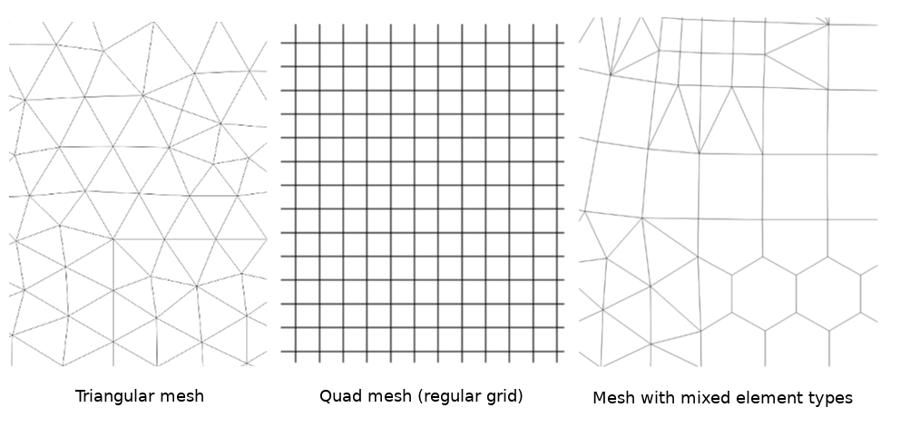
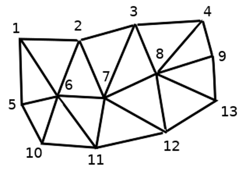
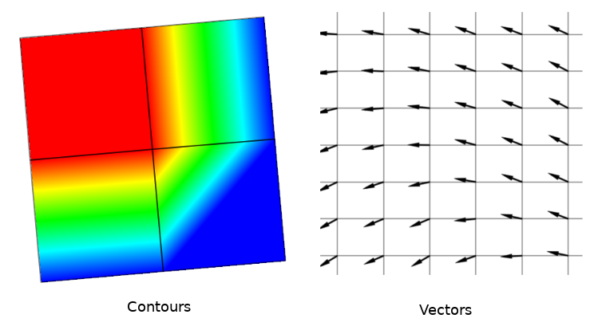
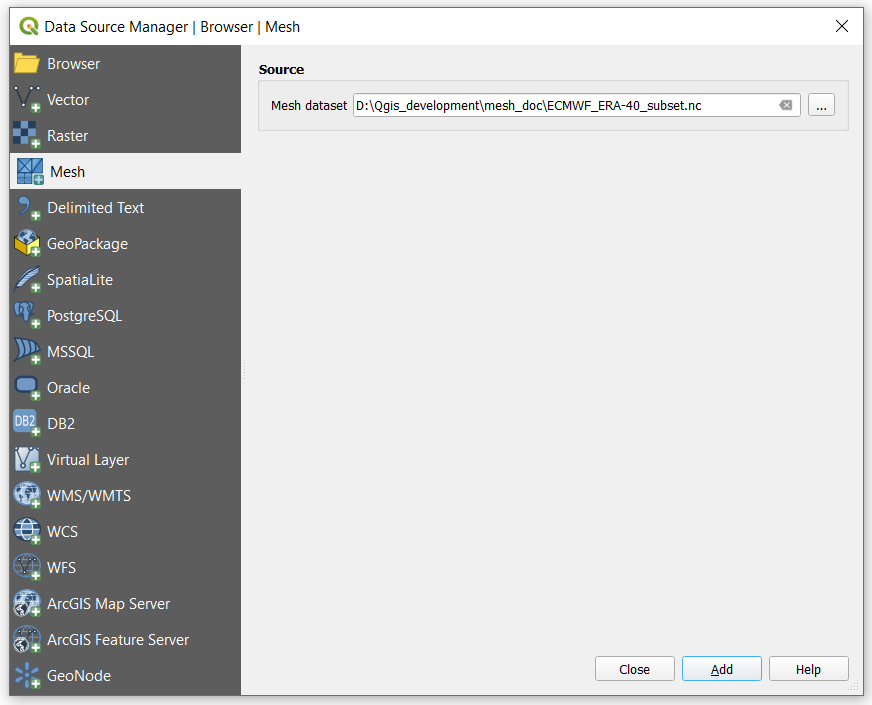
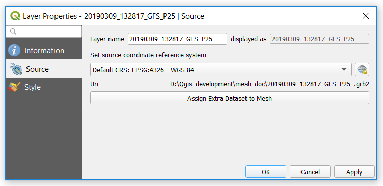

.. only:: html

   |updatedisclaimer|

.. _label_meshproperties:

***********************
 Working with Mesh Data
***********************

.. toctree::
   :maxdepth: 2

Mesh properties
===============

A mesh is an unstructured grid usually with temporal and other component.
The spatial component contains a collection of vertices, edges and faces
in 2D or 3D space:

* **vertices** - XY(Z) points (in the layer's coordinate reference system)
* **edges** - connect pairs of vertices
* **faces** - sets of edges forming a closed shape - typically triangles or
  quadrilaterals (quads), rarely polygons with higher number of vertices

.. _figure_mesh_grid_types:

   Different mesh types

QGIS can render mesh data using a triangle grid or a regular squad mesh.

Mesh provides information about the spatial structure.
In addition, the mesh can have datasets (groups) that assign a value to every vertex.
For example, having a triangular mesh with numbered vertices as shown in the image below:

.. _figure_triangual_grid_with_numered_vertices:

   Triangular grid with numbered vertices

Each vertex can store different datasets -typically multiple quantities-,
and those datasets can also have a temporal dimension. Thus, a single file may
contain multiple datasets.

The following table gives an idea what information is stored in datasets.
Table columns represent indices of mesh vertices, each row represents one dataset.
Datasets can have different datatypes.
In this case, it stored the wind velocity at 10m at particular moment of time (t1, t2, t3).

In a similar way, the mesh dataset can store vector values at each vertex,
for example, vector of wind direction at given time stamps:

=============================== ========= ========= ========= =====
10 metre wind                   1         2         3         ...
=============================== ========= ========= ========= =====
10 metre speed at time=t1       17251     24918     32858     ...
10 metre speed at time=t2       19168     23001     36418     ...
10 metre speed at time=t3       21085     30668     17251     ...
...                             ...       ...       ...       ...
10m wind direction time=t1      [20,2]    [20,3]    [20,4.5]  ...
10m wind direction time=t2      [21,3]    [21,4]    [21,5.5]  ...
10m wind direction time=t3      [22,4]    [22,5]    [22,6.5]  ...
...                             ...       ...       ...       ...
=============================== ========= ========= ========= =====

.

We can visualize the data by assigning colors to values (similarly to how it is
done with :ref:`Singleband pseudocolor <label_colormaptab>` raster rendering)
and interpolating data between vertices according to the mesh topology.
It is common that some quantities are 2D vectors rather than being
simple scalar values (e.g. wind direction).
For such quantities it is very desired to display arrows indicating direction.

.. _figure_mesh_visualisation:

   Possible visualisation of mesh data

Supported formats
=================

QGIS accesses mesh data using the `MDAL drivers <https://github.com/lutraconsulting/MDAL>`_.
Hence, the natively supported formats are:

* ``NetCDF``: Generic format for scientific data
* ``GRIB``: Format commonly used in meteorology
* ``XMDF``: As an example, hydraulic outputs from TUFLOW modelling package
* ``DAT``: Outputs of various hydrodynamic modelling packages (e.g. BASEMENT, HYDRO_AS-2D, TUFLOW)
* ``3Di``: 3Di modelling package format based on Climate and Forecast Conventions (http://cfconventions.org/)
* Some examples of mesh datasets can be found: https://apps.ecmwf.int/datasets/data/interim-full-daily/levtype=sfc/

Loading a mesh layer
====================

To add a mesh layer to QGIS, open the :menuselection:`Data Source Manager`
dialog, either by selecting it from the :menuselection:`Layer -->` menu or
clicking the |dataSourceManager| :sup:`Open Data Source Manager` button.
Then, enable the |addMeshLayer| :guilabel:`Mesh` tab on the left panel
and press the :guilabel:`...` button to select the file and press
:guilabel:`Add`. The layer will be added using the native mesh rendering.

.. _figure_mesh_datasource_manager:

   Mesh tab in Data Source Manager

Information
-----------

.. _figure_mesh_info_properties:

   Mesh Layer Properties

The :guilabel:`Information` tab is read-only and represents an interesting
place to quickly grab summarized information and metadata on the current layer.
Provided information are (based on the provider of the layer) uri, vertex count,
face count and dataset groups count.

Source
------

The :guilabel:`Source` tab displays basic information about the selected mesh, including:

* the Layer name to display in the :guilabel:`Layers` panel
* setting the Coordinate Reference System: Displays the layer’s Coordinate
  Reference System (CRS) as a PROJ.4 string. You can change the layer’s CRS,
  selecting a recently used one in the drop-down list or clicking on |setProjection|
  :guilabel:`Select CRS` button (see :ref:`crs_selector`).
  Use this process only if the CRS applied to the layer is a wrong one or
  if none was applied.

Use the button :guilabel:`Assign Extra Dataset to Mesh` to add more groups
to the current mesh layer.

.. Substitutions definitions - AVOID EDITING PAST THIS LINE
   This will be automatically updated by the find_set_subst.py script.
   If you need to create a new substitution manually,
   please add it also to the substitutions.txt file in the
   source folder.

.. |addMeshLayer| image:: /static/common/mActionAddMeshLayer.png
   :width: 1.5em
.. |dataSourceManager| image:: /static/common/mActionDataSourceManager.png
   :width: 1.5em
.. |setProjection| image:: /static/common/mActionSetProjection.png
   :width: 1.5em
.. |updatedisclaimer| replace:: :disclaimer:`Docs in progress for 'QGIS testing'. Visit https://docs.qgis.org/3.4 for QGIS 3.4 docs and translations.`
