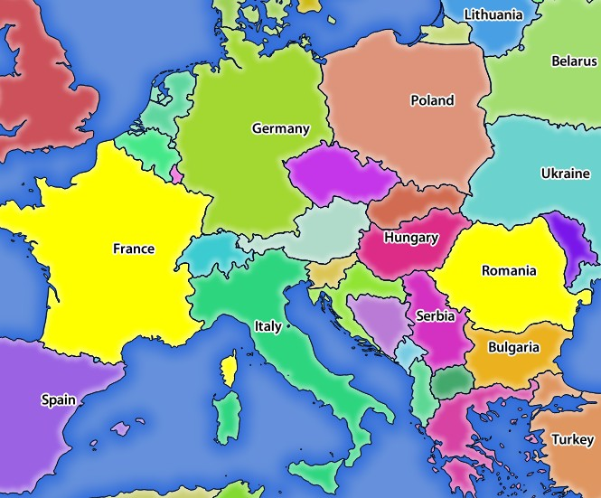
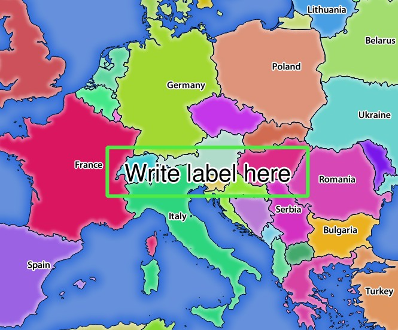

.. only:: html

   |updatedisclaimer|

********
Services
********

.. only:: html

  .. contents::
    :local:
    :depth: 2

QGIS Server is able to serve data according to standard protocols as described
by the **Open Geospatial Consortium (OGC)**:

- WMS 1.1.0 and 1.3.0
- WFS 1.0.0 and 1.1.0
- WCS 1.1.1

Extra vendor parameters and requests are supported in addition to the
original standard that greatly enhance the possibilities of customizing its
behavior thanks to the QGIS rendering engine.

Web Map Service (WMS)
=====================

The **1.1.0** and **1.3.0** WMS standards implemented in QGIS Server provide
a HTTP interface to request map or legend images generated from a QGIS project.
A typical WMS request defines the QGIS project to use, the layers to render as
well as the image format to generate. Basic support is also available for the
**Styled Layer Descriptor (SLD)** standard.

Specifications document according to the version number of the service:

- `WMS 1.1.0 <http://portal.opengeospatial.org/files/?artifact_id=1081&version=1&format=pdf>`_
- `WMS 1.3.0 <http://portal.opengeospatial.org/files/?artifact_id=14416>`_

Standard requests provided by QGIS Server:

+--------------------+-----------------------------------------------------------+
| Request            |  Description                                              |
+====================+===========================================================+
| GetCapabilities    | Return XML metadata with information about the server     |
+--------------------+-----------------------------------------------------------+
| GetMap             | Return a map                                              |
+--------------------+-----------------------------------------------------------+
| GetFeatureInfo     | Retrieves data (geometry and values) for a pixel location |
+--------------------+-----------------------------------------------------------+
| GetLegendGraphics  | Returns legend symbols                                    |
+--------------------+-----------------------------------------------------------+

|

Vendor requests provided by QGIS Server:

+---------------------+---------------------------------------------------+
| Request             |  Description                                      |
+=====================+===================================================+
| GetPrint            | Returns a QGIS composition                        |
+---------------------+---------------------------------------------------+
| GetProjectSettings  | Returns specific information about QGIS Server    |
+---------------------+---------------------------------------------------+
| GetDxf              | Export layers in DXF format                       |
+---------------------+---------------------------------------------------+

.. _`qgisserver-wms-getmap`:

GetMap
------

Standard parameters for the **GetMap** request according to the OGC WMS 1.1.0
and 1.3.0 specifications:

+---------------+----------+----------------------------------+
| Parameter     | Required | Description                      |
+===============+==========+==================================+
| SERVICE       | Yes      | Name of the service              |
+---------------+----------+----------------------------------+
| VERSION       | No       | Version of the service           |
+---------------+----------+----------------------------------+
| REQUEST       | Yes      | Name of the request              |
+---------------+----------+----------------------------------+
| LAYERS        | No       | Layers to display                |
+---------------+----------+----------------------------------+
| STYLES        | No       | Layers' style                    |
+---------------+----------+----------------------------------+
| SRS / CRS     | Yes      | Coordinate reference system      |
+---------------+----------+----------------------------------+
| BBOX          | No       | Map extent                       |
+---------------+----------+----------------------------------+
| WIDTH         | Yes      | Width of the image in pixels     |
+---------------+----------+----------------------------------+
| HEIGHT        | Yes      | Height of the image in pixels    |
+---------------+----------+----------------------------------+
| FORMAT        | No       | Image format                     |
+---------------+----------+----------------------------------+
| TRANSPARENT   | No       | Transparent background           |
+---------------+----------+----------------------------------+

|

In addition to the standard ones, QGIS Server supports the following extra
parameters:

+---------------+----------+----------------------------------+
| Parameter     | Required | Description                      |
+===============+==========+==================================+
| MAP           | Yes      | Specify the QGIS project file    |
+---------------+----------+----------------------------------+
| BGCOLOR       | No       | Specify the background color     |
+---------------+----------+----------------------------------+
| DPI           | No       | Specify the output resolution    |
+---------------+----------+----------------------------------+
| IMAGE_QUALITY | No       | JPEG compression                 |
+---------------+----------+----------------------------------+
| OPACITIES     | No       | Opacity for layer or group       |
+---------------+----------+----------------------------------+
| FILTER        | No       | Subset of features               |
+---------------+----------+----------------------------------+
| SELECTION     | No       | Highlight features               |
+---------------+----------+----------------------------------+

SERVICE
^^^^^^^

This parameter has to be ``WMS`` in case of the **GetMap** request.

For example:

.. code-block:: none

  http://localhost/qgis_server?
  SERVICE=WMS
  &...

VERSION
^^^^^^^

This parameter allows to specify the version of the service to use. Available
values for the ``VERSION`` parameter are:

- ``1.1.0``
- ``1.3.0``

If no version is indicated in the request, then ``1.3.0`` is used by default.

URL example:

.. code-block:: none

  http://localhost/qgis_server?
  SERVICE=WMS
  &VERSION=1.3.0
  &...

According to the version number, slight differences have to be expected as
explained later for the next parameters:

- ``CRS`` / ``SRS``
- ``BBOX``

REQUEST
^^^^^^^

This parameter is ``GetMap`` in case of the **GetMap** request.

URL example:

.. code-block:: none

  http://localhost/qgis_server?
  SERVICE=WMS
  &VERSION=1.3.0
  &REQUEST=GetMap
  &...

LAYERS
^^^^^^

This parameter allows to specify the layers to display on the map. Names have
to be separated by a comma.

URL example:

.. code-block:: none

  http://localhost/qgis_server?
  SERVICE=WMS
  &REQUEST=GetMap
  &LAYERS=mylayer1,mylayer2
  &...

In addition, QGIS Server introduced some options to select layers by:

* a short name
* the layer id

The short name of a layer may be configured through
:menuselection:`Properties --> Metadata` in layer menu. If the short name is
defined, then it's used by default instead of the layer's name:

.. code-block:: none

  http://localhost/qgis_server?
  SERVICE=WMS
  &REQUEST=GetMap
  &LAYERS=mynickname1,mynickname2
  &...

Moreover, there's a project option allowing to select layers by their id in
:menuselection:`OWS Server --> WMS capabilities` menu of the
:menuselection:`Project --> Project Properties` dialog. To activate this
option, the checkbox :guilabel:`Use layer ids as names` has to be selected.

.. code-block:: none

  http://localhost/qgis_server?
  SERVICE=WMS
  &REQUEST=GetMap
  &LAYERS=mylayerid1,mylayerid2
  &...

STYLES
^^^^^^

This parameter can be used to specify a layer's style for the rendering step.
Styles have to be separated by a comma. The name of the default style is
``default``.

URL example:

.. code-block:: none

  http://localhost/qgis_server?
  SERVICE=WMS
  &REQUEST=GetMap
  &LAYERS=mylayer1,mylayer2,mylayer3
  &STYLES=style1,default,style3
  &...

SRS / CRS
^^^^^^^^^

This parameter allows to indicate the map output Spatial Reference System in
WMS **1.1.0** and has to be formed like ``EPSG:XXXX``. Note that ``CRS`` is
also supported if current version is **1.1.0**.

For WMS **1.3.0**, ``CRS`` parameter is preferable but ``SRS`` is also
supported.

Note that if both ``CRS`` and ``SRS`` parameters are indicated in the request,
then it's the current version indicated in ``VERSION`` parameter which is
decisive.

In the next case, the ``SRS`` parameter is kept whatever the ``VERSION``
parameter because ``CRS`` is not indicated:

.. code-block:: none

  http://localhost/qgis_server?
  SERVICE=WMS
  &REQUEST=GetMap
  &VERSION=1.3.0
  &SRS=EPSG:2854
  &...

In the next case, the ``SRS`` parameter is kept instead of ``CRS`` because
of the ``VERSION`` parameter:

.. code-block:: none

  http://localhost/qgis_server?
  SERVICE=WMS
  &REQUEST=GetMap
  &VERSION=1.1.0
  &CRS=EPSG:4326
  &SRS=EPSG:2854
  &...

In the next case, the ``CRS`` parameter is kept instead of ``SRS`` because of
the ``VERSION`` parameter:

.. code-block:: none

  http://localhost/qgis_server?
  SERVICE=WMS
  &REQUEST=GetMap
  &VERSION=1.3.0
  &CRS=EPSG:4326
  &SRS=EPSG:2854
  &...

BBOX
^^^^

This parameter allows to specify the map extent with units according to the
current CRS. Coordinates have to be separated by a comma.

However, a slight difference has to be noticed according to the current
``VERSION`` parameter. Actually, in WMS **1.1.0**, coordinates are formed
like ``minx,miny,maxx,maxy`` or ``minlong,minlat,maxlong,maxlat``.
For example:

.. code-block:: none

  http://localhost/qgis_server?
  SERVICE=WMS
  &REQUEST=GetMap
  &VERSION=1.1.0
  &SRS=epsg:4326
  &BBOX=-180,-90,180,90
  &...

But the axis is reversed in WMS **1.3.0**, so coordinates are formed like:
``miny,minx,maxy,maxx`` or ``minlat,minlong,maxlat,maxlong``. For
example:

.. code-block:: none

  http://localhost/qgis_server?
  SERVICE=WMS
  &REQUEST=GetMap
  &VERSION=1.3.0
  &CRS=epsg:4326
  &BBOX=-90,-180,90,180
  &...

WIDTH
^^^^^

This parameter allows to specify the width in pixels of the output image.

URL example:

.. code-block:: none

  http://localhost/qgis_server?
  SERVICE=WMS
  &REQUEST=GetMap
  &VERSION=1.3.0
  &WIDTH=400
  &...

HEIGHT
^^^^^^

This parameter allows to specify the height in pixels of the output image.

URL example:

.. code-block:: none

  http://localhost/qgis_server?
  SERVICE=WMS
  &REQUEST=GetMap
  &VERSION=1.3.0
  &HEIGHT=400
  &...

FORMAT
^^^^^^

This parameter may be used to specify the format of map image. Available
values are:

- ``jpg``
- ``jpeg``
- ``image/jpeg``
- ``image/png``
- ``image/png; mode=1bit``
- ``image/png; mode=8bit``
- ``image/png; mode=16bit``

If the ``FORMAT`` parameter is different from one of these values, then the
default format PNG is used instead.

URL example:

.. code-block:: none

  http://localhost/qgis_server?
  SERVICE=WMS
  &REQUEST=GetMap
  &VERSION=1.3.0
  &FORMAT=image/png; mode=8bit
  &...

TRANSPARENT
^^^^^^^^^^^

This boolean parameter can be used to specify the background transparency.
Available values are (not case sensitive):

- ``TRUE``
- ``FALSE``

However, this parameter is ignored if the format of the map image indicated
with ``FORMAT`` is different from PNG.

URL example:

.. code-block:: none

  http://localhost/qgis_server?
  SERVICE=WMS
  &REQUEST=GetMap
  &VERSION=1.3.0
  &TRANSPARENT=TRUE
  &...

MAP
^^^

This parameter allows to define the QGIS project file to use.

URL example:

.. code-block:: none

  http://localhost/qgis_server?
  SERVICE=WMS
  &REQUEST=GetMap
  &VERSION=1.3.0
  &MAP=/home/user/project.qgs
  &...

As mentioned in :ref:`GetMap parameters table <qgisserver-wms-getmap>`, ``MAP``
is mandatory because a request needs a QGIS project to actually work. However,
the ``QGIS_PROJECT_FILE`` environment variable may be used to define a default
QGIS project. In this specific case, ``MAP`` is not longer a required
parameter. For further information you may refer to
:ref:`server_env_variables`.

BGCOLOR
^^^^^^^

This parameter allows to indicate a background color for the map image. However
it cannot be combined with ``TRANSPARENT`` parameter in case of PNG images
(transparency takes priority). The colour may be literal or in hexadecimal
notation.

URL example with the literal notation:

.. code-block:: none

  http://localhost/qgis_server?
  SERVICE=WMS
  &REQUEST=GetMap
  &VERSION=1.3.0
  &BGCOLOR=green
  &...

URL example with the hexadecimal notation:

.. code-block:: none

  http://localhost/qgis_server?
  SERVICE=WMS
  &REQUEST=GetMap
  &VERSION=1.3.0
  &BGCOLOR=0x00FF00
  &...

DPI
^^^

This parameter can be used to specify the requested output resolution.

URL example:

.. code-block:: none

  http://localhost/qgis_server?
  SERVICE=WMS
  &REQUEST=GetMap
  &DPI=300
  &...

IMAGE_QUALITY
^^^^^^^^^^^^^

This parameter is only used for JPEG images. By default, the JPEG compression
is ``-1``.

You can change the default per QGIS project in the
:menuselection:`OWS Server --> WMS capabilities` menu of the
:menuselection:`Project --> Project Properties` dialog. If you want to override
it in a ``GetMap`` request you can do it using the ``IMAGE_QUALITY`` parameter.

URL example:

.. code-block:: none

  http://localhost/qgis_server?
  SERVICE=WMS
  &REQUEST=GetMap
  &FORMAT=image/jpeg
  &IMAGE_QUALITY=65
  &...

OPACITIES
^^^^^^^^^

Opacity can be set on layer or group level. Allowed values range from 0 (fully
transparent) to 255 (fully opaque).

URL example:

.. code-block:: none

  http://localhost/qgis_server?
  SERVICE=WMS
  &REQUEST=GetMap
  &LAYERS=mylayer1,mylayer2
  &OPACITIES=125,200
  &...

FILTER
^^^^^^

A subset of layers can be selected with the ``FILTER`` parameter. Syntax is
basically the same as for the QGIS subset string. However, there are some
restrictions to avoid SQL injections into databases via QGIS Server. If a
dangerous string is found in the parameter, QGIS Server will return the next
error:

.. code-block:: none

  Indeed, text strings need to be enclosed with quotes (single quotes for strings, double quotes for attributes). A space between each word / special character is mandatory. Allowed Keywords and special characters are 'AND','OR','IN','=','<','>=','>','>=','!=*,'(',')'. Semicolons in string expressions are not allowed

URL example:

.. code-block:: none

  http://localhost/qgis_server?
  SERVICE=WMS
  &REQUEST=GetMap
  &LAYERS=mylayer1,mylayer2
  &FILTER=mylayer1:"OBJECTID" = 3;mylayer2:'text' = 'blabla'
  &...

.. note::

  It is possible to make attribute searches via GetFeatureInfo and omit
  the X/Y parameter if a FILTER is there. QGIS Server then returns info
  about the matching features and generates a combined bounding box in the
  xml output.

SELECTION
^^^^^^^^^

The ``SELECTION`` parameter can highlight features from one or more layers.
Vector features can be selected by passing comma separated lists with feature
ids.

.. code-block:: none

  http://localhost/qgis_server?
  SERVICE=WMS
  &REQUEST=GetMap
  &LAYERS=mylayer1,mylayer2
  &SELECTION=mylayer1:3,6,9;mylayer2:1,5,6
  &...

The following image presents the response from a GetMap request using the
``SELECTION`` option e.g. ``http://myserver.com/...&SELECTION=countries:171,65``.

As those features id's correspond in the source dataset to **France** and
**Romania** they're highlighted in yellow.

.. _figure_server_selection:

  Server response to a GetMap request with SELECTION parameter

GetDxf
------

It is possible to export layers in the DXF format using the GetDxf Request. Only
layers that have read access in the WFS service are exported in the DXF format.
Here is a valid REQUEST and a documentation of the available parameters::

    http://your.server.address/wms/liegenschaftsentwaesserung/abwasser_werkplan?SERVICE=WMS&VERSION=1.3.0&REQUEST=GetDxf&LAYERS=Haltungen,Normschacht,Spezialbauwerke&STYLES=&CRS=EPSG%3A21781&BBOX=696136.28844801,245797.12108743,696318.91114315,245939.25832905&WIDTH=1042&HEIGHT=811&FORMAT_OPTIONS=MODE:SYMBOLLAYERSYMBOLOGY;SCALE:250&FILE_NAME=werkplan_abwasser.dxf

Parameters:

* FILE_NAME=yoursuggested_file_name_for_download.dxf
* FORMAT_OPTIONS=see options below, key:value pairs separated by Semicolon

FORMAT_OPTIONS Parameters:

* **SCALE:scale** to be used for symbology rules, filters and styles (not an
  actual scaling of the data - data remains in the original scale).
* **MODE:NOSYMBOLOGY|FEATURESYMBOLOGY|SYMBOLLAYERSYMBOLOGY** corresponds to the
  three export options offered in the QGIS Desktop DXF export dialog.
* **LAYERSATTRIBUTES:yourcolumn_with_values_to_be_used_for_dxf_layernames** - if
  not specified, the original QGIS layer names are used.
* **USE_TITLE_AS_LAYERNAME** if enabled, the title of the layer will be used as
  layer name.

GetFeatureInfo
--------------

QGIS Server WMS GetFeatureInfo requests supports the following extra optional parameters to
define the tolerance for point, line and polygon layers:

* **FI_POINT_TOLERANCE** parameter: Tolerance for point layers
  *GetFeatureInfo* request, in pixels.
* **FI_LINE_TOLERANCE** parameter: Tolerance for linestring layers
  *GetFeatureInfo* request, in pixels.
* **FI_POLYGON_TOLERANCE** parameter: Tolerance for polygon layers
  *GetFeatureInfo* request, in pixels.

QGIS Server also permits to make advanced GetFeatureInfo requests and select all
the features that intersect any given WKT geometry. It does that with the help
of the **FILTER_GEOM** parameter.

.. code-block:: guess

  http://localhost/qgis_server?
  SERVICE=WMS
  &REQUEST=GetFeatureInfo
  &LAYERS=countries
  &QUERY_LAYERS=countries
  &INFO_FORMAT:text/xml
  &FILTER_GEOM=POLYGON((16.04 53.51, 10.98 47.81, 21.33 47.53, 16.04 53.51))
  &...

The content of map tips can be added to the GetFeatureInfo response by
passing the **WITH_MAPTIP** vendor parameter.

.. code-block:: guess

  http://localhost/qgis_server?
  SERVICE=WMS
  &REQUEST=GetFeatureInfo
  &LAYERS=countries
  &QUERY_LAYERS=countries
  &INFO_FORMAT:text/xml
  &FILTER_GEOM=POLYGON((16.04 53.51, 10.98 47.81, 21.33 47.53, 16.04 53.51))
  &WITH_MAPTIP=true
  &...

.. _server_getprint:

GetPrint
--------

QGIS Server has the capability to create print layout output in pdf or pixel
format. Print layout windows in the published project are used as templates.
In the GetPrint request, the client has the possibility to specify parameters
of the contained layout maps and labels.

Example:

The published project has two print layouts. In the `GetProjectSettings` response,
they are listed as possible print templates:

.. code-block:: xml

    <WMS_Capabilities>
    ...
    <ComposerTemplates xsi:type="wms:_ExtendedCapabilities">
    <ComposerTemplate width="297" height="210" name="Druckzusammenstellung 1">
    <ComposerMap width="171" height="133" name="map0"/>
    <ComposerMap width="49" height="46" name="map1"/></ComposerTemplate>
    </ComposerTemplates>
    ...
    </WMS_Capabilities>

The client has now the information to request a print output::

    http://myserver.com/cgi/qgis_mapserv.fcgi?...&REQUEST=GetPrint&TEMPLATE=Druckzusammenstellung 1&map0:EXTENT=xmin,ymin,xmax,ymax&map0:ROTATION=45&FORMAT=pdf&DPI=300

Parameters in the GetPrint request are:

* **<map_id>:EXTENT** gives the extent for a layout map item as xmin,ymin,xmax,ymax.
* **<map_id>:ROTATION** map rotation in degrees
* **<map_id>:GRID_INTERVAL_X**, **<map_id>:GRID_INTERVAL_Y** Grid line density for a
  map in x- and y-direction
* **<map_id>:SCALE** Sets a map scale to a layout map item. This is useful to ensure
  scale based visibility of layers and labels even if client and server may
  have different algorithms to calculate the scale denominator
* **<map_id>:LAYERS**, **<map_id>:STYLES** possibility to give layer and styles
  list for layout map item (useful in case of overview maps which should have only
  a subset of layers)

GetLegendGraphics
-----------------

Several additional parameters are available to change the size of the legend
elements:

* **BOXSPACE** space between legend frame and content (mm)
* **LAYERSPACE** versical space between layers (mm)
* **LAYERTITLESPACE** vertical space between layer title and items following
  (mm)
* **SYMBOLSPACE** vertical space between symbol and item following (mm)
* **ICONLABELSPACE** horizontal space between symbol and label text (mm)
* **SYMBOLWIDTH** width of the symbol preview (mm)
* **SYMBOLHEIGHT** height of the symbol preview (mm)

These parameters change the font properties for layer titles and item labels:

* **LAYERFONTFAMILY / ITEMFONTFAMILY** font family for layer title / item text
* **LAYERFONTBOLD / ITEMFONTBOLD** ``TRUE`` to use a bold font
* **LAYERFONTSIZE / ITEMFONTSIZE** Font size in point
* **LAYERFONTITALIC / ITEMFONTITALIC** ``TRUE`` to use italic font
* **LAYERFONTCOLOR / ITEMFONTCOLOR** Hex color code (e.g. ``#FF0000`` for red)
* **LAYERTITLE / RULELABEL** set them to ``FALSE`` to get only
  the legend graphics without labels

Contest based legend. These parameters let the client request a legend showing
only the symbols for the features falling into the requested area:

* **BBOX** the geographical area for which the legend should be built
* **CRS / SRS** the coordinate reference system adopted to define the BBOX
  coordinates
* **WIDTH / HEIGHT** if set these should match those defined for the GetMap
  request, to let QGIS Server scale symbols according to the map view image
  size.

Contest based legend features are based on the
`UMN MapServer implementation: <http://www.mapserver.org/development/rfc/ms-rfc-101.html>`_

* **SHOWFEATURECOUNT** if set to ``TRUE`` adds in the legend the
  feature count of the features like in the following image:

  .. figure:: img/getfeaturecount_legend.png
    :align: center

GetProjectSettings
------------------

This request type works similar to **GetCapabilities**, but it is more specific
to QGIS Server and allows a client to read additional information which is
not available in the GetCapabilities output:

* initial visibility of layers
* information about vector attributes and their edit types
* information about layer order and drawing order
* list of layers published in WFS

Web Feature Service (WFS)
=========================

GetFeature
----------

In the WFS GetFeature request, QGIS Server accepts two extra parameters in
addition to the standard parameters according to the OGC WFS 1.0.0 and 1.1.0
specification:

* **GeometryName** parameter: this parameter can be used to get the *extent*
  or the *centroid* as the geometry or no geometry if *none* if used (ie
  attribute only). Allowed values are *extent*, *centroid* or *none*.
* **StartIndex** parameter: STARTINDEX is standard in WFS 2.0, but it's an
  extension for WFS 1.0.0 which is the only version implemented in QGIS Server.
  STARTINDEX can be used to skip some features in the result set and in
  combination with MAXFEATURES will provide for the ability to use WFS
  GetFeature to page through results. Note that STARTINDEX=0 means start with

.. _`extra-getmap-parameters`:

Extra parameters supported by all request types
===============================================

* **FILE_NAME** parameter: if set, the server response will be sent to the
  client as a file attachment with the specified file name.

* **MAP** parameter: Similar to MapServer, the ``MAP`` parameter can be used to
  specify the path to the QGIS project file. You can specify an absolute path
  or a path relative to the location of the server executable
  (:file:`qgis_mapserv.fcgi`).
  If not specified, QGIS Server searches for .qgs files in the directory where
  the server executable is located.

  Example::

    http://localhost/cgi-bin/qgis_mapserv.fcgi?\
      REQUEST=GetMap&MAP=/home/qgis/mymap.qgs&...

..  note::

    You can define a **QGIS_PROJECT_FILE** as an environment variable to tell
    the server executable where to find the QGIS project file. This variable
    will be the location where QGIS will look for the project file. If not
    defined it will use the MAP parameter in the request and finally look at
    the server executable directory.

  the first feature, skipping none.

.. _`qgisserver-redlining`:

REDLINING
=========

This feature is available and can be used with ``GetMap`` and ``GetPrint`` requests.

The redlining feature can be used to pass geometries and labels in the request which are
overlapped by the server over the standard returned image (map).
This permits the user to put emphasis or maybe add some comments (labels) to some areas,
locations etc. that are not in the standard map.

The request is in the format::

 http://qgisplatform.demo/cgi-bin/qgis_mapserv.fcgi?map=/world.qgs&SERVICE=WMS&VERSION=1.3.0&
 REQUEST=GetMap
 ...
 &HIGHLIGHT_GEOM=POLYGON((590000 5647000, 590000 6110620, 2500000 6110620, 2500000 5647000, 590000 5647000))
 &HIGHLIGHT_SYMBOL=<StyledLayerDescriptor><UserStyle><Name>Highlight</Name><FeatureTypeStyle><Rule><Name>Symbol</Name><LineSymbolizer><Stroke><SvgParameter name="stroke">%23ea1173</SvgParameter><SvgParameter name="stroke-opacity">1</SvgParameter><SvgParameter name="stroke-width">1.6</SvgParameter></Stroke></LineSymbolizer></Rule></FeatureTypeStyle></UserStyle></StyledLayerDescriptor>
 &HIGHLIGHT_LABELSTRING=Write label here
 &HIGHLIGHT_LABELSIZE=16
 &HIGHLIGHT_LABELCOLOR=%23000000
 &HIGHLIGHT_LABELBUFFERCOLOR=%23FFFFFF
 &HIGHLIGHT_LABELBUFFERSIZE=1.5

Here is the image outputed by the above request in which a polygon and a label
are drawn on top of the normal map:

.. _figure_server_redlining:

   Server response to a GetMap request with redlining parameters

You can see there are several parameters in this request:

* **HIGHLIGHT_GEOM**: You can add POINT, MULTILINESTRING, POLYGON etc. It supports multipart
  geometries. Here is an example:  ``HIGHLIGHT_GEOM=MULTILINESTRING((0 0, 0 1, 1 1))``.
  The coordinates should be in the CRS of the GetMap/GetPrint request.

* **HIGHLIGHT_SYMBOL**: This controls how the geometry is outlined and you can change
  the stroke width, color and opacity.

* **HIGHLIGHT_LABELSTRING**: You can pass your labeling text to this parameter.

* **HIGHLIGHT_LABELSIZE**: This parameter controls the size of the label.

* **HIGHLIGHT_LABELCOLOR**: This parameter controls the label color.

* **HIGHLIGHT_LABELBUFFERCOLOR**: This parameter controls the label buffer color.

* **HIGHLIGHT_LABELBUFFERSIZE**: This parameter controls the label buffer size.

.. Substitutions definitions - AVOID EDITING PAST THIS LINE
   This will be automatically updated by the find_set_subst.py script.
   If you need to create a new substitution manually,
   please add it also to the substitutions.txt file in the
   source folder.

.. |updatedisclaimer| replace:: :disclaimer:`Docs for 'QGIS testing'. Visit http://docs.qgis.org/2.18 for QGIS 2.18 docs and translations.`
