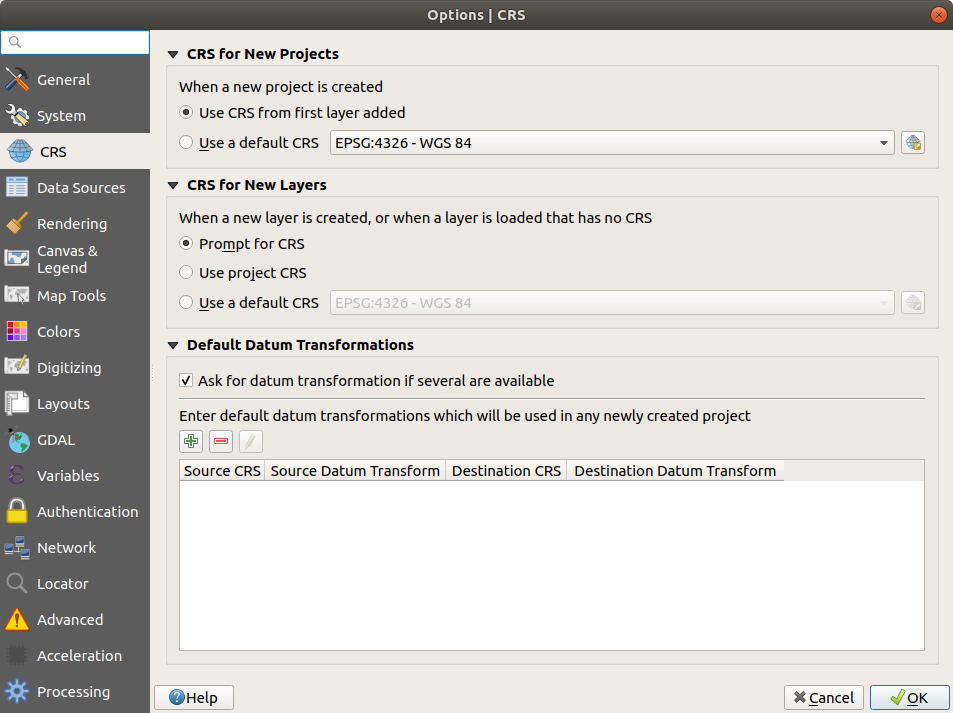
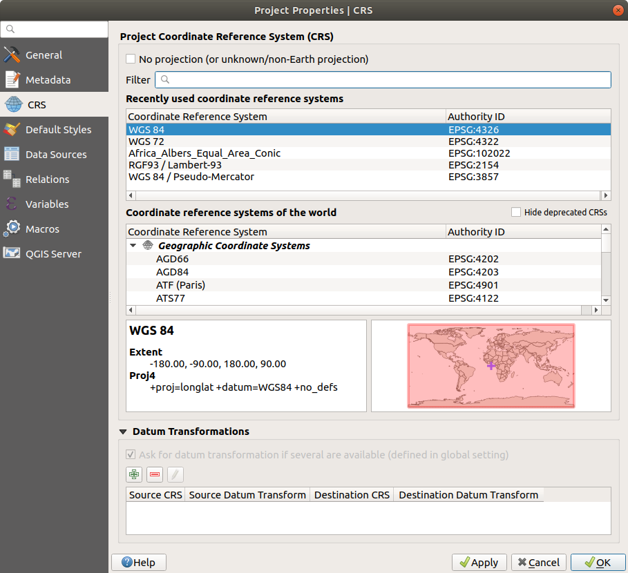
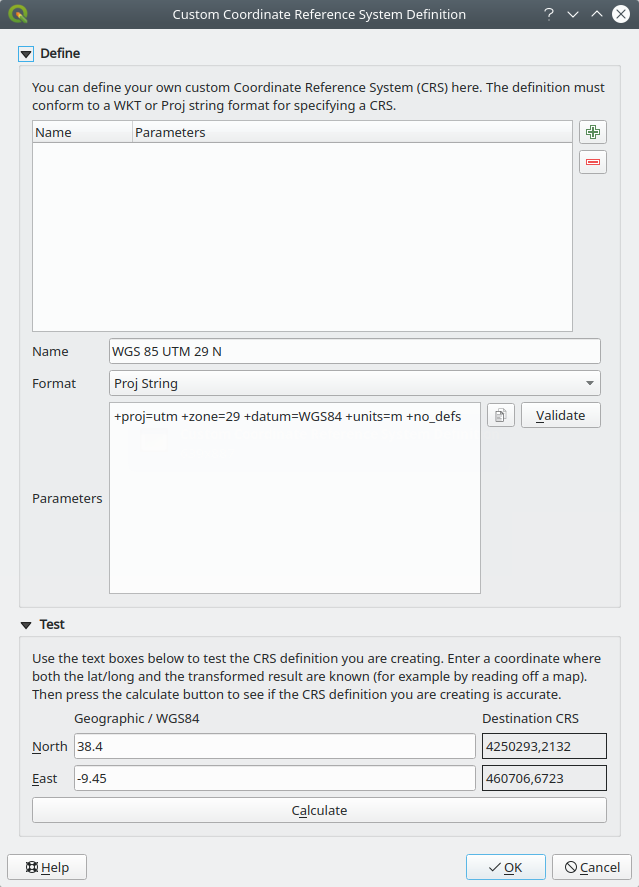
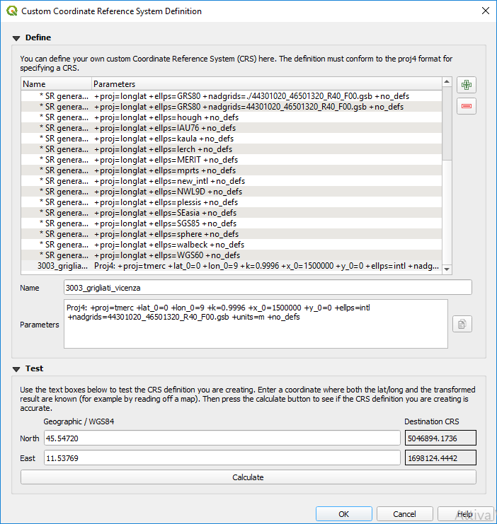
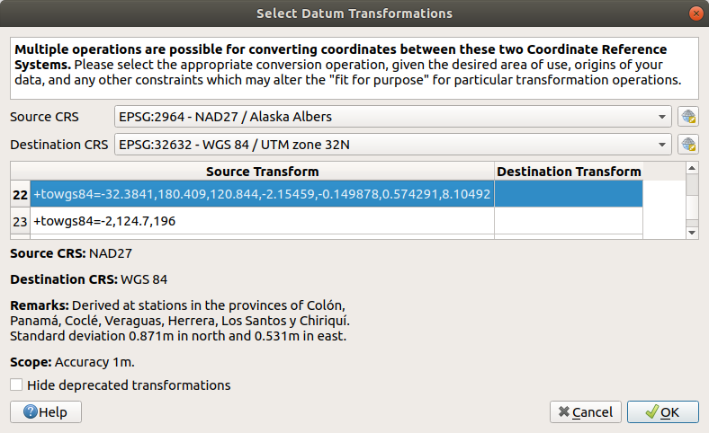

.. only:: html

   |updatedisclaimer|

.. _`label_projections`:

************************
Working with Projections
************************

.. only:: html

   .. contents::
      :local:

.. index:: Projections, CRS (Coordinate Reference System)

QGIS allows users to define a global and project-wide CRS (coordinate
reference system) for layers without a pre-defined CRS. It also allows the user
to define custom coordinate reference systems and supports on-the-fly (OTF)
projection of vector and raster layers. All of these features allow the user to
display layers with different CRSs and have them overlay properly.

.. index:: EPSG (European Petroleum Search Group), IGNF (Institut Geographique National de France)

Overview of Projection Support
==============================

QGIS has support for approximately 2,700 known CRSs. Definitions for each CRS
are stored in a SQLite database that is installed with QGIS. Normally,
you do not need to manipulate the database directly. In fact, doing so may
cause projection support to fail. Custom CRSs are stored in a user database. See
section :ref:`sec_custom_projections` for information on managing your custom
coordinate reference systems.

The CRSs available in QGIS are based on those defined by the European Petroleum
Search Group (EPSG) and the Institut Geographique National de France (IGNF) and
are largely abstracted from the spatial reference tables used in GDAL. EPSG
identifiers are present in the database and can be used to specify a CRS in
QGIS.

In order to use OTF projection, either your data must contain information about its
coordinate reference system or you will need to define a global, layer or
project-wide CRS. For PostGIS layers, QGIS uses the spatial reference identifier
that was specified when the layer was created. For data supported by OGR, QGIS
relies on the presence of a recognized means of specifying the CRS. In the case
of Shapefile, this means a file containing the well-known text (:index:`WKT`)
specification of the CRS. This projection file has the same base name as the
:file:`.shp` file and a :file:`.prj` extension. For example, a shapefile named
:file:`alaska.shp` would have a corresponding projection file named
:file:`alaska.prj`.

Whenever you select a new CRS, the layer units will automatically be
changed in the :guilabel:`General` tab of the |options|
:guilabel:`Project Properties` dialog under the :guilabel:`Project` menu.

.. index:: CRS
   single: CRS; Default CRS

Global Projection Specification
===============================

QGIS starts each new project using the global default projection. The global
default CRS is EPSG:4326 - WGS 84 (``proj=longlat +ellps=WGS84 +datum=WGS84 +no_defs``),
and it comes predefined in QGIS. This default can be changed via the |setProjection|
:sup:`Select CRS` button in the first section, which is used to define the default
coordinate reference system for new projects, as shown in
figure_projection_options_. This choice will be saved for use in subsequent QGIS
sessions.

.. _figure_projection_options:

   CRS tab in the QGIS Options Dialog

When you use layers that do not have a CRS, you need to define how QGIS
responds to these layers. This can be done globally or project-wide in the
:guilabel:`CRS` tab under :menuselection:`Settings -->` |options|
:guilabel:`Options`.

The options shown in figure_projection_options_ are:

* |radioButtonOn| :guilabel:`Prompt for CRS`
* |radioButtonOff| :guilabel:`Use project CRS`
* |radioButtonOff| :guilabel:`Use default CRS displayed below`

If you want to define the coordinate reference system for a certain layer
without CRS information, you can also do that in the :guilabel:`Source` tab
of the raster and vector properties dialog (see :ref:`label_sourcetab` for
rasters and :ref:`vectorsourcemenu` for vectors). If your layer already has a CRS
defined, it will be displayed as shown in :ref:`figure_vector_general`.

.. tip:: **CRS in the Layers Panel**

   Right-clicking on a layer in the Layers Panel (section :ref:`label_legend`)
   provides two CRS shortcuts. :guilabel:`Set layer CRS` takes you directly
   to the Coordinate Reference System Selector dialog (see figure_projection_project_).
   :guilabel:`Set project CRS from Layer` redefines the project CRS using
   the layer's CRS.

.. index:: CRS; On-the-fly transformation
.. _otf_transformation:

Define On The Fly (OTF) CRS Transformation
==========================================

QGIS supports on the fly CRS transformation for both raster and vector data.
However, OTF is not activated by default. When OTF is off, each layer is drawn
using the coordinates as read from the data source. When OTF is on, each layer's
coordinates are transformed to the CRS of the project.

There are three ways to enable On The Fly CRS Transformation:

* Select |projectProperties| :menuselection:`Properties... --> CRS` from
  the :menuselection:`Project` menu. You
  can then  activate the |checkbox| :guilabel:`Enable on the fly CRS
  transformation (OTF)` checkbox in the |crs| :guilabel:`CRS` tab and select
  the CRS to use (see :ref:`crs_selector`)
* Click on the |geographic| :sup:`CRS status` icon in the lower right-hand
  corner of the status bar, leading you to the previous dialog.
* Turn OTF on by default in the |crs| :guilabel:`CRS` tab of the
  :menuselection:`Settings --> Options` dialog by selecting |checkbox|
  :guilabel:`Enable 'on the fly' reprojection by default` or
  :guilabel:`Automatically enable 'on the fly' reprojection if layers have
  different CRS`.

If you have already loaded a layer and you want to enable OTF reprojection, the
best practice is to open the |crs| :guilabel:`CRS` tab of the :guilabel:`Project
Properties` dialog, activate the |checkbox| :guilabel:`Enable 'on the fly'
CRS transformation` checkbox, and select a CRS.
The |geographic| :sup:`CRS status` icon will no longer be greyed out, and all
layers will be OTF projected to the CRS shown next to the icon.

.. index:: Proj.4

.. _figure_projection_project:

   Project Properties Dialog

.. index:: CRS Selection
.. _crs_selector:

Coordinate Reference System Selector
=====================================

This dialog helps you assign a Coordinate Reference System to a project or a
layer, provided a set of projection databases. Items in the dialog are:

* **Filter**: If you know the EPSG code, the identifier, or the name for a
  coordinate reference system, you can use the search feature to find it.
  Enter the EPSG code, the identifier or the name.
* **Recently used coordinate reference systems**: If you have certain CRSs
  that you frequently use in your everyday GIS work, these will be displayed
  in this list. Click on one of these items to select the associated CRS.
* **Coordinate reference systems of the world**: This is a list of all CRSs
  supported by QGIS, including Geographic, Projected and Custom coordinate
  reference systems. To define a CRS, select it from the list by expanding
  the appropriate node and selecting the CRS. The active CRS is preselected.
* **PROJ.4 text**: This is the CRS string used by the PROJ.4 projection
  engine. This text is read-only and provided for informational purposes.

.. tip:: **Looking for a layer CRS? Use the CRS selector.**

   Sometimes, you receive a layer and you don't know its projection. Assuming that you
   have another layer with a valid crs that should overlaps with it, enable the
   OTF reprojection and, in the :guilabel:`Source` tab of the Layer properties
   dialog, use the Coordinate Reference System selector to assign a projection.
   Your layer position is then moved accordingly. You may have to do some trial
   and error in order to find the right position, hence its original CRS.

.. note::

   When operating across layers, for example, computing intersections between two
   layers, it is important that both layers have the same CRS. To change the
   projection of an existing layer, it is **insufficient** to simply change the
   CRS in that layer's properties. Instead you must save the layer as a new layer,
   and choose the desired CRS for the new layer. 

.. index:: CRS
   single: CRS; Custom CRS

.. _sec_custom_projections:

Custom Coordinate Reference System
==================================

If QGIS does not provide the coordinate reference system you need, you can
define a custom CRS. To define a CRS, select |customProjection|
:guilabel:`Custom CRS...` from the :menuselection:`Settings` menu. Custom CRSs
are stored in your QGIS user database. In addition to your custom CRSs, this
database also contains your spatial bookmarks and other custom data.

.. _figure_projection_custom:

   Custom CRS Dialog

Defining a custom CRS in QGIS requires a good understanding of the PROJ.4
projection library. To begin, refer to "Cartographic Projection Procedures
for the UNIX Environment - A User's Manual" by Gerald I. Evenden, U.S.
Geological Survey Open-File Report 90-284, 1990 (available at
ftp://ftp.remotesensing.org/proj/OF90-284.pdf).

This manual describes the use of the ``proj.4`` and related command line
utilities. The cartographic parameters used with ``proj.4`` are described in
the user manual and are the same as those used by QGIS.

The :guilabel:`Custom Coordinate Reference System Definition` dialog requires
only two parameters to define a user CRS:

#. A descriptive name
#. The cartographic parameters in PROJ.4 format

To create a new CRS, click the |signPlus| :sup:`Add new CRS` button and
enter a descriptive name and the CRS parameters.

Integrate an NTv2-transformation in QGIS 
""""""""""""""""""""""""""""""""""""""""""""""
To integrate an NTv2 transformation file in QGIS you need one more step: 

1. Place the NTv2 file (.gsb) in the CRS/Proj folder that QGIS uses (e.g. *C:\\OSGeo4W64\\share\\proj* for windows users)
2. Add in the proj.4 definition the parameter **nadgrids** (+nadgrids=namefile.gsb)

Note that the :guilabel:`Parameters` must begin with a ``+proj=`` block,
to represent the new coordinate reference system.

You can test your CRS parameters to see if they give sane results. To do this,
enter known WGS 84 latitude and longitude values in :guilabel:`North` and
:guilabel:`East` fields, respectively. Click on :guilabel:`Calculate`, and compare the
results with the known values in your coordinate reference system.

.. index:: Datum transformation
.. _datum_transformation:

Default datum transformations
=============================

In QGIS, 'on-the-fly' CRS transformation is enabled by default, meaning that
whenever you use layers with different coordinates system, QGIS transparently
reprojects them while rendering to the project CRS. For some CRS, there are a
number of transforms available. QGIS allows you to define the transformation to
use otherwise QGIS uses a default one.

This customization is done in the :menuselection:`Settings -->` |options|
:guilabel:`Options --> CRS` tab menu under the :guilabel:`Default datum
transformations` group:

* using |checkbox| :guilabel:`Ask for datum transformation if several are
  available`: when more than one appropriate datum transformation exists for a
  source/destination CRS combination, a dialog will automatically be opened
  prompting users to choose which of these datum transformations to use for
  the project;
* or predefining a list of the appropriate default transformations to use
  when loading layers to projects or reprojecting a layer.

  Use the |signPlus| button to open the :guilabel:`Select Datum Transformations`
  dialog. Then:

  #. Indicate the :guilabel:`Source CRS` of the layer, using the drop-down menu
     or the |setProjection| :sup:`Select CRS` widget.
  #. Likewise, provide the :guilabel:`Destination CRS`.
  #. Depending on the transform grid files (based on GDAL and PROJ version
     installed on your system), a list of available transformations from source to
     destination is built in the table. Clicking a row shows details on the settings
     applied (epsg code, accuracy of the transform, number of stations involved...).

     You can choose to only display current valid transformations by checking
     the |checkbox| :guilabel:`Hide deprecated` option.

  #. Find your preferred transformation, select it and click :guilabel:`OK`.

     A new row is added to the table under :menuselection:`CRS --> Default datum
     transformations` with information about 'Source CRS' and 'Destination CRS'
     as well as 'Source datum transform' and 'Destination datum transform'.

  From now, QGIS automatically uses the selected datum transformation for
  further transformation between these two CRSs until you |signMinus| remove
  it from the list or |toggleEditing| replace it with another one.

.. _figure_projection_datum:

   Selecting a preferred default datum transformation

.. Substitutions definitions - AVOID EDITING PAST THIS LINE
   This will be automatically updated by the find_set_subst.py script.
   If you need to create a new substitution manually,
   please add it also to the substitutions.txt file in the
   source folder.

.. |checkbox| image:: /static/common/checkbox.png
   :width: 1.3em
.. |crs| image:: /static/common/CRS.png
   :width: 1.5em
.. |customProjection| image:: /static/common/mActionCustomProjection.png
   :width: 1.5em
.. |geographic| image:: /static/common/geographic.png
.. |options| image:: /static/common/mActionOptions.png
   :width: 1em
.. |projectProperties| image:: /static/common/mActionProjectProperties.png
   :width: 1.5em
.. |radioButtonOff| image:: /static/common/radiobuttonoff.png
.. |radioButtonOn| image:: /static/common/radiobuttonon.png
.. |setProjection| image:: /static/common/mActionSetProjection.png
   :width: 1.5em
.. |signMinus| image:: /static/common/symbologyRemove.png
   :width: 1.5em
.. |signPlus| image:: /static/common/symbologyAdd.png
   :width: 1.5em
.. |toggleEditing| image:: /static/common/mActionToggleEditing.png
   :width: 1.5em
.. |updatedisclaimer| replace:: :disclaimer:`Docs in progress for 'QGIS testing'. Visit https://docs.qgis.org/3.4 for QGIS 3.4 docs and translations.`
