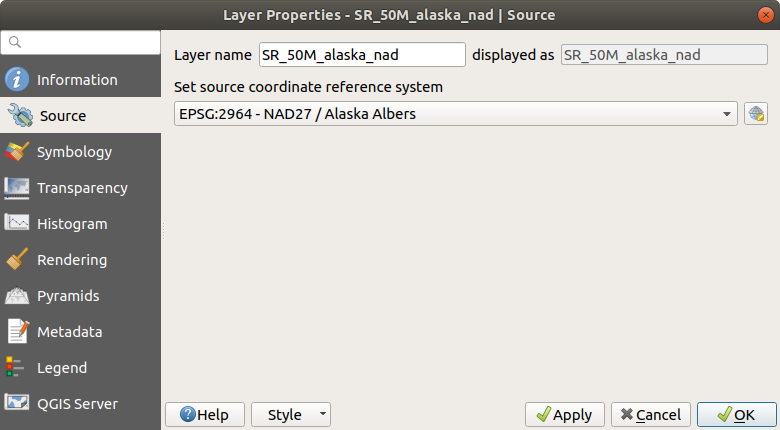
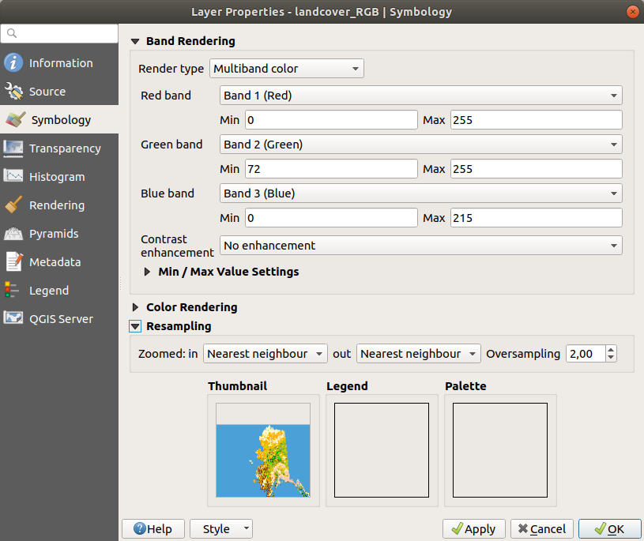
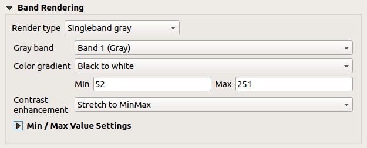
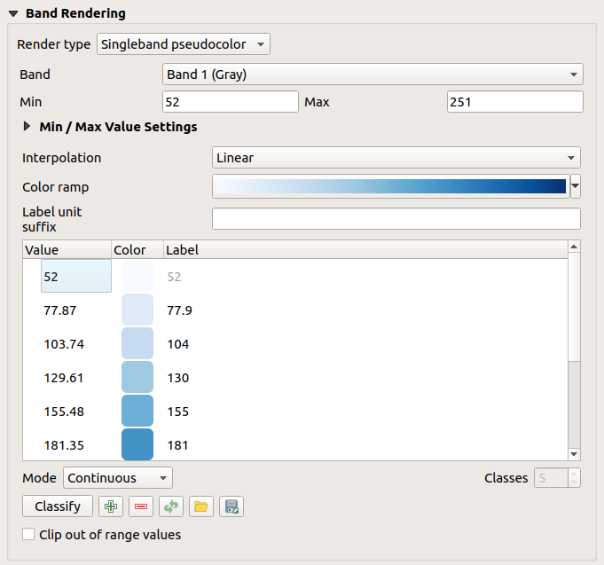
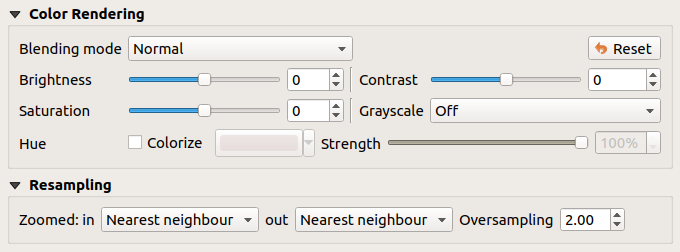
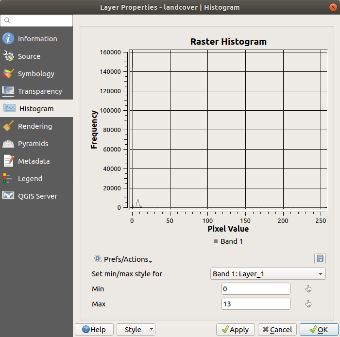
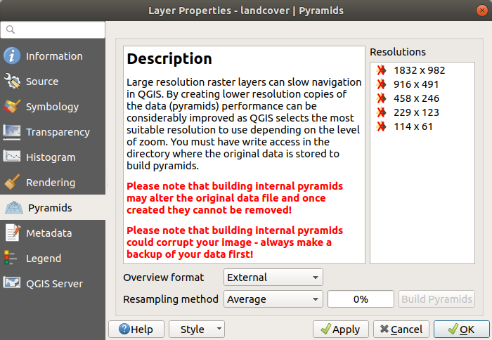
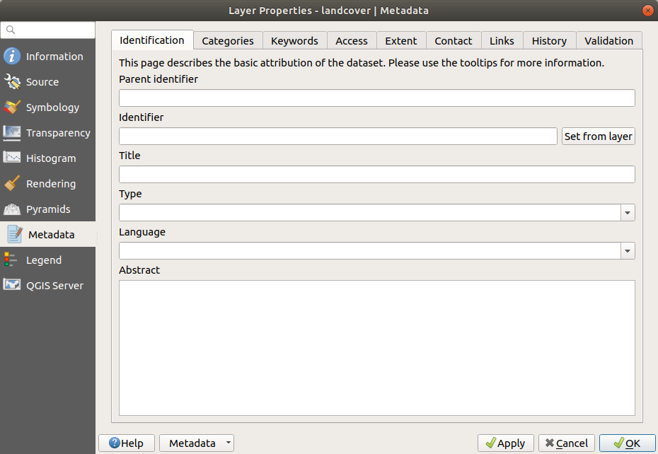

.. only:: html

   |updatedisclaimer|

.. index:: Raster, Layer properties
.. _raster_properties_dialog:

Raster Properties Dialog
========================

.. only:: html

   .. contents::
      :local:

To view and set the properties for a raster layer, double click on the layer name
in the map legend, or right click on the layer name and choose :guilabel:`Properties`
from the context menu. This will open the :guilabel:`Raster Layer Properties`
dialog (see figure_raster_properties_).

There are several tabs in the dialog:

* :guilabel:`Source`
* :guilabel:`Symbology`
* :guilabel:`Transparency`
* :guilabel:`Histogram`
* :guilabel:`Rendering`
* :guilabel:`Pyramids`
* :guilabel:`Legend`
* :guilabel:`QGIS Server`

.. _figure_raster_properties:

   Raster Layers Properties Dialog

.. tip:: **Live update rendering**

   The :ref:`layer_styling_panel` provides you with some of the common features
   of the Layer properties dialog and is a good modeless widget that
   you can use to speed up the configuration of the layer styles and
   automatically view your changes in the map canvas.

.. note::

   Because properties (symbology, label, actions, default values, forms...) of
   embedded layers (see :ref:`nesting_projects`) are pulled from the original
   project file and to avoid changes that may break this behavior, the layer
   properties dialog is made unavailable for these layers.

.. _label_sourcetab:

Source Properties
-----------------

Layer Info
..........

The :guilabel:`Source` tab displays basic information about the selected
raster, including the layer source path, the display name in the legend
(which can be modified), and the number of columns, rows and no-data values
of the raster.

Coordinate Reference System
...........................

Displays the layer's Coordinate Reference System (CRS) as a PROJ.4 string. You
can change the layer's CRS, selecting a recently used one in the drop-down list
or clicking on |setProjection| :sup:`Select CRS` button (see :ref:`crs_selector`).
Use this process only if the CRS applied to the layer is a wrong one or if none
was applied. If you wish to reproject your data into another CRS, rather use
layer reprojection algorithms from Processing or :ref:`Save it into another
layer <general_saveas>`.

.. index:: Symbology, Single Band Raster, Three Band Color Raster, Multi Band Raster

.. _label_symbology:

Symbology Properties
--------------------

Band rendering
..............

QGIS offers four different :guilabel:`Render types`.
The renderer chosen is dependent on the data type.

#. Multiband color - if the file comes as a multiband with several bands (e.g.,
   used with a satellite image with several bands)
#. Paletted - if a single band file comes with an indexed palette (e.g., used
   with a digital topographic map)
#. Singleband gray - (one band of) the image will be rendered as gray; QGIS will
   choose this renderer if the file has neither multibands nor an indexed palette
   nor a continuous palette (e.g., used with a shaded relief map)
#. Singleband pseudocolor - this renderer is possible for files with a continuous palette,
   or color map (e.g., used with an elevation map)

.. _multiband_color:

**Multiband color**

With the multiband color renderer, three selected bands from the image will be
rendered, each band representing the red, green or blue component that will be
used to create a color image. You can choose several :guilabel:`Contrast
enhancement` methods: 'No enhancement', 'Stretch to MinMax', 'Stretch and clip
to MinMax' and 'Clip to min max'.

.. _figure_raster_multiband:

   Raster Symbology - Multiband color rendering

This selection offers you a wide range of options to modify the appearance
of your raster layer. First of all, you have to get the data range from your
image. This can be done by choosing the :guilabel:`Extent` and pressing
**[Load]**. QGIS can |radioButtonOn| :guilabel:`Estimate (faster)` the
:guilabel:`Min` and :guilabel:`Max` values of the bands or use the
|radioButtonOff| :guilabel:`Actual (slower)` :guilabel:`Accuracy`.

Now you can scale the colors with the help of the :guilabel:`Load min/max values`
section. A lot of images have a few very low and high data. These outliers can be
eliminated using the |radioButtonOn| :guilabel:`Cumulative count cut` setting.
The standard data range is set from 2% to 98% of the data values and can be adapted
manually. With this setting, the gray character of the image can disappear.
With the scaling option |radioButtonOff| :guilabel:`Min/max`, QGIS creates a color
table with all of the data included in the original image (e.g., QGIS creates 
a color table with 256 values, given the fact that you have 8 bit bands).
You can also calculate your color table using the |radioButtonOff| :guilabel:`Mean
+/- standard deviation x` |selectNumber|.
Then, only the values within the standard deviation or within multiple standard deviations
are considered for the color table. This is useful when you have one or two cells
with abnormally high values in a raster grid that are having a negative impact on
the rendering of the raster.

All calculations can also be made for the |radioButtonOff| :guilabel:`Current` extent.

.. tip:: **Viewing a Single Band of a Multiband Raster**

   If you want to view a single band of a multiband
   image (for example, Red), you might think you would set the Green and Blue
   bands to "Not Set". But this is not the correct way. To display the Red band,
   set the image type to 'Singleband gray', then select Red as the band to use
   for Gray.

**Paletted**

This is the standard render option for singleband files that already include a
color table, where each pixel value is assigned to a certain color. In that case,
the palette is rendered automatically. If you want to change colors assigned to
certain values, just double-click on the color and the :guilabel:`Select color`
dialog appears. Also, in QGIS it's possible to assign a label to the color values.
The label appears in the legend of the raster layer then.

.. _figure_raster_paletted:

.. figure:: img/rasterPaletted.png
   :align: center

   Raster Symbology - Paletted Rendering

.. index:: Contrast enhancement

**Contrast enhancement**

.. note::
   When adding GRASS rasters, the option *Contrast enhancement* will always be
   set automatically to *stretch to min max*, regardless of if this is set to
   another value in the QGIS general options.

**Singleband gray**

This renderer allows you to render a single band layer with a :guilabel:`Color gradient`:
'Black to white' or 'White to black'. You can define a :guilabel:`Min`
and a :guilabel:`Max` value by choosing the :guilabel:`Extent` first and
then pressing **[Load]**. QGIS can |radioButtonOn| :guilabel:`Estimate (faster)`
the :guilabel:`Min` and :guilabel:`Max` values of the bands or use the
|radioButtonOff| :guilabel:`Actual (slower)` :guilabel:`Accuracy`.

.. _figure_raster_gray:

   Raster Symbology - Singleband gray rendering

With the :guilabel:`Load min/max values` section, scaling of the color table
is possible. Outliers can be eliminated using the |radioButtonOn| :guilabel:`Cumulative
count cut` setting.
The standard data range is set from 2% to 98% of the data values and can
be adapted manually. With this setting, the gray character of the image can disappear.
Further settings can be made with |radioButtonOff| :guilabel:`Min/max` and
|radioButtonOff| :guilabel:`Mean +/- standard deviation x` |selectNumber|.
While the first one creates a color table with all of the data included in the
original image, the second creates a color table that only considers values
within the standard deviation or within multiple standard deviations.
This is useful when you have one or two cells with abnormally high values in
a raster grid that are having a negative impact on the rendering of the raster.

.. index:: Color map, Color interpolation, Discrete
.. _label_colormaptab:

**Singleband pseudocolor**

This is a render option for single-band files, including a continuous palette.
You can also create individual color maps for the single bands here.

.. _figure_raster_pseudocolor:

   Raster Symbology - Singleband pseudocolor rendering

Three types of color interpolation are available:

#. Discrete
#. Linear
#. Exact

In the left block, the button |signPlus| :sup:`Add values manually` adds a value
to the individual color table. The button |signMinus| :sup:`Remove selected row`
deletes a value from the individual color table, and the
|arrowDown| :sup:`Sort colormap items` button sorts the color table according
to the pixel values in the value column. Double clicking on the value column
lets you insert a specific value. Double clicking on the color column opens the dialog
:guilabel:`Change color`, where you can select a color to apply on that value.
Further, you can also add labels for each color, but this value won't be displayed
when you use the identify feature tool.
You can also click on the button |draw| :sup:`Load color map from band`,
which tries to load the table from the band (if it has any). And you can use the
buttons |fileOpen| :sup:`Load color map from file` or |fileSaveAs|
:sup:`Export color map to file` to load an existing color table or to save the
defined color table for other sessions.

In the right block, :guilabel:`Generate new color map` allows you to create newly
categorized color maps. For the :guilabel:`Classification mode` |selectString|
'Equal interval', you only need to select the :guilabel:`number of classes`
|selectNumber| and press the button :guilabel:`Classify`. You can invert the colors
of the color map by clicking the |checkbox| :guilabel:`Invert`
checkbox. In the case of the :guilabel:`Mode` |selectString| 'Continuous', QGIS creates
classes automatically depending on the :guilabel:`Min` and :guilabel:`Max`.
Defining :guilabel:`Min/Max` values can be done with the help of the :guilabel:`Load min/max values` section.
A lot of images have a few very low and high data. These outliers can be eliminated
using the |radioButtonOn| :guilabel:`Cumulative count cut` setting. The standard
data range is set from 2% to 98% of the data values and can be adapted manually.
With this setting, the gray character of the image can disappear.
With the scaling option |radioButtonOff| :guilabel:`Min/max`, QGIS creates a color
table with all of the data included in the original image (e.g., QGIS creates a
color table with 256 values, given the fact that you have 8 bit bands).
You can also calculate your color table using the |radioButtonOff| :guilabel:`Mean +/-
standard deviation x` |selectNumber|.
Then, only the values within the standard deviation or within multiple standard deviations
are considered for the color table.

Color rendering
...............

For every :guilabel:`Band rendering`, a :guilabel:`Color rendering` is possible.

You can also achieve special rendering effects for your raster file(s) using one
of the blending modes (see :ref:`blend-modes`).

Further settings can be made in modifying the :guilabel:`Brightness`, the
:guilabel:`Saturation` and the :guilabel:`Contrast`. You can also use a :guilabel:`Grayscale`
option, where you can choose between 'By lightness', 'By luminosity' and 'By average'.
For one hue in the color table, you can modify the 'Strength'.

Resampling
..........

The :guilabel:`Resampling` option makes its appearance when you zoom in and out of an
image. Resampling modes can optimize the appearance of the map. They calculate a new gray value
matrix through a geometric transformation.

.. _figure_raster_resampling:

   Raster Symbology - Color rendering and Resampling settings

When applying the 'Nearest neighbour' method, the map can have a pixelated
structure when zooming in. This appearance can be improved by using the
'Bilinear' or 'Cubic' method, which cause sharp features to be blurred.
The effect is a smoother image. This method can be applied, for instance,
to digital topographic raster maps.

At the bottom of the :guilabel:`Symbology` tab, you can see a thumbnail of the layer,
its legend symbol, and the palette.

.. index:: Transparency
.. _raster_transparency:

Transparency Properties
-----------------------

QGIS has the ability to display each raster layer at a different transparency level.
Use the transparency slider |slider| to indicate to what extent the underlying layers
(if any) should be visible through the current raster layer. This is very useful
if you like to overlay more than one raster layer (e.g., a shaded relief map
overlayed by a classified raster map). This will make the look of the map more
three dimensional.

.. _figure_raster_transparency:

.. figure:: img/rasterTransparency.png
   :align: center

   Raster Transparency

Additionally, you can enter a raster value that should be treated as *NODATA* in
the :guilabel:`Additional no data value` option.

An even more flexible way to customize the transparency can be done in the
:guilabel:`Custom transparency options` section:

* Use :guilabel:`Transparency band` to apply transparency on an entire band;
* Provide a list of pixels to make transparent with the corresponding level of
  transparency:

  #. Click the |signPlus| :sup:`Add values manually` button. A new row will
     appear in the pixel list;
  #. Enter the **Red**, **Green** and **Blue** values of the pixel and adjust
     the **Percent Transparent** to apply;
  #. Alternatively, you can directly fetch the pixel values directly from the
     raster using the |contextHelp| :sup:`Add values from display` button.
     Then enter the transparency value.
  #. Repeat the steps to adjust more values with custom transparency.
  #. Press the **[Apply]** button and have a look at the map.

  As you can see, it is quite easy to set custom transparency, but it can be
  quite a lot of work. Therefore, you can use the button |fileSave|
  :sup:`Export to file` to save your transparency list to a file. The button
  |fileOpen| :sup:`Import from file` loads your transparency settings and
  applies them to the current raster layer.

.. index:: Histogram
.. _label_histogram:

Histogram Properties
--------------------

The :guilabel:`Histogram` tab allows you to view the distribution of the bands
or colors in your raster. The histogram is generated when you press the
**[Compute Histogram]** button. All existing bands will be displayed together.
You can save the histogram as an image with the |fileSave| button.

At the bottom of the histogram, you can select a raster band in the drop-down
menu and :guilabel:`Set min/max style for` it.
The |actionRun| :guilabel:`Prefs/Actions` drop-down menu gives you advanced
options to customize the histogram:

* With the :guilabel:`Visibility` option, you can display histograms of the individual
  bands. You will need to select the option |radioButtonOff| :guilabel:`Show selected
  band`.
* The :guilabel:`Min/max options` allow you to 'Always show min/max markers', to 'Zoom
  to min/max' and to 'Update style to min/max'.
* The :guilabel:`Actions` option allows you to 'Reset' or 'Recompute histogram' after
  you changed the min or max values of the band(s).

.. _figure_raster_histogram:

   Raster Histogram

.. index:: Rendering
.. _raster_rendering:

Rendering
---------

Scale dependent visibility
..........................

You can set the :guilabel:`Maximum (inclusive)` and :guilabel:`Minimum
(exclusive)` scale, defining a range of scale in which the layer will be
visible. Out of this range, it's hidden. The |mapIdentification|
:sup:`Set to current canvas scale` button helps you use the current map
canvas scale as boundary of the range visibility.
See :ref:`label_scaledepend` for more information.

.. index:: Pyramids
.. _raster_pyramids:

Pyramids Properties
-------------------

Large resolution raster layers can slow navigation in QGIS. By creating lower
resolution copies of the data (pyramids), performance can be considerably
improved, as QGIS selects the most suitable resolution to use depending on the
level of zoom.

You must have write access in the directory where the original data is stored
to build pyramids.

From the :guilabel:`Resolutions` list, select resolutions for which you want to
create pyramid by clicking on them.

If you choose **Internal (if possible)** from the :guilabel:`Overview format`
drop-down menu, QGIS tries to build pyramids internally.

.. note::

   Please note that building pyramids may alter the original data file, and once
   created they cannot be removed. If you wish to preserve a 'non-pyramided'
   version of your raster, make a backup copy prior to building pyramids.

If you choose **External** and **External (Erdas Imagine)** the pyramids will
be created in a file next to the original raster with the same name and a
:file:`.ovr` extension.

Several :guilabel:`Resampling methods` can be used to calculate the pyramids:

* Nearest Neighbour
* Average
* Gauss
* Cubic
* Mode
* None

Finally, click **[Build pyramids]** to start the process.

.. _figure_raster_pyramids:

   Raster Pyramids

.. index:: Legend, Embedded widget
.. _raster_legend:

Legend Properties
-----------------

The :guilabel:`Legend` tab provides you with a list of widgets you can embed
within the layer tree in the Layers panel. The idea is to have a way to
quickly access some actions that are often used with the layer (setup
transparency, filtering, selection, style or other stuff...).

By default, QGIS provides transparency widget but this can be extended by
plugins registering their own widgets and assign custom actions to layers
they manage.

.. index:: QGIS Server
.. _raster_server:

QGIS Server Properties
----------------------

The :guilabel:`QGIS Server` tab displays a wealth of information about the raster
layer, including statistics about each band in the current raster layer.
From this tab, entries may be made for the :guilabel:`Description`,
:guilabel:`Attribution`, :guilabel:`MetadataUrl` and :guilabel:`Properties`.
In :guilabel:`Properties`, statistics are gathered on a 'need to know'
basis, so it may well be that a given layer's statistics have not yet been
collected.

.. _figure_raster_metadata:

   QGIS Server in Raster Properties

.. Substitutions definitions - AVOID EDITING PAST THIS LINE
   This will be automatically updated by the find_set_subst.py script.
   If you need to create a new substitution manually,
   please add it also to the substitutions.txt file in the
   source folder.

.. |actionRun| image:: /static/common/mAction.png
   :width: 1.5em
.. |arrowDown| image:: /static/common/mActionArrowDown.png
   :width: 1.5em
.. |checkbox| image:: /static/common/checkbox.png
   :width: 1.3em
.. |contextHelp| image:: /static/common/mActionContextHelp.png
   :width: 1.5em
.. |draw| image:: /static/common/mActionDraw.png
   :width: 1.5em
.. |fileOpen| image:: /static/common/mActionFileOpen.png
   :width: 1.5em
.. |fileSave| image:: /static/common/mActionFileSave.png
   :width: 1.5em
.. |fileSaveAs| image:: /static/common/mActionFileSaveAs.png
   :width: 1.5em
.. |mapIdentification| image:: /static/common/mActionMapIdentification.png
   :width: 1.5em
.. |radioButtonOff| image:: /static/common/radiobuttonoff.png
.. |radioButtonOn| image:: /static/common/radiobuttonon.png
.. |selectNumber| image:: /static/common/selectnumber.png
   :width: 2.8em
.. |selectString| image:: /static/common/selectstring.png
   :width: 2.5em
.. |setProjection| image:: /static/common/mActionSetProjection.png
   :width: 1.5em
.. |signMinus| image:: /static/common/symbologyRemove.png
   :width: 1.5em
.. |signPlus| image:: /static/common/symbologyAdd.png
   :width: 1.5em
.. |slider| image:: /static/common/slider.png
.. |updatedisclaimer| replace:: :disclaimer:`Docs in progress for 'QGIS testing'. Visit http://docs.qgis.org/2.18 for QGIS 2.18 docs and translations.`
