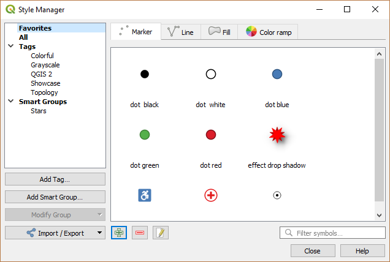
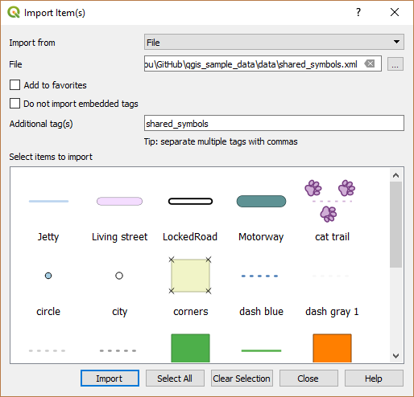
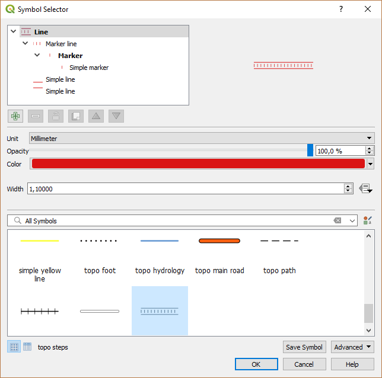

.. only:: html

.. _vector_symbol_library:

********************
 The Symbol Library
********************

.. only:: html

   .. contents::
      :local:

.. index::
    single: Style Manager

.. _vector_style_manager:

The Style Manager
==================

The :guilabel:`Style Manager` is the place where users can manage and create
generic symbols and color ramps to be used in several QGIS projects. You can
open that modeless dialog:

* with the |styleManager| :sup:`Style Manager` button of the Project toolbar;
* from the :menuselection:`Settings -->` |styleManager| :menuselection:`Style
  Manager...` menu;
* or from a vector :menuselection:`Layer Properties --> Symbology` tab (using the
  |styleManager| :sup:`Style Manager` button in a :ref:`symbol property
  <symbol-selector>` dialog).

The dialog allows you to:

* create, edit and remove symbols and color ramps;
* organize symbols and color ramps in custom groups;
* export and import symbols and color ramps.

.. _figure_style_manager:

   The Style Manager

.. _group_symbols:

Organizing symbols and color ramps
----------------------------------

The :guilabel:`Style Manager` dialog displays in its center a frame with
previewed items organized into tabs:

* |pointLayer| :guilabel:`Marker` for point symbols;
* |lineLayer| :guilabel:`Line` for linear symbols;
* |polygonLayer| :guilabel:`Fill` for surface symbols;
* and |color| :guilabel:`Color ramp`.

For each family of items, you can organize the elements into different categories,
listed in the panel on the left:

* **Favorites**: displayed by default when configuring an item, it shows a
  set of default symbols and color ramps you can extend;
* **All**: listing all the installed symbols and color ramps;
* **Tags**: shows a list of labels you can use to identify the items.
  A symbol or color ramp can be tagged more than once. Select a tag in the list
  and you'll see the items that belong to it for each type of item.
  To create a new tag you could later attach to symbols or color ramps, use the
  :guilabel:`Add Tag...` button or select the |signPlus| :guilabel:`Add Tag...`
  from any tag contextual menu;
* **Smart Group**: a smart group dynamically fetches its symbols according to
  conditions set (see eg, figure_smart_group_). Click the :guilabel:`Add Smart Group...`
  button to create smart groups. The dialog box allows you to enter an expression
  to filter the items to select (has a particular tag, have a string in its name,
  etc.). Any symbol or color ramp that satisfies the entered condition(s) is
  automatically added to the smart group.

.. _figure_smart_group:

.. figure:: img/create_smartgroup.png
   :align: center

   Creating a Smart Group

Tags and smart groups are not mutually exclusive: they are simply two different
ways to organize your symbols and color ramps. 
Unlike the smart groups that automatically fetch their belonged items based on
the input constraints, tags are filled by the user. To edit any of those categories,
you can either:

* select the items, right-click and choose :menuselection:`Add to Tag -->`
  and then select the tag name or create a new tag;
* select the tag and press :menuselection:`Modify group... --> Attach Selected Tag
  to Symbols`. A |unchecked| checkbox appears near each item to help you select
  or deselect it. When selection is finished, press :menuselection:`Modify group... -->
  Finish Tagging`.
* select the smart group, press :menuselection:`Modify group... --> Edit smart group...`
  and configure a new set of constraints in the :guilabel:`Smart Group Editor` dialog.
  This option is also available in the contextual menu of the smart group.

To remove a tag or a smart group, right-click on it and select the |signMinus|
:guilabel:`Remove` button. Note that this does not delete the items grouped in the
category.

Adding, editing or removing an item
-----------------------------------

As seen earlier, symbols and color ramps are listed under different tabs whose
contents depend on the active category (tag, smart group, favorites...). For each
type of symbols (*Marker* , *Line* or *Fill*) and color ramp, when the tab is
enabled, you can:

* Add new items: press the |signPlus| :sup:`Add item` button and configure the
  item following :ref:`symbols <symbol-selector>` or :ref:`color ramps <color-ramp>`
  builder description.
* Modify an existing item: select an item and press |symbologyEdit| :sup:`Edit item`
  button and configure as mentioned above. 
* Delete existing items: to delete a symbol you no longer need, select it and click
  |signMinus| :sup:`Remove item` (also available through right-click).
  The symbol will be deleted from the local symbols database.

Right-clicking over a selection of items also allows you to:

* :guilabel:`Add to Favorites`;
* :guilabel:`Remove from Favorites`;
* :menuselection:`Add to Tag -->` and select the appropriate tag or create a new one to use;
* :guilabel:`Clear Tags`: detaching the symbols from any tag;
* :guilabel:`Remove Item(s)`;
* :guilabel:`Edit Item`: applies to the item you right-click over;
* :guilabel:`Export Selected Symbol(s) as PNG...` (not available with color ramps);
* :guilabel:`Export Selected Symbol(s) as SVG...` (not available with color ramps);

.. _share_symbols:

Sharing symbols and color ramps
-------------------------------

The |sharing| :guilabel:`Import/Export` tool, at the left bottom of the Style
Manager dialog, offers options to easily share symbols and color ramps with
others. These options are also available through right-click over the items.

Exporting items
...............

You can export a set of items to an :file:`.XML` file:

#. Expand the |sharing| :guilabel:`Import/Export` drop-down menu and select
   |fileSave| :guilabel:`Export Item(s)...`
#. Choose the symbols and color ramps you'd like to integrate. Symbol selection
   can be done with the mouse or using a tag or group previously set.
#. Press :guilabel:`Export` when ready. You'll be prompted to indicate the destination
   of the saved file. The XML format generates a single file containing all the
   selected symbols. This file can then be imported in another user's style library.

.. _figure_symbol_export:

   Exporting symbols and color ramps

When symbols are selected, you can also export them to :file:`.PNG` or :file:`.SVG`.
Exporting to :file:`.PNG` or :file:`.SVG` (both not available for color ramp symbols)
creates a file for each selected symbol in a given folder. The SVG folder can be
added to the :guilabel:`SVG paths` in :menuselection:`Settings --> Options -->
System` menu of another user, allowing him direct access to all these symbols.

Importing items
...............

You can extend your symbols library by importing new symbols:

#. Expand the |sharing| :guilabel:`Import/Export` drop-down menu and select
   |fileOpen| :guilabel:`Import Item(s)` at the left bottom of the dialog.
#. In the new dialog, indicate the source of the symbols (it can be an
   :file:`.xml` file on the disk or a url).
#. Set whether to |unchecked| :guilabel:`Add to favorites` the items to import.
#. Check |unchecked| :guilabel:`Do not import embedded tags` to avoid the import
   of tags associated to the items being imported.
#. Give the name of any :guilabel:`Additional tag(s)` to apply to the new items.
#. Select from the preview the symbols you want to add to your library.
#. And press **Import**.

.. _figure_symbol_import:

   Importing symbols and color ramps

.. _color-ramp:

Color Ramp
-----------

.. index:: Colors
   single: Colors; Color ramp
   single: Colors; Gradient color ramp
   single: Colors; Color brewer
   single: Colors; Custom color ramp

The Color ramp tab in the :guilabel:`Style Manager` dialog helps you preview
different color ramps based on the category selected in the left panel.

To create a custom color ramp, activate the Color ramp tab and click the
|signPlus| :sup:`Add item` button. The button reveals a drop-down list to
choose the ramp type:

* :guilabel:`Gradient`: given a start and end colors, generate a color ramp which
  can be **continuous** or **discrete**. With double-clicking the ramp preview, you
  can add as many intermediate color stops as you want.

.. _figure_color_custom_ramp:

   Example of custom gradient color ramp with multiple stops

* :guilabel:`Color presets`: allows to create a color ramp consisting of a list of
  colors selected by the user;
* :guilabel:`Random`: creates a random set of colors based on range of values for
  :guilabel:`Hue`, :guilabel:`Saturation`, :guilabel:`Value` and :guilabel:`Opacity`
  and a number of colors (:guilabel:`Classes`);
* :guilabel:`Catalog: ColorBrewer`: a set of predefined discrete color gradients
  you can customize the number of colors in the ramp;
* or :guilabel:`Catalog: cpt-city`: an access to a whole catalog of color gradients to
  locally :guilabel:`save as standard gradient`. The cpt-city option opens a new
  dialog with hundreds of themes included 'out of the box'.

.. _figure_color_cpt_city:

   cpt-city dialog with hundreds of color ramps

.. tip:: **Easily adjust the color stops of the gradient color ramp**

 Double-clicking the ramp preview or drag-and-drop a color from the color spot onto
 the ramp preview adds a new color stop. Each color stop can be tweaked using the
 :ref:`color-selector` widgets or by plotting each of its parameters. You can also 
 reposition it using the mouse, the arrow keys (combine with :kbd:`Shift` key for
 a larger move) or the :guilabel:`Relative position` spinbox. Pressing :guilabel:`Delete
 stop` as well as :kbd:`DEL` key removes the selected color stop. 

.. _symbol-selector:

The Symbol Selector
====================

The Symbol selector is the main dialog to design a symbol.
You can create or edit Marker, Line or Fill Symbols.

.. _figure_symbol_marker:

   Designing a Line symbol

Two main components structure the symbol selector dialog:

* the symbol tree, showing symbol layers that are combined afterwards to shape a
  new global symbol
* and settings to configure the selected symbol layer in the tree.

.. _symbol_tree:

The symbol layer tree
----------------------

A symbol can consist of several :guilabel:`Symbol layers`. The symbol tree shows
the overlay of these symbol layers that are combined afterwards to shape a
new global symbol. Besides, a dynamic symbol representation is updated as soon as
symbol properties change.

A set of tools is available to manage the symbol tree items and according to the
level selected, you'll get enabled different tools at the bottom of the dialog to:

* |signPlus| add new symbol layer: you can stack as many symbols as you want
* |signMinus| remove the selected symbol layer
* lock colors of symbol layer: a |locked| locked color stays unchanged when
  user changes the color at the global (or upper) symbol level
* |duplicateLayer| duplicate a (group of) symbol layer(s)
* move up or down the symbol layer

When a symbol layer is selected in the tree, you can also:

* control its visibility with the |checkbox| :guilabel:`Enable layer` option.
  Disabled symbol layers are not drawn, but are saved and can be enabled at a
  later stage. This makes it easier to customize parts of the symbol based on
  the feature attributes or to tweak symbol appearance without having to
  totally delete a symbol layer;
* apply :ref:`rendering effects <draw_effects>` using the |checkbox|
  :guilabel:`Draw effects` button.

.. _edit_symbol:

Configuring a symbol
---------------------

In QGIS, configuring a symbol is done in two steps: the symbol and then the
symbol layer.

The symbol
..........

At the top level of the tree, it depends on the layer geometry and can be of
**Marker**, **Line** or **Fill** type. Each symbol can embed one or
more symbols (including, of any other type) or symbol layers.

You can setup some parameters that apply to the global symbol:

* :guilabel:`Unit`: it can be **Millimeter**, **Points**, **Pixels**,
  **Meters at Scale**, **Map unit** or **Inches**
* :guilabel:`Transparency`
* :guilabel:`Color`: when this parameter is changed by the user, its value is
  echoed to all unlocked sub-symbols color
* :guilabel:`Size` and :guilabel:`Rotation` for marker symbols
* :guilabel:`Width` for line symbols

.. note::

  The :ref:`Data-defined override <data_defined>` button beside the last layer-related
  parameters is inactive when setting the symbol from the Style manager dialog.
  When the symbol is connected to a map layer, this button helps you create
  proportional or multivariate analysis rendering.

The symbols used at this level are items you can pick from the :ref:`symbols
library <vector_style_manager>`. Available symbols of the corresponding type
are shown and, through the editable drop-down list just above, can be filtered
by free-form text or by :ref:`categories <group_symbols>`.
You can also update the list of symbols using the
|styleManager| :sup:`Style Manager` button and open the eponym dialog. There,
you can use any capabilities as exposed in :ref:`vector_style_manager` section.

The symbols are displayed either:

* in an icon list (with thumbnail, name and associated tags) using the
  |openTable| :sup:`List View` button below the frame;
* or as icon preview using the |iconView| :sup:`Icon View` button.

Press the :guilabel:`Save Symbol` button to add any symbol being edited to the symbols
library. With the :guilabel:`Advanced` |selectString| option, you can:

* set the **symbol levels**: defining the way symbol layers are connected to
  each other in the map canvas (see :ref:`Symbols_levels` for more information)
* and for line and fill symbols, **clip features to canvas extent**.

.. Todo: Explain what does advanced "clip features to canvas" option mean for the symbol?

.. tip::

   Note that once you have set the size in the lower levels of the
   :guilabel:`Symbol layers` dialog, the size of the whole symbol can be changed
   with the :guilabel:`Size` (for marker symbols) or the :guilabel:`Width` (for
   line symbols) menu in the first level again. The size of the lower levels
   changes accordingly, while the size ratio is maintained.

.. _symbol_layer:

The symbol layer
................

At a lower level of the tree, you can customize the symbol layers. The available
symbol layer types depend on the upper symbol type. You can apply on the symbol
layer |paintEffects| :ref:`paint effects <draw_effects>` to enhance its rendering.

Because describing all the options of all the symbol layer types would not be
possible, only particular and significant ones are mentioned below.

Common parameters
^^^^^^^^^^^^^^^^^

Some common options and widgets are available to build a symbol layer,
regardless it's of marker, line or fill sub-type:

* the :ref:`color selector <color-selector>` widget to ease color manipulation
* :guilabel:`Units`: it can be **Millimeter**, **Points**, **Pixels**,
  **Meters at Scale**, **Map unit** or **Inches**
* the |dataDefined| :sup:`data-defined override` widget near almost all options,
  extending capabilities of customizing each symbol (see :ref:`data_defined` for
  more information)

.. note::

 While the description below assumes that the symbol layer type is bound to the
 feature geometry, keep in mind that you can embed symbol layers in each others.
 In that case, the lower level symbol layer parameter (placement, offset...)
 might be bound to the upper-level symbol, and not to the feature geometry
 itself.

.. _vector_marker_symbols:

Marker Symbols
^^^^^^^^^^^^^^

Appropriate for point geometry features, marker symbols have several
:guilabel:`Symbol layer types`:

* **Simple marker** (default);
* **Ellipse marker**: a simple marker symbol layer, with customizable width and
  height;
* **Filled marker**: similar to the simple marker symbol layer, except that it
  uses a :ref:`fill sub symbol <vector_fill_symbols>` to render the marker.
  This allows use of all the existing QGIS fill (and stroke) styles for
  rendering markers, e.g. gradient or shapeburst fills;
* **Font marker**: use installed fonts as marker symbols;
* **Geometry generator** (see :ref:`geometry_generator_symbol`);
* **Vector Field marker** (see :ref:`vector_field_marker`);

.. _svg_marker:

* **SVG marker**: provides you with images from your SVG paths (set in
  :menuselection:`Settings --> Options... --> System` menu) to render as marker
  symbol. Width and height of the symbol can be set independently or using the
  |lockedGray| :sup:`Lock aspect ratio`. Each SVG file colors and stroke can
  also be adapted.

  .. note:: Requirements for a customizable SVG marker symbol

   To have the possibility to change the colors of a :guilabel:`SVG marker`,
   you have to add the placeholders ``param(fill)`` for fill color,
   ``param(outline)`` for stroke color and ``param(outline-width)`` for stroke
   width. These placeholders can optionally be followed by a default value, e.g.:
 
   .. code-block:: xml
  
    <svg width="100%" height="100%">
    <rect fill="param(fill) #ff0000" stroke="param(outline) #00ff00" stroke-width="param(outline-width) 10" width="100" height="100">
    </rect>
    </svg>
 
For each marker symbol layer type, you can set some of the following properties:

* :guilabel:`Size`
* :guilabel:`Fill color` using all the capabilities of the :ref:`color-selector`
  widget, extended by a shortcut to apply a :guilabel:`Transparent fill`
  in the drop-down menu;
* :guilabel:`Stroke color` using all the capabilities of the color selector
  widget, extended by a shortcut to apply a :guilabel:`Transparent stroke`
  in the drop-down menu;
* :guilabel:`Stroke style`
* :guilabel:`Stroke width`
* :guilabel:`Join style`
* :guilabel:`Rotation`
* :guilabel:`Offset`: You can shift the symbol in the :guilabel:`X` or
  :guilabel:`Y` direction;
* :guilabel:`Anchor point`.

In most of the marker symbols dialog, you also have a frame with previews of
predefined symbols you can choose from.

.. _vector_line_symbols:

Line Symbols
^^^^^^^^^^^^

Appropriate for line geometry features, line symbols have following symbol
layer types:

* **Simple line** (default): available settings are:

  * :guilabel:`Color`
  * :guilabel:`Stroke width`
  * :guilabel:`Stroke style`
  * :guilabel:`Join style`
  * :guilabel:`Cap style`
  * :guilabel:`Offset`
  * |checkbox| :guilabel:`Use custom dash pattern`: overrides the :guilabel:`Stroke
    style` setting with a custom dash.

.. _arrow_symbol:

* **Arrow**: draws lines as curved (or not) arrows with a single or a double
  head with configurable width, length and thickness. To create a curved arrow
  the line feature must have at least three vertices. It also uses a
  :ref:`fill symbol <vector_fill_symbols>` such as gradients or shapeburst
  to render the arrow body. Combined with the geometry generator, this type of
  layer symbol helps you representing flow maps;
* **Geometry generator** (see :ref:`geometry_generator_symbol`);
* **Marker line**: displays a marker symbol along the line. It can be at
  a regular distance or based on its geometry: first, last or each vertex, on
  central point or on every curve point. You can set an offset along the line
  for the marker symbol, or offset the line itself. The :guilabel:`Rotate
  marker` option allows you to set whether the marker symbol should follow the
  line orientation or not.

.. _vector_fill_symbols:

Fill Symbols
^^^^^^^^^^^^

Appropriate for polygon geometry features, fill symbols have also several
symbol layer types:

* **Simple fill** (default): the following settings are available:

  * :guilabel:`Fill color` using all the capabilities of the :ref:`color-selector`
    widget, extended by a shortcut to apply a :guilabel:`Transparent fill`
  * :guilabel:`Fill style`
  * :guilabel:`Stroke color` using all the capabilities of the color selector
    widget, extended by a shortcut to apply a :guilabel:`Transparent stroke`
  * :guilabel:`Stroke width`
  * :guilabel:`Stroke style`
  * :guilabel:`Join style`
  * :guilabel:`Offset`: You can shift the symbol in the :guilabel:`X` or
    :guilabel:`Y` direction;

* **Centroid fill**: places a marker symbol at the centroid of the visible
  feature. The position of the marker may however not be the real centroid
  of the feature because calculation takes into account the polygon(s)
  clipped to area visible in map canvas for rendering and ignores holes.
  Use the geometry generator symbol if you want the exact centroid. 
  
  The marker can be placed on every part of a multi-part feature or
  only on its biggest part, and forced to be inside the polygon;

* **Geometry generator** (see :ref:`geometry_generator_symbol`);
* **Gradient fill**: uses a radial, linear or conical gradient, based on either
  simple two color gradients or a predefined :ref:`gradient color ramp
  <color-ramp>` to fill polygon layers. Gradient can be rotated and applied on
  a single feature basis or across the whole map extent. Also start and end
  points can be set via coordinates or using the centroid (of feature or map);
* **Line pattern fill**: fills the polygon with a hatching pattern of line
  symbol layer. You can set the spacing between lines and an offset from the
  feature boundary;
* **Point pattern fill**: fills the polygon with a hatching pattern of marker
  symbol layer. You can set the spacing between lines and an offset from the
  feature boundary; 
* **Raster image fill**: you can fill polygons with a tiled raster image.
  Options include (data defined) file name, opacity, image size (in pixels, mm
  or map units), coordinate mode (feature or view) and rotation;
* **SVG fill**: fills the polygon using :ref:`SVG markers <svg_marker>`;
* **Shapeburst fill**: this option buffered a gradient fill, where a gradient
  is drawn from the boundary of a polygon towards the polygon's centre.
  Configurable parameters include distance from the boundary to shade, use of
  color ramps or simple two color gradients, optional blurring of the fill and
  offsets;
* **Outline: Arrow**: uses a line :ref:`arrow symbol <arrow_symbol>` layer to
  represent the polygon boundary;
* **Outline: Marker line**: uses a marker line symbol layer to represent the
  polygon boundary;
* **Outline: simple line**: uses a simple line symbol layer to represent the
  polygon boundary. The :guilabel:`Draw line only inside polygon` option helps
  polygon borders inside the polygon and can be useful to clearly represent
  adjacent polygon boundaries.

.. note::

 When geometry type is polygon, you can choose to disable the automatic
 clipping of lines/polygons to the canvas extent. In some cases this clipping
 results in unfavourable symbology (e.g. centroid fills where the centroid must
 always be the actual feature's centroid).

.. _geometry_generator_symbol: 
 
The Geometry Generator
^^^^^^^^^^^^^^^^^^^^^^

Available with all types of symbols, the :guilabel:`geometry generator` symbol
layer allows to use :ref:`expression syntax <functions_list>` to generate a
geometry on the fly during the rendering process. The resulting geometry does
not have to match with the original geometry type and you can add several
differently modified symbol layers on top of each other.

Some examples:

::

  -- render the centroid of a feature
  centroid( $geometry ) 

  -- visually overlap features within a 100 map units distance from a point
  -- feature, i.e generate a 100m buffer around the point
  buffer( $geometry, 100 )

  -- Given polygon layer1( id1, layer2_id, ...) and layer2( id2, fieldn...)
  -- render layer1 with a line joining centroids of both where layer2_id = id2
  make_line( centroid( $geometry ),
             centroid( geometry( get_feature( 'layer2', 'id2', attribute(
                 $currentfeature, 'layer2_id') ) )
           ) 

.. _vector_field_marker:

The Vector Field Marker
^^^^^^^^^^^^^^^^^^^^^^^

The vector field marker is used to display vector field data such as earth
deformation, tidal flows, and the like. It displays the vectors as lines
(preferably arrows) that are scaled and oriented according to selected
attributes of data points. It can only be used to render point data; line and
polygon layers are not drawn by this symbology.

The vector field is defined by attributes in the data, which can represent the
field either by:

* **cartesian** components (``x`` and ``y`` components of the field)
* or **polar** coordinates: in this case, attributes define ``Length`` and
  ``Angle``. The angle may be measured either clockwise from north, or
  Counterclockwise from east, and may be either in degrees or radians.
* or as **height only** data, which displays a vertical arrow scaled using an
  attribute of the data. This is appropriate for displaying the vertical
  component of deformation, for example.

The magnitude of field can be scaled up or down to an appropriate size for
viewing the field.

.. Substitutions definitions - AVOID EDITING PAST THIS LINE
   This will be automatically updated by the find_set_subst.py script.
   If you need to create a new substitution manually,
   please add it also to the substitutions.txt file in the
   source folder.

.. |checkbox| image:: /static/common/checkbox.png
   :width: 1.3em
.. |color| image:: /static/common/color.png
.. |dataDefined| image:: /static/common/mIconDataDefine.png
   :width: 1.5em
.. |duplicateLayer| image:: /static/common/mActionDuplicateLayer.png
   :width: 1.5em
.. |fileOpen| image:: /static/common/mActionFileOpen.png
   :width: 1.5em
.. |fileSave| image:: /static/common/mActionFileSave.png
   :width: 1.5em
.. |iconView| image:: /static/common/mActionIconView.png
   :width: 1.5em
.. |lineLayer| image:: /static/common/mIconLineLayer.png
   :width: 1.5em
.. |locked| image:: /static/common/locked.png
   :width: 1.5em
.. |lockedGray| image:: /static/common/lockedGray.png
   :width: 1.2em
.. |openTable| image:: /static/common/mActionOpenTable.png
   :width: 1.5em
.. |paintEffects| image:: /static/common/mIconPaintEffects.png
   :width: 1.5em
.. |pointLayer| image:: /static/common/mIconPointLayer.png
   :width: 1.5em
.. |polygonLayer| image:: /static/common/mIconPolygonLayer.png
   :width: 1.5em
.. |selectString| image:: /static/common/selectstring.png
   :width: 2.5em
.. |sharing| image:: /static/common/mActionSharing.png
   :width: 1.5em
.. |signMinus| image:: /static/common/symbologyRemove.png
   :width: 1.5em
.. |signPlus| image:: /static/common/symbologyAdd.png
   :width: 1.5em
.. |styleManager| image:: /static/common/mActionStyleManager.png
   :width: 1.5em
.. |symbologyEdit| image:: /static/common/symbologyEdit.png
   :width: 1.5em
.. |unchecked| image:: /static/common/checkbox_unchecked.png
   :width: 1.3em
