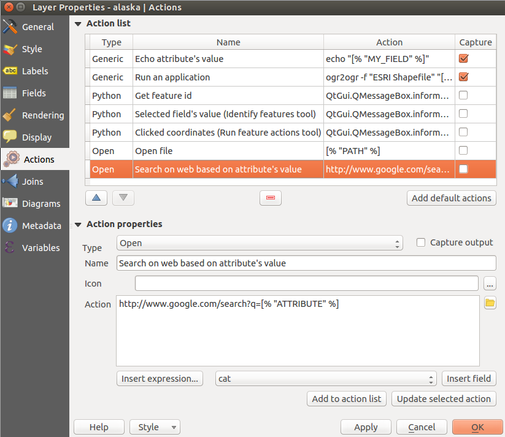
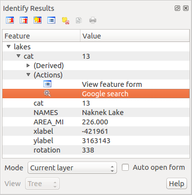

|updatedisclaimer|

*************
Actions Menu
*************

|action| QGIS provides the ability to perform an action based on the attributes
of a feature. This can be used to perform any number of actions, for example,
running a program with arguments built from the attributes of a feature or
passing parameters to a web reporting tool.

.. _figure_actions_1:

.. only:: html

   **Figure Actions 1:**

   Overview action dialog with some sample actions

Actions are useful when you frequently want to run an external application or
view a web page based on one or more values in your vector layer. They are
divided into six types and can be used like this:

* Generic, Mac, Windows and Unix actions start an external process.
* Python actions execute a Python expression.
* Generic and Python actions are visible everywhere.
* Mac, Windows and Unix actions are visible only on the respective platform (i.e.,
  you can define three 'Edit' actions to open an editor and the users can only
  see and execute the one 'Edit' action for their platform to run the editor).

There are several examples included in the dialog. You can load them by clicking
on **[Add default actions]**. One example is performing a search based on an
attribute value. This concept is used in the following discussion.

.. index:: Actions, Attribute_Actions

Defining Actions
================

Attribute actions are defined from the vector `Layer Properties`
dialog. To :index:`define an action`, open the vector `Layer Properties`
dialog and click on the `Actions` menu. Go to the `Action properties`.
Select 'Generic' as type and provide a descriptive name for the action.
The action itself must contain
the name of the application that will be executed when the action is invoked.
You can add one or more attribute field values as arguments to the application.
When the action is invoked, any set of characters that start with a ``%``
followed by the name of a field will be replaced by the value of that field.
The special characters :index:`%%` will be replaced by the value of the field
that was selected from the identify results or attribute table (see using_actions_
below). Double quote marks can be used to group text into a single argument to
the program, script or command. Double quotes will be ignored if preceded by a
backslash.

If you have field names that are substrings of other field names (e.g.,
``col1`` and ``col10``), you should indicate that by surrounding the field name
(and the \% character) with square brackets (e.g., ``[%col10]``). This will
prevent the ``%col10`` field name from being mistaken for the ``%col1`` field
name with a ``0`` on the end. The brackets will be removed by QGIS when it
substitutes in the value of the field. If you want the substituted field to be
surrounded by square brackets, use a second set like this: ``[[%col10]]``.

Using the `Identify Features` tool, you can open the
`Identify Results` dialog. It includes a *(Derived)* item that contains
information relevant to the layer type. The values in this item can be accessed
in a similar way to the other fields by proceeding the derived field name with
``(Derived).``. For example, a point layer has an ``X`` and ``Y`` field, and the
values of these fields can be used in the action with ``%(Derived).X`` and
``%(Derived).Y``. The derived attributes are only available from the
`Identify Results` dialog box, not the `Attribute Table` dialog box.

Two :index:`example actions` are shown below:

* ``konqueror http://www.google.com/search?q=%nam``
* ``konqueror http://www.google.com/search?q=%%``

In the first example, the web browser konqueror is invoked and passed a URL
to open. The URL performs a Google search on the value of the ``nam`` field
from our vector layer. Note that the application or script called by the
action must be in the path, or you must provide the full path. To be certain, we
could rewrite the first example as:
``/opt/kde3/bin/konqueror http://www.google.com/search?q=%nam``. This will
ensure that the konqueror application will be executed when the action is
invoked.

The second example uses the \%\% notation, which does not rely on a particular
field for its value. When the action is invoked, the \%\% will be replaced by
the value of the selected field in the identify results or attribute table.

.. _using_actions:

Using Actions
=============

Actions can be invoked from either the `Identify Results` dialog,
an `Attribute Table` dialog or from `Run Feature Action`
(recall that these dialogs can be opened by clicking |mActionIdentify|
:sup:`Identify Features` or |mActionOpenTable| :sup:`Open Attribute Table` or
|mAction| :sup:`Run Feature Action`). To invoke an action, right
click on the record and choose the action from the pop-up menu. Actions are
listed in the popup menu by the name you assigned when defining the action.
Click on the action you wish to invoke.

If you are invoking an action that uses the ``%%`` notation, right-click on the
field value in the `Identify Results` dialog or the
`Attribute Table` dialog that you wish to pass to the application
or script.

Here is another example that pulls data out of a vector layer and inserts
it into a file using bash and the ``echo`` command (so it will only work on
|nix| or perhaps |osx|). The layer in question has fields for a species name
``taxon_name``, latitude ``lat`` and longitude ``long``. We would like to be
able to make a spatial selection of localities and export these field values
to a text file for the selected record (shown in yellow in the QGIS map area).
Here is the action to achieve this:

::

  bash -c "echo \"%taxon_name %lat %long\" >> /tmp/species_localities.txt"

After selecting a few localities and running the action on each one, opening
the output file will show something like this:

::

  Acacia mearnsii -34.0800000000 150.0800000000
  Acacia mearnsii -34.9000000000 150.1200000000
  Acacia mearnsii -35.2200000000 149.9300000000
  Acacia mearnsii -32.2700000000 150.4100000000

As an exercise, we can create an action that does a Google search on the ``lakes``
layer. First, we need to determine the URL required to perform a search on a
keyword. This is easily done by just going to Google and doing a simple
search, then grabbing the URL from the address bar in your browser. From this
little effort, we see that the format is http://google.com/search?q=qgis,
where ``QGIS`` is the search term. Armed with this information, we can proceed:

#. Make sure the ``lakes`` layer is loaded.
#. Open the `Layer Properties` dialog by double-clicking on the
   layer in the legend, or right-click and choose `Properties`
   from the pop-up menu.
#. Click on the `Actions` menu.
#. Enter a name for the action, for example ``Google Search``.
#. For the action, we need to provide the name of the external program to run.
   In this case, we can use Firefox. If the program is not in your path, you
   need to provide the full path.
#. Following the name of the external application, add the URL used for doing
   a Google search, up to but not including the search term:
   ``http://google.com/search?q=``
#. The text in the `Action` field should now look like this:
   ``firefox http://google.com/search?q=``
#. Click on the drop-down box containing the field names for the ``lakes``
   layer. It's located just to the left of the **[Insert Field]** button.
#. From the drop-down box, select 'NAMES' and click **[Insert Field]**.
#. Your action text now looks like this:

   ``firefox http://google.com/search?q=%NAMES``
#. To finalize the action, click the **[Add to action list]** button.

This completes the action, and it is ready to use. The final text of the
action should look like this:

::

   firefox http://google.com/search?q=%NAMES

We can now use the action. Close the `Layer Properties` dialog and
zoom in to an area of interest. Make sure the ``lakes`` layer is active and
identify a lake. In the result box you'll now see that our action is visible:

.. _figure_actions_2:

.. only:: html

   **Figure Actions 2:**

   Select feature and choose action

When we click on the action, it brings up Firefox and navigates to the URL
http://www.google.com/search?q=Tustumena. It is also possible to add further
attribute fields to the action. Therefore, you can add a ``+`` to the end of
the action text, select another field and click on **[Insert Field]**. In
this example, there is just no other field available that would make sense
to search for.

You can define multiple actions for a layer, and each will show up in the
`Identify Results` dialog.

You can also invoke actions from the attribute table
by selecting a row and right-clicking, then choosing the action from the
pop-up menu.

There are all kinds of uses for actions. For example, if you have
a point layer containing locations of images or photos along with a file name,
you could create an action to launch a viewer to display the image. You could
also use actions to launch web-based reports for an attribute field or
combination of fields, specifying them in the same way we did in our
Google search example.

We can also make more complex examples, for instance, using **Python**
actions.

Usually, when we create an action to open a file with an external application,
we can use absolute paths, or eventually relative paths. In the second case,
the path is relative to the location of the external program executable file.
But what about if we need to use relative paths, relative to the selected layer
(a file-based one, like a shapefile or SpatiaLite)? The following code will
do the trick:

::

  command = "firefox"
  imagerelpath = "images_test/test_image.jpg"
  layer = qgis.utils.iface.activeLayer()
  import os.path
  layerpath = layer.source() if layer.providerType() == 'ogr'
    else (qgis.core.QgsDataSourceURI(layer.source()).database()
      if layer.providerType() == 'spatialite' else None)
  path = os.path.dirname(str(layerpath))
  image = os.path.join(path,imagerelpath)
  import subprocess
  subprocess.Popen( [command, image ] )

We just have to remember that the action is one of type *Python* and
the *command* and *imagerelpath* variables must be changed to fit our needs.

But what about if the relative path needs to be relative to the (saved)
project file? The code of the Python action would be:

::

  command = "firefox"
  imagerelpath = "images/test_image.jpg"
  projectpath = qgis.core.QgsProject.instance().fileName()
  import os.path
  path = os.path.dirname(str(projectpath)) if projectpath != '' else None
  image = os.path.join(path, imagerelpath)
  import subprocess
  subprocess.Popen( [command, image ] )

Another Python action example is the one that allows us to add new layers
to the project. For instance, the following examples will add to the project
respectively a vector and a raster. The names of the files to be added to the
project and the names to be given to the layers are data driven (*filename* and
*layername* are column names of the table of attributes of the vector where
the action was created):

::

  qgis.utils.iface.addVectorLayer('/yourpath/[% "filename" %].shp',
    '[% "layername" %]', 'ogr')

To add a raster (a TIF image in this example), it becomes:

::

  qgis.utils.iface.addRasterLayer('/yourpath/[% "filename" %].tif',
    '[% "layername" %]')
