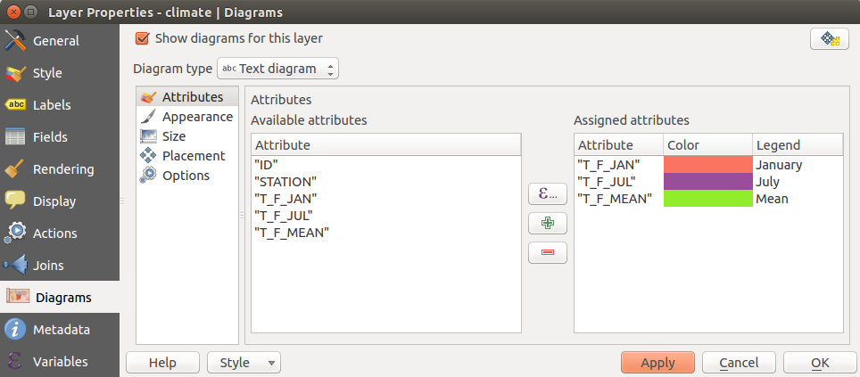
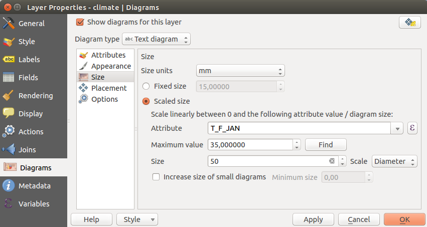
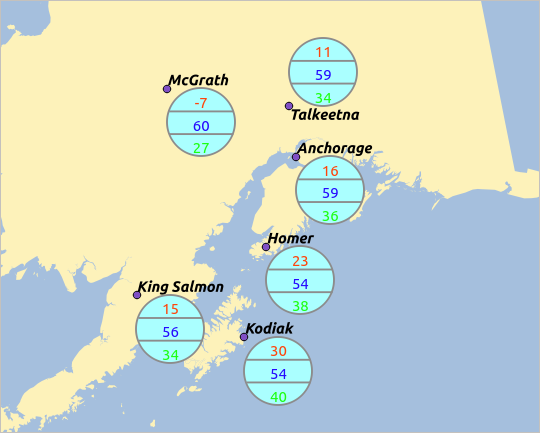

|updatedisclaimer|

.. _`sec_diagram`:

**************
Diagrams Menu
**************

|diagram| The `Diagrams` menu allows you to add a graphic overlay to
a vector layer (see figure_diagrams_1_).

The current core implementation of diagrams provides support for:

* **pie charts**, a circular statistical graphic divided into slices to illustrate
  numerical proportion. The arc length of each slice is proportional to the
  quantity it represents,
* **text diagrams**, a horizontaly divided circle showing statistics values inside
* and **histograms**.

For each type of diagram, the menu is divided into five tabs:

Attributes
==========

`Attributes` defines which variables to display in the diagram.
Use |mActionSignPlus| :sup:`add item` button to select the desired fields into
the 'Assigned Attributes' panel. Generated attributes with :ref:`vector_expressions`
can also be used.

You can move up and down any row with click and drag, sorting how atributes
are displayed. You can also change the label in the 'Legend' column
or the attibute color by double-clicking the item.
This label is the default text displayed in the legend of the print composer.

.. _figure_diagrams_1:

.. only:: html

   **Figure Diagrams 1:**

   Vector properties dialog with diagram menu

Appearance
==========

`Appearance` defines how the diagram looks like. It provides
general settings that do not interfere with the statistic values such as:

* the graphic transparency, its outline width and color
* the width of the bar in case of histogram
* the circle background color in case of text diagram, and the font used for texts
* the orientation of the left line of the first slice represented in pie chart.
  Note that slices are displayed clockwise.

In this menu, you can also manage the diagram visibility:

* by removing diagrams that overlap others or `Show all diagrams`
  even if they overlap each other
* by setting the :ref:`scale visibility <label_scaledepend>`

Size
====

`Size` is the main tab to set how the selected statistics are
represented. The diagram size units can be 'Map Units' or 'Millimeters'.
You can use :

* `Fixed size`, an unique size to represent the graphic of all the
  features, except when displaying histogram
* or `Scaled size`, based on an expression using layer attributes.

.. ToDo: better explain the scale behaviour of the different diagram types

.. _figure_diagrams_2:

.. only:: html

   **Figure Diagrams 2:**

   Vector properties dialog with diagram menu, Size tab

Position
========

`Position` helps to define diagram placement.
According to the layer geometry type, it offers different options for the placement:

* 'Over the point' or 'Around  the point' for point geometry.
  The latter variable requires a radius to follow.
* 'Over the line' or 'Around  the line' for line geometry. Like point feature,
  the last variable requires a distance to respect and user can specify the
  diagram placement relative to the feature ('above', 'on' and/or 'below' the line)
  It's possible to select several options at once.
  In that case, QGIS will look for the optimal position of the diagram. Remember that
  here you can also use the line orientation for the position of the diagram.
* 'Over the centroid', 'Around the centroid' (with a distance set),
  'Perimeter' and anywhere 'Inside polygon' are the options for polygon features.

The diagram can also be placed using feature data by filling the ``X``
and ``Y`` fields with an attribute of the feature.

The placement of the diagrams can interact with the labelling, so you can
detect and solve position conflicts between diagrams and labels by setting
the **Priority** slider.

Options
=======

The `Options` tab has settings only in case of histogram. You can
choose whether the bar orientation should be 'Up', 'Down', 'Right' and 'Left'.

.. ToDo: explain the behaviour of this option

.. note::
  Given that almost all the settings above are common to the different types of
  diagram, when designing your diagram, you can switch between them to check
  which one is more appropriate to your data without any loss.

Case Study
==========

We will demonstrate an example and overlay on the Alaska boundary layer a
text diagram showing temperature data from a climate vector layer.
Both vector layers are part of the QGIS sample dataset (see section
:ref:`label_sampledata`).

#. First, click on the |mActionAddOgrLayer| :sup:`Load Vector` icon, browse
   to the QGIS sample dataset folder, and load the two vector shape layers
   :file:`alaska.shp` and :file:`climate.shp`.
#. Double click the ``climate`` layer in the map legend to open the
   `Layer Properties` dialog.
#. Click on the `Diagrams` menu, activate |checkbox| `Show
   diagrams for this layer`, and from the `Diagram type` |selectstring|
   combo box, select 'Text diagram'.
#. In the `Appearance` tab, we choose a light blue as background color,
   and in the `Size` tab, we set a fixed size to 18 mm.
#. In the `Position` tab, placement could be set to 'Around Point'.
#. In the diagram, we want to display the values of the three columns
   ``T_F_JAN``, ``T_F_JUL`` and ``T_F_MEAN``. So, in the `Attributes` tab
   first select ``T_F_JAN`` and click the |mActionSignPlus| button, then repeat with
   ``T_F_JUL`` and finally ``T_F_MEAN``.
#. Now click **[Apply]** to display the diagram in the QGIS main window.
#. You can adapt the chart size in the `Size` tab. Activate the
   |radiobuttonon| `Scaled size` and set the size of the diagrams on
   the basis of the `maximum value` of an attribute and the
   `Size` option.
   If the diagrams appear too small on the screen, you can activate the
   |checkbox| `Increase size of small diagrams` checkbox and define
   the minimum size of the diagrams.
#. Change the attribute colors by double clicking on the color values in the
   `Assigned attributes` field.
   Figure_diagrams_3_ gives an idea of the result.
#. Finally, click **[Ok]**.

.. _figure_diagrams_3:

.. only:: html

   **Figure Diagrams 3:**

   Diagram from temperature data overlayed on a map

Remember that in the `Position` tab, a |checkbox| `Data
defined position` of the diagrams is possible. Here, you can use attributes
to define the position of the diagram.
You can also set a scale-dependent visibility in the `Appearance` tab.

The size and the attributes can also be an expression.
Use the |mActionmIconExpressionEditorOpen| button to add an expression.
See :ref:`vector_expressions` chapter for more information and example.

