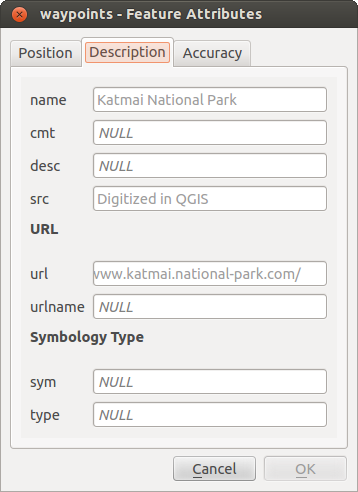

|updatedisclaimer|

.. _vector_attributes_menu:

************
Fields Menu
************

|attributes| Within the `Fields` menu, the field attributes of the
selected dataset can be manipulated. The buttons |mActionNewAttribute|
:sup:`New Column` and |mActionDeleteAttribute| :sup:`Delete Column`
can be used when the dataset is in |mActionToggleEditing| :sup:`Editing mode`.

**Edit Widget**

.. following is included to give some space between title and figure!

\

\

.. _figure_fields_1:

.. only:: html

   **Figure Fields 1:**

.. figure:: ./images/editwidgetsdialog.png
   :align: center

   Dialog to select an edit widget for an attribute column

Within the `Fields` menu, you also find an **edit widget** column.
This column can be used to define values or a range of values that are allowed
to be added to the specific attribute table column. If you click on the
**[edit widget]** button, a dialog opens, where you can define different
widgets. These widgets are:

* **Checkbox**: Displays a checkbox, and you can define what attribute is
  added to the column when the checkbox is activated or not.
* **Classification**: Displays a combo box with the values used for
  classification, if you have chosen 'unique value' as legend type in
  the `Style` menu of the properties dialog.
* **Color**: Displays a color button allowing user to choose a color from the
  color dialog window.
* **Date/Time**: Displays a line field which can open a calendar widget to enter
  a date, a time or both. Column type must be text. You can select a custom
  format, pop-up a calendar, etc.
* **Enumeration**: Opens a combo box with values that can be used within
  the columns type. This is currently only supported by the PostgreSQL provider.
* **File name**: Simplifies the selection by adding a file chooser dialog.
* **Hidden**: A hidden attribute column is invisible. The user is not able
  to see its contents.
* **Photo**: Field contains a filename for a picture. The width and height of
  the field can be defined.
* **Range**: Allows you to set numeric values from a specific range. The edit
  widget can be either a slider or a spin box.
* **Relation Reference**: This widget lets you embed the feature form of the
  referenced layer on the feature form   of the actual layer.
  See :ref:`vector_relations`.
* **Text edit** (default): This opens a text edit field that allows simple
  text or multiple lines to be used. If you choose multiple lines you
  can also choose html content.
* **Unique values**: You can select one of the values already used in
  the attribute table. If 'Editable' is activated, a line edit is shown with
  autocompletion support, otherwise a combo box is used.
* **UUID Generator**: Generates a read-only UUID (Universally Unique Identifiers)
  field, if empty.
* **Value map**: A combo box with predefined items. The value is stored in
  the attribute, the description is shown in the combo box. You can define
  values manually or load them from a layer or a CSV file.
* **Value Relation**: Offers values from a related table in a combobox. You can
  select layer, key column and value column. Several options are available to
  change the standard behaviours: allow null value, order by value, allow
  multiple selections and use of autocompleter. The forms will display either
  a dropdown list or a line edit field when completer checkbox is enabled.
* **Webview**: Field contains a URL. The width and height of the field is variable.

.. note::

   QGIS has an advanced 'hidden' option to define your own field
   widget using python and add it to this impressive list of widgets.
   It is tricky but it is very well explained in following excellent blog that
   explains how to create a real time validation widget that can be used like
   described widgets.
   See http://blog.vitu.ch/10142013-1847/write-your-own-qgis-form-elements

With the **Attribute editor layout**, you can now define built-in forms
(see figure_fields_2_). This is useful for data entry jobs or to identify
objects using the option auto open form when you have objects with many attributes.
You can create an editor with several tabs and named groups to present
the attribute fields.

Choose 'Drag and drop designer' and an attribute column. Use the |mActionSignPlus|
icon to create a category to insert a tab or a named group (see figure_fields_3_).
When creating a new category, QGIS will insert a new tab or named group for the
category in the built-in form.
The next step will be to assign the relevant fields to a selected category
with the |mActionArrowRight| icon. You can create more categories and use the
same fields again.

Other options in the dialog are 'Autogenerate' and 'Provide ui-file'.

* 'Autogenerate' just creates editors for all fields and tabulates them.

* The 'Provide ui-file' option allows you to use complex dialogs made with the Qt-Designer.
  Using a UI-file allows a great deal of freedom in creating a dialog.
  For detailed information, see
  http://nathanw.net/2011/09/05/qgis-tips-custom-feature-forms-with-python-logic/.

QGIS dialogs can have a Python function that is called when the dialog is opened.
Use this function to add extra logic to your dialogs. The form code can be specified
in three different ways:

* load from the environment (for example in `startup.py` or from a plugin)
* load from an external file, a file chooser will appear in that case to allow
  you to select a Python file from your filesystem
* load from inline code, a Python editor will appear where you can directly
  type your form code

In all cases you must enter the name of the function that will be called
(`open` in the example below).

An example is (in module MyForms.py):

::

  def open(dialog,layer,feature):
      geom = feature.geometry()
      control = dialog.findChild(QWidged,"My line edit")

Reference in Python Init Function like so: `open`

.. _figure_fields_2:

.. only:: html

   **Figure Fields 2:**

.. figure:: ./images/attribute_editor_layout.png
   :align: center

   Dialog to create categories with the **Attribute editor layout**

.. _figure_fields_3:

.. only:: html

   **Figure Fields 3:**

   Resulting built-in form with tabs and named groups

