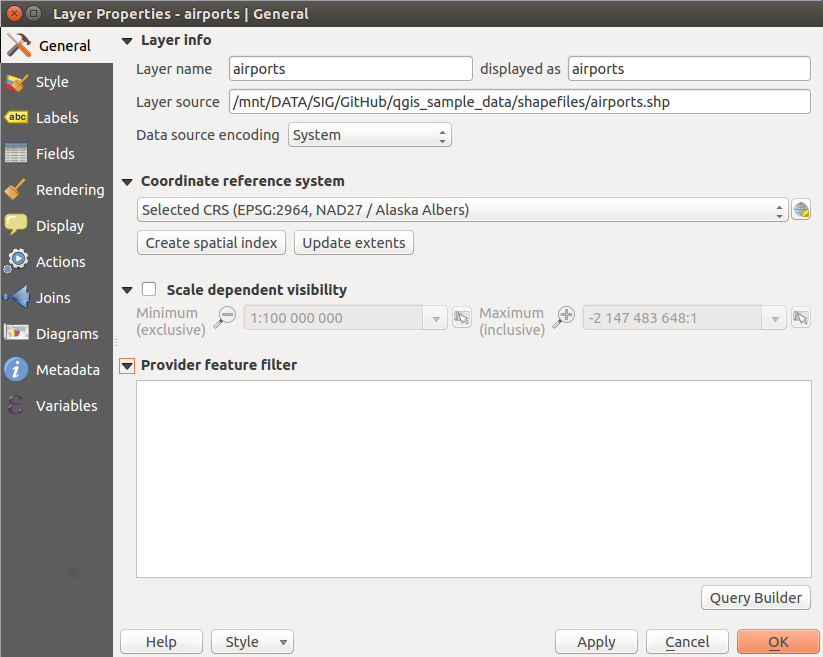

|updatedisclaimer|

.. _vectorgeneralmenu:

*************
General Menu
*************

|general| Use this menu to make general settings for the vector layer.
There are several options available:

**Layer Info**

* Change the display name of the layer in `displayed as`
* Define the `Layer source` of the vector layer
* Define the `Data source encoding` to define provider-specific options
  and to be able to read the file

**Coordinate Reference System**

* `Specify` the coordinate reference system. Here, you
  can view or change the projection of the specific vector layer.
* Create a `Spatial Index` (only for OGR-supported formats)
* `Update Extents` information for a layer
* View or change the projection of the specific vector layer, clicking on
  `Specify ...`

|checkbox| `Scale dependent visibility`

* You can set the `Maximum (inclusive)` and `Minimum (exclusive)`
  scale, defining a range of scale in which features will be visible.
  Out of this range, they are hidden.
  The |mActionMapIdentification| :sup:`Set to current canvas scale` button helps
  you use the current map canvas scale as boundary of the range visibility.

**Feature subset**

* With the **[Query Builder]** button, you can create a subset of the features in the
  layer that will be visualized (also refer to section :ref:`vector_query_builder`).

.. do not change the order of reference-tag and only-tag, this figure has
   an external reference.

.. only:: html

   **Figure Vector General 1:**

.. _figure_vector_general_1:

   General menu in vector layers properties dialog

