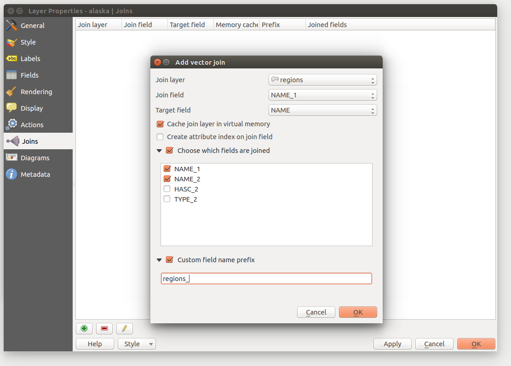

|updatedisclaimer|

.. _`sec_joins`:

***********
Joins Menu
***********

|join| The `Joins` menu allows you to :index:`join` a loaded attribute
table to a loaded vector layer. After clicking |mActionSignPlus|, the
`Add vector join` dialog appears. As key columns, you have to define a
:index:`join layer` you want to connect with the target vector layer.
Then, you have to specify the join field that is common to both the join layer
and the target layer. Now you can also specify a subset of fields from the joined
layer based on the checkbox |checkbox| `Choose which fields are joined`.
As a result of the join, all information from the join layer and the target layer
are displayed in the attribute table of the target layer as joined information.
If you specified a subset of fields only these fields are displayed in the attribute
table of the target layer.

.. FIXME: are table joins also possible with MSSQL and ORACLE tables?

QGIS currently has support for joining non-spatial table formats supported by OGR
(e.g., CSV, DBF and Excel), delimited text and the PostgreSQL provider
(see figure_joins_1_).

.. _figure_joins_1:

.. only:: html

   **Figure Joins 1:**

   Join an attribute table to an existing vector layer

Additionally, the add vector join dialog allows you to:

* |checkbox| `Cache join layer in virtual memory`
* |checkbox| `Create attribute index on the join field`
* |checkbox| `Choose which fields are joined`
* Create a |checkbox| `Custom field name prefix`

