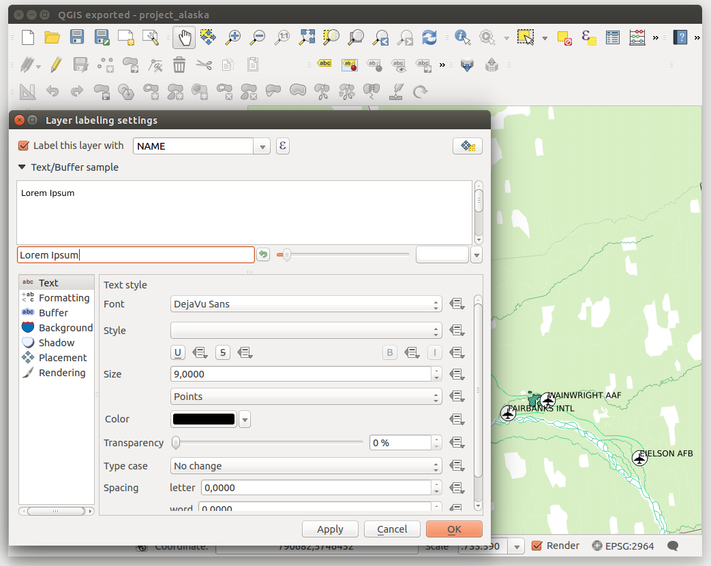

|updatedisclaimer|

.. _vector_labels_tab:

************
Labels Menu
************

The |mActionLabeling| :sup:`Labels` core application provides smart
labelling for vector point, line and polygon layers, and it only requires a
few parameters. This new application also supports on-the-fly transformed layers.
The core functions of the application have been redesigned. In QGIS, there are a
number of other features that improve the labelling. The following menus
have been created for labelling the vector layers:

* Text
* Formatting
* Buffer
* Background
* Shadow
* Placement
* Rendering

Let us see how the new menus can be used for various vector layers.

.. _labeling_point_layers:

Labeling point layers
=====================

Start QGIS and load a vector point layer. Activate the layer in the legend and
click on the |mActionLabeling| :sup:`Layer Labelling Options` icon in the QGIS
toolbar menu.

The first step is to activate the |checkbox| `Label this layer with`
checkbox and select an attribute column to use for labelling.
Click |mActionmIconExpressionEditorOpen| if you want to define labels
based on expressions - See labeling_with_expressions_.

The following steps describe a simple labelling without using the
`Data defined override` functions,
which are situated next to the drop-down menus.

You can define the text style in the `Text` menu (see Figure_labels_1_).
Use the `Type case` option to influence the text rendering.
You have the possibility to render the text 'All uppercase', 'All lowercase'
or 'Capitalize first letter'. Use the :ref:`blend-modes` to create effects
known from graphics programs.

In the `Formatting` menu, you can define a character for a line break
in the labels with the 'Wrap on character' function. You can format the
`Line Height` and the alignment. For the latter typical values are
available plus *Follow label placement*. When set to this mode, text alignment
for labels will be dependant on the final placement of the label relative to the
point. Eg, if the label is placed to the left of the point then the label will
be right aligned, and if it is placed to the right of the point then the label
will be left aligned.

Use the |checkbox| `Formatted numbers` option to format the numbers in
an attribute table. Here, decimal places may be inserted.
If you enable this option, three decimal places are initially set by default.

To create a buffer, just activate the |checkbox| `Draw text buffer`
checkbox in the `Buffer` menu.
The buffer color is variable. Here, you can also use blend modes.
If the |checkbox| `color buffer's fill` checkbox is activated, it will
interact with partially transparent text and give mixed color transparency
results. Turning off the buffer fill fixes that issue (except where the interior
aspect of the buffer's stroke intersects with the text's fill) and also allows
you to make outlined text.

In the `Background` menu, you can define with `Size X` and
`Size Y` the shape of your background.
Use `Size type` to insert an additional 'Buffer' into your background.
The buffer size is set by default here.
The background then consists of the buffer plus the background in `Size X`
and `Size Y`. You can set a `Rotation` where you can choose
between 'Sync with label', 'Offset of label' and 'Fixed'.
Using 'Offset of label' and 'Fixed', you can rotate the background.
Define an `Offset X,Y` with X and Y values, and the background
will be shifted. When applying `Radius X,Y`, the background gets
rounded corners.
Again, it is possible to mix the background with the underlying layers in the
map canvas using the `Blend mode` (see :ref:`blend-modes`).

Use the `Shadow` menu for a user-defined `Drop shadow`.
The drawing of the background is very variable.
Choose between 'Lowest label component', 'Text', 'Buffer' and 'Background'.
The `Offset` angle depends on the orientation
of the label. If you choose the |checkbox| `Use global shadow` checkbox,
then the zero point of the angle is
always oriented to the north and doesn't depend on the orientation of the label.
You can influence the appearance of the shadow with the `Blur radius`.
The higher the number, the softer the shadows. The appearance of the drop shadow
can also be altered by choosing a blend mode.

.. comment FIXME: at the moment there is an error in this setting

   |checkbox| `Blur only alpha pixels`:
   It is supposed to show only those
   pixels that have a partial alpha component beyond the base opaque pixels of
   the component being blurred. For example, if you set the shadow of some
   text to be gray and turn on that option, it should still show a duplication
   of the text, colored as per the shadow color option, but with any blurred
   shadow that extends beyond its text. With the option off, in this example,
   it will blur all pixels of the duplicated text.
   This is useful for creating a shadow that increases legibility at smaller
   output sizes, e.g. like duplicating text and offsetting it a bit in
   illustration programs, while still showing a bit of shadow at larger sizes.
   Apparently, there is an error with re-painting the opaque pixels back over
   top of the shadow (depending upon the shadow's color), when that setting is
   used.

Choose the `Placement` menu for the label placement and the labeling
priority. Using the |radiobuttonon| `Offset from point` setting, you
now have the option to use `Quadrants` to place your label. Additionally,
you can alter the angle of the label placement with the `Rotation` setting.
Thus, a placement in a certain quadrant with a certain rotation is possible.
In the `priority` section you can define with which priority the labels
are rendered. It interacts with labels of the other vector layers in the map canvas.
If there are labels from different layers in the same location then the label
with the higher priority will be displayed and the other will be left out.

.. index:: Colliding_labels

In the `Rendering` menu, you can define label and feature options.
Under `Label options`, you find the scale-based visibility setting now.
You can prevent QGIS from rendering only selected labels with the
|checkbox| `Show all labels for this layer (including colliding labels)`
checkbox. Under `Feature options`, you can define whether every
part of a multipart feature is to be labelled. It's possible to define
whether the number of features to be labelled is limited and to
|checkbox| `Discourage labels from covering features`.

.. features act as obstacles for labels or not .

.. _figure_labels_1:

.. only:: html

   **Figure Labels 1:**

   Smart labeling of vector point layers

Labeling line layers
====================

The first step is to activate the |checkbox| `Label this layer` checkbox
in the `Label settings` tab and select an attribute column to use for
labeling. Click |mActionmIconExpressionEditorOpen| if you
want to define labels based on expressions - See labeling_with_expressions_.

After that, you can define the text style in the `Text` menu. Here,
you can use the same settings as for point layers.

Also, in the `Formatting` menu, the same settings as for
point layers are possible.

The `Buffer` menu has the same functions as described in
section labeling_point_layers_.

The `Background` menu has the same entries as described in
section labeling_point_layers_.

Also, the `Shadow` menu has the same entries as described in
section labeling_point_layers_.

In the `Placement` menu, you find special settings for line layers.
The label can be placed |radiobuttonon| `Parallel`,
|radiobuttonoff| `Curved` or |radiobuttonoff| `Horizontal`.
With the |radiobuttonon| `Parallel` and |radiobuttonoff| `Curved`
option, you can define the position |checkbox| `Above line`,
|checkbox| `On line` and |checkbox| `Below line`.
It's possible to select several options at once.
In that case, QGIS will look for the optimal position of the label. Remember that
here you can also use the line orientation for the position of the label.
Additionally, you can define a `Maximum angle between curved characters` when
selecting the |radiobuttonoff| `Curved` option (see Figure_labels_2_ ).

You can set up a minimum distance for repeating labels.
Distance can be in mm or in map units.

Some Placement setup will display more options, for example, `Curved`
and `Parallel` Placements will allow the user to set up the position
of the label (above, below or on the line), `distance` from the line
and for `Curved`, the user can also setup inside/outside max angle
between curved label. As for point vector layers you have the possibility to
define a `Priority` for the labels.

The `Rendering` menu has nearly the same entries as for point layers.
In the `Feature options`, you can now
`Suppress labelling of features smaller than` a set length.

.. if features act as obstacles for labels or not.

.. _figure_labels_2:

.. only:: html

   **Figure Labels 2:**

.. figure:: ./images/label_line.png
   :align: center

   Smart labeling of vector line layers

Labelling polygon layers
========================

The first step is to activate the |checkbox| `Label this layer`
checkbox and select an attribute column to use for labelling. Click
|mActionmIconExpressionEditorOpen| if you want to define labels
based on expressions - See labeling_with_expressions_.

In the `Text` menu, define the text style. The entries are the same as
for point and line layers.

The `Formatting` menu allows you to format multiple lines, also similar
to the cases of point and line layers.

As with point and line layers, you can create a text buffer in the
`Buffer` menu.

Use the `Background` menu to create a complex user-defined background
for the polygon layer. You can use the menu also as with the point and line layers.

The entries in the `Shadow` menu are the same as for point and line layers.

In the `Placement` menu, you find special settings for polygon layers
(see Figure_labels_3_).
|radiobuttonon| `Offset from centroid`, |radiobuttonoff| `Horizontal
(slow)`, |radiobuttonoff| `Around centroid`,
|radiobuttonoff| `Free` and
|radiobuttonoff| `Using perimeter` are possible.

In the |radiobuttonon| `Offset from centroid` settings, you can specify
if the centroid is of the |radiobuttonon| `visible polygon` or
|radiobuttonoff| `whole polygon`. That means that either the centroid
is used for the polygon you can see on the map or the centroid is determined for
the whole polygon, no matter if you can see the whole feature on the map.
You can place your label with the quadrants here, and define offset and rotation.
The |radiobuttonoff| `Around centroid` setting makes it possible to place
the label around the centroid with a certain distance. Again, you can define
|radiobuttonon| `visible polygon`
or |radiobuttonoff| `whole polygon` for the centroid.
With the |radiobuttonoff| `Using perimeter` settings, you can define a
position and a distance for the label. For the position,
|checkbox| `Above line`, |checkbox| `On line`,
|checkbox| `Below line` and |checkbox| `Line orientation
dependent position` are possible.

Related to the choice of Label Placement, several options will appear.
As for Point Placement you can choose the distance for the polygon outline,
repeat the label around the polygon perimeter.

As for point and line vector layers you have the possibility to define a
`Priority` for the polygon vector layer.

The entries in the `Rendering` menu are the same as for line layers.
You can also use `Suppress labelling of features smaller than` in
the `Feature options`.

.. if features act as obstacles for labels or not

.. _figure_labels_3:

.. only:: html

   **Figure Labels 3:**

.. figure:: ./images/label_area.png
   :align: center

   Smart labelling of vector polygon layers

.. _labeling_with_expressions:

Define labels based on expressions
==================================

QGIS allows to use expressions to label features. Just click the
|mActionmIconExpressionEditorOpen| icon in the |mActionLabeling| :sup:`Labels`
menu of the properties dialog. In figure_labels_4_ you see a sample expression
to label the alaska regions with name and area size, based on the field 'NAME_2',
some descriptive text and the function '$area()' in combination with
'format_number()' to make it look nicer.

.. features act as obstacles for labels or not .

.. _figure_labels_4:

.. only:: html

   **Figure Labels 4:**

.. figure:: ./images/label_expression.png
   :align: center
   :width: 30em

   Using expressions for labelling

Expression based labelling is easy to work with. All you have to take care of
is, that you need to combine all elements (strings, fields and functions) with a
string concatenation sign '||' and that fields are written in "double quotes"
and strings in 'single quotes'. Let's have a look at some examples:

::

   # label based on two fields 'name' and 'place' with a comma as separator
   "name" || ', ' || "place"

   -> John Smith, Paris

   # label based on two fields 'name' and 'place' separated by comma
   'My name is ' || "name" || 'and I live in ' || "place"

   -> My name is John Smith and I live in Paris

   # label based on two fields 'name' and 'place' with a descriptive text
   # and a line break (\n)
   'My name is ' || "name" || '\nI live in ' || "place"

   -> My name is John Smith
      I live in Paris

   # create a multi-line label based on a field and the $area function
   # to show the place name and its area size based on unit meter.
   'The area of ' || "place" || 'has a size of ' || $area || 'm²'

   -> The area of Paris has a size of 105000000 m²

   # create a CASE ELSE condition. If the population value in field
   # population is <= 50000 it is a town, otherwise a city.
   'This place is a ' || CASE WHEN "population <= 50000" THEN 'town' ELSE 'city' END

  -> This place is a town

As you can see in the expression builder, you have hundreds of functions available
to create simple and very complex expressions to label your data in QGIS. See
:ref:`vector_expressions` chapter for more information and examples on expressions.

Using data-defined override for labelling
=========================================

With the data-defined override functions, the settings for the labelling
are overridden by entries in the attribute table.
You can activate and deactivate the function with the right-mouse button.
Hover over the symbol and you see the information about the data-defined override,
including the current definition field.
We now describe an example using the data-defined override function for the
|mActionMoveLabel|:sup:`Move label` function (see figure_labels_5_ ).

#. Import :file:`lakes.shp` from the QGIS sample dataset.
#. Double-click the layer to open the Layer Properties. Click on `Labels`
   and `Placement`. Select |radiobuttonon| `Offset from centroid`.
#. Look for the `Data defined` entries. Click the |mIconDataDefine| icon
   to define the field type for the `Coordinate`. Choose 'xlabel' for X
   and 'ylabel' for Y. The icons are now highlighted in yellow.
#. Zoom into a lake.
#. Go to the Label toolbar and click the |mActionMoveLabel| icon.
   Now you can shift the label manually to another position (see figure_labels_6_).
   The new position of the label is saved in the 'xlabel' and 'ylabel' columns
   of the attribute table.

.. _figure_labels_5:

.. only:: html

   **Figure Labels 5:**

.. figure:: ./images/label_data_defined.png
   :align: center

   Labelling of vector polygon layers with data-defined override

.. _figure_labels_6:

.. only:: html

   **Figure Labels 6:**

.. figure:: ./images/move_label.png
   :align: center

   Move labels

.. _rule_based_labeling:

Rule-based labeling
===================

With Rule-based labeling multiple label configurations can be defined
and applied selectively on the base of expression filters, as in
:ref:`Rule-based rendering <rule_based_rendering>`

Rules can be set selecting the corresponding option at the top of the
Labels panel (see figure_labels_7_ )

.. _figure_labels_7:

.. only:: html

   **Figure Labels 7:**

.. figure:: ./images/label_rules_panel.png
   :align: center

   Rule based labeling panel

To create a rule, activate an existing row by double-clicking on it,
or click on ‘+’ and click on the new rule.
Within the panel you can set the filter expression and the related label
configurations.

.. _figure_labels_8:

.. only:: html

   **Figure Labels 8:**

.. figure:: ./images/label_rule_settings.png
   :align: center

   Rule settings

