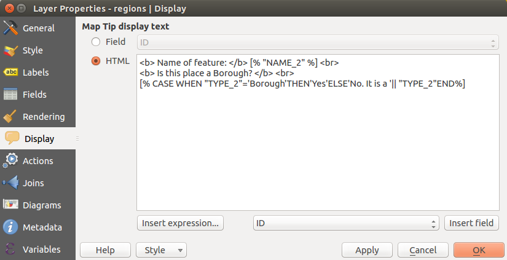

|updatedisclaimer|

*************
Display Menu
*************

|mActionMapTips| This menu is specifically created for Map Tips.
It includes a nice feature: Map Tip display text in HTML.
While you can still choose a |radiobuttonoff| `Field` to be displayed
when hovering over a feature on the map, it is also possible to insert HTML code
that creates a complex display when hovering over a feature.
To activate Map Tips, select the menu option `View --> Map Tips`.

Figure Display 1 and 2 show an example of HTML code and how it behaves in map canvas.

.. _figure_display_1:

.. only:: html

   **Figure Display 1:**

   HTML code for map tip

.. _figure_display_2:

.. only:: html

   **Figure Display 2:**

.. figure:: ././images/map_tip.png
   :align: center

   Map tip made with HTML code
