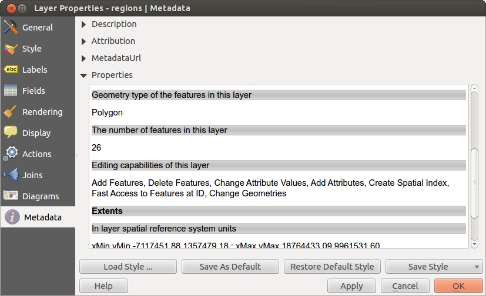

|updatedisclaimer|

.. _vectormetadatamenu:

**************
Metadata Menu
**************

|metadata| The `Metadata` menu consists of `Description`,
`Attribution`, `MetadataURL` and `Properties` sections.

In the `Properties` section, you get general information about the layer,
including specifics about the type and location, number of features, feature type,
and editing capabilities. The `Extents`
table provides you with layer extent information and the
`Layer Spatial Reference System`, which is information about the CRS
of the layer. This is a quick way to get information about the layer.

Additionally, you can add or edit a title and abstract for the layer in the
`Description` section. It's also possible to define a
`Keyword list` here. These keyword lists can be used in a
metadata catalogue. If you want to use a title from an XML metadata file,
you have to fill in a link in the `DataUrl` field.
Use `Attribution` to get attribute data from an XML metadata catalogue.
In `MetadataUrl`, you can define the general path to the XML metadata
catalogue. This information will be saved in the QGIS project file for subsequent
sessions and will be used for QGIS server.

.. _figure_metadata_vect:

.. only:: html

   **Figure Metadata 1:**

   Metadata menu in vector layers properties dialog
