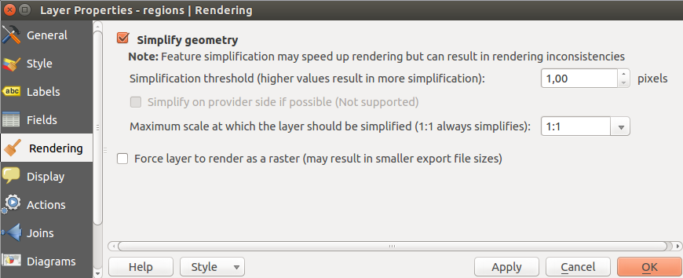

|updatedisclaimer|

***************
Rendering Menu
***************

QGIS offers support for on-the-fly feature generalisation. This can
improve rendering times when drawing many complex features at small scales.
This feature can be enabled or disabled in the layer settings using the
|checkbox| `Simplify geometry` option. There is also a global
setting that enables generalisation by default for newly added layers (see
section :ref:`gui_options`).

.. _figure_rendering_10:

.. only:: html

   **Figure Rendering 1:**

   Layer Geometry Simplification dialog

.. note::
  Feature generalisation may introduce artefacts into your rendered
  output in some cases. These may include slivers between polygons and
  inaccurate rendering when using offset-based symbol layers.

While rendering extremely detailed layers (e.g. polygon layers with a huge number
of nodes), this can cause composer exports in PDF/SVG format to be huge as all
nodes are included in the exported file. This can also make the resultant file
very slow to work with/open in other programs.

Checking |checkbox| `Force layer to render as raster` forces these
layers to be rasterised so that the exported files won't have to include all
the nodes contained in these layers and the rendering is therefore sped up.

You can also do this by forcing the composer to export as a raster,
but that is an all-or-nothing solution, given that the rasterisation
is applied to all layers.
