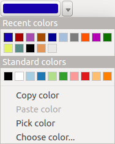

|updatedisclaimer|

**************
Special Tools
**************

.. _save_layer_property:

Save and Share Layer Properties
===============================

When a layer is added to map canvas, QGIS uses by default a random symbol/color
to render its features. You can however set a default symbol in
`Project --> Properties --> Default styles` that will be applied
to each newly added layer according to its geometry type.

But, most of the time, you'd prefer to have a custom and more complexe style
that can be applied automatically or manually (with less efforts) to the layers.
You can achieve this goal using the `Style` combobox at the bottom of
the Layer Properties dialog. This combobox provides you with functions to create,
load and manage styles.

A style stores any information set in the layer properties dialog to render
or interact with the features (including symbology, labelling, action, diagram...
settings).
Styles can be stored inside the project, in a file (``.qml`` or ``.sld``) or
in a database (SpatiaLite, PostGIS...). Thanks to layer visibility manager, you can assign
several styles to the same layer but only one can be active at the same time.

.. only:: html

   **Figure Vector Properties 10:**

.. _figure_vector_properties_10:

.. figure:: ./images/style_combobox.png
   :align: center

   Style combobox options

By default, the style applied to a loaded layer is named ``default``.
Once you have got the ideal and appropriate rendering for your layer,
you can save it by clicking the `Style` |selectstring| combo box and choose:

* **Rename Current**: The active style gets renamed and updated with the current options
* **Add**: A new style is created using the current options.

At the bottom of the Style drop-down list, you see the styles set
for the layer and the active one is checked.
Once you have more than one style defined for a layer, a **Remove Current** option
can help you delete those you no more want.

Note that each time you validate the layer properties dialog, the active style
is updated with the changes you've done.

You can create as many styles as you wish for each layer.
Combined to layer visibility preset, this offers a quick and powerful way to manage
complexe projects with few layers (no need to duplicate any layer in the map legend).

While these styles are saved inside the project and can be copied and pasted from
layer to layer in the project, it's also possible to save them outside the project
so that they can be loaded in another project.
Clicking the |selectstring| `Style --> Save Style`
saves the symbol as a QGIS layer style file (``.qml``) or SLD file (``.sld``).
SLDs can be exported from any type of renderer -- single symbol,
categorized, graduated or rule-based -- but when importing an SLD, either a
single symbol or rule-based renderer is created.
That means that categorized or graduated styles are converted to rule-based.
If you want to preserve those renderers, you have to stick to the QML format.
On the other hand, it can be very handy sometimes to have this easy way of
converting styles to rule-based.

If the datasource of the layer is a database (PostGIS or Spatialite for example),
you can also save your layer style inside a table of the database. Just click on
`Save Style` combobox and choose **Save in database** item then fill in
the dialog to define a style name, add a description, an ui file if applicable
and check if the style is the default style. You can add several style in the database.
However each table can have only one default style.

.. ToDo:
   It might be interesting to explain the difference between *local database*
   and *datasource database* proposed as options when saving or loading style from DB

   It might also be nice to add the tip about restoring style table
   while restoring a database

When loading a layer in QGIS, if a default style already exists for this layer,
QGIS will load the layer and its style. After you modified the layer style,
you can **Save as Default**, creating a new style that becomes the default one
or **Restore Default** style if you're not satisfied.

.. only:: html

   **Figure Vector Properties 2:**

.. _figure_vector_properties_2:

.. figure:: ./images/save_style_database.png
   :align: center

   Save Style in database Dialog

From many parts of the layer properties dialog (and also from many other dialogs),
there are some features you'll often encounter. Some of them are presented below.

.. _color-selector:

Color Selector
==============

The `select color` dialog will appear whenever you click
to choose a color - either border or fill color. This dialog
has four different tabs which allow you to select colors by
|mIconColorBox| :sup:`color ramp`, |mIconColorWheel| :sup:`color wheel`,
|mIconColorSwatches| :sup:`color swatches` or |mIconColorPicker| :sup:`color picker`.

Whatever method you use, the selected color is always described through color
sliders for HSV  (Hue, Saturation, Value) and RGB (Red, Green, Blue) values.
There is also an `opacity` slider to set transparency level.
On the lower left part of the dialog you can see a comparison between the
`current` and the `new` color you are presently
selecting and on the lower right part you have the option to add the color
you just tweaked into a color slot button.

.. _figure_color_selector_1:

.. only:: html

   **Figure color selector 1:**

.. figure:: ./images/color_selector_ramp.png
   :align: center

   Color selector ramp tab

With |mIconColorBox| :sup:`color ramp` or with |mIconColorWheel| :sup:`color wheel`,
you can browse to all possible color combinations.
There are other possibilities though. By using `color swatches` |mIconColorSwatches|
you can choose from a preselected list. This selected list is
populated with one of three methods: `Recent colors`,
`Standard colors` or `Project colors`

.. _figure_color_selector_2:

.. only:: html

   **Figure color selector 2:**

.. figure:: ./images/color_selector_recent_colors.png
   :align: center

   Color selector switcher tab

Another option is to use the |mIconColorPicker| :sup:`color picker` which allows
you to sample a color from under your mouse pointer at any part of
QGIS or even from another application by pressing the space bar. Please note
that the color picker is OS dependent and is currently not supported by OSX.

.. _tip_quick_color_picker_+_copy/paste_colors:

.. tip:: **quick color picker + copy/paste colors**

   You can quickly choose from `Recent colors`, from `Standard colors`
   or simply `copy` or `paste` a color by clicking
   the drop-down arrow that follows a current color box.

.. _figure_color_selector_3:

.. only:: html

   **Figure color selector 3:**

   Quick color selector menu

.. _blend-modes:

Blending Modes
==============

QGIS offers different options for special rendering effects with these tools that
you may previously only know from graphics programs:

* **Normal**: This is the standard blend mode, which uses the alpha channel of the top
  pixel to blend with the pixel beneath it. The colors aren't mixed.
* **Lighten**: This selects the maximum of each component from the foreground and
  background pixels. Be aware that the results tend to be jagged and harsh.
* **Screen**: Light pixels from the source are painted over the destination, while
  dark pixels are not. This mode is most useful for mixing the texture of one layer
  with another layer (e.g., you can use a hillshade to texture another layer).
* **Dodge**: Dodge will brighten and saturate underlying pixels based on the lightness
  of the top pixel. So, brighter top pixels cause the saturation and brightness of
  the underlying pixels to increase. This works best if the top pixels aren't too
  bright; otherwise the effect is too extreme.
* **Addition**: This blend mode simply adds pixel values of one layer with the other.
  In case of values above one (in the case of RGB), white is displayed.
  This mode is suitable for highlighting features.
* **Darken**: This creates a resultant pixel that retains the smallest components of the
  foreground and background pixels. Like lighten, the results tend to be jagged and harsh.
* **Multiply**: Here, the numbers for each pixel of the top layer are multiplied with
  the corresponding pixels for the bottom layer. The results are darker pictures.
* **Burn**: Darker colors in the top layer cause the underlying layers to darken.
  Burn can be used to tweak and colorise underlying layers.
* **Overlay**: This mode combines the multiply and screen blending modes.
  In the resulting picture, light parts become lighter and dark parts become darker.
* Soft light: This is very similar to overlay, but instead of using multiply/screen
  it uses color burn/dodge. This is supposed to emulate shining a soft light onto an image.
* **Hard light**: Hard light is also very similar to the overlay mode. It's supposed
  to emulate projecting a very intense light onto an image.
* **Difference**: Difference subtracts the top pixel from the bottom pixel, or the other
  way around, to always get a positive value. Blending with black produces no change,
  as the difference with all colors is zero.
* **Subtract**: This blend mode simply subtracts pixel values of one layer from the other.
  In case of negative values, black is displayed.

.. _draw-effects:

..
  Draw effects
  ============

  Data-Defined Override
  =====================

