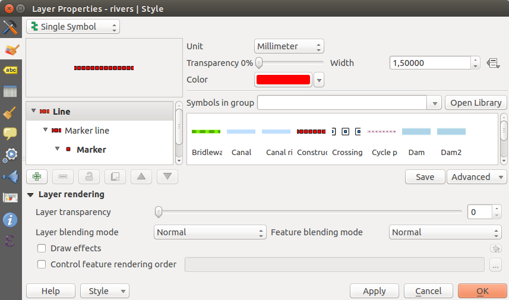
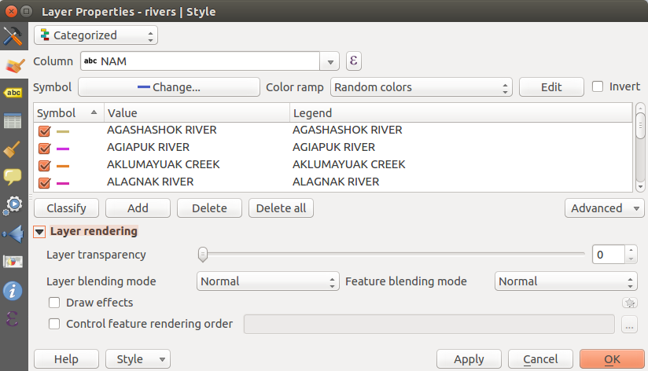
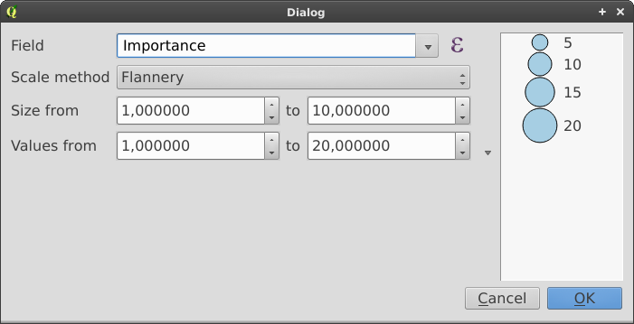
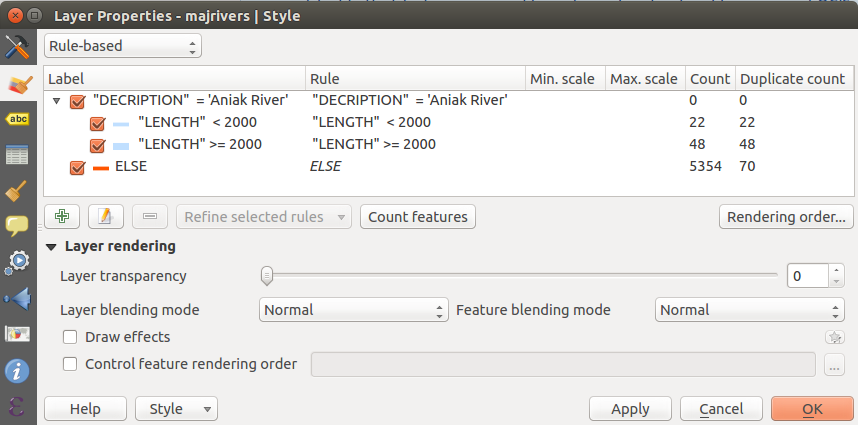
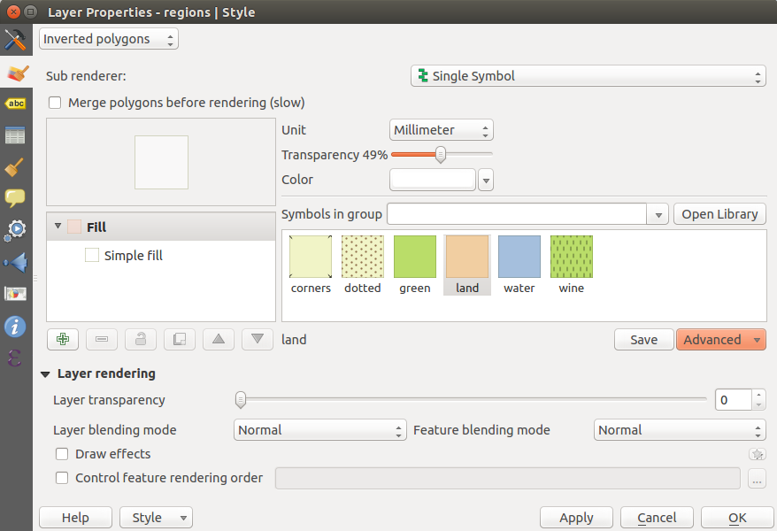

|updatedisclaimer|

.. index:: Symbology

.. _vector_style_menu:

***********
Style Menu
***********

The Style menu provides you with a comprehensive tool for rendering and
symbolizing your vector data.
You can use tools that are common to all vector data, as well as special symbolizing
tools that were designed for the different kinds of vector data.

Features rendering
==================

The renderer is responsible for drawing a feature together with the correct
symbol. There are four types of renderers: single symbol, categorized, graduated
and rule-based.
There is no continuous color renderer, because it is in fact only a special case
of the graduated renderer. The categorized and graduated renderers can be created
by specifying a symbol and a color ramp - they will set the colors for symbols
appropriately. For point layers, there is a point displacement renderer available.
For each data type (points, lines and polygons), vector symbol layer types are available.
Depending on the chosen renderer, the `Style` menu provides different
additional sections.

If you change the renderer type when setting the style of a vector layer the settings
you made for the symbol will be maintained. Be aware that this procedure only works
for one change. If you repeat changing the renderer type the settings for the symbol
will get lost.

.. index:: Single_Symbol_Renderer, Renderer_Single_Symbol

Single Symbol Renderer
----------------------

The Single Symbol Renderer is used to render all features of the layer using
a single user-defined symbol. The properties, which can be adjusted in the
`Style` menu, depend partially on the type of layer, but all types share
the following dialog structure: in the upper part, you have panels that help you
prepare the symbol to use (see :ref:`symbol-selector` for further information),
and at the bottom the :ref:`layer_rendering` widget.

.. _figure_symbology_1:

.. only:: html

   **Figure Symbology 1:**

   Single symbol line properties

.. index:: Categorized_Renderer, Renderer_Categorized

Categorized Renderer
--------------------

The Categorized Renderer is used to render all features from a layer, using
an user-defined symbol whose aspect reflects the value of a selected
feature's attribute. The `Style` menu allows you to select:

* The attribute (using the Column listbox or the |mActionmIconExpressionEditorOpen|
  `Set column expression` function, see :ref:`vector_expressions` chapter)
* The symbol (using the :ref:`symbol-selector` dialog) which will be used as default
  for each class
* The range of colors (using the Color ramp listbox) from which color applied
  to the symbol is selected

Then click on **Classify** button to create classes from the distinct value of
the attribute column. Each class can be disabled unchecking the checkbox at
the left of the class name.

To change symbol, value and/or label of the class, just double click
on the item you want to change.

Right-click shows a contextual menu to **Copy/Paste**, **Change color**, **Change
transparency**, **Change output unit**, **Change symbol width**.

The example in figure_symbology_2_ shows the category rendering dialog used
for the rivers layer of the QGIS sample dataset.

.. _figure_symbology_2:

.. only:: html

   **Figure Symbology 2:**

   Categorized Symbolizing options

.. _tip_change_multiple_symbols:

.. tip:: **Select and change multiple symbols**

   The Symbology allows you to select multiple symbols and right
   click to change color, transparency, size, or width of selected
   entries.

.. index:: Graduated_Renderer, Renderer_Graduated
.. index:: Natural_Breaks_(Jenks), Pretty_Breaks, Equal_Interval, Quantile

Graduated Renderer
------------------

.. FixMe: This section is really really out of date

The Graduated Renderer is used to render all the features from a layer, using
an user-defined symbol whose color or size reflects the assignment of a
selected feature's attribute to a class.

Like the Categorized Renderer, the Graduated Renderer allows you
to define rotation and size scale from specified columns.

Also, analogous to the Categorized Renderer, the `Style` tab allows you
to select:

* The attribute (using the Column listbox or the |mActionmIconExpressionEditorOpen|
  `Set column expression` function)
* The symbol (using the Symbol selector dialog)
* The colors (using the color Ramp list)

Additionally, you can specify the number of classes and also the mode for
classifying features within the classes (using the Mode list). The available
modes are:

* Equal Interval: each class has the same size (e.g. values from 0 to 16 and
  4 classes, each class has a size of 4);
* Quantile: each class will have the same number of element inside
  (the idea of a boxplot);
* Natural Breaks (Jenks): the variance within each class is minimal while the
  variance between classes is maximal;
* Standard Deviation: classes are built depending on the standard deviation of
  the values;
* Pretty Breaks: Computes a sequence of about n+1 equally spaced nice values
  which cover the range of the values in x. The values are chosen so that they
  are 1, 2 or 5 times a power of 10. (based on pretty from the R statistical
  environment http://astrostatistics.psu.edu/datasets/R/html/base/html/pretty.html)

The listbox in the center part of the `Style` menu lists the classes
together with their ranges, labels and symbols that will be rendered.

Click on **Classify** button to create classes using the chosen mode. Each
classes can be disabled unchecking the checkbox at the left of the class name.

To change symbol, value and/or label of the class, just double click
on the item you want to change.

Right-click shows a contextual menu to **Copy/Paste**, **Change color**, **Change
transparency**, **Change output unit**, **Change symbol width**.

The example in figure_symbology_3_ shows the graduated rendering dialog for
the rivers layer of the QGIS sample dataset.

.. _figure_symbology_3:

.. only:: html

   **Figure Symbology 3:**

.. figure:: ./images/graduatesymbol_ng_line.png
   :align: center

   Graduated Symbolizing options

The |mIconDataDefine| menu provides 'Data-defined override' for points size
and rotation and for line width (for points and line layers resp.). For point
layers, an assistant is accessible through the |mIconDataDefine| menu
to help you define size expression.

.. _figure_symbology_4:

.. only:: html

   **Figure Symbology 4:**

   Varying size assistant

The assistant lets you define:

* The attribute (using the Field listbox or the |mActionmIconExpressionEditorOpen|
  `Set column expression` function, see :ref:`vector_expressions`)
* The minimum and maximum size of the symbol
* The minimum and maximum values of the Field. The down pointing arrow allows
  to set the minimum and maximum values according to your data.

The values presented in the varying size assistant above will set the size
'Data-defined override' with:
::

 scale_exp( Importance, 1, 20, 1, 10, 0.57 )

The available scale methods are 'Flannery', 'Surface' and 'Radius'.

.. tip:: **Thematic maps using an expression**

   Categorized and graduated thematic maps can be created using the result
   of an expression. In the properties dialog for vector layers, the attribute
   chooser is extended with a |mActionmIconExpressionEditorOpen|
   `Set column expression` function.
   So you don't need to write the classification attribute
   to a new column in your attribute table if you want the classification
   attribute to be a composite of multiple fields, or a formula of some sort.

.. Index:: Rule-based_Rendering, Rendering_Rule-based

.. _rule_based_rendering:

Rule-based rendering
--------------------

The Rule-based Renderer is used to render all the features from a layer,
using rule based symbols whose aspect reflects the assignment of a selected
feature's attribute to a class. The rules are based on SQL statements.
The dialog allows rule grouping by filter or scale, and you can decide
if you want to enable symbol levels or use only the first-matched rule.

To create a rule, activate an existing row by double-clicking on it, or
click on '+' and click on the new rule. In the `Rule properties` dialog,
you can define a label for the rule. Press the |browsebutton| button to open the
expression string builder.
In the **Function List**, click on `Fields and Values` to view all
attributes of the attribute table to be searched.
To add an attribute to the field calculator **Expression** field,
double click its name in the `Fields and Values` list. Generally, you
can use the various fields, values and functions to construct the calculation
expression, or you can just type it into the box (see :ref:`vector_expressions`).
You can create a new rule by copying and pasting an existing rule with the right
mouse button. You can also use the 'ELSE' rule that will be run if none of the other
rules on that level matches.
Since QGIS 2.8 the rules appear in a tree hierarchy in the map legend. Just
double-click the rules in the map legend and the Style menu of the layer properties
appears showing the rule that is the background for the symbol in the tree.

The example in figure_symbology_5_ shows the rule-based rendering dialog
for the rivers layer of the QGIS sample dataset.

.. _figure_symbology_5:

.. only:: html

   **Figure Symbology 5:**

   Rule-based Symbolizing options

.. index:: Point_Displacement_Renderer, Renderer_Point_Displacement
.. index:: Displacement_plugin

Point displacement
------------------

The Point Displacement Renderer works to visualize all features of a point layer,
even if they have the same location. To do this, the symbols of the points are
placed on a displacement circle around a center symbol.

.. _figure_symbology_6:

.. only:: html

   **Figure Symbology 6:**

.. figure:: ./images/poi_displacement.png
   :align: center

   Point displacement dialog

.. tip:: **Export vector symbology**

   You have the option to export vector symbology from QGIS into Google \*.kml,
   \*.dxf and MapInfo \*.tab files. Just open the right mouse menu of the layer
   and click on `Save As...` to specify the name
   of the output file and its format.
   In the dialog, use the `Symbology export` menu to save the symbology
   either as `Feature symbology -->` or as `Symbol
   layer symbology -->`.
   If you have used symbol layers, it is recommended to use the second setting.

.. ToDo: add information about the export options

.. index:: Inverted_Polygon_Renderer

Inverted Polygon
----------------

Inverted polygon renderer allows user to define a symbol to fill in outside of
the layer's polygons. As before you can select subrenderers. These subrenderers
are the same as for the main renderers.

.. _figure_symbology_7:

.. only:: html

   **Figure Symbology 7:**

   Inverted Polygon dialog

.. tip:: **Switch quickly between styles**

   Once you created one of the above mentioned styles you can right-click on the
   layer and choose `Styles --> Add` to save your style. Now you
   can easily switch between styles you created using the
   `Styles -->` menu again.

.. index:: Heatmap Renderer

Heatmap
-------

With the Heatmap renderer you can create live dynamic heatmaps for (multi)point
layers. You can specify the heatmap radius in pixels, mm or map units, choose
a color ramp for the heatmap style and use a slider for selecting a trade-off
between render speed and quality. When adding or removing a feature the heatmap
renderer updates the heatmap style automatically.

.. _layer_rendering:

Layer rendering
===============

From the Style tab, you can also set some options that invariabily act on all
features of the layer:

* `Layer transparency` |slider|: You can make the underlying layer in
  the map canvas visible with this tool. Use the slider to adapt the visibility
  of your vector layer to your needs. You can also make a precise definition of
  the percentage of visibility in the the menu beside the slider.
* `Layer blending mode` and `Feature blending mode`: You can
  achieve special rendering effects with these tools that you may
  previously only know from graphics programs. The pixels of your overlaying and
  underlaying layers are mixed through the settings described in :ref:`blend-modes`.
* `Draw effects`
* `Control feature rendering order` allows you to define, using features
  attributes, the order in which they shall be processed by the renderer.

