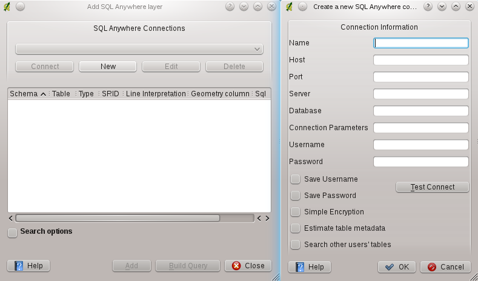

..  !TeX  root  =  user_guide.tex

.. _sqlanywhere:

SQL Anywhere Plugin
====================

.. when the revision of a section has been finalized, 
.. comment out the following line:
.. \updatedisclaimer

SQL Anywhere is a proprietary relational database management system (RDBMS) 
from Sybase. SQL Anywhere includes spatial support including OGC, shape files 
etc. and built in functions to export to KML, GML and SVG formats.

The |icon_sqlanywhere| :sup:`SQL Anywhere` Plugin provides a 
native data provider added to QGIS under the GPL v3. The Plugin allows 
to connect to this SQL Anywhere. The :guilabel:`Add SQL Anywhere layer` 
dialog is similar in functionality to the dialogs for PostGIS and SpatiaLite.

.. _`fig:sqlanywhere`:

   SQL Anywhere dialog (KDE)

.. FIXME Needs an example, but the database is proprietary

