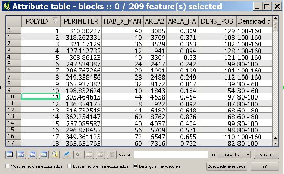
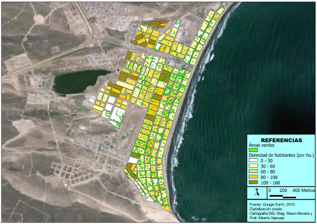
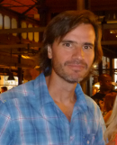
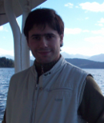

===================
QGIS at high school
===================

the urban green spaces in Rada Tilly coastal town, Chubut province, Argentina

Introduction
============

In our region, Argentinean Patagonia, we have very few references about the application of GIS in High School for the construction of geographical knowledge as a mean to face territorial and environmental issues. The case of the urban green spaces in Rada Tilly coastal town analyzed by QuantumGIS, tends to demonstrate a methodology of an academic exercise that can project, with important reaches, as formative instances related to the geographical reasoning in students of 12th grade of the Abraham Lincoln School.
We started by the observation (inventory), digitizing the cadastral blocks and the green areas (tree´s canopy) using Google Earth satellite images. As a conceptual framework, we lectured about cartographic design, satellite images reading and interpretation, and specially, location analysis to contrast the situation (in m2) of the urban green spaces by inhabitant in Rada Villa coastal town, with values suggested by the World Health Organization -WHO- (a  minimum of 9 m2 of green areas, by person, in urban areas).

About the project
=================

The main objective of the experience was to lecture the 12th grade students, in the implementation of a GIS as tool to optimize and enhance the management of spatial information, and to provide a support to the decision making process.

**Specific objectives:**

* Student´s appropriation of a local issue (the Rada Tilly´s green areas related the 9m2 by inhabitant proposed by WHO) from a geographical perspective through GIS tools.
* Usage of GIS as a technical tool to validate of socio-spatial hypothesis.
* Verification of the viability of capture, processing, storage, analysis, recovery and updating of spatial data using a FOSS QuantumGIS.

**Methodology:**

To generate the project we continue the following methodology:

* Practical and theoretical lectures; mainly about the usage of QGIS and the benefits of urban green spaces and its territorial implications.
Cartographic modeling, vector layers definition, development of GIS databases.
* Field work (trees data records and GPS locations).
* Vector digitizing of urban cadastral blocks and the tree´s canopies, using a Google Earth (GeoEye) image. In order to consider the amount inhabitants by cadastral block, we assigned an average value of 4 inhabitants by plot.
* Results presentation through thematic cartography.

   Attribute table of “blocks” vector layer

Conclusion
==========

Based in the projection of an average value of 4 inhabitants by cadastral plot, we estimated that the current (2010) urban population Rada Tilly would go up to around 9.600 inhabitants. These people reside in 209 blocks and they represent 157.6 hectares. The average population density would be of 61 inhabitants by hectare. 
The total inventoried green areas grow up to 150.736 m2 (15 hectares). Reason why we can consider that the green area by inhabitant in the study area is 15.7 m2 (the WHO suggested value is 9m2 of green area by inhabitant). This value proves a very favorable situation, as far as the environmental benefits, that trees offer to the inhabitants in this marine coastal town. 

   Distribution of urban green spaces (green) and population density by blocks (white to brown) at Rada Tilly coastal town, Chubut Provinc, Argentina.

Although the project was an academic exercise of High School, we deeply value the inventory´s results obtained by QGIS. Students worked with all academic rigor and seriousness, showing appropriation of the thematic (urban green spaces) and also of the tool (QGIS). It was a very enriching experience for them and also for the educational staff involved.

After the project experience we can assure that the FOSS QuantumGIS is an extremely recommendable alternative for capture, processing, storage, analysis, recovery and updating of spatial data, in fast and efficient form. We have such a positive impression of the software that we will start the use of QGIS in our university courses, replacing GIS Proprietary software that we have being using.

Authors
=======

   Mauro Novara

Mauro Novara is Professor of Territorial Information Systems course. Lecturer and researcher of National University of Patagonia San Juan Bosco, Faculty of Humanities and Social Sciences. Geography Department. Comodoro Rivadavia, Chubut Province, Argentina.

   
   Alberto Vázquez

This article was contributed in September 2011 by Mauro Novara and Alberto Vázquez from Argentina.

Prof. Alberto Vázquez is a graduate teaching assistant of Territorial Information Systems course. National University of Patagonia San Juan Bosco, Faculty of Humanities and Social Sciences. Geography Department. Comodoro Rivadavia, Chubut Province, Argentina.