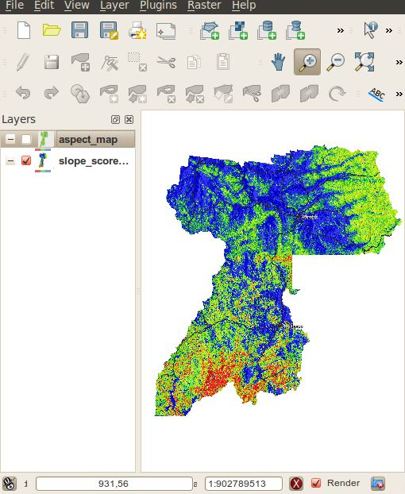
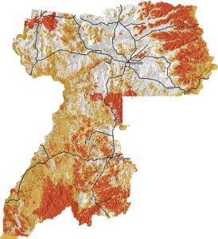

==========================================================
QGIS and GRASS in Local Government Bushfire Hazard Mapping
==========================================================

Introduction
============
 
The Southern Downs Regional Council (SDRC) is a small-to-medium sized local government in south east Queensland, Australia. The council region, mainly the southern part, suffers from major bushfires. Bushfire is a real and present concern for the residents and landowners in the Southern Downs Region, and has resulted in the loss of life and property.
This project will allow the council and the people of the region to be more aware of the risk and to allow for better decision making in the future.

The Project
===========

As bushfire is not only a problem for SDRC but also for the whole of Queensland, the state government requires that each local government identifies the bushfire hazard in their area via the State Planning Policy 1/03 Mitigating the Adverse Impacts of Flood, Bushfire and Landslide [1]. This kind of job would normally be done using consultants but was instead done by the council itself using a combination of QGIS and GRASS.

The GIS side of the project project was broken down into 6 main steps

* Slope assessment and mapping
* Aspect assessment and mapping
* Vegetation assessment and mapping
* Combining scores to identify the severity of bushfire hazard
* Field verification and qualitative assessment
* Final Maps

The use of QGIS and GRASS
=========================

QGIS, using the GRASS plugin, was selected as it provided the tools needed to complete the job and the interaction between QGIS and GRASS made it easy to process the raster maps and present them in a meaningful way to users. SDRC uses MapInfo for its main GIS system, however MapInfo’s addons were not as powerful as GRASS GIS for raster processing.
The QGIS GRASS plugin was used to import 5 meter contours of the whole region into GRASS which were then converted into a contour raster map using r.surf.contour. A slope and aspect map were then generated using r.slope.aspect from the raster contour map. Categories were assigned to different slope and aspect ranges and given a hazard risk sore. Vegetation areas were also given different risk scores. All the resulting raster maps were then combined using mapcalc and given a final risk hazard score. The risk scores are then divided into three main categories: high; medium; and low.

The final part of the process was field verification via the rural fire service. After the review process, QGIS was used to print the final maps for presentation.
As all GRASS commands can be run from the command line, all the commands that were needed to generate the bushfire hazard maps were recorded, for documentation purposes and for if the maps needed to be regenerated some time in the future.
 
 
Conclusion
==========

Overall QGIS, together with the GRASS plugin, provided a great experience and a great final outcome for the council doing their own bushfire hazard mapping. The GRASS plugin provides a very easy to use interface to GRASS through QGIS. As QGIS is able to open the GRASS raster format natively, integration is very seamless and maps can be made with ease.   
The project won an encouragement award at the Queensland Planning Institute of Australia state planning awards in 2010 [2] 
 
References
==========
* [1] http://www.emergency.qld.gov.au/publications/spp/ 
* [2]http://digital.crowtherblayne.com.au/default.aspx?xml=crowther_pia.xml

Author
======

This article was contributed in January 2011 by Nathan Woodrow. Nathan is a GIS officer at the Southern Downs Regional Council and is studying an associates degree in Spatial Science at University of Souther Queensland