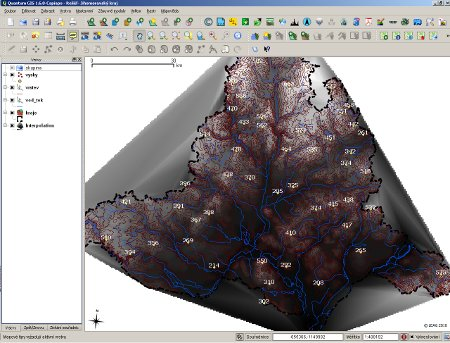
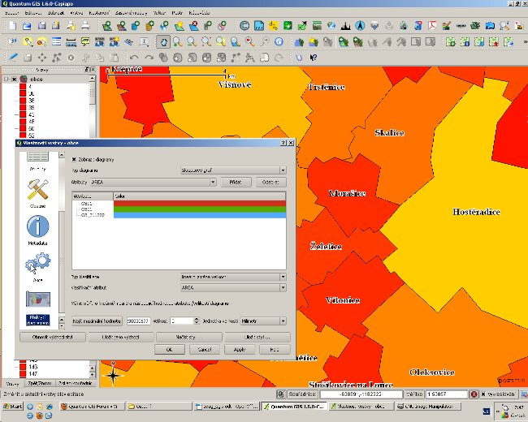
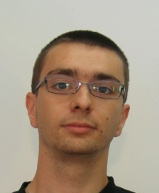

============================================
QGIS as major GIS software in the Laboratory 
============================================

on Experimental and Applied Geography

Introduction
============

Laboratory on Experimental and Applied Geography (LEAG) is part of College of Hotel and Business Management, Ltd. In Brno, Czech Republic (Vysoká škola obchodní a hotelová, s.r.o.) which offers higher education at tourism, business and hotel management. LEAG is focused on modeling socio-economic spatial processes, analyzing spatial patterns, describing and monitoring the reality of localities and regions.

   QGIS while modeling 3D objects (interpolation), terrain analysis

LEAG plays important role in academic research held in College of Business and Hotel Management. The need of spatial modeling requires also excellent software. The philosophy of minimum cost and maximum efficiency led to choice of open source solutions. This step resulted in using core open source SW such as LibreOffice, GIMP, Inkscape and Quantum GIS. QGIS does not stand alone – we use MapWindow, OpenJump, gvSIG, SAGA and others. But QGIS plays the major role.
 
Use of QGIS
===========

Quantum GIS is the leading software and stands in current versions (because of the “experimental” character of LEAG we are using the latest unstable releases instead of LTS versions) for several reasons:

* Graphical User Interface (close to commercial products)
* Quick development and integrating user-wanted features
* Stability and interoperability (we are using Windows and Ubuntu Linux platforms)
* Others (mentioned e.g. in the case study written by Dr. Horst Düster)

Spatial analysis are done mainly using basic geoprocessing functions and python-based plugins. Recent projects where QGIS was used:

* Modeling patterns between spatial location and inhabitants
* Creating 3D models for terrain visualization (and further use as hill-shadowing)
* Storing, creating and editing database of small and medium enterprises (+ further visualization)
* Homogenizing of free-to-use geodata and creation of “geo-data-bank” for students and researchers at College of Business and Hotel Management
 
QGIS is used with synergy to other open source products. For example the final layout is mostly create using Inkscape or GIMP (less in LibreOffice Draw). Web-based maps are editing using Inkscape (after SVG export) and raster maps are pre-edited using GIMP.
QGIS is also great educational tool. College of Business and Hotel Management offers students subjects like “Geographical Information Systems I. and II.” or “Selected chapters from geoinformatic literacy” where QGIS is used as main platform for teaching students how to use GIS and how to produce high-quality maps. Recently, the QGIS was used as main product during GIS Day held at our school on November 2010.

   Using diagrams comparing population between two censuses

Conclusion
==========

With no cost and high efficiency the Laboratory on Experimental and Applied Geography produces high-quality analysis, maps and visualizations. Using QGIS large databases are being created and further testing of new functions are being done. Finally, one of the highest impact of using QGIS could be seen in education – QGIS is the first software, which is presented to students. During regular workshops students learn how to legally work with QGIS and how to create their own maps.

Author
======

   Jakub Trojan

This article was contributed in November 2010 by Jakub Trojan. He is an academic researcher at College of Business and Hotel Management, Ltd. (Brno, CZ) where he founded and leads Laboratory on Experimental and Applied Geography. He is also a doctoral student at Institute of Geography, Faculty of Science, Masaryk university (Brno, CZ).