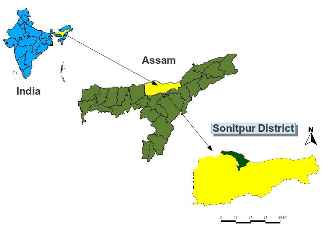
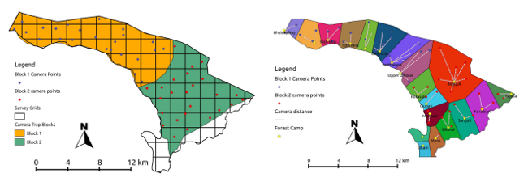
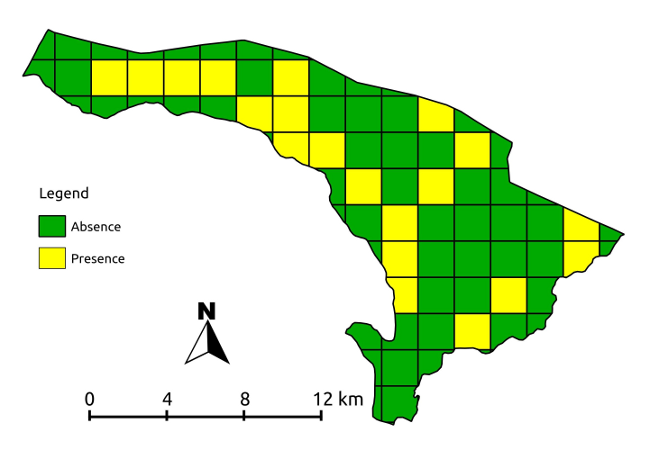
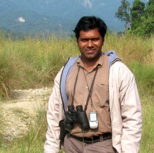

=================================
Quantum GIS for monitoring tigers
=================================

(using camera traps in Nameri Tiger Reserve, Assam, India Sonitpur District)

Nameri Tiger Reserve (NTR) is one of the 3 tiger reserves of Assam and it is situated in the northern part of Sonitpur District of Assam along the foothills of Eastern Himalayas. Spread over an area of 344 sq km, NTR boasts rich diversity of flora and fauna. The core area of the reserve which constitutes the “Nameri National Park” is bound by River Jia-Bhoreli on the west and River Bor-Dikorai in the east. To the north of the Nameri lies the Pakke Tiger Reserve of Arunachal Pradesh.

Within this landscape, the principal species of conservation importance are the Royal Bengal Tiger, Asian Elephant, Indian bison, Common leopard, clouded leopard, Wild dog, Sambar deer, barking deer, hog deer, wild boar and several other species. The bird diversity of NTR is also quite impressive and more than 370 bird species have been identified so far. The reserve is managed by the Assam Forest Department, Government of Assam.

Application of QGIS for designing camera trap study
===================================================

Starting with the year 2011, the National Tiger Conservation Authority (NTCA) of India has made it mandatory for the all the tiger reserves of the country to monitor tigers by using camera traps. Under this new protocol, 25 pairs of cameras will be installed for 100 sq km of tiger reserve and the sampling period is 40-60 days. This new tiger monitoring protocol relies heavily on the GIS.

.. figure:: ./images/india_assam2.png
   :alt: Picture of a male Tiger
   :scale: 60%
   :align: right

   Picture of a male tiger that was captured in one of the camera traps

During 2012-13, we implemented this new tiger monitoring protocol in NTR by using Quantum GIS. To begin with, we digitized the NTR boundary in Qgis and saved it as polygon. This boundary polygon was exported to GPS for navigation purpose during the field surveys. We conducted an extensive sign survey in NTR for evidences of tiger presence such pugmarks, scratch marks and scats. GPS coordinates of tiger signs as well as suitable locations for camera traps were recorded. After completion of the survey, the data was transferred to Qgis using GPS tools for further processing and for finalizing camera trap locations. A shape file containing the tiger signs and probable camera trap locations was prepared.

   Block wise distribution of camera trap locations and assigning camera traps to different forest camps by using voronoi polygons & hub distance.

Next we prepared 4 sq km grid layer using mmqgis plugin. The shape file containing results of sign survey was overlaid on the 4 sq grid to visualise the distribution of camera traps in NTR. Distance matrix option under vector analysis tools was quite handy for determining the inter camera distance. Camera locations having less than 1.8 km inter distance were removed to comply with the monitoring protocol. Due to lack of sufficient cameras to monitor the entire reserve area in one go, we decided to divide the reserve area into 2 blocks of 100 sq km each. Boundaries of these blocks were digitised and saved as separate shape files for both the blocks. Using RGB composition plugin, a false color composite of the reserve was created and the sign survey shape file overlaid to assess the habitat types used by the tiger. During the study period, the camera traps have to be monitored intensively by the field staff. To ensure smooth functioning of monitoring process, we used Voronoi polygon feature of Geometry tools and hub distance of mmqgis plugin for planning logistic requirements. The geographic coordinates of camera traps are required for estimating the tiger density and occupancy modelling of other species. These coordinate details were easily generated from camera trap shape files by using the “Export/ add geometry columns” feature of vector Geometry tools.

 

   Survey grids with tiger presence

Conclusion
==========

For the first time in the history of this small tiger reserve of North East India, it was possible to monitor tigers by using camera traps mainly because of Quantum GIS. Results of this monitoring exercise indicate the presence of 8-15 tigers in this landscape. In addition to the tigers, several elusive species have also been photographically documented. Apart from tiger monitoring, we are also using Qgis for activities such as planning habitat management works, revising patrolling schedules, and designing maps for visitors.
The user-friendly interface, rich features, in-depth documentation, on-line support  and the free/open source philosophy are the few qualities of Quantum GIS that made us to select it over other proprietary software. We believe that Quantum GIS has great potential for empowering individuals/institutions/ involved in conserving endangered wildlife in the developing world by offering GIS technology at little or no cost.

Author
======

   Rajendra Garawad

This article was contributed by Rajendra G. Garawad in March 2013. He is the Field Director of Nameri Tiger Reserve, Assam, India. He holds Master Degrees in Forestry Science and Conservation & Land Management.

