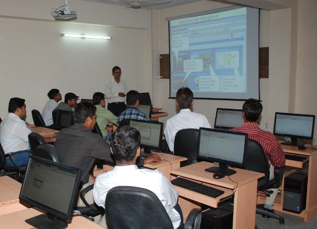
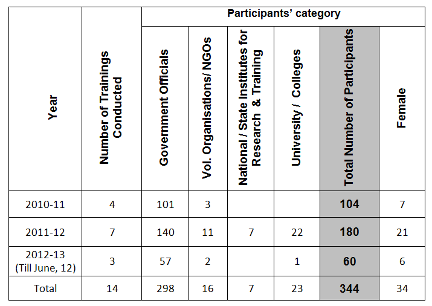

==================================================
Quantum GIS Trainings at NIRD Jaipur Centre, India
==================================================

The National Institute of Rural Development (NIRD) is an Apex institute of Ministry of Rural Development, Government of India. Headquarter is located at Hyderabad city of India and it has three sub centres at Guwahati, Jaipur and Patna city. Jaipur city is capital of Rajasthan State (North Western side of country). The NIRD Jaipur Centre is actively involved in short (mostly 5 days including one-day handheld GPS survey and local visit) residential GIS trainings for middle level government officials of North Indian States. Reputed NGOs and Scholars are also trained if interested. Trainings are fully sponsored by NIRD and participants are to bear only their travel expenses.
The author is working in NIRD Jaipur centre as an Assistant Professor and coordinating GIS and Watershed related trainings at the centre. Initially at the time of his posting at Headquarter of NIRD at Hyderabad, he was involved in GIS trainings with commercial software like ArcGIS and ERDAS. After getting opportunity of a two days training on QuantumGIS at IIT Madras in 2009, it was felt that the Open Source GIS can fulfil the need of Rural Development sector of India. The version learnt in training was QGIS 1.0.2. The training feedback was provided to seniors and it was recommended to introduce QGIS in further trainings but apprehensions were there in accepting the software in mainstream of trainings. Software was then pursued for the personal use for one year and its new versions were checked for the enhanced functionalities. During this whenever author was course coordinator in training, he used QGIS in trainings for introduction and feedbacks.

QGIS is used for all GIS training courses
=========================================

   QGIS training course at NIRD Jaipur Centre

Since creation of NIRD Jaipur centre, only QuantumGIS is being used for all GIS trainings at the centre. Further it is being messaged and advised in all trainings that no commercial GIS software should be purchased at District (administrative unit in India after Nation and State) and below, if real requirement is not felt and this saving may be used for purchase of hardware like GPSs, computers etc. 

There is a question why QGIS only when other software like uDig, MapWindow, gvSIG, GRASS are also there. The answer lies in the facts that QGIS is an OSGeo incubated project, less complex, its development is very fast and associated with huge community of users and developers and lastly authors expertise. With its latest version of 1.8, software is capable of satisfying the all needs of grass root rural development executors in India with satisfying the present queries and wishes for future. 

The applications of software during training are generally concentrated on Watershed and Mahatma Gandhi National Rural Employment Guarantee Scheme (MGNREGS) as these two are land based flagships of Government of India. Local Open Source Raster and Vector data are used in exercises. Participants are encouraged to come with their own or departmental data if available to work. Training is provided in lab equipped with 15 computers of i5, 8GB RAM and Windows7 OS. Per training number of trainees remains between 20-30.

   Conducted QGIS training courses and participants

General topics covered are basic introduction to the GIS and QGIS software , major tool bars, plug-in structure, geo-referencing, creation/editing of vector data, clip (Raster/Vector), merge, terrain analysis, contours, .csv to .shp layer, .shp to .kml and vice versa, handling GPS data, Interpolation, table editing/query, field calculator, print composer etc. and some basic analysis on vector data. Apart from introduction to various help links available, a LinkedIn group for participants has been created for post training support. 

Number of QGIS Based trainings conducted by author with participants’ details is shown in the table:

Success
=======

Every month training is conducted with 20-30 participants so this number is increasing every month. Training feedbacks are remaining very positive and encouraging. Certificates are provided to the participants after completion of training. 
Presently handouts are being supplied to the participants in hard copy and tutorial, software and practice data in soft copies but plan is there to create DVDs containing screen-recorded lectures/demo of various topics in Hindi and English language.  In future certificate and diploma programmes may also be initiated.

Author
======

   
   H K Solanki

This article was contributed in July 2012 by H K Solanki, Assistant professor, NIRD Jaipur centre, Website: http://www.nird.org.in
