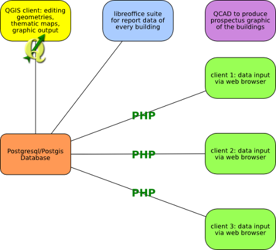
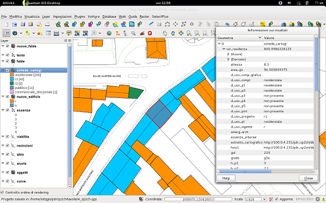
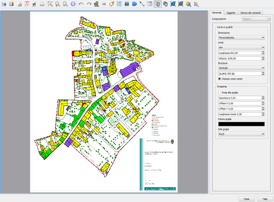

Using QGIS for urban planning in the municipality of Montecchio Maggiore, Vicenza, Italy
Montecchio Maggiore is a small town in the middle west of Vicenza (about 24.000 population). And as many other italian municipality it manages the town planning; in particular the urban planning and what we call “recovery plan” aka PDR - Piani Di Recupero. This urbanistic tool is dedicated to the historical area in the center of the town and it requires a specific study: building state of conservation, intended use, particular historical notice via survey and restitution to produce planimetric and prospectus graphics. For this purpose it has used QGIS in addition to Postgresql/Postgis database, PHP code and Libreoffice suite, QCAD (LibreCAD).

The task
========

   Workflow Schema

A schema will clarify the workflow: 

Every building data was retrieved via survey and written in paper schedule. Once in office the data were inputed into the Postgresql/Postgis database via PHP form using canonical web browser (Firefox, Iceweasel as well). In a second moment the shape of every building was draw with QGIS and linked to the survey table via id key field (PostgreSQL/Postgis view). 

At the same time the facades of buildings were designed using QCAD (LibreCAD). 

The PDR (piani di recupero) must follow strict rules that require specific graphics:

* Present state
* Project state
* Intended use (present)
* Intended use (project)
*Type of intervention admitted

For every graphic thematic maps were produced using the attribute and data retrieve during the survey (for the present state) and data modified during the study and design fase.
Thus a photo was linked to every building facilitating the design and analisys in the gis project (using the “action” feature). The SQL tools (pgquery, postgis manager, dbmanager et al.) allowed to obtain very sophisticated query immediately viewable in the map canvas such as: volume calculation split by building intended use, standards area calculation in percentage of the total planning area and other minor queries. All useful items for the design and planning study otherwise not possible without a very strength tool like gis (and QGIS in particular).
 

   QGIS project with building data viewing

Finally a synthesis report for every building were produced using libreoffice suite. The report consists in a schedule summarise with photo, cartography extract which localize the building in the contest and data of the present state.
 

   QGIS print composer for final graphic layout

Conclusion
==========

The strength of QGIS is the very user friendly interface coupled with the several tools it offers. The connection with vary data formats (shape files, spatialite db, postgresql/postgis db,...) facilitates and increases the interoperability between different worlds. And thus the freedom offered by the free software (QGIS, PHP, Libreoffice, QCAD) stimulates and open new horizons.
And last but not least: we worked on different platform (Windows 7 64 bit, Windows xp 32 bit, Debian server and Debian client) but we never encountered insurmountable problems.

Author
======

   Flavio Rigolon

This article was contributed May 2012 by Flavio Rigolon. He lives in Vicenza (Italy) and works in Montecchio Maggiore municipality as SIT manager. He has migrated almost all the gis data from proprietary to free platform (QGIS, Postgresql/Postgis, Spatialite). He is a member of GFOSS.it (Associazione Italiana per l'Informazione Geografica Libera) since 2007 and was a member of the GFOSS.it board from 2010 to 2012.